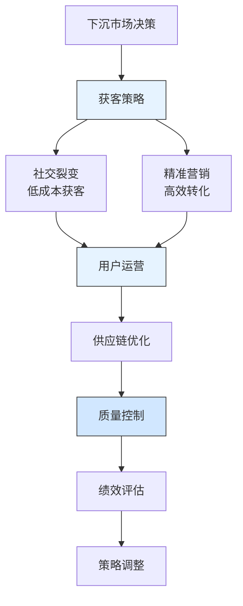

---
{"dg-publish":true,"tags":["财务BP","初创企业","拼多多","下沉市场","社交电商","案例分析"],"创建日期":"2024-04-28","permalink":"/知识共享/001_财务/01_财务BP/03_案例/初创企业财务BP案例集/拼多多下沉市场扩张的财务策略/","dgPassFrontmatter":true}
---

> [!quote] 案例简介
> 本案例分析拼多多在2015-2018年期间如何规划下沉市场扩张，重点关注其如何通过创新的财务策略平衡用户增长与盈利能力，以及如何通过社交电商模式和精准营销优化投资回报。

## 案例背景

### 企业背景
拼多多成立于2015年，是中国领先的社交电商平台。2015年，拼多多瞄准下沉市场，计划通过社交裂变模式快速获取用户。这是中国电商行业最具创新性的市场扩张计划之一。

### 财务状况
拼多多在规划下沉市场扩张时的财务状况：
- 2015年成立初期，资金主要来自天使投资
- 用户增长迅速，但单用户价值较低
- 营销投入占比较高，但获客成本优势明显
- 需要平衡用户增长与财务可持续性

### 市场环境
2015-2018年中国电商市场特点：
- 一二线城市电商渗透率趋于饱和
- 下沉市场网购需求快速增长
- 社交电商模式兴起
- 传统电商平台下沉布局加速

## 挑战与机遇识别

### 核心问题
拼多多面临的下沉市场扩张财务规划挑战包括：
1. **获客成本控制**：如何降低用户获取成本
2. **用户价值提升**：如何提高单用户贡献
3. **供应链优化**：如何建立下沉市场供应链
4. **竞争应对**：如何应对传统电商平台竞争

### 问题根源分析
通过分析，财务规划挑战的根本原因包括：
- **用户习惯差异**：下沉市场用户网购习惯不同
- **物流成本高**：下沉市场配送成本较高
- **商品结构特殊**：需要适应下沉市场需求
- **竞争激烈**：传统电商平台资源丰富

### 机遇评估
拼多多识别的主要机遇包括：
1. 通过社交裂变降低获客成本
2. 利用微信生态快速触达用户
3. 通过拼团模式提升用户粘性
4. 下沉市场增长潜力巨大

## 财务策略分析

### 下沉市场扩张财务策略
拼多多采取的核心财务策略包括：
1. **社交裂变获客策略**：
   - 设计拼团、砍价等社交玩法
   - 利用微信社交关系链传播
   - 建立用户邀请奖励机制
   - 优化分享转化率

2. **精准营销策略**：
   - 基于用户画像精准投放
   - 设计符合下沉市场的营销活动
   - 建立本地化营销团队
   - 优化广告投放效率

3. **供应链优化策略**：
   - 建立下沉市场供应商体系
   - 优化物流配送网络
   - 开发适合下沉市场的商品
   - 建立质量控制体系

### 财务逻辑与假设
该战略的关键假设包括：
- 社交裂变可降低50%的获客成本
- 拼团模式可提升30%的用户留存率
- 下沉市场用户年增长率将保持40%以上
- 供应链优化可降低20%的运营成本

### 财务分析工具应用
拼多多在下沉市场规划中应用了以下工具：
1. **用户增长模型**：评估不同获客渠道的ROI
2. **LTV预测模型**：基于用户行为的长期价值预测
3. **敏感性分析**：评估获客成本、用户留存变动的影响
4. **供应链成本模型**：评估不同区域的配送成本

## 实施过程

### 实施步骤与时间线
拼多多下沉市场扩张分为三个阶段：

**第一阶段(2015-2016)：模式验证期**
- 2015年推出拼团模式
- 2016年接入微信支付
- 建立基础用户运营体系
- 开始供应链体系建设

**第二阶段(2016-2017)：快速扩张期**
- 用户数量突破1亿
- 建立本地化运营团队
- 优化商品结构
- 完善物流配送网络

**第三阶段(2017-2018)：优化提升期**
- 提升用户质量
- 加强供应链管理
- 优化营销效率
- 提升平台体验

### 实施挑战
实施过程中面临的主要挑战包括：
1. 用户质量参差不齐
2. 物流配送效率低
3. 商品质量控制难
4. 竞争压力加大

### 关键成功因素
成功实施的关键因素包括：
1. 创新的社交电商模式
2. 微信生态的流量支持
3. 精准的用户定位
4. 高效的运营体系

## 结果评估

### 短期效果
实施下沉市场策略后，拼多多在短期内取得了显著成效：
- 2018年用户数量突破3亿
- GMV突破千亿
- 获客成本低于行业平均水平
- 用户活跃度持续提升

### 长期影响
这一财务策略对拼多多产生了深远影响：
- 成为中国第三大电商平台
- 建立了完整的社交电商体系
- 形成了独特的商业模式
- 提升了平台竞争力

### 预期与实际差异
与预期相比，存在一些差异：
- 用户增长速度高于预期
- 获客成本优势更明显
- 供应链优化效果显著
- 竞争压力小于预期

## 经验教训提炼

### 成功经验
拼多多下沉市场扩张的成功经验包括：
1. **社交裂变**：利用社交关系降低获客成本
2. **精准定位**：准确把握下沉市场需求
3. **模式创新**：建立独特的商业模式
4. **快速迭代**：持续优化产品和服务
5. **资源整合**：充分利用微信生态

### 失误与教训
值得反思的问题包括：
1. 初期商品质量控制不足
2. 部分区域物流效率低
3. 用户服务体验有待提升
4. 平台治理需要加强

### 可借鉴原则
对其他初创企业有价值的借鉴原则：
1. 创新是突破的关键
2. 精准定位目标市场
3. 重视用户增长质量
4. 持续优化运营效率

## 延伸思考

### 讨论问题
1. 初创企业如何平衡用户增长与盈利能力？
2. 社交电商模式的核心优势是什么？
3. 如何评估下沉市场的长期价值？

### 行业应用借鉴
拼多多的经验对以下领域有重要参考价值：
- **社交电商**：用户增长与变现
- **社区团购**：本地化运营
- **新零售**：线上线下融合

### 未来趋势展望
下沉市场扩张财务规划可能的发展趋势：
1. 更加重视用户质量
2. 供应链效率持续提升
3. 社交玩法不断创新
4. 本地化运营更加深入

## 参考资源

1. Pinduoduo Annual Reports (2015-2018).
2. 《拼多多下沉市场战略报告》. 拼多多.
3. McKinsey & Company. (2018). *The Rise of Social Commerce in China*.
4. 《中国下沉市场电商发展报告》. 艾瑞咨询.
5. Harvard Business Review. (2018). *Pinduoduo's Market Strategy*. 