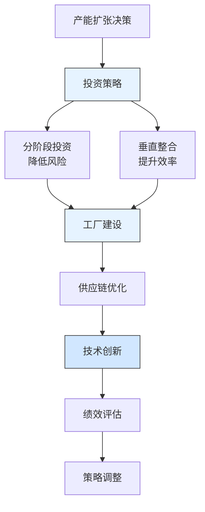

---
{"dg-publish":true,"tags":["财务BP","制造业","比亚迪","产能扩张","新能源汽车","案例分析"],"创建日期":"2024-04-28","permalink":"/知识共享/001_财务/01_财务BP/03_案例/制造业财务BP案例集/比亚迪汽车产能扩张的财务策略/","dgPassFrontmatter":true}
---

> [!quote] 案例简介
> 本案例分析比亚迪在2018-2022年期间如何规划新能源汽车产能扩张，重点关注其如何通过创新的财务策略平衡产能扩张与资金效率，以及如何通过垂直整合和规模效应优化投资回报。

## 案例背景

### 企业背景
比亚迪成立于1995年，是中国领先的新能源汽车制造商。2018年，比亚迪计划大规模扩张新能源汽车产能，以应对快速增长的市场需求。这是中国新能源汽车行业最大规模的产能扩张计划之一。

### 财务状况
比亚迪在规划产能扩张时的财务状况：
- 2018年营收约1300亿元人民币
- 新能源汽车业务快速增长，但占比仍较低
- 研发投入持续增加，但盈利能力稳定
- 需要平衡产能扩张与财务可持续性

### 市场环境
2018-2022年中国新能源汽车市场特点：
- 政策支持力度大，补贴逐步退坡
- 消费者接受度快速提升
- 充电基础设施不断完善
- 竞争对手产能扩张加速

## 挑战与机遇识别

### 核心问题
比亚迪面临的产能扩张财务规划挑战包括：
1. **资本支出管理**：如何优化大规模产能投资
2. **供应链整合**：如何平衡垂直整合与成本效率
3. **技术升级**：如何平衡研发投入与产能扩张
4. **市场风险**：如何应对补贴退坡影响

### 问题根源分析
通过分析，财务规划挑战的根本原因包括：
- **投资规模大**：新能源汽车工厂投资额巨大
- **技术迭代快**：需要持续投入研发
- **供应链复杂**：涉及多个关键零部件
- **政策影响大**：补贴政策变化影响大

### 机遇评估
比亚迪识别的主要机遇包括：
1. 通过垂直整合降低生产成本
2. 利用规模效应提升效率
3. 通过技术创新提升产品竞争力
4. 市场增长潜力巨大

## 财务策略分析

### 产能扩张财务策略
比亚迪采取的核心财务策略包括：
1. **分阶段投资策略**：
   - 将产能扩张分为多个阶段
   - 根据市场需求动态调整投资节奏
   - 采用模块化工厂设计
   - 建立灵活的生产线布局

2. **垂直整合策略**：
   - 自建电池生产基地
   - 投资关键零部件生产
   - 建立完整的供应链体系
   - 优化物流配送网络

3. **技术创新策略**：
   - 持续投入研发
   - 开发新一代电池技术
   - 优化生产工艺
   - 提升自动化水平

### 财务逻辑与假设
该战略的关键假设包括：
- 新能源汽车销量年增长率将保持30%以上
- 垂直整合可降低15%的生产成本
- 规模效应可提升20%的生产效率
- 技术创新可提升产品竞争力

### 财务分析工具应用
比亚迪在产能规划中应用了以下工具：
1. **产能需求模型**：评估不同市场的需求增长
2. **投资回报模型**：基于不同工厂的投资回报预测
3. **敏感性分析**：评估销量、成本变动的影响
4. **现金流预测模型**：评估资金需求与回报

## 实施过程

### 实施步骤与时间线
比亚迪产能扩张分为三个阶段：

**第一阶段(2018-2019)：基础建设期**
- 2018年启动多个工厂建设
- 2019年完成电池生产基地
- 建立基础供应链体系
- 开始生产线布局

**第二阶段(2019-2021)：快速扩张期**
- 多个工厂陆续投产
- 建立完整的供应链网络
- 优化生产工艺
- 提升自动化水平

**第三阶段(2021-2022)：优化提升期**
- 提升生产效率
- 加强质量控制
- 优化供应链管理
- 提升产品竞争力

### 实施挑战
实施过程中面临的主要挑战包括：
1. 资金需求量大
2. 技术迭代速度快
3. 供应链管理复杂
4. 市场竞争加剧

### 关键成功因素
成功实施的关键因素包括：
1. 垂直整合的供应链优势
2. 分阶段的投资策略
3. 持续的技术创新
4. 灵活的生产布局

## 结果评估

### 短期效果
实施产能扩张策略后，比亚迪在短期内取得了显著成效：
- 2022年新能源汽车销量突破180万辆
- 产能利用率达到85%以上
- 生产成本持续下降
- 市场份额稳步提升

### 长期影响
这一财务策略对比亚迪产生了深远影响：
- 成为中国最大的新能源汽车制造商
- 建立了完整的垂直整合体系
- 形成了技术领先优势
- 提升了全球竞争力

### 预期与实际差异
与预期相比，存在一些差异：
- 销量增长快于预期
- 成本下降幅度大于预期
- 技术迭代速度加快
- 市场竞争更加激烈

## 经验教训提炼

### 成功经验
比亚迪产能扩张的成功经验包括：
1. **垂直整合**：建立完整的供应链体系
2. **分阶段投资**：降低投资风险
3. **技术创新**：持续提升产品竞争力
4. **灵活布局**：适应市场变化
5. **规模效应**：提升生产效率

### 失误与教训
值得反思的问题包括：
1. 部分工厂建设进度延迟
2. 初期自动化水平不足
3. 供应链管理有待优化
4. 人才储备需要加强

### 可借鉴原则
对其他制造业企业有价值的借鉴原则：
1. 垂直整合可提升效率
2. 分阶段投资降低风险
3. 技术创新是关键
4. 灵活应对市场变化

## 延伸思考

### 讨论问题
1. 制造业企业如何平衡产能扩张与资金效率？
2. 垂直整合的边界在哪里？
3. 如何评估技术创新的投资回报？

### 行业应用借鉴
比亚迪的经验对以下领域有重要参考价值：
- **新能源汽车**：产能规划与供应链管理
- **制造业**：垂直整合与效率提升
- **技术创新**：研发投入与产品竞争力

### 未来趋势展望
制造业产能扩张财务规划可能的发展趋势：
1. 更加重视智能化生产
2. 供应链更加灵活
3. 技术创新更加重要
4. 可持续发展更加关注

## 参考资源

1. BYD Annual Reports (2018-2022).
2. 《比亚迪新能源汽车发展战略报告》. 比亚迪.
3. McKinsey & Company. (2022). *The Future of EV Manufacturing*.
4. 《中国新能源汽车产业发展报告》. 中国汽车工业协会.
5. Harvard Business Review. (2021). *BYD's Manufacturing Strategy*. 