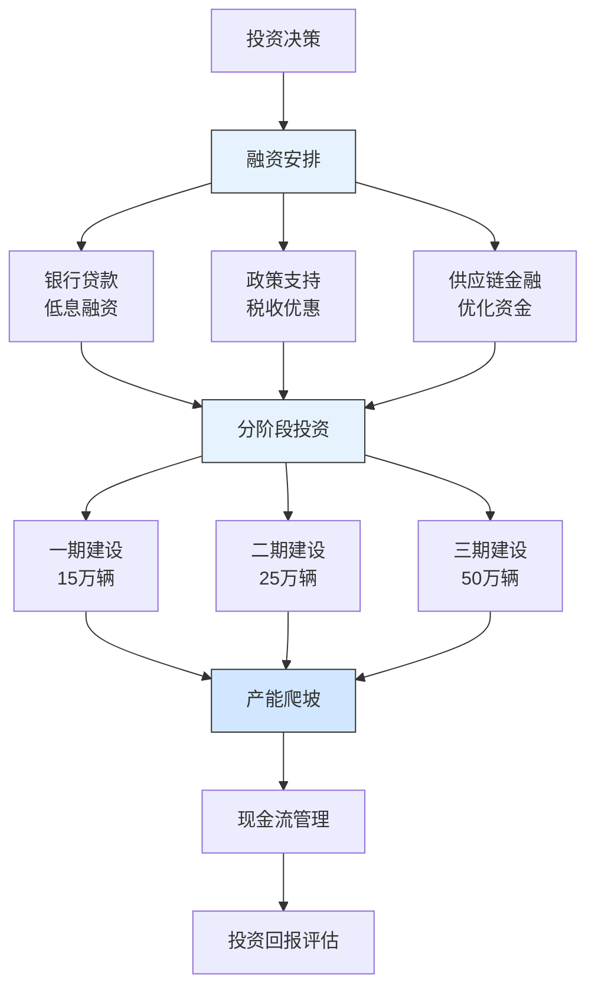

---
{"dg-publish":true,"tags":["财务BP","制造业","特斯拉","产能扩张","资本支出","案例分析"],"创建日期":"2024-04-28","permalink":"/知识共享/001_财务/01_财务BP/03_案例/制造业财务BP案例集/特斯拉超级工厂产能扩张的财务规划/","dgPassFrontmatter":true}
---

> [!quote] 案例简介
> 本案例分析特斯拉在2017-2020年期间如何规划上海超级工厂(Gigafactory 3)的产能扩张，重点关注其如何通过创新的财务策略平衡大规模资本支出与产能爬坡，以及如何通过本地化供应链和融资安排优化投资回报。

## 案例背景

### 企业背景
特斯拉成立于2003年，是全球领先的电动汽车制造商。2017年，特斯拉决定在中国上海建设其首个海外超级工厂，计划总投资约50亿美元，目标年产能50万辆电动汽车。这是特斯拉首次在海外建设整车制造工厂，也是中国首个外商独资汽车制造项目。

### 财务状况
特斯拉在规划上海工厂时的财务状况：
- 2017年全球交付量约10万辆，营收118亿美元
- 自由现金流为负，但融资能力较强
- 中国市场销量快速增长，但受制于进口关税
- 需要平衡全球产能扩张与财务可持续性

### 市场环境
2017-2020年中国新能源汽车市场特点：
- 政策支持力度大，补贴和牌照政策利好
- 本土品牌快速崛起，竞争加剧
- 供应链本地化程度不断提高
- 消费者对电动汽车接受度快速提升

## 挑战与机遇识别

### 核心问题
特斯拉面临的产能扩张财务规划挑战包括：
1. **大规模资本支出管理**：如何平衡50亿美元投资与财务可持续性
2. **产能爬坡与现金流平衡**：如何管理产能爬坡期的现金流压力
3. **本地化供应链建设**：如何优化本地供应商开发与采购成本
4. **政策环境利用**：如何最大化利用中国新能源汽车政策支持

### 问题根源分析
通过分析，财务规划挑战的根本原因包括：
- **投资规模大**：单厂投资额超过特斯拉年营收的40%
- **产能爬坡周期长**：从建设到满产需要2-3年时间
- **本地化要求高**：需要建立完整的本地供应链体系
- **政策依赖性强**：补贴和牌照政策影响产品竞争力

### 机遇评估
特斯拉识别的主要机遇包括：
1. 通过本地化生产降低关税和运输成本
2. 利用中国完善的汽车供应链体系降低采购成本
3. 通过政策支持获得低息贷款和税收优惠
4. 快速响应中国市场需求变化，提升市场份额

## 财务策略分析

### 产能扩张财务策略
特斯拉采取的核心财务策略包括：
1. **分阶段投资策略**：
   - 将50亿美元投资分为三期实施
   - 首期投资约20亿美元，实现15万辆年产能
   - 根据市场反馈和现金流状况决定后续投资节奏
   - 采用"边建设边生产"模式，提前产生收入

2. **多元化融资安排**：
   - 获得中国本地银行低息贷款
   - 利用上海自贸区政策获得税收优惠
   - 通过供应链金融降低营运资金压力
   - 考虑引入战略投资者分担投资风险

3. **本地化成本优化**：
   - 建立本地供应商开发计划
   - 优化物流和仓储成本
   - 降低人工和运营成本
   - 提高零部件国产化率

### 财务逻辑与假设
该战略的关键假设包括：
- 中国新能源汽车市场将保持30%以上的年增长率
- 本地化生产可降低20-25%的综合成本
- 产能爬坡期可通过预售和定金管理现金流
- 政策支持将至少持续到2025年

### 财务分析工具应用
特斯拉在产能规划中应用了以下工具：
1. **投资回报分析**：评估不同投资规模和时点的IRR和NPV
2. **现金流预测模型**：基于不同产能爬坡速度的现金流预测
3. **敏感性分析**：评估销量、价格、成本变动对投资回报的影响
4. **供应链成本优化模型**：评估不同本地化程度下的成本结构

## 实施过程

### 实施步骤与时间线
特斯拉上海工厂的产能扩张分为三个阶段：

**第一阶段(2018-2019)：工厂建设期**
- 2018年7月签署投资协议，获得土地
- 2019年1月工厂开工建设
- 获得中国本地银行35亿元人民币贷款
- 建立本地供应商开发团队

**第二阶段(2019-2020)：产能爬坡期**
- 2019年10月首辆Model 3下线
- 2020年实现周产3000辆目标
- 本地供应商比例提升至70%
- 开始Model Y生产线建设

**第三阶段(2020-2021)：规模扩张期**
- 2020年实现年产能15万辆
- 启动二期扩建工程
- 本地供应商比例提升至90%
- 开始出口欧洲市场

### 实施挑战
实施过程中面临的主要挑战包括：
1. 疫情导致建设进度延迟
2. 本地供应商开发进度不及预期
3. 原材料价格波动影响成本控制
4. 政策调整影响产品定价策略

### 关键成功因素
成功实施的关键因素包括：
1. 与中国政府和银行的良好合作关系
2. 灵活调整投资节奏，根据市场反馈优化计划
3. 强大的本地化团队和供应链管理能力
4. 创新的工厂设计和建设方法

## 结果评估

### 短期效果
实施产能扩张策略后，特斯拉在短期内取得了显著成效：
- 2019年10月实现首车下线，创下最快建设记录
- 2020年实现盈利，成为特斯拉首个盈利的海外工厂
- 本地供应商比例快速提升，降低采购成本
- 获得中国消费者认可，Model 3销量领先

### 长期影响
这一财务策略对特斯拉产生了深远影响：
- 上海工厂成为特斯拉全球产能扩张的标杆
- 建立了完整的中国供应链体系
- 提升了在中国市场的品牌影响力
- 为后续柏林和德州工厂建设提供了经验

### 预期与实际差异
与预期相比，存在一些差异：
- 建设进度快于预期，但疫情导致短期产能受限
- 本地化成本降低幅度超过预期
- 政策支持力度大于预期
- 市场需求增长快于预期

## 经验教训提炼

### 成功经验
特斯拉上海工厂产能扩张的成功经验包括：
1. **分阶段投资**：降低单次投资风险，提高资金使用效率
2. **本地化战略**：充分利用本地资源和政策支持
3. **创新融资**：多元化融资渠道降低资金成本
4. **快速响应**：灵活调整投资节奏适应市场变化
5. **供应链优化**：建立本地供应链体系降低成本

### 失误与教训
值得反思的问题包括：
1. 对疫情等外部风险准备不足
2. 初期本地供应商开发进度较慢
3. 部分设备进口导致成本上升
4. 产能爬坡期质量控制压力大

### 可借鉴原则
对其他制造业企业有价值的借鉴原则：
1. 大规模投资需要分阶段实施，降低风险
2. 充分利用本地资源和政策支持
3. 建立灵活的融资和投资调整机制
4. 重视本地供应链体系建设

## 延伸思考

### 讨论问题
1. 在全球化背景下，制造业企业应如何平衡本地化与全球化战略？
2. 大规模产能扩张如何平衡投资规模与财务可持续性？
3. 政策支持在制造业投资决策中应占多大权重？

### 行业应用借鉴
特斯拉的经验对以下制造业领域有重要参考价值：
- **汽车制造**：产能扩张与本地化战略
- **新能源产业**：政策支持下的投资规划
- **高端制造**：技术引进与本地化平衡

### 未来趋势展望
制造业产能扩张财务规划可能的发展趋势：
1. 更加灵活的模块化工厂设计
2. 数字化和智能化对投资回报的影响
3. 供应链韧性与成本优化的平衡
4. 环境因素在投资决策中的权重提升

## 参考资源

1. Tesla Annual Reports (2017-2020).
2. 《上海超级工厂建设报告》. 特斯拉中国.
3. McKinsey & Company. (2020). *The Future of Automotive Manufacturing*.
4. 《中国新能源汽车产业发展报告》. 中国汽车工业协会.
5. Harvard Business Review. (2019). *Tesla's China Strategy*. 