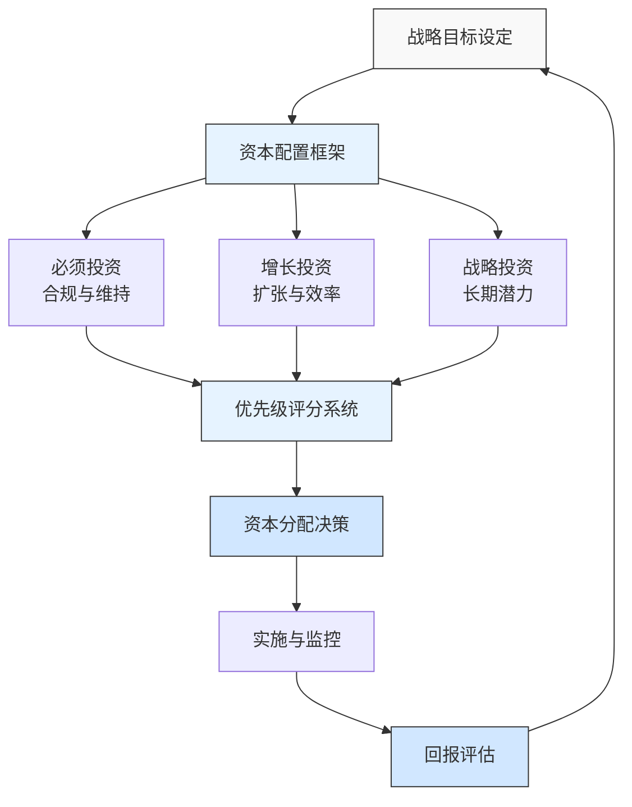

---
{"dg-publish":true,"tags":["财务BP","制造业","资本支出","GE","案例分析","预算规划"],"创建日期":"2024-04-28","permalink":"/知识共享/001_财务/01_财务BP/03_案例/制造业财务BP案例集/通用电气资本支出规划案例/","dgPassFrontmatter":true}
---

> [!quote] 案例简介
> 本案例分析通用电气(GE)在其转型期间的资本支出规划体系，重点关注其如何在多元化业务组合中制定、评估和优化资本支出预算，以及如何将资本支出与战略目标相结合。

## 案例背景

### 企业背景
通用电气(GE)作为一家有着百年历史的工业巨头，曾是全球最大的跨国企业之一，业务涵盖航空发动机、电力设备、医疗设备等多个领域。在2010-2020年期间，GE经历了重大的业务转型，从金融、媒体等非核心业务撤出，重新聚焦于工业制造核心业务。

### 财务管理体系
GE历来以严格的财务管理著称，特别是在杰克·韦尔奇时代建立的预算管理体系影响深远。其资本支出规划采用"自上而下"与"自下而上"相结合的方法：
- 总部制定战略导向和资本回报要求
- 业务部门提出详细的资本需求计划
- 财务团队进行审核与调整
- 高管团队最终决策与资源分配

### 市场环境
案例发生在2015-2018年间，这一时期GE面临：
- 全球工业部门增长放缓
- 数字化转型压力增大
- 投资者对资本回报的期望提高
- 全球贸易格局变化带来的不确定性

## 挑战与机遇识别

### 核心问题
GE面临的核心财务规划挑战包括：
1. **资本效率低下**：历史上的大型并购和多元化战略导致资本回报率不足
2. **资源分配失衡**：各业务部门间资本配置与实际增长机会不匹配
3. **长期投资与短期回报矛盾**：如何平衡长期技术研发投资与短期股东回报
4. **数字化转型资金需求**：传统制造业向数字化、服务化转型需大量资本投入

### 问题根源分析
通过PESTEL分析，问题的根本原因包括：
- **政治因素**：全球贸易保护主义上升影响跨国资本配置
- **经济因素**：全球经济结构性变化导致传统业务增长放缓
- **技术因素**：数字化、自动化技术迭代加速，资本支出周期与技术更新周期不匹配
- **内部因素**：历史形成的复杂业务组合导致资本分配效率低下

### 机遇评估
GE识别的主要机遇包括：
1. 通过精准的资本配置支持高增长部门（如航空、医疗）发展
2. 利用数字化转型提升资产效率，降低长期资本需求
3. 通过资本轻量化策略改善整体资本回报率
4. 建立更敏捷的资本规划流程，适应快速变化的市场环境

## 财务策略分析

### 资本支出规划战略
GE采取的核心财务策略包括：
1. **资本支出优先级框架重构**：
   - 建立"三层级"资本评估模型：必须投资、增长投资、战略投资
   - 采用基于风险调整后回报率(RAROC)的评估体系
   - 设置最低15%的内部回报率(IRR)门槛

2. **资本轻量化战略**：
   - 从资产密集型向服务型业务模式转变
   - 通过合作伙伴关系分担资本风险（尤其在新兴市场）
   - 采用更灵活的设备租赁、共享模式替代完全自有

3. **数字化赋能的资本规划**：
   - 投资数字孪生技术，优化资产使用效率
   - 建立实时资产绩效监控系统，动态调整资本配置
   - 应用预测性维护技术，延长资产使用周期

### 财务逻辑与假设
该战略的关键假设包括：
- 资本密集度与未来增长率并非线性相关
- 数字化投资将带来长期资产效率提升
- 核心工业业务的资本回报率可以通过更精准配置得到显著改善
- 服务化转型可以提供更稳定的现金流和更高的回报率

### 财务分析工具应用
GE在资本支出规划中应用了以下工具：
1. **情景规划模型**：针对不同宏观环境设计三种资本配置情景
2. **实物期权分析**：评估分阶段投资策略，保留战略灵活性
3. **敏感性分析**：识别影响资本回报的关键因素
4. **多属性决策分析**：平衡量化与非量化因素的决策框架

## 实施过程

### 实施步骤与时间线
GE的资本支出规划改革分三个阶段实施：

**第一阶段(2015-2016)：诊断与框架建立**
- 全面评估现有资本项目组合表现
- 建立新的资本评估标准和流程
- 开发资本规划指南和工具

**第二阶段(2016-2017)：试点与调整**
- 在航空和医疗部门试点新的资本规划流程
- 基于反馈调整评估标准和流程
- 培训业务部门和财务团队

**第三阶段(2017-2018)：全面推广与整合**
- 向所有业务部门推广新模式
- 建立季度资本审查循环
- 将资本规划与长期战略规划整合

### 实施挑战
实施过程中面临的主要挑战包括：
1. 各业务部门对资本削减的抵触
2. 历史数据质量问题影响回报率计算准确性
3. 短期业绩压力与长期投资需求的矛盾
4. 跨部门协调资本共享项目的复杂性

### 关键成功因素
成功实施的关键因素包括：
1. CEO和CFO的坚定支持与直接参与
2. 透明公开的资本分配流程
3. 将管理层薪酬与资本效率挂钩
4. 建立专门的资本效率提升团队

## 结果评估

### 短期效果
实施新的资本支出规划体系后，短期内取得了以下成效：
- 年度资本支出总额降低15%，从约110亿美元降至93亿美元
- 资本支出批准周期从平均12周缩短至8周
- 项目取消率在规划早期提高，避免了资源浪费
- 部门间资本配置差异扩大，更聚焦高回报业务

### 长期影响
长期来看，该改革对GE产生了深远影响：
- 资本回报率(ROIC)在核心业务提升了约3个百分点
- 自由现金流增长，为股东回报和债务减少提供支持
- 资产利用率提高约12%，支持了业务扩张而无需等比例增加资本支出
- 转向资本轻型业务模式，使服务收入占比提高

### 预期与实际差异
与预期相比，存在一些差异：
- 数字化投资回报周期比预期更长
- 某些业务单元对资本减少的适应比预期困难
- 宏观经济变化导致某些假设条件改变
- 资本效率提升速度略低于最初目标

## 经验教训提炼

### 成功经验
GE资本支出规划的成功经验包括：
1. **差异化资本分配**：不同业务部门应有不同的资本回报标准
2. **敏捷资本规划**：从年度固定预算向动态调整模式转变
3. **数字化工具赋能**：利用数据分析提升资本决策质量
4. **服务转型思路**：降低资本密集度、提高回报率的有效途径
5. **多维度评估框架**：超越单一财务指标，综合战略价值评估

### 失误与教训
值得反思的问题包括：
1. 对某些传统业务资本过度紧缩导致竞争力下降
2. 过度强调短期回报率指标，可能影响长期创新能力
3. 资本规划与市场营销、研发等职能协调不足
4. 未充分考虑区域差异，全球标准化程度过高

### 可借鉴原则
对其他制造企业有价值的借鉴原则：
1. 资本规划应与战略规划紧密结合，而非仅是财务练习
2. 建立明确的资本项目分类体系与差异化评估标准
3. 平衡集中决策与授权灵活性，适应不同业务特点
4. 利用数字化工具提升资本效率，非仅是节约资本

## 延伸思考

### 讨论问题
1. 资本密集型制造业如何在数字化转型中平衡传统设备投资与数字技术投资？
2. 全球制造企业应如何调整资本支出策略应对地缘政治风险增加与供应链重构？
3. 循环经济理念如何影响未来制造业的资本支出规划？

### 行业应用借鉴
GE的经验对以下行业有重要参考价值：
- **重工业**：资产优化与产能灵活性规划
- **设备制造**：从产品销售向产品服务系统转型
- **基础设施行业**：长期资产管理与数字化提效

### 未来趋势展望
未来制造业资本支出规划可能的发展趋势：
1. 智能制造资本需求结构变化（硬件占比下降，软件和数据系统占比上升）
2. 可持续发展要求带来新的资本规划优先项
3. 更灵活的混合资本模式（自有、租赁、服务、合作）
4. "零碳"转型带来的大规模资本重配置需求

## 参考资源

1. Flannery, J. (2018). *Transformation at GE: The Road to Digital Industrial*. Harvard Business Review.
2. GE Annual Reports (2015-2018).
3. Lohr, S. (2018). *GE's Road to Digital Transformation*. MIT Sloan Management Review.
4. Financial Times (2017). *Inside GE's Transformation*.
5. Bloomberg (2018). *GE's Capital Allocation Strategy Under Flannery*. 