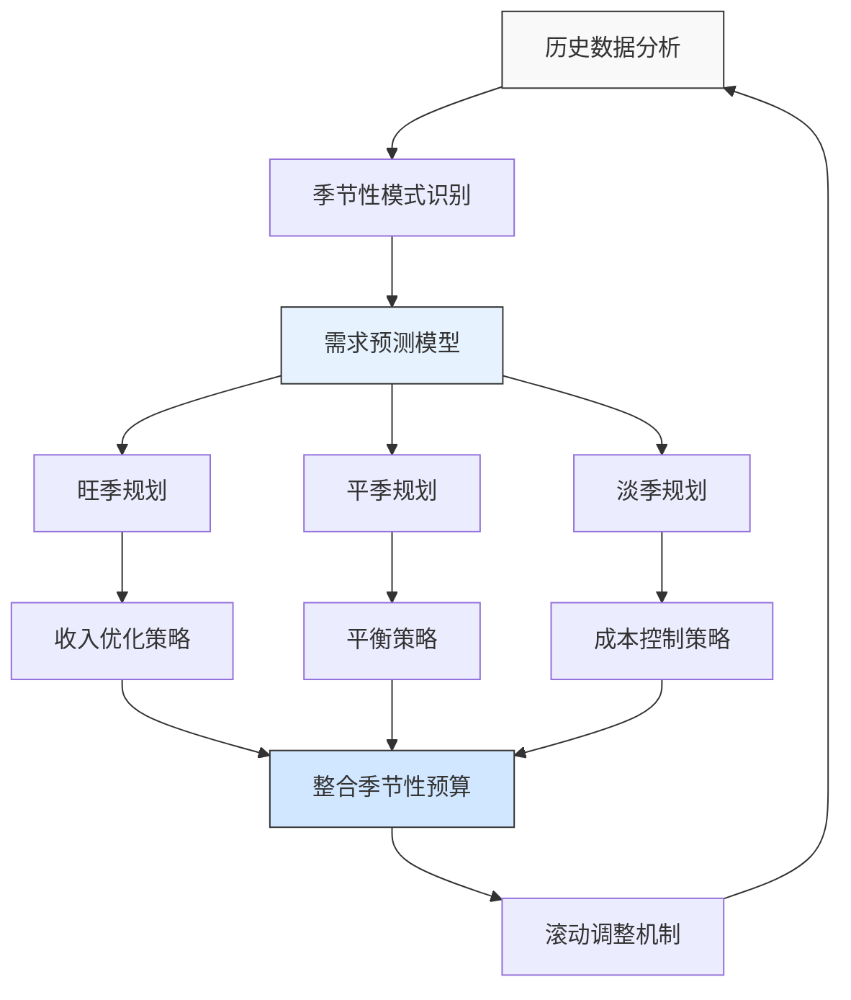

---
{"dg-publish":true,"tags":["财务BP","服务业","酒店业","季节性预算","收入预测","案例分析"],"创建日期":"2024-04-28","permalink":"/知识共享/001_财务/01_财务BP/03_案例/服务业财务BP案例集/希尔顿酒店集团季节性预算规划案例/","dgPassFrontmatter":true}
---

> [!quote] 案例简介
> 本案例分析希尔顿酒店集团如何应对季节性需求波动进行有效的财务预算规划，重点关注其如何平衡淡旺季资源配置，实现全年盈利目标的稳定性和可持续性。

## 案例背景

### 企业背景
希尔顿酒店集团(Hilton Worldwide Holdings Inc.)是全球领先的酒店管理公司之一，成立于1919年，在全球100多个国家拥有6,000多家酒店和度假村，旗下拥有希尔顿、康莱德、DoubleTree等多个品牌。2019年，希尔顿实现营收94亿美元，管理着超过100万间客房，员工约17万人。

### 财务管理体系
希尔顿采用多级预算管理体系：
- 总部制定全球战略目标和关键绩效指标
- 区域总部根据市场特点进行区域预算分配
- 各酒店根据历史数据和市场预期提交详细预算
- 实施"滚动预算"，每季度更新未来12个月预测

### 市场环境
酒店行业具有明显的季节性特征，不同区域和业务线面临不同的需求模式：
- 度假型酒店：休闲季节(如暑假、圣诞节)客流量高
- 商务型酒店：工作日和会议季需求旺盛
- 区域差异：北半球夏季是欧美旅游高峰，同时为亚太地区商务旺季
- 节假日效应：特定节日对全球各地酒店需求影响各异

## 挑战与机遇识别

### 核心问题
希尔顿面临的季节性预算规划核心挑战包括：
1. **收入波动与固定成本矛盾**：酒店业高固定成本结构与季节性收入波动的矛盾
2. **人力资源规划难题**：如何在保持服务质量的前提下灵活调配人力资源
3. **现金流管理压力**：淡季现金流不足与旺季资金盈余的均衡
4. **全球业务协同复杂性**：不同地区季节性周期不同，资源调配难度大

### 问题根源分析
通过分析，季节性预算挑战的根本原因包括：
- **行业特性**：酒店业固定资产投入大，短期难以调整容量
- **消费者行为**：休闲和商务出行具有明显的时间集中性
- **预测复杂性**：宏观经济、天气、社会事件等多因素影响需求预测
- **内部协调**：全球业务布局下，集团与各地区酒店信息不对称

### 机遇评估
希尔顿识别的主要机遇包括：
1. 利用全球网络优势，平衡不同地区季节性差异带来的收入波动
2. 通过精准预测和灵活定价，优化淡季资源利用率
3. 发展MICE业务(会议、奖励旅游、会议和展览)填补传统淡季
4. 建立共享服务中心，提高资源利用效率

## 财务策略分析

### 季节性预算规划策略
希尔顿采取的核心财务策略包括：
1. **差异化预算分配模型**：
   - 将全年预算按"淡季-平季-旺季"三级划分，分别配置不同资源
   - 建立"基础保障预算+弹性绩效预算"的双层结构
   - 各酒店根据历史季节性模式获得差异化资源配置权限

2. **动态收入管理系统**：
   - 实施收益管理(Revenue Management)系统优化房价
   - 建立基于历史数据的季节性需求预测模型
   - 实时调整营销预算分配，向更有效渠道倾斜

3. **灵活成本管理机制**：
   - 人力资源配置与预期入住率挂钩
   - 能源和物料消耗实施季节性阈值管理
   - 将部分固定成本转化为变动成本(如外包服务)

### 财务逻辑与假设
该战略的关键假设包括：
- 季节性波动模式具有相对稳定性和可预测性
- 不同地区和酒店类型的季节性互补可实现集团层面的平衡
- 通过价格杠杆可部分调节需求分布
- 优化资源配置比单纯成本削减更能提高整体效益

### 财务分析工具应用
希尔顿在季节性预算规划中应用了以下工具：
1. **时间序列预测**：分析历史数据的季节性模式
2. **复合弹性预算**：根据不同入住率设计阶梯式预算方案
3. **情景规划**：为极端季节波动设计应急资源方案
4. **贡献毛利分析**：评估不同业务单元的边际贡献

## 实施过程

### 实施步骤与时间线
希尔顿的季节性预算规划改革分四个阶段实施：

**第一阶段(前期准备)：数据分析与模式识别**
- 收集3-5年历史经营数据，识别季节性模式
- 对各区域、各品牌、各类型酒店进行季节性特征分类
- 建立季节性指数评估体系

**第二阶段(模型构建)：预算规划框架设计**
- 开发季节性预算分配模型
- 设计KPI考核标准，纳入季节性调整因子
- 构建业绩预测和监控工具

**第三阶段(系统实施)：全球推广与执行**
- 总部和区域财务团队培训
- 酒店经理季节性预算管理技能培训
- 系统上线和数据整合

**第四阶段(持续优化)：评估与调整**
- 季度回顾预算执行情况
- 持续优化季节性预测模型
- 完善应对极端季节波动的机制

### 实施挑战
实施过程中面临的主要挑战包括：
1. 各地区酒店对传统年度固定预算模式的依赖
2. 缺乏准确预测特殊事件(如大型会展)影响的能力
3. 总部标准化与区域灵活性的平衡
4. IT系统整合与数据共享的技术难题

### 关键成功因素
成功实施的关键因素包括：
1. 高管团队对季节性预算重要性的共识
2. 精细化的数据收集与分析能力
3. 将预算管理与绩效考核系统有机结合
4. 酒店管理者参与预算设计过程

## 结果评估

### 短期效果
实施季节性预算规划后，短期内取得了以下成效：
- 淡季收入提升8%，通过更精准的营销资源分配和定价策略
- 运营成本降低约5%，主要来自人力资源和能源消耗优化
- 预算准确率从原来的±15%提高到±7%
- 酒店管理者满意度提高，预算过程参与感增强

### 长期影响
长期来看，该改革对希尔顿产生了深远影响：
- 集团整体RevPAR(每间可供出租客房收入)同比提升4.2%
- 现金流波动性降低，资金使用效率提高
- 淡旺季员工流动率差异缩小30%
- 投资回报率(ROI)稳定性提高，降低了资金成本

### 预期与实际差异
与预期相比，存在一些差异：
- 全球经济波动导致某些地区预测不准
- 细分市场(如商务、休闲)的季节性模式发生变化
- 极端天气事件影响超出预期
- 某些新兴市场的季节性特征与历史数据存在较大差异

## 经验教训提炼

### 成功经验
希尔顿季节性预算规划的成功经验包括：
1. **预算分层设计**：基础保障与弹性绩效预算相结合
2. **全球资源平衡**：利用不同地区季节互补性实现资源优化
3. **数据驱动决策**：精细化分析历史数据指导未来规划
4. **差异化管理**：针对不同类型酒店采用不同的季节性预算模式
5. **价值驱动分配**：资源向价值贡献更高的业务单元倾斜

### 失误与教训
值得反思的问题包括：
1. 对线上预订渠道季节性变化预估不足
2. 部分酒店过度依赖历史数据，忽视市场环境变化
3. 在某些地区缺乏对竞争对手季节性策略的响应
4. 总部与区域沟通机制仍有改进空间

### 可借鉴原则
对其他服务业企业有价值的借鉴原则：
1. 将季节性视为可管理而非不可控因素
2. 建立数据分析体系，识别隐藏的季节性模式
3. 资源分配需与价值创造紧密结合
4. 将季节性因素纳入KPI考核，避免短视行为

## 延伸思考

### 讨论问题
1. 数字化技术如何进一步提升服务业季节性预算的精准度？
2. 在气候变化和消费者行为变化背景下，传统季节性模式是否仍然有效？
3. 如何平衡总部标准化与区域自主性，实现全球业务的最优季节性资源配置？

### 行业应用借鉴
希尔顿的经验对以下行业有重要参考价值：
- **餐饮业**：季节性菜单设计与人力资源配置
- **零售业**：季节性库存管理与促销规划
- **航空业**：季节性航线规划与定价策略
- **旅游景区**：淡旺季资源配置与体验设计

### 未来趋势展望
未来服务业季节性预算规划可能的发展趋势：
1. AI驱动的超精准需求预测，缩小季节性波动影响
2. 共享经济模式下的资源季节性优化(如共享员工)
3. 气候变化导致传统季节性模式转变
4. 全渠道运营下的季节性资源分配新模式

## 参考资源

1. Hilton Worldwide Annual Reports (2017-2019).
2. Cornell Hotel and Restaurant Administration Quarterly. *Seasonal Budgeting in Hotel Industry*.
3. Harvard Business Review (2018). *How Hilton Manages Global Operations*.
4. International Journal of Hospitality Management. *Revenue Management in Seasonal Hospitality Business*.
5. STR Global. *Hotel Industry Performance Reports 2018-2019*. 