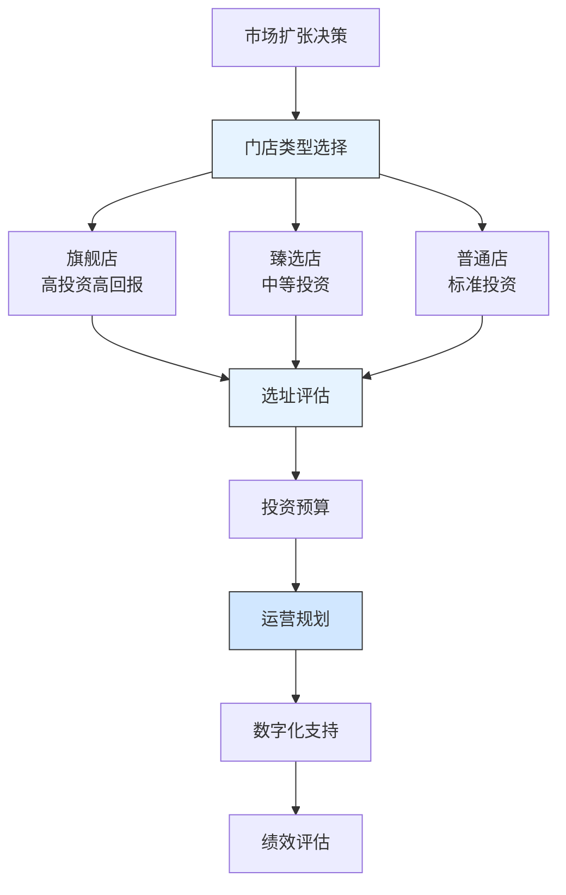

---
{"dg-publish":true,"tags":["财务BP","服务业","星巴克","市场扩张","门店布局","案例分析"],"创建日期":"2024-04-28","permalink":"/知识共享/001_财务/01_财务BP/03_案例/服务业财务BP案例集/星巴克中国市场扩张的财务策略/","dgPassFrontmatter":true}
---

> [!quote] 案例简介
> 本案例分析星巴克在2015-2020年期间如何规划中国市场的快速扩张，重点关注其如何通过创新的财务策略平衡门店扩张速度与单店盈利能力，以及如何通过本地化运营和数字化战略优化投资回报。

## 案例背景

### 企业背景
星巴克成立于1971年，是全球领先的咖啡连锁品牌。2015年，星巴克宣布将中国作为其全球第二大市场，计划在2021年前将中国门店数量从约2000家扩张至5000家。这是星巴克历史上最大规模的市场扩张计划之一。

### 财务状况
星巴克在规划中国市场扩张时的财务状况：
- 2015年全球营收192亿美元，中国市场占比约5%
- 中国门店平均单店收入高于全球平均水平
- 中国市场利润率持续提升，但扩张成本较高
- 需要平衡快速扩张与财务可持续性

### 市场环境
2015-2020年中国咖啡市场特点：
- 咖啡消费习惯快速形成，年增长率超过20%
- 本土咖啡品牌崛起，竞争加剧
- 数字化消费习惯普及，外卖需求增长
- 一线城市市场趋于饱和，二三线城市潜力大

## 挑战与机遇识别

### 核心问题
星巴克面临的市场扩张财务规划挑战包括：
1. **门店选址与投资回报**：如何确保新店选址的财务可行性
2. **扩张速度与质量平衡**：如何平衡快速扩张与单店盈利能力
3. **本地化运营成本**：如何优化本地化运营成本结构
4. **数字化投入与回报**：如何评估数字化战略的财务影响

### 问题根源分析
通过分析，财务规划挑战的根本原因包括：
- **选址成本高**：优质商业地产租金持续上涨
- **人力成本上升**：咖啡师等专业人才成本增加
- **竞争加剧**：本土品牌以低价策略抢占市场
- **消费习惯变化**：外卖需求增加带来运营模式调整

### 机遇评估
星巴克识别的主要机遇包括：
1. 通过数字化提升运营效率和客户体验
2. 利用品牌优势获取更有利的物业条件
3. 通过本地化产品创新提升客单价
4. 二三线城市市场潜力巨大

## 财务策略分析

### 市场扩张财务策略
星巴克采取的核心财务策略包括：
1. **差异化门店策略**：
   - 将门店分为旗舰店、臻选店、普通店三类
   - 不同级别门店采用不同的投资标准和回报预期
   - 根据城市级别和商圈特点选择门店类型
   - 建立动态的门店升级机制

2. **数字化投资策略**：
   - 与阿里巴巴合作建立数字化生态系统
   - 投资外卖配送能力建设
   - 开发会员系统和移动支付
   - 建立数据驱动的选址模型

3. **本地化运营策略**：
   - 建立本地供应链体系
   - 开发符合中国消费者口味的产品
   - 优化人力成本结构
   - 实施本地化营销策略

### 财务逻辑与假设
该战略的关键假设包括：
- 中国咖啡市场将保持15%以上的年增长率
- 数字化投入可提升20-25%的运营效率
- 二三线城市门店投资回收期在2-3年
- 会员体系可提升30%的客户复购率

### 财务分析工具应用
星巴克在市场扩张规划中应用了以下工具：
1. **门店选址模型**：评估不同位置的投资回报潜力
2. **现金流预测模型**：基于不同扩张速度的现金流预测
3. **敏感性分析**：评估租金、人力成本变动对盈利能力的影响
4. **会员价值分析**：评估不同级别会员的长期价值

## 实施过程

### 实施步骤与时间线
星巴克中国市场扩张分为三个阶段：

**第一阶段(2015-2017)：战略布局期**
- 2015年与阿里巴巴达成战略合作
- 2016年推出臻选店概念
- 2017年建立本地供应链中心
- 开始系统化会员体系建设

**第二阶段(2017-2019)：快速扩张期**
- 年均新开500家门店
- 推出外卖服务
- 建立数字化门店管理系统
- 优化本地化产品结构

**第三阶段(2019-2020)：优化提升期**
- 调整扩张节奏，注重单店质量
- 升级数字化系统
- 优化供应链效率
- 加强会员运营

### 实施挑战
实施过程中面临的主要挑战包括：
1. 优质物业资源竞争激烈，租金成本上升
2. 专业人才供给不足，培训成本增加
3. 外卖业务利润率低于堂食
4. 二三线城市消费习惯培养周期长

### 关键成功因素
成功实施的关键因素包括：
1. 强大的品牌影响力和议价能力
2. 完善的数字化基础设施
3. 本地化团队和决策机制
4. 灵活的门店类型组合策略

## 结果评估

### 短期效果
实施市场扩张策略后，星巴克在短期内取得了显著成效：
- 2019年门店数量突破4000家
- 数字化订单占比超过30%
- 会员数量突破1000万
- 单店平均收入保持稳定增长

### 长期影响
这一财务策略对星巴克产生了深远影响：
- 中国市场成为全球增长引擎
- 建立了完整的数字化运营体系
- 形成了本地化产品创新能力
- 提升了整体运营效率

### 预期与实际差异
与预期相比，存在一些差异：
- 外卖业务发展快于预期，但利润率低于预期
- 二三线城市扩张速度略低于计划
- 数字化投入回报高于预期
- 会员忠诚度提升效果显著

## 经验教训提炼

### 成功经验
星巴克中国市场扩张的成功经验包括：
1. **差异化门店策略**：根据市场特点灵活调整门店类型
2. **数字化先行**：提前布局数字化基础设施
3. **本地化运营**：建立本地供应链和产品体系
4. **会员价值**：重视会员体系的长期价值
5. **质量优先**：平衡扩张速度与单店质量

### 失误与教训
值得反思的问题包括：
1. 对二三线城市市场培育周期估计不足
2. 外卖业务利润率压力大于预期
3. 部分新店选址过于激进
4. 人才储备跟不上扩张速度

### 可借鉴原则
对其他服务业企业有价值的借鉴原则：
1. 市场扩张需要差异化策略
2. 数字化投入要提前布局
3. 重视本地化运营效率
4. 平衡速度与质量的关系

## 延伸思考

### 讨论问题
1. 服务业企业如何平衡快速扩张与运营质量？
2. 数字化投入在服务业扩张中应占多大权重？
3. 如何评估会员体系的长期财务价值？

### 行业应用借鉴
星巴克的经验对以下服务业领域有重要参考价值：
- **餐饮连锁**：门店扩张与标准化管理
- **零售服务**：数字化与会员运营
- **体验经济**：服务升级与价值创造

### 未来趋势展望
服务业市场扩张财务规划可能的发展趋势：
1. 更加精细化的门店类型划分
2. 数字化与实体体验的深度融合
3. 会员经济的价值重估
4. 本地化运营的智能化升级

## 参考资源

1. Starbucks Annual Reports (2015-2020).
2. 《星巴克中国发展战略报告》. 星巴克中国.
3. McKinsey & Company. (2020). *The Future of Retail Service*.
4. 《中国咖啡市场发展报告》. 中国连锁经营协会.
5. Harvard Business Review. (2019). *Starbucks' China Strategy*. 