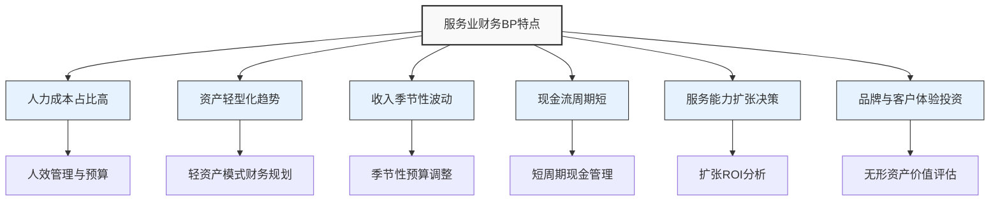

---
{"dg-publish":true,"tags":["财务BP","服务业","案例集","预算规划","财务分析","现金流管理"],"创建日期":"2024-04-28","permalink":"/知识共享/001_财务/01_财务BP/03_案例/服务业财务BP案例集/服务业财务BP案例集/","dgPassFrontmatter":true}
---

# 服务业财务BP案例集

## 概述

本案例集汇总了服务业企业在财务规划与预算管理中的典型案例，涵盖酒店、餐饮、咨询、零售服务等不同细分领域。通过这些案例，展示服务业在财务BP实践中的独特特点与关键考量因素。

## 服务业财务BP的特点

## 案例目录

### 1. 酒店行业案例
- [希尔顿酒店集团季节性预算规划案例](希尔顿酒店集团季节性预算规划案例.md) - 分析国际酒店集团如何应对季节性需求波动进行预算规划
- [海底捞全球扩张的财务策略](海底捞全球扩张的财务策略.md) - 分析连锁餐饮企业如何规划全球扩张的财务战略
- [万豪酒店集团资产优化与财务规划](万豪酒店集团资产优化与财务规划.md) - 研究酒店集团如何通过轻资产模式优化财务结构

### 2. 餐饮行业案例
- [星巴克中国市场扩张的财务策略](星巴克中国市场扩张的财务策略.md) - 探讨星巴克在中国市场扩张中的财务规划与决策
- [麦当劳特许经营模式的财务规划](麦当劳特许经营模式的财务规划.md) - 分析特许经营模式下的财务BP策略
- [奈雪的茶新店扩张投资回报分析](奈雪的茶新店扩张投资回报分析.md) - 研究新型茶饮品牌的门店投资决策

### 3. 零售服务案例
- [沃尔玛全渠道战略的财务规划](沃尔玛全渠道战略的财务规划.md) - 分析零售巨头线上线下融合的财务策略
- [优衣库库存管理与财务规划](优衣库库存管理与财务规划.md) - 探讨服装零售企业的库存与现金流管理
- [京东物流基础设施投资决策](京东物流基础设施投资决策.md) - 分析电商物流投资的财务规划

### 4. 专业服务案例
- [德勤咨询人力资源预算优化](德勤咨询人力资源预算优化.md) - 研究知识密集型企业的人力资源预算
- [爱彼迎平台模式的收入预测](爱彼迎平台模式的收入预测.md) - 分析共享经济平台的财务预测方法
- [携程OTA模式的现金流管理](携程OTA模式的现金流管理.md) - 探讨在线旅游平台的现金流周期管理

## 服务业财务BP关键挑战

1. **人力成本管理** - 服务业企业如何平衡人力资源投入与产出效益
2. **季节性波动应对** - 如何设计弹性预算应对需求波动
3. **扩张节奏控制** - 如何确定最优扩张速度与资金需求
4. **客户体验投资回报** - 如何量化客户体验投资的财务回报
5. **多渠道整合** - 线上线下渠道融合的财务协同效应

## 服务业财务BP最佳实践

1. **收入驱动预算法** - 基于服务能力和目标入住率/上座率的收入预测
2. **弹性人力规划** - 结合固定人力与临时人力的混合预算模型
3. **零基预算应用** - 定期审视成本结构，避免预算惯性
4. **多情景现金流预测** - 应用高中低三种情景预测现金流敏感性
5. **单位经济模型** - 建立标准化单店/单位服务财务模型

## 行业趋势与展望

- **数字化转型** - 服务业企业数字化转型下的IT预算规划
- **体验经济** - 客户体验投资增加对财务结构的影响
- **可持续发展** - ESG因素对服务业财务规划的新要求
- **敏捷预算** - 从年度固定预算向滚动预算和敏捷预算转变
- **数据驱动决策** - 基于客户数据的精细化财务规划

## 参考资源

1. Deloitte. (2022). *Hospitality Financial Management: Trends and Challenges*.
2. PwC. (2023). *Service Industry Financial Planning Best Practices*.
3. McKinsey & Company. (2021). *The Future of Service Business Models*.
4. 《服务业财务管理创新与实践》，中国财政经济出版社，2022.
5. 《数字时代的服务业财务转型》，机械工业出版社，2023. 