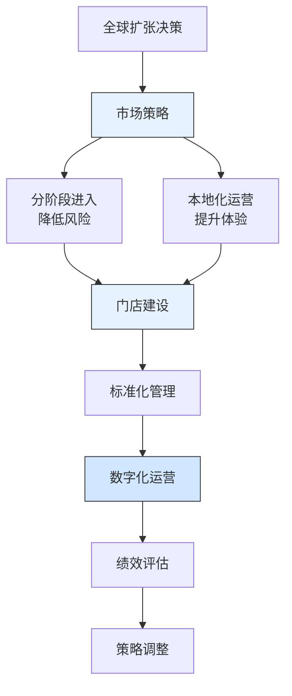

---
{"dg-publish":true,"tags":["财务BP","服务业","海底捞","全球扩张","餐饮连锁","案例分析"],"创建日期":"2024-04-28","permalink":"/知识共享/001_财务/01_财务BP/03_案例/服务业财务BP案例集/海底捞全球扩张的财务策略/","dgPassFrontmatter":true}
---

> [!quote] 案例简介
> 本案例分析海底捞在2018-2022年期间如何规划全球市场扩张，重点关注其如何通过创新的财务策略平衡海外扩张与运营效率，以及如何通过本地化运营和标准化管理优化投资回报。

## 案例背景

### 企业背景
海底捞成立于1994年，是中国领先的火锅连锁餐饮企业。2018年，海底捞开始大规模海外扩张，计划将品牌推向全球市场。这是中国餐饮行业最大规模的国际化扩张计划之一。

### 财务状况
海底捞在规划全球扩张时的财务状况：
- 2018年营收约170亿元人民币
- 国内门店数量超过300家
- 单店盈利能力稳定，但海外市场经验有限
- 需要平衡扩张速度与财务可持续性

### 市场环境
2018-2022年全球餐饮市场特点：
- 亚洲餐饮文化影响力提升
- 消费者对体验式餐饮需求增加
- 数字化技术应用加速
- 国际餐饮品牌竞争加剧

## 挑战与机遇识别

### 核心问题
海底捞面临的全球扩张财务规划挑战包括：
1. **本地化成本**：如何平衡标准化与本地化投入
2. **人才管理**：如何培养国际化管理团队
3. **供应链建设**：如何建立全球供应链体系
4. **文化差异**：如何适应不同市场消费习惯

### 问题根源分析
通过分析，财务规划挑战的根本原因包括：
- **文化差异大**：不同市场餐饮习惯差异显著
- **人才需求高**：需要大量国际化管理人才
- **供应链复杂**：需要建立全球食材供应网络
- **运营成本高**：海外市场运营成本较高

### 机遇评估
海底捞识别的主要机遇包括：
1. 通过品牌优势快速进入新市场
2. 利用数字化技术提升运营效率
3. 通过标准化管理降低扩张成本
4. 全球中餐市场增长潜力大

## 财务策略分析

### 全球扩张财务策略
海底捞采取的核心财务策略包括：
1. **分阶段市场进入策略**：
   - 将全球市场分为成熟市场和新兴市场
   - 不同市场采用不同的投资标准
   - 根据市场特点选择进入方式
   - 建立动态的市场优先级调整机制

2. **本地化运营策略**：
   - 建立本地化菜单体系
   - 培养本地管理团队
   - 开发符合本地文化的服务模式
   - 建立本地化营销体系

3. **标准化管理策略**：
   - 建立全球统一的服务标准
   - 开发数字化管理系统
   - 优化供应链管理
   - 建立人才培养体系

### 财务逻辑与假设
该战略的关键假设包括：
- 成熟市场投资回收期在2-3年
- 本地化投入可提升30%的客户满意度
- 标准化管理可降低20%的运营成本
- 数字化可提升15%的运营效率

### 财务分析工具应用
海底捞在全球化规划中应用了以下工具：
1. **市场潜力模型**：评估不同市场的增长潜力
2. **单店盈利模型**：基于不同市场特点的盈利预测
3. **敏感性分析**：评估客单价、翻台率变动的影响
4. **现金流预测模型**：评估资金需求与回报

## 实施过程

### 实施步骤与时间线
海底捞全球扩张分为三个阶段：

**第一阶段(2018-2019)：战略布局期**
- 2018年进入新加坡市场
- 2019年拓展至美国市场
- 建立全球供应链体系
- 开始人才培养计划

**第二阶段(2019-2021)：快速扩张期**
- 进入10多个国家和地区
- 建立本地化运营中心
- 优化数字化管理系统
- 完善人才培养体系

**第三阶段(2021-2022)：优化提升期**
- 提升本地化运营水平
- 加强品牌建设
- 优化全球供应链
- 提升运营效率

### 实施挑战
实施过程中面临的主要挑战包括：
1. 本地化人才短缺
2. 供应链成本高
3. 文化差异大
4. 运营效率待提升

### 关键成功因素
成功实施的关键因素包括：
1. 强大的品牌影响力
2. 标准化的管理体系
3. 本地化运营能力
4. 数字化技术应用

## 结果评估

### 短期效果
实施全球扩张策略后，海底捞在短期内取得了显著成效：
- 2022年海外门店超过100家
- 海外市场营收占比达到15%
- 客户满意度保持高位
- 品牌影响力持续提升

### 长期影响
这一财务策略对海底捞产生了深远影响：
- 成为全球领先的中餐品牌
- 建立了完整的国际化运营体系
- 形成了标准化管理能力
- 提升了全球品牌价值

### 预期与实际差异
与预期相比，存在一些差异：
- 部分市场扩张速度慢于预期
- 本地化成本高于预期
- 数字化效果显著
- 品牌影响力提升快于预期

## 经验教训提炼

### 成功经验
海底捞全球扩张的成功经验包括：
1. **分阶段进入**：根据市场特点灵活调整策略
2. **本地化运营**：重视本地化服务体验
3. **标准化管理**：建立统一的管理体系
4. **数字化赋能**：提升运营效率
5. **人才培养**：建立国际化人才梯队

### 失误与教训
值得反思的问题包括：
1. 部分市场本地化投入过大
2. 供应链成本控制不足
3. 人才储备需要加强
4. 运营效率有待提升

### 可借鉴原则
对其他服务业企业有价值的借鉴原则：
1. 全球化需要分阶段实施
2. 本地化是成功的关键
3. 标准化管理很重要
4. 数字化要先行

## 延伸思考

### 讨论问题
1. 服务业企业如何平衡标准化与本地化？
2. 如何评估不同市场的长期价值？
3. 数字化对服务业全球化的影响？

### 行业应用借鉴
海底捞的经验对以下领域有重要参考价值：
- **餐饮连锁**：标准化与本地化
- **服务业**：全球扩张策略
- **品牌管理**：国际化品牌建设

### 未来趋势展望
服务业全球扩张财务规划可能的发展趋势：
1. 更加重视数字化应用
2. 本地化更加精细化
3. 供应链更加灵活
4. 人才管理更加重要

## 参考资源

1. Haidilao Annual Reports (2018-2022).
2. 《海底捞全球化战略报告》. 海底捞.
3. McKinsey & Company. (2022). *The Future of Global Restaurant Chains*.
4. 《全球餐饮市场发展报告》. 艾瑞咨询.
5. Harvard Business Review. (2021). *Haidilao's Global Strategy*. 