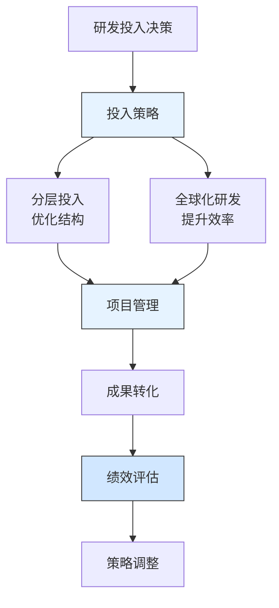

---
{"dg-publish":true,"tags":["财务BP","科技企业","华为","研发投入","技术创新","案例分析"],"创建日期":"2024-04-28","permalink":"/知识共享/001_财务/01_财务BP/03_案例/科技企业财务BP案例集/华为研发投入的财务策略/","dgPassFrontmatter":true}
---

> [!quote] 案例简介
> 本案例分析华为在2015-2020年期间如何规划和管理研发投入，重点关注其如何通过创新的财务策略平衡研发投入与财务可持续性，以及如何通过研发投入优化提升企业竞争力。

## 案例背景

### 企业背景
华为成立于1987年，是全球领先的信息与通信技术（ICT）解决方案提供商。2015年，华为开始大规模增加研发投入，以应对全球技术竞争和市场需求变化。这是中国科技企业最大规模的研发投入计划之一。

### 财务状况
华为在规划研发投入时的财务状况：
- 2015年营收约3950亿元人民币
- 研发投入占比约15%
- 现金流状况良好，但面临国际市场压力
- 需要平衡研发投入与财务可持续性

### 市场环境
2015-2020年全球科技市场特点：
- 5G技术快速发展
- 人工智能技术兴起
- 全球技术竞争加剧
- 供应链安全重要性提升

## 挑战与机遇识别

### 核心问题
华为面临的研发投入财务规划挑战包括：
1. **投入规模**：如何确定合理的研发投入规模
2. **投入方向**：如何平衡基础研究与应用研究
3. **投入效率**：如何提升研发投入产出效率
4. **风险控制**：如何管理研发投入风险

### 问题根源分析
通过分析，财务规划挑战的根本原因包括：
- **技术迭代快**：需要持续投入保持技术领先
- **竞争压力大**：国际市场竞争激烈
- **投入周期长**：研发成果转化需要时间
- **风险高**：研发失败风险较大

### 机遇评估
华为识别的主要机遇包括：
1. 通过技术创新提升产品竞争力
2. 建立技术壁垒保护市场份额
3. 开拓新的业务增长点
4. 提升全球品牌影响力

## 财务策略分析

### 研发投入财务策略
华为采取的核心财务策略包括：
1. **分层投入策略**：
   - 基础研究投入占比30%
   - 应用研究投入占比50%
   - 产品开发投入占比20%
   - 建立动态调整机制

2. **全球化研发策略**：
   - 建立全球研发中心网络
   - 吸引全球顶尖人才
   - 开展国际合作研究
   - 建立本地化研发团队

3. **效率提升策略**：
   - 建立研发项目管理体系
   - 优化研发资源配置
   - 加强知识产权管理
   - 提升研发成果转化率

### 财务逻辑与假设
该战略的关键假设包括：
- 研发投入年增长率保持在15%左右
- 研发成果转化率提升至30%
- 知识产权收入占比达到10%
- 研发效率提升20%

### 财务分析工具应用
华为在研发投入规划中应用了以下工具：
1. **研发投入回报模型**：评估不同研发项目的投资回报
2. **技术路线图**：规划技术发展方向
3. **敏感性分析**：评估研发投入变动的影响
4. **现金流预测模型**：评估资金需求与回报

## 实施过程

### 实施步骤与时间线
华为研发投入分为三个阶段：

**第一阶段(2015-2017)：战略布局期**
- 2015年启动大规模研发投入
- 2016年建立全球研发中心网络
- 2017年优化研发管理体系
- 开始人才培养计划

**第二阶段(2017-2019)：快速扩张期**
- 研发投入持续增加
- 建立完整的研发体系
- 优化项目管理流程
- 完善人才培养体系

**第三阶段(2019-2020)：优化提升期**
- 提升研发效率
- 加强知识产权管理
- 优化全球研发布局
- 提升成果转化率

### 实施挑战
实施过程中面临的主要挑战包括：
1. 研发投入规模大
2. 人才竞争激烈
3. 项目管理复杂
4. 成果转化周期长

### 关键成功因素
成功实施的关键因素包括：
1. 强大的资金实力
2. 完善的研发体系
3. 全球化人才网络
4. 高效的项目管理

## 结果评估

### 短期效果
实施研发投入策略后，华为在短期内取得了显著成效：
- 2020年研发投入达到1419亿元
- 研发人员超过10万人
- 专利申请量全球领先
- 技术竞争力显著提升

### 长期影响
这一财务策略对华为产生了深远影响：
- 成为全球技术领先企业
- 建立了完整的研发体系
- 形成了技术壁垒
- 提升了全球竞争力

### 预期与实际差异
与预期相比，存在一些差异：
- 研发投入增长快于预期
- 人才竞争更加激烈
- 技术迭代速度加快
- 国际环境变化影响大

## 经验教训提炼

### 成功经验
华为研发投入的成功经验包括：
1. **分层投入**：合理分配研发资源
2. **全球化布局**：吸引全球顶尖人才
3. **效率提升**：优化研发管理流程
4. **成果转化**：加强知识产权管理
5. **人才培养**：建立人才梯队

### 失误与教训
值得反思的问题包括：
1. 部分研发项目周期过长
2. 人才流失率较高
3. 项目管理有待优化
4. 成果转化效率待提升

### 可借鉴原则
对其他科技企业有价值的借鉴原则：
1. 研发投入需要长期坚持
2. 全球化布局很重要
3. 效率提升是关键
4. 人才培养是基础

## 延伸思考

### 讨论问题
1. 科技企业如何平衡研发投入与财务可持续性？
2. 如何评估研发投入的长期价值？
3. 全球化研发布局的优势与挑战？

### 行业应用借鉴
华为的经验对以下领域有重要参考价值：
- **科技企业**：研发投入管理
- **创新型企业**：技术创新策略
- **全球化企业**：全球研发布局

### 未来趋势展望
科技企业研发投入财务规划可能的发展趋势：
1. 更加重视基础研究
2. 全球化布局更加重要
3. 效率提升更加关键
4. 人才培养更加重视

## 参考资源

1. Huawei Annual Reports (2015-2020).
2. 《华为研发战略报告》. 华为.
3. McKinsey & Company. (2020). *The Future of R&D Investment*.
4. 《全球科技企业研发投入报告》. 艾瑞咨询.
5. Harvard Business Review. (2019). *Huawei's R&D Strategy*. 