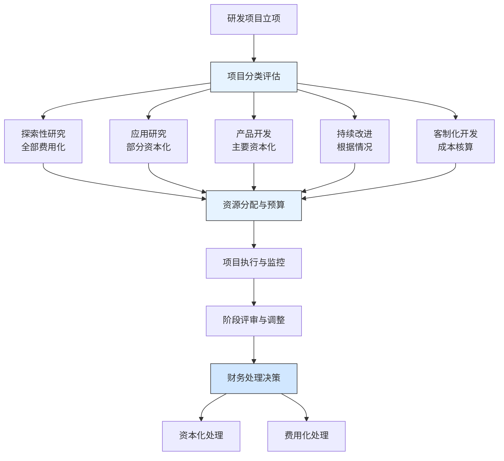

---
{"dg-publish":true,"tags":["财务BP","科技企业","研发预算","资本化","费用化","华为","案例分析"],"创建日期":"2024-04-28","permalink":"/知识共享/001_财务/01_财务BP/03_案例/科技企业财务BP案例集/华为研发资本化与费用化平衡策略/","dgPassFrontmatter":true}
---

> [!quote] 案例简介
> 本案例分析华为技术有限公司如何在研发投入中平衡资本化与费用化的财务策略，重点关注其如何通过精细化的研发预算管理提升研发效率，同时优化财务报表结构，支持长期技术创新。

## 案例背景

### 企业背景
华为技术有限公司成立于1987年，总部位于中国深圳，是全球领先的信息通信技术(ICT)解决方案提供商。经过三十多年发展，华为业务已经覆盖电信网络、企业业务、消费者业务和云计算等领域。2019年，华为全球销售收入达8588亿元人民币，员工超过19.4万人，其中研发人员占比超过一半，在全球设有多个研发中心。

### 财务管理体系
华为建立了完善的财务管理体系，特别是在研发投入管理方面：
- 实行"透明、规范、共享"的财经政策
- 采用"战略驱动-预算管理-绩效评估"闭环管理
- 研发预算实行分级管理，战略性研发与业务线研发分开规划
- 执行严格的研发项目立项、评估和验收流程

### 市场环境
2015-2020年是华为研发投入策略重要调整期，当时面临的市场环境：
- 全球通信行业进入5G与AI变革前夕
- 国际政治环境带来的潜在供应链风险
- 消费电子业务快速增长，生态构建需要加速
- 企业云计算与智能化转型提供新机遇

## 挑战与机遇识别

### 核心问题
华为面临的研发投入财务规划挑战包括：
1. **研发强度与短期盈利平衡**：如何保持高强度研发投入同时维持合理盈利能力
2. **资本化与费用化决策难题**：研发支出资本化与费用化的界限判断与财务影响
3. **多元业务研发资源分配**：如何在消费者、运营商、企业等多条业务线间合理分配研发资源
4. **前沿技术投资回报评估**：如何评估基础研究和前沿技术的长期价值与回报

### 问题根源分析
通过深入分析，研发管理面临的关键挑战源于：
- **内在矛盾**：研发投入具有高不确定性，与财务可预测性需求存在天然矛盾
- **会计规范约束**：研发资本化需要严格满足会计准则要求，同时面临审计挑战
- **组织机制**：业务部门与研发部门对研发预算的目标存在天然差异
- **技术演进**：技术更新加速导致产品生命周期缩短，研发投资回收窗口变窄

### 机遇评估
华为识别的主要机遇包括：
1. 通过精细化研发管理，提高研发资金使用效率
2. 借助严格的资本化标准建立更规范的研发管理体系
3. 利用财务规划工具优化研发支出节奏，平滑财务表现
4. 构建差异化研发投资组合，平衡短期产品开发与长期技术突破

## 财务策略分析

### 研发资本化与费用化策略
华为采取的核心财务策略包括：
1. **分层次研发支出分类框架**：
   - 建立研发项目五级分类：探索性研究、应用研究、产品开发、持续改进和客制化开发
   - 为不同类型研发活动设定不同资本化标准和流程
   - 根据项目类型分配不同风险等级和财务处理方式

2. **动态资本化阈值管理**：
   - 制定"技术可行性+商业可行性"双维度评估模型
   - 设立资本化节点评审机制，根据项目进展动态调整资本化比例
   - 建立研发预算与实际支出偏差分析机制，及时调整资本化策略

3. **战略性研发专项预算管理**：
   - 将基础研究和战略性技术研发单独预算，主要采用费用化处理
   - 为战略性研发设立独立的考核指标，减少短期财务压力
   - 实施"2+8策略"：保证20%研发投入用于前沿探索，80%用于产品开发

### 财务逻辑与假设
该战略的关键假设包括：
- 研发投入规模与创新成果并非线性关系，管理效率是关键变量
- 资本化处理可以更好地匹配研发投入与未来收益
- 分类管理可以提高研发投入的有效性和可持续性
- 财务规划工具可以缓解研发投入波动带来的盈利压力

### 财务分析工具应用
华为在研发投入规划中应用了以下工具：
1. **研发ROI模型**：评估不同类型研发项目的投资回报周期和预期回报率
2. **多维资源配置矩阵**：按业务线、技术域、产品生命周期阶段分配研发资源
3. **资本化敏感性分析**：评估不同资本化比例对财务指标的影响
4. **项目组合管理工具**：平衡高风险与低风险研发项目的资源分配

## 实施过程

### 实施步骤与时间线
华为的研发资本化与费用化战略实施分为四个阶段：

**第一阶段(2015-2016)：规范与标准化**
- 制定统一的研发项目分类标准和判断标准
- 建立技术与商业可行性评估流程
- 完善研发立项和预算管理流程

**第二阶段(2016-2017)：系统建设与流程优化**
- 实施研发项目财务管理系统
- 优化研发工时统计与分配机制
- 建立研发资本化决策评审机制

**第三阶段(2017-2018)：全面推广与深化**
- 在全球研发中心推广资本化管理体系
- 将资本化管理与技术路线图规划整合
- 实施研发预算动态调整机制

**第四阶段(2018-2020)：持续改进与优化**
- 引入更精细化的研发价值管理工具
- 优化资本化比例与业务增长的匹配度
- 建立基于价值链的研发投入分析框架

### 实施挑战
实施过程中面临的主要挑战包括：
1. 国际会计准则对研发资本化的严格限定
2. 研发人员对资本化管理的抵触情绪
3. 不同业务部门对研发资源分配的竞争
4. 技术发展迅速导致资本化资产潜在减值风险

### 关键成功因素
成功实施的关键因素包括：
1. 高管层对研发价值导向的共识与支持
2. 建立跨部门协作机制，特别是研发、财务和业务部门
3. 设计合理的激励机制，平衡短期绩效与长期创新
4. 持续改进研发管理工具和方法

## 结果评估

### 短期效果
实施研发资本化与费用化管理策略后，短期内取得了以下成效：
- 研发支出资本化比例从平均22%优化至约30%，更好地反映技术投资价值
- 研发预算执行偏差率降低8个百分点，提高了资源使用效率
- 财务报表中研发相关指标更加规范透明，增强了投资者信心
- 业务线与研发部门在预算规划过程中的协同性提升

### 长期影响
长期来看，该策略对华为产生了深远影响：
- 研发投入强度稳步提升，2019年达到总收入的15.3%
- 通过优化资本化，净利润波动性降低，支持了持续高研发投入
- 专利申请数量持续增长，每年新增数千项专利
- 建立了可持续创新的财务支持体系

### 预期与实际差异
与预期相比，存在一些差异：
- 某些前沿技术领域的资本化难度高于预期
- 外部环境变化导致战略调整，部分研发项目提前终止
- 不同业务线的研发资本化比例差异大于预期
- 部分资本化资产的实际使用寿命短于预计

## 经验教训提炼

### 成功经验
华为研发资本化与费用化管理的成功经验包括：
1. **研发分类管理**：不同性质的研发活动采用差异化管理模式
2. **预算与战略联动**：将研发预算与技术路线图紧密结合
3. **动态调整机制**：根据项目进展和市场反馈动态调整资本化策略
4. **平衡长短期投入**：保持战略性研发投入的稳定性
5. **系统支持**：通过信息系统确保研发过程的可追溯性和合规性

### 失误与教训
值得反思的问题包括：
1. 部分研发项目技术可行性评估过于乐观，导致后期减值风险
2. 资本化标准过于复杂，增加了管理负担
3. 某些领域研发投入与市场回报的相关性评估不足
4. 在业务快速变化期，长期资本化资产可能面临提前淘汰风险

### 可借鉴原则
对其他科技企业有价值的借鉴原则：
1. 研发资本化是财务工具，不应成为推高短期利润的手段
2. 建立与企业发展阶段匹配的研发投入结构
3. 财务规划应服务于技术创新，而非限制创新
4. 资本化标准应结合行业特点和企业战略定位

## 延伸思考

### 讨论问题
1. 科技企业如何在快速变化的技术环境中平衡研发资本化与潜在的减值风险？
2. 在全球会计准则趋同的背景下，中国科技企业应如何建立既符合国际规范又支持长期创新的研发财务政策？
3. 企业应如何设计研发预算体系，平衡总部战略导向与业务部门实际需求？

### 行业应用借鉴
华为的经验对以下行业有重要参考价值：
- **软件企业**：研发投入与产品生命周期管理
- **医药企业**：长周期研发项目的阶段性资本化策略
- **芯片设计企业**：IP资产管理与研发投入回报评估

### 未来趋势展望
科技企业研发资本化管理可能的发展趋势：
1. 更加精细化的研发价值测量模型，超越传统财务指标
2. 融合无形资产评估的新方法，更好反映技术创新价值
3. 结合数据分析的研发投资组合优化工具
4. 适应开源与创新生态的研发投入管理新模式

## 参考资源

1. 华为投资控股有限公司年报 (2015-2020).
2. 《国际会计准则第38号—无形资产》.
3. 柯丁. (2019). *华为研发管理之道*. 电子工业出版社.
4. Harvard Business Review. (2018). *How Huawei Manages R&D Investment*.
5. Journal of Technology Management in China. *R&D Capitalization Practices in Chinese Technology Firms*. 