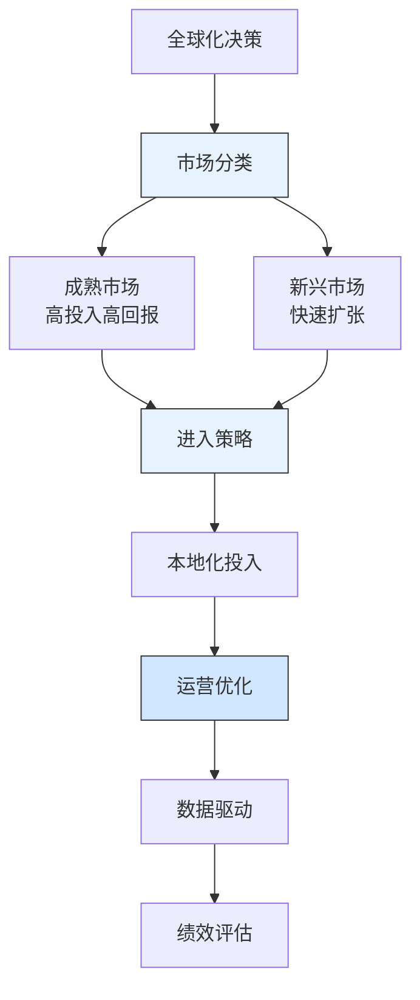

---
{"dg-publish":true,"tags":["财务BP","科技企业","字节跳动","全球化扩张","产品本地化","案例分析"],"创建日期":"2024-04-28","permalink":"/知识共享/001_财务/01_财务BP/03_案例/科技企业财务BP案例集/字节跳动全球化扩张的财务策略/","dgPassFrontmatter":true}
---

> [!quote] 案例简介
> 本案例分析字节跳动在2016-2020年期间如何规划全球化扩张，重点关注其如何通过创新的财务策略平衡产品本地化投入与全球市场扩张，以及如何通过数据驱动的决策和本地化运营优化投资回报。

## 案例背景

### 企业背景
字节跳动成立于2012年，是中国领先的科技公司。2016年，字节跳动开始全球化战略，计划将TikTok等产品推向全球市场。这是中国互联网企业最大规模的全球化扩张计划之一。

### 财务状况
字节跳动在规划全球化扩张时的财务状况：
- 2016年营收约60亿元人民币，主要来自中国市场
- 核心产品DAU快速增长，但海外市场占比低
- 研发投入占比较高，但盈利能力良好
- 需要平衡全球化投入与财务可持续性

### 市场环境
2016-2020年全球社交媒体市场特点：
- 移动互联网用户快速增长，特别是新兴市场
- 本地化内容需求强烈，文化差异显著
- 数据隐私监管趋严，合规成本上升
- 竞争对手全球化布局加速

## 挑战与机遇识别

### 核心问题
字节跳动面临的全球化扩张财务规划挑战包括：
1. **产品本地化成本**：如何平衡本地化投入与规模效应
2. **市场准入壁垒**：如何应对不同国家的监管要求
3. **运营成本控制**：如何优化全球运营成本结构
4. **投资回报周期**：如何评估不同市场的投资回报

### 问题根源分析
通过分析，财务规划挑战的根本原因包括：
- **文化差异大**：不同市场用户习惯差异显著
- **监管环境复杂**：各国数据隐私政策不同
- **运营成本高**：需要建立本地化团队
- **竞争激烈**：全球科技巨头布局完善

### 机遇评估
字节跳动识别的主要机遇包括：
1. 通过算法优势快速适应本地市场
2. 利用中国经验优化全球运营效率
3. 通过并购加速市场进入
4. 新兴市场用户增长潜力大

## 财务策略分析

### 全球化扩张财务策略
字节跳动采取的核心财务策略包括：
1. **分阶段市场进入策略**：
   - 将全球市场分为成熟市场和新兴市场
   - 不同市场采用不同的投资标准和回报预期
   - 根据市场特点选择进入方式（自建/并购）
   - 建立动态的市场优先级调整机制

2. **本地化投入策略**：
   - 建立本地化内容运营团队
   - 投资本地创作者生态
   - 开发符合本地文化的产品功能
   - 建立本地化营销体系

3. **数据驱动决策策略**：
   - 建立全球用户行为分析系统
   - 开发市场潜力评估模型
   - 优化广告投放效率
   - 建立ROI实时监控体系

### 财务逻辑与假设
该战略的关键假设包括：
- 新兴市场用户增长率将保持30%以上
- 本地化投入可提升50%的用户留存率
- 成熟市场投资回收期在2-3年
- 算法优势可降低30%的获客成本

### 财务分析工具应用
字节跳动在全球化规划中应用了以下工具：
1. **市场潜力模型**：评估不同市场的增长潜力
2. **ROI预测模型**：基于不同市场特点的投资回报预测
3. **敏感性分析**：评估用户增长、获客成本变动的影响
4. **并购评估模型**：评估潜在并购目标的财务价值

## 实施过程

### 实施步骤与时间线
字节跳动全球化扩张分为三个阶段：

**第一阶段(2016-2017)：战略布局期**
- 2016年收购Musical.ly
- 2017年推出TikTok国际版
- 建立全球内容审核团队
- 开始本地化运营体系建设

**第二阶段(2017-2019)：快速扩张期**
- 进入100多个国家和地区
- 建立本地化运营中心
- 推出创作者激励计划
- 优化广告投放系统

**第三阶段(2019-2020)：优化提升期**
- 加强数据隐私合规
- 提升本地化内容质量
- 优化全球运营效率
- 加强品牌建设

### 实施挑战
实施过程中面临的主要挑战包括：
1. 数据隐私监管要求不断提高
2. 本地化内容运营成本高
3. 不同市场文化差异大
4. 全球竞争加剧

### 关键成功因素
成功实施的关键因素包括：
1. 强大的算法和技术优势
2. 灵活的市场进入策略
3. 本地化团队建设
4. 数据驱动的决策机制

## 结果评估

### 短期效果
实施全球化策略后，字节跳动在短期内取得了显著成效：
- 2020年TikTok全球下载量突破20亿
- 进入全球150多个市场
- 本地化内容占比超过60%
- 广告收入快速增长

### 长期影响
这一财务策略对字节跳动产生了深远影响：
- 成为全球最具价值的科技公司之一
- 建立了完整的全球化运营体系
- 形成了本地化内容创新能力
- 提升了全球品牌影响力

### 预期与实际差异
与预期相比，存在一些差异：
- 数据隐私合规成本高于预期
- 部分市场用户增长快于预期
- 本地化投入回报高于预期
- 品牌建设效果显著

## 经验教训提炼

### 成功经验
字节跳动全球化扩张的成功经验包括：
1. **分阶段市场进入**：根据市场特点灵活调整策略
2. **本地化先行**：重视本地化内容运营
3. **数据驱动**：建立科学的决策机制
4. **技术优势**：发挥算法和技术优势
5. **灵活调整**：快速响应市场变化

### 失误与教训
值得反思的问题包括：
1. 对数据隐私监管准备不足
2. 部分市场本地化投入过大
3. 品牌建设起步较晚
4. 全球运营效率有待提升

### 可借鉴原则
对其他科技企业有价值的借鉴原则：
1. 全球化需要分阶段实施
2. 本地化是成功的关键
3. 数据驱动决策很重要
4. 技术优势要充分发挥

## 延伸思考

### 讨论问题
1. 科技企业如何平衡全球化扩张与本地化投入？
2. 数据隐私合规成本应如何评估？
3. 如何评估不同市场的长期价值？

### 行业应用借鉴
字节跳动的经验对以下科技领域有重要参考价值：
- **社交媒体**：内容本地化与全球运营
- **移动应用**：用户增长与变现
- **数字广告**：全球投放效率

### 未来趋势展望
科技企业全球化财务规划可能的发展趋势：
1. 更加重视数据隐私合规
2. 本地化投入更加精细化
3. 全球运营效率持续提升
4. 技术驱动的决策更加普及

## 参考资源

1. ByteDance Annual Reports (2016-2020).
2. 《字节跳动全球化战略报告》. 字节跳动.
3. McKinsey & Company. (2020). *The Future of Global Tech Expansion*.
4. 《全球社交媒体市场发展报告》. IDC.
5. Harvard Business Review. (2019). *ByteDance's Global Strategy*. 