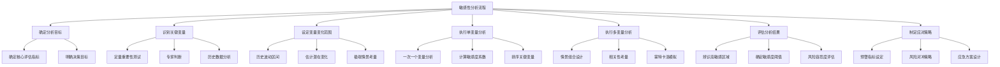

---
{"dg-publish":true,"tags":["财务BP","敏感性分析","情景规划","风险评估","模板"],"创建日期":"2024-04-28","permalink":"/知识共享/001_财务/01_财务BP/04_模板/01_分析框架/敏感性分析模板/","dgPassFrontmatter":true}
---

# 敏感性分析模板

## 模板概述

本模板提供了一个系统化的敏感性分析框架，用于识别和评估财务预测中的关键变量对结果的影响程度。通过敏感性分析，财务人员可以更全面地了解企业财务计划的风险敞口，为管理层决策提供更可靠的信息支持，并制定相应的风险缓解策略。

## 前期准备

### 所需数据与资源

- [ ] 基准财务预测模型
  - 完整的财务预测表（利润表、资产负债表、现金流量表）
  - 基础假设文档
  - 历史财务趋势数据
- [ ] 关键变量信息
  - 历史波动范围
  - 行业标准差或波动性指标
  - 关联性数据（若进行多变量分析）
- [ ] 技术工具
  - Excel或专业财务模型软件
  - 统计分析工具（如需）

### 分析团队组成

- 财务分析师（主责）
- 业务运营负责人（提供业务视角）
- 风险管理专员（评估分析结果）
- 高级财务经理（审核与决策支持）

## 分析框架结构

## 核心分析模块

### 1. 确定分析目标

#### 评估指标选择表

| 评估指标 | 选择 | 重要性 | 评估理由 | 目标值 | 可接受偏差范围 |
|---------|------|--------|----------|--------|--------------|
| 净利润 | □ | 高/中/低 |  |  | ±__% |
| 毛利率 | □ | 高/中/低 |  |  | ±__% |
| 经营现金流 | □ | 高/中/低 |  |  | ±__% |
| EBITDA | □ | 高/中/低 |  |  | ±__% |
| ROI/ROE | □ | 高/中/低 |  |  | ±__% |
| 资产周转率 | □ | 高/中/低 |  |  | ±__% |
| 偿债能力指标 | □ | 高/中/低 |  |  | ±__% |
| 增长率 | □ | 高/中/低 |  |  | ±__% |
| 其他:_____ | □ | 高/中/低 |  |  | ±__% |

#### 分析目的明确化

| 分析目的 | 选择 | 具体要求 | 预期输出 | 决策支持方向 |
|---------|------|---------|---------|------------|
| 预算风险评估 | □ |  |  |  |
| 投资决策支持 | □ |  |  |  |
| 融资规划支持 | □ |  |  |  |
| 业务变革评估 | □ |  |  |  |
| 战略规划验证 | □ |  |  |  |
| 其他:_____ | □ |  |  |  |

### 2. 识别关键变量

#### 潜在变量清单

| 变量类别 | 潜在变量 | 历史波动性 | 对目标指标影响途径 | 初步重要性评估 | 纳入分析 |
|---------|---------|-----------|----------------|--------------|---------|
| **收入变量** |  |  |  |  |  |
| | 销量 |  |  | 高/中/低 | □ |
| | 单价 |  |  | 高/中/低 | □ |
| | 产品组合 |  |  | 高/中/低 | □ |
| | 市场份额 |  |  | 高/中/低 | □ |
| **成本变量** |  |  |  |  |  |
| | 原材料成本 |  |  | 高/中/低 | □ |
| | 人工成本 |  |  | 高/中/低 | □ |
| | 制造费用 |  |  | 高/中/低 | □ |
| | 能源成本 |  |  | 高/中/低 | □ |
| **运营变量** |  |  |  |  |  |
| | 运营效率 |  |  | 高/中/低 | □ |
| | 产能利用率 |  |  | 高/中/低 | □ |
| | 周转天数 |  |  | 高/中/低 | □ |
| **外部变量** |  |  |  |  |  |
| | 利率 |  |  | 高/中/低 | □ |
| | 汇率 |  |  | 高/中/低 | □ |
| | 税率 |  |  | 高/中/低 | □ |
| | 通胀率 |  |  | 高/中/低 | □ |

#### 变量筛选标准

选择以下符合条件的变量进行敏感性分析：
1. 历史波动性显著（变异系数>___%）
2. 对目标指标影响明显（初步评估为高或中）
3. 管理层认为具有战略重要性
4. 当前环境下具有高不确定性
5. 可能超出历史波动范围

### 3. 设定变量变化范围

#### 变量范围设定表

| 变量 | 基准值 | 历史最低 | 历史最高 | 历史标准差 | 设定分析范围 | 设定理由 |
|------|-------|---------|---------|-----------|------------|---------|
|  |  |  |  |  | 基准值±__% |  |
|  |  |  |  |  | 基准值±__% |  |
|  |  |  |  |  | 基准值±__% |  |
|  |  |  |  |  | 基准值±__% |  |
|  |  |  |  |  | 基准值±__% |  |
|  |  |  |  |  | 基准值±__% |  |

#### 分析步长设定

为每个变量设定适当的分析步长：

| 变量 | 分析范围 | 步长设置 | 分析点数量 |
|------|---------|---------|----------|
|  | ±__% | __% | __ 点 |
|  | ±__% | __% | __ 点 |
|  | ±__% | __% | __ 点 |
|  | ±__% | __% | __ 点 |

*注：步长设置应在计算负担与分析精度间取得平衡，通常5-10个分析点为宜。*

### 4. 执行单变量分析

#### 单变量敏感性分析表

| 变量 | 变化值 | 对目标指标影响 | 百分比变化 | 敏感度系数 |
|------|-------|--------------|-----------|----------|
| **变量1** |  |  |  |  |
|  | -__% |  |  |  |
|  | -__% |  |  |  |
|  | 基准值 |  | 0% | - |
|  | +__% |  |  |  |
|  | +__% |  |  |  |
| **变量2** |  |  |  |  |
|  | -__% |  |  |  |
|  | -__% |  |  |  |
|  | 基准值 |  | 0% | - |
|  | +__% |  |  |  |
|  | +__% |  |  |  |

*注：敏感度系数 = 目标指标变化百分比 ÷ 输入变量变化百分比*

#### 变量重要性排序

根据敏感度系数对变量进行重要性排序：

| 排名 | 变量 | 敏感度系数 | 重要性评级 | 监控频率建议 |
|------|------|-----------|-----------|------------|
| 1 |  |  | 极高/高/中/低 |  |
| 2 |  |  | 极高/高/中/低 |  |
| 3 |  |  | 极高/高/中/低 |  |
| 4 |  |  | 极高/高/中/低 |  |
| 5 |  |  | 极高/高/中/低 |  |

### 5. 执行多变量分析

#### 情景组合设计

| 情景名称 | 描述 | 情景概率 | 变量1 | 变量2 | 变量3 | ... |
|---------|------|---------|-------|-------|-------|-----|
| 基准情景 | 最可能情况 | __% | 基准值 | 基准值 | 基准值 |  |
| 乐观情景 | 优于预期 | __% |  |  |  |  |
| 中性乐观 | 略优于预期 | __% |  |  |  |  |
| 中性悲观 | 略差于预期 | __% |  |  |  |  |
| 悲观情景 | 显著低于预期 | __% |  |  |  |  |
| 极端情景 | 压力测试 | __% |  |  |  |  |
| 自定义:_____ |  | __% |  |  |  |  |

#### 多变量分析结果

| 情景 | 目标指标值 | 偏离基准 | 概率加权影响 | 是否可接受 |
|------|-----------|---------|------------|-----------|
| 基准情景 |  | 0% | __% | □ |
| 乐观情景 |  | __% | __% | □ |
| 中性乐观 |  | __% | __% | □ |
| 中性悲观 |  | __% | __% | □ |
| 悲观情景 |  | __% | __% | □ |
| 极端情景 |  | __% | __% | □ |
| 自定义:_____ |  | __% | __% | □ |
| 概率加权平均 |  | __% | 100% | □ |

### 6. 评估分析结果

#### 关键发现摘要

| 发现类别 | 关键发现 | 重要性 | 影响领域 | 应对建议 |
|---------|---------|--------|---------|---------|
| 高敏感变量 |  | 高/中/低 |  |  |
| 临界点识别 |  | 高/中/低 |  |  |
| 高风险情景 |  | 高/中/低 |  |  |
| 机会区域 |  | 高/中/低 |  |  |
| 稳定性评估 |  | 高/中/低 |  |  |

#### 敏感性可视化

*注：此处应插入敏感性分析图表，如蜘蛛图、龙卷风图等。*

示例图表描述：
1. 龙卷风图：显示各变量对目标指标的相对影响程度
2. 蜘蛛图：展示单一变量不同变化水平对多个指标的影响
3. 二维敏感性图：展示两个关键变量组合变化对目标指标的影响
4. 分布图：展示不同情景下目标指标的概率分布

### 7. 制定应对策略

#### 风险缓解策略表

| 风险变量 | 监控指标 | 预警阈值 | 预警级别 | 缓解策略 | 责任部门 |
|---------|---------|---------|---------|---------|---------|
|  |  |  | 红/黄/绿 |  |  |
|  |  |  | 红/黄/绿 |  |  |
|  |  |  | 红/黄/绿 |  |  |
|  |  |  | 红/黄/绿 |  |  |

#### 应对方案矩阵

| 情景名称 | 触发条件 | 应对方案 | 所需资源 | 实施时间 | 负责人 |
|---------|---------|---------|---------|---------|-------|
| 乐观超预期 |  |  |  |  |  |
| 中度偏差 |  |  |  |  |  |
| 严重偏差 |  |  |  |  |  |
| 极端情况 |  |  |  |  |  |

#### 战略含义总结

| 战略维度 | 敏感性分析启示 | 战略调整建议 | 优先级 |
|---------|--------------|------------|-------|
| 业务增长 |  |  | 高/中/低 |
| 成本控制 |  |  | 高/中/低 |
| 投资决策 |  |  | 高/中/低 |
| 资金管理 |  |  | 高/中/低 |
| 风险管理 |  |  | 高/中/低 |

## 应用指南

### 使用步骤

1. **准备阶段** (1-2天)
   - 收集历史数据
   - 确定分析目标
   - 确定核心评估指标
   - 组建分析团队

2. **变量识别** (1-2天)
   - 头脑风暴潜在变量
   - 筛选关键变量
   - 确定分析范围和步长

3. **分析执行** (2-4天)
   - 设置基准模型
   - 执行单变量分析
   - 设计多变量情景
   - 执行情景分析

4. **结果评估** (1-2天)
   - 汇总分析结果
   - 创建可视化图表
   - 确定关键发现
   - 评估风险与机会

5. **策略制定** (1-2天)
   - 设计风险缓解策略
   - 制定应对方案
   - 建立监控机制
   - 形成最终报告

### 常见问题与解决方案

| 问题类型 | 常见问题 | 解决方案 |
|---------|---------|---------|
| 数据问题 | 历史数据不足 | 使用行业基准或专家判断补充 |
| | 数据质量不佳 | 进行数据清洗，明确标记假设 |
| 变量选择 | 变量太多 | 使用重要性筛选，聚焦影响最大的3-5个变量 |
| | 变量间高度相关 | 识别相关性，避免重复计算影响 |
| 范围设定 | 难以确定合理范围 | 结合历史波动、专家判断与极端情景测试 |
| 结果解读 | 结果难以直观理解 | 使用可视化图表，强调相对重要性 |
| | 决策指导不明确 | 将分析结果与具体决策选项关联 |

## 示例应用

> 注：以下为简化示例，仅用于说明敏感性分析的应用。

### 案例背景

XYZ制造公司计划在新区域市场推出新产品线，投资总额2000万元，预期年利润300万元，ROI 15%。管理层需要了解哪些因素可能影响项目成功。

### 敏感性分析摘要

**关键变量识别**:
- 销量 (±20%)
- 单价 (±10%)
- 原材料成本 (±15%)
- 市场渗透率 (±25%)
- 营销费用 (±20%)

**敏感度系数排名**:
1. 单价: 3.2 (高敏感度)
2. 销量: 2.8 (高敏感度)
3. 原材料成本: 1.5 (中敏感度)
4. 市场渗透率: 1.2 (中敏感度)
5. 营销费用: 0.7 (低敏感度)

**情景分析结果**:
- 基准情景: ROI 15%
- 乐观情景: ROI 22%
- 悲观情景: ROI 8%
- 极端情景: ROI -2%

**关键发现**:
- 项目ROI对单价和销量高度敏感
- 当单价下降超过7%且销量下降超过10%时，ROI将低于目标回报率12%
- 原材料成本增加15%以上需配合至少5%的单价提升以维持目标回报率

**应对策略**:
- 建立单价保护策略，考虑长期合同锁定
- 开发多渠道销售策略分散销量风险
- 建立原材料成本监控机制，考虑套期保值
- 为极端情景准备应急资金储备

## 参考资源

1. Saltelli, A. et al. (2019). *Sensitivity Analysis in Practice*.
2. Harvard Business Review. (2018). *Financial Modeling and Sensitivity Analysis*.
3. CFA Institute. (2020). *Sensitivity Analysis for Investment Decisions*.
4. 《财务建模与决策分析》，清华大学出版社，2021.
5. 《风险管理与决策优化》，机械工业出版社，2022. 