---
{"dg-publish":true,"tags":["财务BP","分析框架","预算规划","财务分析","模板"],"创建日期":"2024-04-28","permalink":"/知识共享/001_财务/01_财务BP/04_模板/01_分析框架/财务BP分析框架模板/","dgPassFrontmatter":true}
---

# 财务BP分析框架模板

## 模板概述

本模板提供了一个完整的财务BP(Business Plan/Budget Planning)分析框架，适用于企业财务规划、预算编制与财务分析工作。本框架整合了自上而下和自下而上两种分析方法，帮助财务人员系统性地分析企业财务状况、预测未来发展、制定合理的财务目标和行动计划。

## 前期准备

### 所需数据清单

- [ ] 历史财务数据(3年以上)
  - 利润表、资产负债表、现金流量表
  - 月度/季度财务数据
  - 部门/业务线财务数据
- [ ] 业务规划数据
  - 销售计划
  - 产能计划
  - 战略规划文档
- [ ] 市场数据
  - 行业增长率
  - 竞争对手信息
  - 宏观经济指标
- [ ] 成本结构信息
  - 固定成本明细
  - 变动成本分析
  - 成本驱动因素

### 所需团队与利益相关者

- 财务团队(预算编制、财务分析、财务控制)
- 业务部门负责人(销售、运营、生产)
- 高管团队(战略方向验证)
- IT支持(数据获取与系统支持)

## 分析框架结构

```mermaid
graph TD
    A[财务BP分析框架] --> B[宏观环境分析]
    A --> C[企业内部分析]
    A --> D[财务目标设定]
    A --> E[详细预算规划]
    A --> F[敏感性与情景分析]
    A --> G[执行与监控计划]
    
    B --> B1[行业趋势分析]
    B --> B2[竞争格局评估]
    B --> B3[宏观经济因素]
    
    C --> C1[历史财务表现分析]
    C --> C2[业务增长驱动因素]
    C --> C3[成本结构与效率]
    C --> C4[资源配置状况]
    
    D --> D1[收入目标]
    D --> D2[利润目标]
    D --> D3[现金流目标]
    D --> D4[战略性财务KPI]
    
    E --> E1[销售预算]
    E --> E2[成本预算]
    E --> E3[资本支出预算]
    E --> E4[人员预算]
    E --> E5[财务报表预测]
    
    F --> F1[关键变量识别]
    F --> F2[情景设计]
    F --> F3[敏感性测试]
    F --> F4[风险评估]
    
    G --> G1[预算执行计划]
    G --> G2[偏差分析机制]
    G --> G3[调整触发条件]
    G --> G4[报告与沟通体系]
```

## 核心分析模块

### 1. 宏观环境分析

#### 行业趋势分析

| 趋势因素 | 现状描述 | 未来预测 | 对公司的潜在影响 | 信息来源 | 置信度 |
|---------|---------|---------|----------------|---------|--------|
| 市场规模 |  |  |  |  | 高/中/低 |
| 增长率 |  |  |  |  | 高/中/低 |
| 技术变革 |  |  |  |  | 高/中/低 |
| 客户偏好 |  |  |  |  | 高/中/低 |
| 监管环境 |  |  |  |  | 高/中/低 |

#### 竞争格局评估

| 竞争因素 | 现状 | 趋势 | 对财务的影响 |
|---------|------|------|------------|
| 市场集中度 |  |  |  |
| 定价能力 |  |  |  |
| 新进入者 |  |  |  |
| 替代品威胁 |  |  |  |
| 供应商议价能力 |  |  |  |

#### 宏观经济因素

| 经济指标 | 当前值 | 预测值 | 对公司业务的敏感性 | 应对策略 |
|---------|-------|-------|-----------------|---------|
| GDP增长率 |  |  | 高/中/低 |  |
| 通货膨胀率 |  |  | 高/中/低 |  |
| 利率水平 |  |  | 高/中/低 |  |
| 汇率变动 |  |  | 高/中/低 |  |
| 就业率 |  |  | 高/中/低 |  |

### 2. 企业内部分析

#### 历史财务表现分析

| 财务指标 | 年度-3 | 年度-2 | 年度-1 | 当前 | 变动趋势 | 同行对比 |
|---------|-------|-------|-------|------|----------|---------|
| 收入增长率 |  |  |  |  |  |  |
| 毛利率 |  |  |  |  |  |  |
| 净利率 |  |  |  |  |  |  |
| ROE |  |  |  |  |  |  |
| 经营现金流 |  |  |  |  |  |  |
| 资产周转率 |  |  |  |  |  |  |

#### 业务增长驱动因素分析

| 增长驱动因素 | 历史贡献度 | 潜在增长空间 | 实现难度 | 资源需求 | 优先级 |
|------------|-----------|------------|---------|---------|-------|
| 市场份额提升 |  |  | 高/中/低 |  | 高/中/低 |
| 新产品开发 |  |  | 高/中/低 |  | 高/中/低 |
| 地域扩张 |  |  | 高/中/低 |  | 高/中/低 |
| 客单价提升 |  |  | 高/中/低 |  | 高/中/低 |
| 复购率改善 |  |  | 高/中/低 |  | 高/中/低 |

#### 成本结构与效率分析

| 成本类别 | 占收入比例 | 固定/变动比例 | 近期变化趋势 | 优化机会 | 预计影响 |
|---------|-----------|-------------|------------|---------|---------|
| 直接材料 |  |  |  |  |  |
| 直接人工 |  |  |  |  |  |
| 制造费用 |  |  |  |  |  |
| 销售费用 |  |  |  |  |  |
| 管理费用 |  |  |  |  |  |
| 研发费用 |  |  |  |  |  |

### 3. 财务目标设定

#### 目标设定矩阵

| 财务指标 | 短期目标(1年) | 中期目标(3年) | 长期目标(5年) | 实现路径 | 假设条件 |
|---------|-------------|-------------|-------------|---------|---------|
| 收入增长率 |  |  |  |  |  |
| 毛利率 |  |  |  |  |  |
| 营业利润率 |  |  |  |  |  |
| 净利润率 |  |  |  |  |  |
| ROE/ROIC |  |  |  |  |  |
| 自由现金流 |  |  |  |  |  |
| 负债比率 |  |  |  |  |  |

#### 目标分解表

| 总体目标 | 部门 | 子目标 | 关键行动 | 衡量指标 | 负责人 | 时间节点 |
|---------|------|-------|---------|---------|-------|---------|
|  | 销售 |  |  |  |  |  |
|  | 生产 |  |  |  |  |  |
|  | 研发 |  |  |  |  |  |
|  | 财务 |  |  |  |  |  |
|  | 人力 |  |  |  |  |  |

### 4. 详细预算规划

#### 收入预测模型选择

- [ ] 历史趋势法
- [ ] 市场份额法
- [ ] 自下而上累加法
- [ ] 驱动因素法
- [ ] 客户群体分析法

#### 成本预测方法选择

- [ ] 固定/变动成本划分法
- [ ] 零基预算法
- [ ] 历史比例法
- [ ] 活动基础成本法
- [ ] 单位成本法

#### 财务预测汇总表

| 项目 | Q1 | Q2 | Q3 | Q4 | 全年 | 同比增长 | 假设说明 |
|------|----|----|----|----|------|----------|---------|
| **收入** |  |  |  |  |  |  |  |
| 产品A |  |  |  |  |  |  |  |
| 产品B |  |  |  |  |  |  |  |
| 服务C |  |  |  |  |  |  |  |
| **成本** |  |  |  |  |  |  |  |
| 直接成本 |  |  |  |  |  |  |  |
| 间接成本 |  |  |  |  |  |  |  |
| **费用** |  |  |  |  |  |  |  |
| 销售费用 |  |  |  |  |  |  |  |
| 管理费用 |  |  |  |  |  |  |  |
| 研发费用 |  |  |  |  |  |  |  |
| **利润** |  |  |  |  |  |  |  |
| 营业利润 |  |  |  |  |  |  |  |
| 净利润 |  |  |  |  |  |  |  |
| **投资** |  |  |  |  |  |  |  |
| 资本支出 |  |  |  |  |  |  |  |
| 研发投资 |  |  |  |  |  |  |  |

### 5. 敏感性与情景分析

#### 关键变量识别

| 变量 | 基准值 | 波动区间 | 影响方向 | 敏感度系数 | 检测频率 |
|------|-------|---------|---------|-----------|---------|
| 销量 |  | ±__% | 正/负 |  |  |
| 售价 |  | ±__% | 正/负 |  |  |
| 原材料成本 |  | ±__% | 正/负 |  |  |
| 人工成本 |  | ±__% | 正/负 |  |  |
| 汇率 |  | ±__% | 正/负 |  |  |
| 利率 |  | ±__% | 正/负 |  |  |

#### 情景规划矩阵

| 指标 | 悲观情景 | 基准情景 | 乐观情景 | 触发事件 | 应对策略 |
|------|---------|---------|---------|---------|---------|
| 收入 |  |  |  |  |  |
| 毛利率 |  |  |  |  |  |
| 运营利润 |  |  |  |  |  |
| 净利润 |  |  |  |  |  |
| 现金流 |  |  |  |  |  |
| 投资回报率 |  |  |  |  |  |

### 6. 执行与监控计划

#### 预算偏差跟踪表

| 指标 | 预算值 | 实际值 | 偏差额 | 偏差率 | 原因分析 | 纠正措施 | 责任人 |
|------|-------|-------|-------|-------|---------|---------|-------|
| 收入 |  |  |  |  |  |  |  |
| 成本 |  |  |  |  |  |  |  |
| 毛利 |  |  |  |  |  |  |  |
| 营业费用 |  |  |  |  |  |  |  |
| 净利润 |  |  |  |  |  |  |  |
| 资本支出 |  |  |  |  |  |  |  |

#### 预算审核与调整流程

1. **定期审核**
   - 频率: [月度/季度]
   - 参与人员: [角色列表]
   - 审核内容: [关键指标列表]

2. **阈值触发审核**
   - 收入偏差超过±___%
   - 利润偏差超过±___%
   - 成本偏差超过±___%
   - 现金流偏差超过±___%

3. **调整流程**
   - 调整提议: [责任人]
   - 分析与影响评估: [责任人]
   - 审批流程: [审批链]
   - 实施与跟踪: [责任人]

## 决策支持工具

### 投资评估矩阵

| 评估维度 | 权重 | 项目1得分 | 项目2得分 | 项目3得分 | 评分标准 |
|---------|------|----------|----------|----------|---------|
| 战略一致性 |  |  |  |  |  |
| 财务回报 |  |  |  |  |  |
| 风险水平 |  |  |  |  |  |
| 资源需求 |  |  |  |  |  |
| 竞争优势 |  |  |  |  |  |
| 总加权得分 |  |  |  |  |  |

### 资源配置决策表

| 资源类型 | 当前分配 | 计划分配 | 调整理由 | 预期效益 | 风险 | 优先级 |
|---------|---------|---------|---------|---------|------|-------|
| 资金 |  |  |  |  |  |  |
| 人力 |  |  |  |  |  |  |
| 系统/设备 |  |  |  |  |  |  |
| 管理关注 |  |  |  |  |  |  |

## 使用指南

### 应用步骤

1. **数据准备阶段**
   - 收集历史财务与业务数据(2-3周)
   - 整理市场与竞争信息(1-2周)
   - 与业务部门访谈收集业务规划(1周)

2. **分析阶段**
   - 完成环境分析与内部评估(1-2周)
   - 设定初步财务目标(1周)
   - 完成敏感性分析(1周)

3. **预算编制阶段**
   - 自上而下设定目标(1周)
   - 自下而上汇总预算(2-3周)
   - 协调与确认最终预算(1-2周)

4. **执行与监控阶段**
   - 分解目标到部门与个人(1周)
   - 建立监控机制(1周)
   - 定期审核与调整(持续进行)

### 质量检查清单

- [ ] 数据完整性验证
- [ ] 逻辑一致性检查
- [ ] 假设合理性验证
- [ ] 敏感性测试已完成
- [ ] 与战略一致性确认
- [ ] 跨部门协调已完成
- [ ] 现金流影响已分析
- [ ] 风险评估已完成
- [ ] 监控机制已建立

## 示例应用

> 注: 以下是一个简化示例，说明如何应用本框架进行财务BP分析。

### 示例背景

公司X，制造业企业，年收入3亿元，计划扩大产能并进入新区域市场。

### 关键分析摘要

**环境分析**:
- 行业增长率: 8%
- 竞争格局: 中度集中，前五企业占60%市场份额
- 关键经济因素: 原材料价格上涨，利率稳定

**内部分析**:
- 历史增长率: 12%
- 毛利率: 35%，近三年稳定
- 主要增长驱动: 地域扩张(60%)，新产品线(40%)

**财务目标**:
- 收入增长: 15%
- 毛利率维持: 35%
- 净利润率提升: 10% → 12%

**资源分配**:
- 产能扩张投资: 5000万元
- 新区域市场开发: 2000万元
- 研发投入: 1500万元

**风险评估**:
- 原材料价格上涨超15%将显著影响毛利率
- 新市场拓展速度低于预期是主要风险点

## 参考资源

1. Bragg, S. M. (2021). *Budgeting: A Comprehensive Guide*. Accounting Tools.
2. McKinsey & Company. (2020). *Financial Planning Best Practices*.
3. Harvard Business Review. (2021). *Strategic Finance and Budgeting*.
4. 《企业全面预算管理实务》，中国财政经济出版社，2019.
5. 《财务分析与决策》，机械工业出版社，2020. 