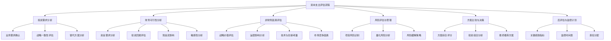

---
{"dg-publish":true,"tags":["财务BP","资本支出","投资评估","项目分析","模板"],"创建日期":"2024-04-28","permalink":"/知识共享/001_财务/01_财务BP/04_模板/01_分析框架/资本支出评估模板/","dgPassFrontmatter":true}
---

# 资本支出评估模板

## 模板概述

本模板提供了一个全面的资本支出评估框架，用于企业评估、分析和决策重大资本投资项目。通过系统化的分析过程，帮助财务和业务人员评估投资机会、风险和价值，确保资本支出决策与企业战略目标一致，并实现最佳资源配置和投资回报。

## 前期准备

### 所需数据与资料

- [ ] 项目基本信息
  - 项目描述与目标
  - 技术规格与要求
  - 项目时间表
  - 实施计划概述
- [ ] 财务相关数据
  - 投资金额明细
  - 预期收益/成本节约
  - 维护成本估算
  - 折旧/摊销方案
- [ ] 市场与战略数据
  - 市场需求预测
  - 竞争分析资料
  - 战略规划文档
  - 技术发展趋势
- [ ] 风险相关资料
  - 历史项目经验教训
  - 项目风险评估
  - 行业标杆数据
  - 法规与合规要求

### 评估团队组成

**核心团队**:
- 财务分析专员（主持与分析）
- 业务部门代表
- 技术/工程专家
- 项目管理专员

**其他利益相关者**:
- 高级管理层代表
- 风险管理专员
- 法务/合规人员（如需）
- 外部专家顾问（如需）

## 分析框架结构

## 核心分析模块

### 1. 投资需求分析

#### 1.1 业务需求确认表

| 需求类别 | 具体需求 | 重要性 | 满足方式 | 合理性评估 | 验证方法 |
|---------|---------|--------|---------|-----------|---------|
| 产能需求 |  | 高/中/低 |  |  |  |
| 技术更新 |  | 高/中/低 |  |  |  |
| 质量改善 |  | 高/中/低 |  |  |  |
| 成本节约 |  | 高/中/低 |  |  |  |
| 合规要求 |  | 高/中/低 |  |  |  |
| 安全提升 |  | 高/中/低 |  |  |  |
| 其他:____ |  | 高/中/低 |  |  |  |

#### 1.2 战略一致性评估

| 战略目标 | 相关性 | 项目贡献度 | 贡献机制 | 替代方案比较 |
|---------|-------|-----------|---------|------------|
|  | 高/中/低 | 高/中/低 |  |  |
|  | 高/中/低 | 高/中/低 |  |  |
|  | 高/中/低 | 高/中/低 |  |  |
|  | 高/中/低 | 高/中/低 |  |  |

**战略一致性总结**:
> [简明扼要地总结项目与企业战略的一致性，以及潜在的战略价值]

#### 1.3 替代方案分析

| 方案选项 | 方案描述 | 优势 | 劣势 | 预估投资额 | 实施难度 | 初步评估 |
|---------|---------|------|------|-----------|---------|---------|
| 方案1 |  |  |  |  | 高/中/低 | 推荐/考虑/不推荐 |
| 方案2 |  |  |  |  | 高/中/低 | 推荐/考虑/不推荐 |
| 方案3 |  |  |  |  | 高/中/低 | 推荐/考虑/不推荐 |
| 不投资选项 |  |  |  | 0 | - | 推荐/考虑/不推荐 |

### 2. 财务可行性分析

#### 2.1 资金需求分析

| 支出类别 | 年度1 | 年度2 | 年度3 | ... | 总计 | 资金来源 | 支出时间 |
|---------|------|------|------|-----|------|---------|---------|
| 土地/建筑 |  |  |  |  |  |  |  |
| 设备采购 |  |  |  |  |  |  |  |
| 安装成本 |  |  |  |  |  |  |  |
| 技术许可 |  |  |  |  |  |  |  |
| 培训费用 |  |  |  |  |  |  |  |
| 运营准备 |  |  |  |  |  |  |  |
| 意外开支 |  |  |  |  |  |  |  |
| **合计** |  |  |  |  |  |  |  |

**支出计划图表**:
*[此处应插入投资支出时间线图表]*

#### 2.2 投资回报评估

| 评估指标 | 计算结果 | 门槛值/基准 | 达标状态 | 同类项目对比 | 敏感性 |
|---------|---------|------------|---------|------------|-------|
| 净现值(NPV) |  |  | 达标/不达标 |  | 高/中/低 |
| 内部收益率(IRR) |  |  | 达标/不达标 |  | 高/中/低 |
| 回收期 |  |  | 达标/不达标 |  | 高/中/低 |
| 投资回报率(ROI) |  |  | 达标/不达标 |  | 高/中/低 |
| 经济增加值(EVA) |  |  | 达标/不达标 |  | 高/中/低 |
| 获利指数(PI) |  |  | 达标/不达标 |  | 高/中/低 |

**财务计算关键假设**:
- 折现率: ___%，基于 [说明依据]
- 项目期限: ___年，基于 [说明依据]
- 通货膨胀率预测: ___%/年
- 税率假设: ___%
- 折旧方法: [直线法/加速折旧/其他]

#### 2.3 现金流影响分析

| 现金流项目 | 年度1 | 年度2 | 年度3 | 年度4 | 年度5 | ... | 年度N |
|-----------|------|------|------|------|------|-----|------|
| **现金流入** |  |  |  |  |  |  |  |
| 增量收入 |  |  |  |  |  |  |  |
| 成本节约 |  |  |  |  |  |  |  |
| 资产处置 |  |  |  |  |  |  |  |
| **现金流出** |  |  |  |  |  |  |  |
| 初始投资 |  |  |  |  |  |  |  |
| 运营成本 |  |  |  |  |  |  |  |
| 维护成本 |  |  |  |  |  |  |  |
| 税金支出 |  |  |  |  |  |  |  |
| **净现金流** |  |  |  |  |  |  |  |
| 累计现金流 |  |  |  |  |  |  |  |
| 折现现金流 |  |  |  |  |  |  |  |
| 累计折现现金流 |  |  |  |  |  |  |  |

**现金流图表**:
*[此处应插入累计现金流与折现现金流图表]*

#### 2.4 敏感性分析

| 变量 | 基准值 | 变动范围 | NPV影响 | IRR影响 | 临界点 | 管理建议 |
|------|-------|---------|---------|---------|-------|---------|
| 投资金额 |  | ±__% |  |  |  |  |
| 收入/节约 |  | ±__% |  |  |  |  |
| 运营成本 |  | ±__% |  |  |  |  |
| 项目延期 |  | +__月 |  |  |  |  |
| 折现率 |  | ±__% |  |  |  |  |
| 使用寿命 |  | ±__年 |  |  |  |  |

**敏感性图表**:
*[此处应插入敏感性分析图表，如龙卷风图]*

### 3. 非财务因素评估

#### 3.1 战略价值评估矩阵

| 战略维度 | 权重 | 得分(1-10) | 加权得分 | 评价依据 |
|---------|------|-----------|---------|---------|
| 市场地位增强 | __% |  |  |  |
| 核心能力提升 | __% |  |  |  |
| 长期竞争优势 | __% |  |  |  |
| 客户价值提升 | __% |  |  |  |
| 组织能力建设 | __% |  |  |  |
| 其他:_____ | __% |  |  |  |
| **总分** | 100% |  |  |  |

#### 3.2 运营影响分析

| 运营维度 | 现状 | 变化预测 | 影响评级 | 管理措施 |
|---------|------|---------|---------|---------|
| 生产流程 |  |  | 正/负/中性 |  |
| 质量水平 |  |  | 正/负/中性 |  |
| 效率指标 |  |  | 正/负/中性 |  |
| 库存管理 |  |  | 正/负/中性 |  |
| 交付时间 |  |  | 正/负/中性 |  |
| 员工技能 |  |  | 正/负/中性 |  |
| 维护需求 |  |  | 正/负/中性 |  |

#### 3.3 技术与创新评估

| 技术指标 | 评估结果 | 行业地位 | 生命周期阶段 | 风险水平 | 推荐决策 |
|---------|---------|---------|------------|---------|---------|
| 技术成熟度 |  | 领先/同行/落后 | 早期/成熟/衰退 | 高/中/低 |  |
| 创新程度 |  | 领先/同行/落后 | 早期/成熟/衰退 | 高/中/低 |  |
| 兼容性 |  | 领先/同行/落后 | 早期/成熟/衰退 | 高/中/低 |  |
| 可扩展性 |  | 领先/同行/落后 | 早期/成熟/衰退 | 高/中/低 |  |
| 替代风险 |  | 领先/同行/落后 | 早期/成熟/衰退 | 高/中/低 |  |

### 4. 风险评估与管理

#### 4.1 风险识别清单

| 风险类别 | 具体风险 | 概率 | 影响程度 | 风险等级 | 前期经验 | 监控指标 |
|---------|---------|------|---------|---------|---------|---------|
| **项目风险** |  |  |  |  |  |  |
| 实施延期 |  | 高/中/低 | 高/中/低 | A/B/C |  |  |
| 成本超支 |  | 高/中/低 | 高/中/低 | A/B/C |  |  |
| 技术问题 |  | 高/中/低 | 高/中/低 | A/B/C |  |  |
| **市场风险** |  |  |  |  |  |  |
| 需求变化 |  | 高/中/低 | 高/中/低 | A/B/C |  |  |
| 竞争反应 |  | 高/中/低 | 高/中/低 | A/B/C |  |  |
| 价格波动 |  | 高/中/低 | 高/中/低 | A/B/C |  |  |
| **运营风险** |  |  |  |  |  |  |
| 整合难题 |  | 高/中/低 | 高/中/低 | A/B/C |  |  |
| 能力不足 |  | 高/中/低 | 高/中/低 | A/B/C |  |  |
| 人员适应 |  | 高/中/低 | 高/中/低 | A/B/C |  |  |
| **其他风险** |  |  |  |  |  |  |
| 合规风险 |  | 高/中/低 | 高/中/低 | A/B/C |  |  |
| 声誉风险 |  | 高/中/低 | 高/中/低 | A/B/C |  |  |

*风险等级：A=重大风险，需主动管理；B=中等风险，需定期监控；C=低风险，接受并记录*

#### 4.2 风险缓解计划

| 主要风险 | 缓解策略 | 实施行动 | 责任人 | 资源需求 | 时限 | 成功标志 |
|---------|---------|---------|-------|---------|------|---------|
|  |  |  |  |  |  |  |
|  |  |  |  |  |  |  |
|  |  |  |  |  |  |  |
|  |  |  |  |  |  |  |

### 5. 方案比较与决策

#### 5.1 方案综合评分表

| 评估维度 | 权重 | 方案1 | 方案2 | 方案3 | 评分标准 |
|---------|------|-------|-------|-------|---------|
| **财务指标** | __% |  |  |  |  |
| NPV/IRR | __% |  |  |  | 1-10分 |
| 回收期 | __% |  |  |  | 1-10分 |
| 财务风险 | __% |  |  |  | 1-10分 |
| **战略价值** | __% |  |  |  |  |
| 战略一致性 | __% |  |  |  | 1-10分 |
| 市场地位 | __% |  |  |  | 1-10分 |
| 长期优势 | __% |  |  |  | 1-10分 |
| **运营考量** | __% |  |  |  |  |
| 实施难度 | __% |  |  |  | 1-10分 |
| 运营协同 | __% |  |  |  | 1-10分 |
| 可扩展性 | __% |  |  |  | 1-10分 |
| **风险评估** | __% |  |  |  |  |
| 技术风险 | __% |  |  |  | 1-10分 |
| 市场风险 | __% |  |  |  | 1-10分 |
| 整合风险 | __% |  |  |  | 1-10分 |
| **总加权得分** | 100% |  |  |  |  |
| **排名** |  |  |  |  |  |

#### 5.2 投资组合分析

*[此处应插入投资组合气泡图，横轴为战略价值，纵轴为财务价值，气泡大小为投资规模或风险]*

| 项目名称 | 计划周期 | 投资规模 | 财务评分 | 战略评分 | 风险评分 | 投资组合地位 |
|---------|---------|---------|---------|---------|---------|------------|
| 本项目 |  |  |  |  |  | 核心/战略/支持/淘汰 |
| 进行中项目1 |  |  |  |  |  | 核心/战略/支持/淘汰 |
| 进行中项目2 |  |  |  |  |  | 核心/战略/支持/淘汰 |
| 规划中项目1 |  |  |  |  |  | 核心/战略/支持/淘汰 |
| 规划中项目2 |  |  |  |  |  | 核心/战略/支持/淘汰 |

#### 5.3 最终决策建议

| 决策选项 | 建议 | 主要理由 | 附加条件 | 预期结果 |
|---------|------|---------|---------|---------|
| 立即批准 | □ |  |  |  |
| 有条件批准 | □ |  |  |  |
| 延期决定 | □ |  |  |  |
| 重新规划 | □ |  |  |  |
| 否决 | □ |  |  |  |

**决策建议摘要**:
> [简明扼要地总结决策建议，包括理由和条件]

### 6. 后评估与监控计划

#### 6.1 关键绩效指标

| KPI类别 | 具体指标 | 基准值 | 目标值 | 测量频率 | 责任部门 | 干预阈值 |
|---------|---------|-------|-------|---------|---------|---------|
| **财务指标** |  |  |  |  |  |  |
| 投资回报 |  |  |  |  |  |  |
| 成本控制 |  |  |  |  |  |  |
| 现金流表现 |  |  |  |  |  |  |
| **运营指标** |  |  |  |  |  |  |
| 产能提升 |  |  |  |  |  |  |
| 质量改善 |  |  |  |  |  |  |
| 效率提升 |  |  |  |  |  |  |
| **市场指标** |  |  |  |  |  |  |
| 市场份额 |  |  |  |  |  |  |
| 客户满意度 |  |  |  |  |  |  |
| 增长表现 |  |  |  |  |  |  |

#### 6.2 监控时间表

| 阶段 | 审查时间点 | 审查内容 | 参与人员 | 产出文件 | 决策点 |
|------|-----------|---------|---------|---------|-------|
| 项目开始 |  |  |  |  |  |
| 实施阶段 |  |  |  |  |  |
| 完工验收 |  |  |  |  |  |
| 运营第1年 |  |  |  |  |  |
| 运营第2年 |  |  |  |  |  |
| 全面评估 |  |  |  |  |  |

#### 6.3 经验教训收集计划

| 学习领域 | 关注问题 | 收集方法 | 责任人 | 时间节点 | 应用计划 |
|---------|---------|---------|-------|---------|---------|
| 规划质量 |  |  |  |  |  |
| 实施管理 |  |  |  |  |  |
| 财务表现 |  |  |  |  |  |
| 风险管理 |  |  |  |  |  |
| 组织适应 |  |  |  |  |  |

## 应用指南

### 使用步骤

**1. 准备阶段** (2-4周)
   - 收集项目需求与基础信息
   - 确定初步投资范围与目标
   - 组建评估团队
   - 确定评估时间表

**2. 分析阶段** (3-6周)
   - 完成需求分析与方案设计
   - 进行财务模型构建与分析
   - 评估非财务因素
   - 识别与评估主要风险

**3. 决策阶段** (1-2周)
   - 综合各维度评估结果
   - 形成决策建议
   - 准备决策支持文档
   - 进行决策会议与讨论

**4. 实施规划阶段** (2-3周)
   - 细化实施计划
   - 制定监控与评估机制
   - 分配资源与责任
   - 准备项目启动

### 不同规模项目的应用调整

| 项目规模 | 投资额范围 | 分析深度调整 | 审批流程 | 时间表调整 |
|---------|-----------|------------|---------|----------|
| 小型项目 | <___万元 | 简化分析，重点关注短期回报 | 部门级审批 | 1-2周完成 |
| 中型项目 | ___-___万元 | 标准分析流程，平衡短期与长期 | 中层管理审批 | 3-5周完成 |
| 大型项目 | ___-___万元 | 深入分析，强调战略与长期价值 | 高管团队审批 | 6-10周完成 |
| 战略性项目 | >___万元 | 全方位分析，包括外部专家评估 | 董事会审批 | 10-16周完成 |

### 常见问题与解决方案

| 问题类型 | 常见问题 | 解决方案 |
|---------|---------|---------|
| 数据问题 | 缺乏可靠历史数据 | 使用行业基准或类似项目数据，明确标识假设 |
| | 成本低估/收益高估 | 应用风险调整系数，参考历史项目的实际偏差 |
| 分析困难 | 难以量化的战略价值 | 使用德尔菲法收集专家意见，采用情景分析 |
| | 技术不确定性高 | 增加风险缓冲，设计分阶段实施与评估计划 |
| 决策障碍 | 多方利益冲突 | 透明化评估标准，举行结构化决策会议 |
| | 资源争夺 | 使用投资组合分析，确保战略一致性 |

## 最佳实践案例

> 注：以下为简化示例，说明如何应用本模板进行资本支出评估。

### 案例背景

ABC制造公司计划投资2000万元扩建生产线，以满足未来3年预期的需求增长并提高生产效率。

### 关键分析摘要

**需求分析**:
- 现有产能利用率已达95%，预计销售增长15%/年
- 产品质量和交货时间是竞争关键因素
- 新技术可将单位生产成本降低12%

**财务评估**:
- NPV: 3200万元，IRR: 23%，回收期: 4.2年
- 敏感性分析显示销量下降20%时NPV仍为正值
- 最大现金流缺口900万元出现在项目实施后第10个月

**战略价值**:
- 提升市场响应速度，推动客户满意度提升
- 为新产品线生产创造技术基础
- 保持技术领先优势，提高进入壁垒

**风险评估**:
- 主要风险：实施延期、技术整合难度、市场需求波动
- 风险缓解：分阶段实施、早期供应商参与、灵活产能设计

**决策建议**:
- 有条件批准，前提是分两个阶段实施，第一阶段完成后评估
- 优先分配内部技术专家资源，确保技术整合
- 制定详细监控计划，关注实施进度与市场需求变化

## 参考资源

1. Damodaran, A. (2021). *Investment Valuation: Tools and Techniques for Determining the Value of Any Asset*. Wiley Finance.
2. Harvard Business Review. (2019). *Capital Allocation Excellence*.
3. McKinsey & Company. (2020). *Best Practices in Capital Allocation*.
4. 《投资决策与项目评估》，中国财政经济出版社，2021.
5. 《财务评价方法与实务》，机械工业出版社，2022. 