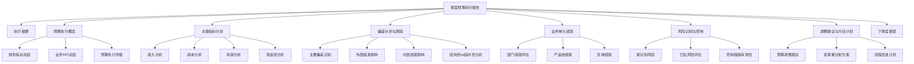

---
{"dg-publish":true,"tags":["财务BP","季度报告","预算执行","绩效分析","模板"],"创建日期":"2024-04-28","permalink":"/知识共享/001_财务/01_财务BP/04_模板/02_报告/季度预算执行报告模板/","dgPassFrontmatter":true}
---

# 季度预算执行报告模板

## 模板概述

本模板提供了标准化的季度预算执行报告框架，适用于企业内部季度财务执行情况汇报、业务单元绩效评估、管理层监控决策与调整支持等场景。本模板整合了预算执行情况分析、偏差识别与原因分析、调整方案建议以及下季度展望等关键内容，重点关注预算执行的及时监控、问题识别与解决方案。

## 前期准备

### 所需数据与资料

- [ ] 预算与实际数据
  - 季度预算计划详细版本
  - 实际财务结果数据
  - 业务KPI指标实际数据
- [ ] 历史对比数据
  - 上季度执行情况
  - 去年同期数据
  - 年初至今累计数据
- [ ] 业务运营数据
  - 产能/服务交付数据
  - 营销活动效果数据
  - 人员/资产利用率数据
- [ ] 市场与竞争数据
  - 市场环境变化
  - 竞争动态
  - 行业标杆数据

### 编制团队与流程

**核心团队**:
- 财务BP负责人(主持与编制)
- 业务单元财务代表
- 业务运营负责人
- 财务分析专员

**编制流程**:
1. 季度结束后数据收集与审核(D+5)
2. 初步分析与差异识别(D+8)
3. 与业务单元主管沟通分析(D+10)
4. 原因分析与问题识别(D+12)
5. 制定调整方案建议(D+15)
6. 报告编制与提交(D+18)
7. 管理层汇报与讨论(D+20)

## 报告结构

## 报告内容框架

### 1. 封面与目录

**封面内容**:
- 公司名称与标识
- 文档标题: "[公司名]20XX年第X季度预算执行报告"
- 报告编制日期: "YYYY-MM-DD"
- 编制部门: "财务部/财务BP团队"
- 文档保密级别: "内部使用/保密/机密"

**目录要素**:
- 主要章节与小节
- 图表清单
- 附件清单
- 页码索引

### 2. 执行摘要

*[1页，快速概括核心信息]*

**关键要素**:
- 总体预算执行评级(优/良/中/差)
- 主要财务与业务指标达成情况一览
- 重大偏差与成功点概述
- 主要风险与机会
- 需要重点关注的问题
- 关键行动建议

**执行摘要模板**:

> 20XX年第X季度，[公司名称]整体预算执行情况为[评级]，实现收入[金额]，完成预算的[百分比]，同比[增长/下降][百分比]；净利润[金额]，完成预算的[百分比]，同比[增长/下降][百分比]。
> 
> 主要成功点包括：[列出2-3点主要成功或超预期表现]；主要挑战包括：[列出2-3点主要挑战或未达预期项目]。
> 
> 关键风险点：[列出1-2个需要管理层重点关注的风险]。建议采取以下行动：[列出2-3个关键行动建议]。
> 
> 展望下季度，预计将[简述下季度预期情况]，预算完成率预计将达到[百分比]。

### 3. 预算执行概览

#### 3.1 财务指标总结

| 关键财务指标 | 预算目标 | 实际结果 | 完成率 | 同比变化 | 年初至今完成率 | 状态评级 |
|------------|---------|---------|-------|---------|--------------|---------|
| 总收入 |  |  | __% | __% | __% | ⬤/◐/◯ |
| 毛利润 |  |  | __% | __% | __% | ⬤/◐/◯ |
| 营业利润 |  |  | __% | __% | __% | ⬤/◐/◯ |
| 净利润 |  |  | __% | __% | __% | ⬤/◐/◯ |
| 经营现金流 |  |  | __% | __% | __% | ⬤/◐/◯ |
| 资本支出 |  |  | __% | __% | __% | ⬤/◐/◯ |

*注：状态评级 ⬤=达成/超预期，◐=接近目标(±5%)，◯=显著偏差*

#### 3.2 业务KPI总结

| 关键业务指标 | 预算目标 | 实际结果 | 完成率 | 同比变化 | 评级 | 趋势 |
|------------|---------|---------|-------|---------|------|------|
| 销量/客户数 |  |  | __% | __% | ⬤/◐/◯ | ↑/→/↓ |
| 市场份额 | __% | __% | __% | __% | ⬤/◐/◯ | ↑/→/↓ |
| 产能利用率 | __% | __% | __% | __% | ⬤/◐/◯ | ↑/→/↓ |
| 新产品收入占比 | __% | __% | __% | __% | ⬤/◐/◯ | ↑/→/↓ |
| 客户满意度 |  |  | __% | __% | ⬤/◐/◯ | ↑/→/↓ |
| 员工生产力 |  |  | __% | __% | ⬤/◐/◯ | ↑/→/↓ |

*注：趋势表示与上季度相比，↑=改善，→=持平，↓=恶化*

#### 3.3 预算执行评级一览表

*[插入雷达图或仪表盘，直观展示各维度预算执行情况]*

| 评估维度 | 权重 | 评分(1-5) | 加权得分 | 评价 |
|---------|------|-----------|---------|------|
| 收入目标完成度 | __% |  |  |  |
| 利润目标完成度 | __% |  |  |  |
| 成本控制有效性 | __% |  |  |  |
| 现金流管理 | __% |  |  |  |
| 资源使用效率 | __% |  |  |  |
| 战略目标推进 | __% |  |  |  |
| **总体评级** | 100% |  |  |  |

评级标准：4.5-5分=优秀，3.5-4.5分=良好，2.5-3.5分=一般，1.5-2.5分=需改进，<1.5分=严重不足

### 4. 关键指标分析

#### 4.1 收入分析

| 收入来源 | 预算目标 | 实际结果 | 偏差 | 偏差率 | 主要原因 |
|---------|---------|---------|------|-------|---------|
| 产品线A |  |  |  | __% |  |
| 产品线B |  |  |  | __% |  |
| 服务类别A |  |  |  | __% |  |
| 区域1 |  |  |  | __% |  |
| 区域2 |  |  |  | __% |  |
| 客户群1 |  |  |  | __% |  |
| 客户群2 |  |  |  | __% |  |
| **总计** |  |  |  | __% |  |

**收入分析洞察**:
- [关于产品组合的见解]
- [关于定价策略有效性的见解]
- [关于销售渠道表现的见解]
- [关于收入质量与可持续性的见解]

#### 4.2 成本分析

| 成本类别 | 预算目标 | 实际结果 | 偏差 | 偏差率 | 单位成本变化 | 主要原因 |
|---------|---------|---------|------|-------|-----------|---------|
| 直接材料 |  |  |  | __% | __% |  |
| 直接人工 |  |  |  | __% | __% |  |
| 制造费用 |  |  |  | __% | __% |  |
| 销售费用 |  |  |  | __% | __% |  |
| 管理费用 |  |  |  | __% | __% |  |
| 研发费用 |  |  |  | __% | __% |  |
| **总成本** |  |  |  | __% | __% |  |

**成本结构变化**:
*[插入成本结构对比饼图，展示计划vs实际成本结构变化]*

**成本控制洞察**:
- [关于成本效率的见解]
- [关于成本弹性的见解]
- [关于成本结构变化趋势的见解]
- [关于成本控制举措有效性的见解]

#### 4.3 利润分析

| 利润指标 | 预算目标 | 实际结果 | 偏差 | 偏差率 | 驱动因素分析 |
|---------|---------|---------|------|-------|------------|
| 毛利润 |  |  |  | __% | 收入影响: __%, 成本影响: __% |
| 毛利率 | __% | __% | __% | - | [主要影响因素] |
| 营业利润 |  |  |  | __% | 毛利影响: __%, 费用影响: __% |
| 营业利润率 | __% | __% | __% | - | [主要影响因素] |
| 净利润 |  |  |  | __% | 营业利润影响: __%, 税费影响: __% |
| 净利润率 | __% | __% | __% | - | [主要影响因素] |

**利润瀑布图**:
*[插入利润瀑布图，展示从预算到实际利润的变化因素]*

**利润分析洞察**:
- [关于利润质量的见解]
- [关于利润驱动因素变化的见解]
- [关于利润可持续性的见解]
- [关于利润结构优化方向的见解]

#### 4.4 现金流分析

| 现金流项目 | 预算目标 | 实际结果 | 偏差 | 偏差率 | 主要原因 |
|-----------|---------|---------|------|-------|---------|
| 经营活动现金流入 |  |  |  | __% |  |
| 经营活动现金流出 |  |  |  | __% |  |
| **经营活动净现金流** |  |  |  | __% |  |
| 投资活动净现金流 |  |  |  | __% |  |
| 筹资活动净现金流 |  |  |  | __% |  |
| **自由现金流** |  |  |  | __% |  |

**现金转换周期分析**:

| 指标 | 预算目标 | 实际结果 | 变化天数 | 现金流影响 | 改进措施 |
|------|---------|---------|---------|-----------|---------|
| 存货周转天数 |  |  | +/- |  |  |
| 应收账款天数 |  |  | +/- |  |  |
| 应付账款天数 |  |  | +/- |  |  |
| **现金转换周期** |  |  | +/- |  |  |

**现金流分析洞察**:
- [关于经营现金流质量的见解]
- [关于资本支出效率的见解]
- [关于现金转换周期优化的见解]
- [关于流动性管理的见解]

### 5. 偏差分析与原因

#### 5.1 主要偏差识别

| 预算项目 | 计划 | 实际 | 偏差额 | 偏差率 | 影响程度 | 性质 |
|---------|------|------|-------|-------|---------|------|
|  |  |  |  | __% | 高/中/低 | 结构性/周期性/临时性 |
|  |  |  |  | __% | 高/中/低 | 结构性/周期性/临时性 |
|  |  |  |  | __% | 高/中/低 | 结构性/周期性/临时性 |
|  |  |  |  | __% | 高/中/低 | 结构性/周期性/临时性 |
|  |  |  |  | __% | 高/中/低 | 结构性/周期性/临时性 |

#### 5.2 外部因素影响分析

| 外部因素 | 影响项目 | 影响程度 | 预期持续性 | 可控性 | 应对策略 |
|---------|---------|---------|-----------|-------|---------|
| 市场需求变化 |  | 高/中/低 | 长/中/短期 | 高/中/低 |  |
| 竞争环境变化 |  | 高/中/低 | 长/中/短期 | 高/中/低 |  |
| 供应链波动 |  | 高/中/低 | 长/中/短期 | 高/中/低 |  |
| 宏观经济因素 |  | 高/中/低 | 长/中/短期 | 高/中/低 |  |
| 法规政策变化 |  | 高/中/低 | 长/中/短期 | 高/中/低 |  |

#### 5.3 内部因素影响分析

| 内部因素 | 影响项目 | 影响程度 | 责任部门 | 根本原因 | 改进措施 |
|---------|---------|---------|---------|---------|---------|
| 执行偏差 |  | 高/中/低 |  |  |  |
| 规划假设不准 |  | 高/中/低 |  |  |  |
| 资源配置问题 |  | 高/中/低 |  |  |  |
| 流程效率问题 |  | 高/中/低 |  |  |  |
| 政策调整影响 |  | 高/中/低 |  |  |  |

#### 5.4 结构性vs临时性分析

**结构性问题**:
- [问题1]: [简述问题性质、根本原因及长期影响]
- [问题2]: [简述问题性质、根本原因及长期影响]

**临时性因素**:
- [因素1]: [简述因素性质、短期影响及预期解决时间]
- [因素2]: [简述因素性质、短期影响及预期解决时间]

**偏差分析总结与洞察**:
> [综合分析偏差原因及其对全年预算的影响，以及对未来规划的启示]

### 6. 业务单元绩效

#### 6.1 部门绩效评估

| 部门 | 预算达成率 | KPI达成率 | 资源利用率 | 绩效评级 | 重点改进领域 |
|------|-----------|-----------|-----------|---------|------------|
| 销售部门 | __% | __% | __% | A/B/C/D |  |
| 生产部门 | __% | __% | __% | A/B/C/D |  |
| 研发部门 | __% | __% | __% | A/B/C/D |  |
| 市场部门 | __% | __% | __% | A/B/C/D |  |
| 人力资源 | __% | __% | __% | A/B/C/D |  |
| 财务部门 | __% | __% | __% | A/B/C/D |  |
| 供应链 | __% | __% | __% | A/B/C/D |  |

*评级标准：A=优秀(>95%)，B=良好(85-95%)，C=一般(70-85%)，D=需改进(<70%)*

#### 6.2 产品线绩效

| 产品线 | 收入达成率 | 利润达成率 | 增长率 | 市场表现 | 投资回报率 | 战略重要性 |
|-------|-----------|-----------|-------|---------|-----------|-----------|
|  | __% | __% | __% | ⬤/◐/◯ | __% | 高/中/低 |
|  | __% | __% | __% | ⬤/◐/◯ | __% | 高/中/低 |
|  | __% | __% | __% | ⬤/◐/◯ | __% | 高/中/低 |
|  | __% | __% | __% | ⬤/◐/◯ | __% | 高/中/低 |

**产品组合洞察**:
- [关于产品生命周期的见解]
- [关于产品盈利性的见解]
- [关于产品组合优化方向的见解]

#### 6.3 区域绩效

| 区域市场 | 收入达成率 | 利润达成率 | 市场份额变化 | 增长潜力 | 资源分配合理性 |
|---------|-----------|-----------|------------|---------|--------------|
|  | __% | __% | +/-__% | 高/中/低 | ⬤/◐/◯ |
|  | __% | __% | +/-__% | 高/中/低 | ⬤/◐/◯ |
|  | __% | __% | +/-__% | 高/中/低 | ⬤/◐/◯ |
|  | __% | __% | +/-__% | 高/中/低 | ⬤/◐/◯ |

**区域策略洞察**:
- [关于区域发展策略有效性的见解]
- [关于区域资源配置的见解]
- [关于区域特定风险的见解]

### 7. 风险识别与控制

#### 7.1 新识别风险

| 风险类别 | 风险描述 | 可能影响 | 发生概率 | 影响程度 | 风险等级 | 应对措施 |
|---------|---------|---------|---------|---------|---------|---------|
|  |  |  | 高/中/低 | 高/中/低 | A/B/C |  |
|  |  |  | 高/中/低 | 高/中/低 | A/B/C |  |
|  |  |  | 高/中/低 | 高/中/低 | A/B/C |  |

*风险等级：A=需立即应对，B=需密切监控，C=一般关注*

#### 7.2 已知风险评估

| 已知风险 | 原评估等级 | 当前状态 | 趋势 | 控制措施有效性 | 调整建议 |
|---------|-----------|---------|------|--------------|---------|
|  | A/B/C | 持续/改善/恶化 | ↑/→/↓ | 有效/部分有效/无效 |  |
|  | A/B/C | 持续/改善/恶化 | ↑/→/↓ | 有效/部分有效/无效 |  |
|  | A/B/C | 持续/改善/恶化 | ↑/→/↓ | 有效/部分有效/无效 |  |

#### 7.3 控制措施有效性

| 关键控制点 | 目标 | 实际表现 | 有效性评价 | 改进建议 |
|-----------|------|---------|-----------|---------|
| 成本控制流程 |  |  | ⬤/◐/◯ |  |
| 收入保障措施 |  |  | ⬤/◐/◯ |  |
| 资金管理 |  |  | ⬤/◐/◯ |  |
| 合规管理 |  |  | ⬤/◐/◯ |  |

**风险控制总结**:
> [评估整体风险控制有效性，以及对下季度的风险预警]

### 8. 调整建议与行动计划

#### 8.1 预算调整建议

| 预算项目 | 原预算 | 调整建议 | 调整率 | 调整理由 | 影响评估 | 审批要求 |
|---------|-------|---------|-------|---------|---------|---------|
|  |  |  | __% |  |  | VP/总监/部门 |
|  |  |  | __% |  |  | VP/总监/部门 |
|  |  |  | __% |  |  | VP/总监/部门 |
|  |  |  | __% |  |  | VP/总监/部门 |

#### 8.2 资源重分配方案

| 资源类别 | 从哪里减少 | 减少量 | 分配到哪里 | 分配量 | 预期效果 | 时间安排 |
|---------|-----------|-------|-----------|-------|---------|---------|
| 人力资源 |  |  |  |  |  |  |
| 营销预算 |  |  |  |  |  |  |
| 资本支出 |  |  |  |  |  |  |
| 运营费用 |  |  |  |  |  |  |

#### 8.3 流程改进计划

| 流程问题 | 改进措施 | 责任人 | 时间节点 | 资源需求 | 预期改善 | 验收标准 |
|---------|---------|-------|---------|---------|---------|---------|
|  |  |  |  |  |  |  |
|  |  |  |  |  |  |  |
|  |  |  |  |  |  |  |

**优先行动项目**:
1. [行动1]: [说明行动内容、责任人、时间要求与预期效果]
2. [行动2]: [说明行动内容、责任人、时间要求与预期效果]
3. [行动3]: [说明行动内容、责任人、时间要求与预期效果]

### 9. 下季度展望

#### 9.1 关键假设更新

| 假设类别 | 原假设 | 更新假设 | 变化原因 | 对预算影响 |
|---------|-------|---------|---------|-----------|
| 市场环境 |  |  |  |  |
| 客户行为 |  |  |  |  |
| 竞争态势 |  |  |  |  |
| 成本结构 |  |  |  |  |
| 运营效率 |  |  |  |  |

#### 9.2 下季度预期表现

| 关键指标 | 年度目标 | 年初至今完成 | 全年预期 | 下季度目标 | 挑战与机会 |
|---------|---------|------------|---------|-----------|-----------|
| 收入 |  |  |  |  |  |
| 净利润 |  |  |  |  |  |
| 自由现金流 |  |  |  |  |  |
| 运营KPI1 |  |  |  |  |  |
| 运营KPI2 |  |  |  |  |  |

#### 9.3 需要特别关注的领域

1. **战略执行关注点**:
   - [关注点1]: [说明关注理由与监控要点]
   - [关注点2]: [说明关注理由与监控要点]

2. **运营执行关注点**:
   - [关注点1]: [说明关注理由与监控要点]
   - [关注点2]: [说明关注理由与监控要点]

3. **财务管理关注点**:
   - [关注点1]: [说明关注理由与监控要点]
   - [关注点2]: [说明关注理由与监控要点]

**下季度展望总结**:
> [总结下季度关键挑战与机会，以及整体预期]

### 10. 附录

#### 10.1 详细财务数据

*[附上详细的财务数据表，包括更细分的科目与维度]*

#### 10.2 关键假设与实际对比

*[列出季初预算时的关键假设与实际情况对比]*

#### 10.3 季度同比与环比详细数据

*[附上关键指标的季度同比与环比详细数据与趋势图]*

## 使用指南

### 报告编制要点

1. **数据准确性与一致性**
   - 确保数据口径一致
   - 核对各表间的勾稽关系
   - 确认同比/环比基数一致

2. **分析深度与广度平衡**
   - 重点分析影响较大的偏差
   - 关注结构性问题与趋势性变化
   - 平衡定量与定性分析

3. **行动导向**
   - 每个问题分析应对应解决方案
   - 明确责任人与时间表
   - 提供具体、可执行的建议

### 常见问题解答

**Q: 如何区分结构性与临时性偏差?**
A: 结构性偏差通常与业务模式、市场环境根本变化或内部能力缺口相关，将持续影响未来表现；临时性偏差通常由短期事件、季节性波动或特殊项目引起，不会对长期趋势产生影响。

**Q: 预算偏差分析应采取何种视角?**
A: 应同时从横向(与计划比)、纵向(与历史比)、外部(与行业/竞争对手比)三个维度进行分析，以获得全面视角。

**Q: 如何处理预算执行中的"意外之喜"?**
A: 对超预期表现同样需要深入分析原因，评估其可持续性，并考虑是否可以将成功经验推广至其他领域，或适当调高后续期间目标。

### 呈现建议

1. **管理层汇报**
   - 聚焦关键偏差与风险
   - 突出需要决策的事项
   - 使用可视化图表
   - 控制在30分钟内

2. **业务部门沟通**
   - 针对具体部门的详细分析
   - 具体改进建议与支持需求
   - 共同讨论解决方案
   - 明确后续行动计划

## 示例与最佳实践

> 注: 以下为简化示例，帮助理解如何填充本模板。

### 示例: 执行摘要

2023年第2季度，ABC科技公司整体预算执行情况为良好，实现收入1.2亿元，完成预算的95%，同比增长12%；净利润1800万元，完成预算的92%，同比增长8%。

主要成功点包括：新产品线销售超预期15%，毛利率提升2个百分点；主要挑战包括：北美市场收入不及预期(完成率85%)，原材料成本上涨导致部分产品线利润压力增大。

关键风险点：供应链中断风险增加，可能影响Q3生产计划。建议采取以下行动：加速供应商多元化进程，调整北美市场价格策略，加强成本控制精细化管理。

展望下季度，预计随着新产品线持续放量及成本控制措施见效，预算完成率预计将达到97%。

### 最佳实践: 偏差分析

1. **使用"Five Whys"技术深入分析**
   - 不满足于表面原因
   - 连续追问"为什么"至少5次
   - 找到真正的根本原因

2. **区分责任归属**
   - 区分可控因素与不可控因素
   - 区分部门职责范围
   - 避免简单推责，聚焦解决方案

3. **将定性分析量化**
   - 尽可能将影响因素量化
   - 使用敏感性分析量化各因素影响权重
   - 建立因果关系模型

## 参考资源

1. Kaplan, R. S., & Norton, D. P. (2008). *The Execution Premium: Linking Strategy to Operations*.
2. Simons, R. (2013). *Levers of Control: How Managers Use Innovative Control Systems to Drive Strategic Renewal*.
3. 《预算执行分析与控制》，中国财政经济出版社，2020.
4. 《高效财务分析：从数据到决策》，机械工业出版社，2021.
5. 《业务财务伙伴(Business Partner)实践指南》，中信出版社，2022. 