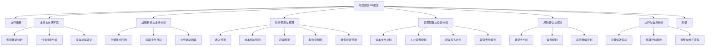

---
{"dg-publish":true,"tags":["财务BP","年度报告","预算规划","财务分析","模板"],"创建日期":"2024-04-28","permalink":"/知识共享/001_财务/01_财务BP/04_模板/02_报告/年度财务BP报告模板/","dgPassFrontmatter":true}
---

# 年度财务BP报告模板

## 模板概述

本模板提供了标准化的年度财务业务规划(Business Plan/Budget Planning)报告框架，适用于企业内部年度财务规划汇报、董事会预算审批、管理层决策支持等场景。本模板整合了财务预测、预算编制、业务规划和战略执行等关键内容，既有高层次战略视角，也包含详细的执行计划与风险管控。

## 前期准备

### 所需数据与资料

- [ ] 战略规划文档
  - 企业年度/三年战略规划
  - 业务部门发展计划
  - 市场与竞争分析资料
- [ ] 历史财务数据
  - 过去3年财务报表
  - 当年预算执行情况
  - 关键财务指标历史表现
- [ ] 业务预测数据
  - 销售预测
  - 成本预测
  - 人员规划
  - 资本支出计划
- [ ] 宏观经济与行业数据
  - 行业增长率预测
  - 通胀率预测
  - 汇率/利率预期

### 编制团队与流程

**核心团队**:
- 财务总监/CFO(主持与审核)
- 财务BP经理(编制主责)
- 业务单元负责人(提供业务预测)
- 财务分析师(数据分析与建模)

**编制流程**:
1. 确认战略目标与业务计划(T-90天)
2. 收集历史数据并进行财务分析(T-75天)
3. 制定初步预测与假设(T-60天)
4. 部门预算汇总与平衡(T-45天)
5. 财务模型构建与场景分析(T-30天)
6. 管理层初审与调整(T-20天)
7. 最终报告编制与提交(T-10天)

## 报告结构

## 报告内容框架

### 1. 封面与目录

**封面内容**:
- 公司名称与标识
- 文档标题: "[公司名]年度财务业务规划"
- 规划年度: "20XX财年"
- 编制日期: "YYYY-MM-DD"
- 文档保密级别: "内部使用/保密/机密"

**目录要素**:
- 主要章节与小节
- 图表清单
- 附录清单
- 页码索引

### 2. 执行摘要

*[1-2页，简明扼要概括整体规划要点]*

**关键要素**:
- 业务环境简述
- 战略重点与业务目标概要
- 财务计划亮点(收入、利润、现金流目标)
- 主要投资与资源分配决策
- 风险与机遇概述
- 关键成功因素

**执行摘要模板**:

> [财年]年度，[公司名称]将面临[简述主要外部环境]。基于[简述战略背景]，我们计划实现[收入目标]的收入和[利润目标]的净利润，同比增长[增长率]。
> 
> 主要业务目标包括：[列出3-5个关键业务目标]。为支持这些目标，我们计划投资[投资总额]，主要用于[列出主要投资领域]。
> 
> 本规划的主要风险包括[列出主要风险因素]，我们已制定[简述应对策略]应对这些风险。关键成功因素包括[列出2-3个关键成功因素]。

### 3. 业务与市场环境

#### 3.1 宏观环境分析

| 宏观因素 | 当前状况 | 未来趋势 | 对业务的潜在影响 | 应对策略 |
|---------|---------|---------|----------------|---------|
| 经济增长 |  |  |  |  |
| 通货膨胀 |  |  |  |  |
| 利率环境 |  |  |  |  |
| 政策法规 |  |  |  |  |
| 技术变革 |  |  |  |  |
| 社会趋势 |  |  |  |  |

#### 3.2 行业分析

| 行业指标 | 当前值 | 预测值 | 变化趋势 | 影响分析 |
|---------|-------|-------|---------|---------|
| 市场规模 |  |  |  |  |
| 增长率 |  |  |  |  |
| 利润水平 |  |  |  |  |
| 进入壁垒 |  |  |  |  |
| 创新趋势 |  |  |  |  |
| 整合状况 |  |  |  |  |

#### 3.3 竞争格局

| 竞争维度 | 我司状况 | 主要竞争对手状况 | 竞争优劣势分析 | 战略应对 |
|---------|---------|----------------|--------------|---------|
| 市场份额 |  |  |  |  |
| 产品/服务 |  |  |  |  |
| 定价策略 |  |  |  |  |
| 成本结构 |  |  |  |  |
| 客户忠诚度 |  |  |  |  |
| 创新能力 |  |  |  |  |

### 4. 战略目标与业务计划

#### 4.1 战略框架回顾

*[简述公司整体战略框架，确保年度规划与长期战略一致]*

**战略支柱与年度聚焦**:

| 战略支柱 | 长期目标 | 年度聚焦方向 | 成功指标 | 负责部门 |
|---------|---------|------------|---------|---------|
|  |  |  |  |  |
|  |  |  |  |  |
|  |  |  |  |  |

#### 4.2 年度业务目标

| 业务目标 | 具体目标值 | 计量方法 | 基准值 | 目标时间点 | 负责人 |
|---------|-----------|---------|-------|-----------|-------|
|  |  |  |  |  |  |
|  |  |  |  |  |  |
|  |  |  |  |  |  |
|  |  |  |  |  |  |

#### 4.3 业务驱动因素分析

| 增长驱动因素 | 预期贡献度 | 驱动逻辑 | 关键假设 | 资源需求 | 风险因素 |
|------------|-----------|---------|---------|---------|---------|
|  | __%份额 |  |  |  |  |
|  | __%份额 |  |  |  |  |
|  | __%份额 |  |  |  |  |
|  | __%份额 |  |  |  |  |

### 5. 财务预测与预算

#### 5.1 收入预测

| 收入来源 | 上年实际 | 当年预测 | 增长率 | 增长分析 | 季度分布 | 关键假设 |
|---------|---------|---------|-------|---------|---------|---------|
| 产品线A |  |  | __% |  | Q1:_% Q2:_% Q3:_% Q4:_% |  |
| 产品线B |  |  | __% |  | Q1:_% Q2:_% Q3:_% Q4:_% |  |
| 地区1 |  |  | __% |  | Q1:_% Q2:_% Q3:_% Q4:_% |  |
| 地区2 |  |  | __% |  | Q1:_% Q2:_% Q3:_% Q4:_% |  |
| 客户群1 |  |  | __% |  | Q1:_% Q2:_% Q3:_% Q4:_% |  |
| 客户群2 |  |  | __% |  | Q1:_% Q2:_% Q3:_% Q4:_% |  |
| **总计** |  |  | __% |  | Q1:_% Q2:_% Q3:_% Q4:_% |  |

*[此处可插入收入预测图表，如增长趋势、收入构成等]*

#### 5.2 成本结构预测

| 成本类别 | 上年实际 | 上年占收入% | 当年预测 | 当年占收入% | 变动分析 | 关键驱动因素 |
|---------|---------|------------|---------|-----------|---------|------------|
| 直接材料 |  | __% |  | __% |  |  |
| 直接人工 |  | __% |  | __% |  |  |
| 制造费用 |  | __% |  | __% |  |  |
| 销售费用 |  | __% |  | __% |  |  |
| 管理费用 |  | __% |  | __% |  |  |
| 研发费用 |  | __% |  | __% |  |  |
| 财务费用 |  | __% |  | __% |  |  |
| **总成本** |  | __% |  | __% |  |  |

*[此处可插入成本结构图表，如成本构成饼图、成本趋势图等]*

#### 5.3 利润预测

| 利润指标 | 上年实际 | 当年预测 | 变动额 | 变动率 | 影响因素分析 |
|---------|---------|---------|-------|-------|------------|
| 毛利润 |  |  |  | __% |  |
| 毛利率 | __% | __% | __% | - |  |
| 营业利润 |  |  |  | __% |  |
| 营业利润率 | __% | __% | __% | - |  |
| 净利润 |  |  |  | __% |  |
| 净利润率 | __% | __% | __% | - |  |
| EBITDA |  |  |  | __% |  |
| EBITDA率 | __% | __% | __% | - |  |

*[此处可插入利润预测图表，如利润趋势、利润率变化等]*

#### 5.4 现金流预测

| 现金流项目 | Q1 | Q2 | Q3 | Q4 | 全年 | 同比变化 | 关键分析 |
|-----------|----|----|----|----|------|---------|----------|
| 经营活动现金流入 |  |  |  |  |  | __% |  |
| 经营活动现金流出 |  |  |  |  |  | __% |  |
| **经营活动净现金流** |  |  |  |  |  | __% |  |
| 投资活动净现金流 |  |  |  |  |  | __% |  |
| 筹资活动净现金流 |  |  |  |  |  | __% |  |
| **自由现金流** |  |  |  |  |  | __% |  |
| 期末现金余额 |  |  |  |  |  | __% |  |

*[此处可插入现金流瀑布图、季度现金流趋势等]*

#### 5.5 财务报表预测

**简明资产负债表预测**:

| 项目 | 上年末 | 预测年末 | 变动额 | 变动率 | 重点分析 |
|------|-------|---------|-------|-------|---------|
| **资产总计** |  |  |  | __% |  |
| 流动资产 |  |  |  | __% |  |
| 非流动资产 |  |  |  | __% |  |
| **负债总计** |  |  |  | __% |  |
| 流动负债 |  |  |  | __% |  |
| 非流动负债 |  |  |  | __% |  |
| **所有者权益** |  |  |  | __% |  |

**关键财务比率预测**:

| 财务比率 | 上年实际 | 当年预测 | 行业标准 | 变动分析 |
|---------|---------|---------|---------|---------|
| **盈利能力** |  |  |  |  |
| ROE | __% | __% | __% |  |
| ROIC | __% | __% | __% |  |
| **运营效率** |  |  |  |  |
| 存货周转天数 |  |  |  |  |
| 应收账款周转天数 |  |  |  |  |
| 总资产周转率 |  |  |  |  |
| **偿债能力** |  |  |  |  |
| 流动比率 |  |  |  |  |
| 资产负债率 | __% | __% | __% |  |
| 利息保障倍数 |  |  |  |  |

### 6. 资源配置与投资计划

#### 6.1 资本支出计划

| 投资项目 | 预算金额 | 投资目的 | 预期回报 | 实施时间表 | 责任部门 | 审批状态 |
|---------|---------|---------|---------|-----------|---------|---------|
|  |  |  | ROI: __% |  |  | □已批/□待批 |
|  |  |  | ROI: __% |  |  | □已批/□待批 |
|  |  |  | ROI: __% |  |  | □已批/□待批 |
|  |  |  | ROI: __% |  |  | □已批/□待批 |
| **合计** |  |  |  |  |  |  |

#### 6.2 人力资源规划

| 部门 | 当前人数 | 计划人数 | 净增加 | 人员成本预算 | 增加理由 | 效能指标 |
|------|---------|---------|-------|------------|---------|---------|
|  |  |  |  |  |  |  |
|  |  |  |  |  |  |  |
|  |  |  |  |  |  |  |
|  |  |  |  |  |  |  |
| **总计** |  |  |  |  |  |  |

**人力成本占比分析**:
- 人力成本占总成本比例: __%
- 人均产值: _____
- 人均利润: _____

#### 6.3 研发投入计划

| 研发方向 | 预算金额 | 占收入比例 | 预期成果 | 时间里程碑 | 成功标准 |
|---------|---------|-----------|---------|-----------|---------|
|  |  | __% |  |  |  |
|  |  | __% |  |  |  |
|  |  | __% |  |  |  |
| **总计** |  | __% |  |  |  |

#### 6.4 营销费用规划

| 营销类别 | 预算金额 | 占收入比例 | 预期ROI | 关键KPI | 评估机制 |
|---------|---------|-----------|---------|--------|---------|
| 品牌建设 |  | __% |  |  |  |
| 客户获取 |  | __% |  |  |  |
| 客户保留 |  | __% |  |  |  |
| 渠道发展 |  | __% |  |  |  |
| 产品推广 |  | __% |  |  |  |
| **总计** |  | __% |  |  |  |

### 7. 风险评估与应对

#### 7.1 敏感性分析

| 变量 | 变动范围 | 对净利润影响 | 对现金流影响 | 敏感度系数 | 监控机制 |
|------|---------|------------|------------|-----------|---------|
|  | ±__% | ±__% | ±__% |  |  |
|  | ±__% | ±__% | ±__% |  |  |
|  | ±__% | ±__% | ±__% |  |  |
|  | ±__% | ±__% | ±__% |  |  |

*[此处可插入敏感性分析图表，如蜘蛛图、龙卷风图等]*

#### 7.2 情景分析

| 指标 | 悲观情景 | 基准情景 | 乐观情景 | 情景触发因素 | 应对策略 |
|------|---------|---------|---------|------------|---------|
| 收入 |  |  |  |  |  |
| 净利润 |  |  |  |  |  |
| 自由现金流 |  |  |  |  |  |
| ROIC |  |  |  |  |  |

#### 7.3 主要风险清单

| 风险类别 | 风险描述 | 影响程度 | 发生概率 | 风险等级 | 缓解措施 | 责任人 |
|---------|---------|---------|---------|---------|---------|-------|
| 市场风险 |  | 高/中/低 | 高/中/低 |  |  |  |
| 运营风险 |  | 高/中/低 | 高/中/低 |  |  |  |
| 财务风险 |  | 高/中/低 | 高/中/低 |  |  |  |
| 合规风险 |  | 高/中/低 | 高/中/低 |  |  |  |
| 战略风险 |  | 高/中/低 | 高/中/低 |  |  |  |

*[此处可插入风险矩阵图]*

### 8. 执行与监控计划

#### 8.1 关键绩效指标(KPI)

| KPI类别 | 具体指标 | 目标值 | 当前值 | 测量频率 | 责任人 | 行动触发点 |
|---------|---------|-------|-------|---------|-------|-----------|
| **财务指标** |  |  |  |  |  |  |
|  | 收入增长率 | __% |  |  |  | <__% |
|  | 净利润率 | __% |  |  |  | <__% |
|  | 现金转换率 | __% |  |  |  | <__% |
| **客户指标** |  |  |  |  |  |  |
|  | 客户满意度 |  |  |  |  |  |
|  | 市场份额 | __% |  |  |  |  |
| **内部流程** |  |  |  |  |  |  |
|  | 生产效率 |  |  |  |  |  |
|  | 质量指标 |  |  |  |  |  |
| **创新与学习** |  |  |  |  |  |  |
|  | 新产品收入占比 | __% |  |  |  |  |
|  | 员工满意度 |  |  |  |  |  |

#### 8.2 预算控制机制

**预算执行审核周期**:
- 月度审核: [说明审核重点与流程]
- 季度审核: [说明审核重点与流程]
- 半年调整: [说明调整机制与权限]

**预算偏差管理流程**:

| 偏差程度 | 审批流程 | 报告要求 | 调整权限 | 责任人 |
|---------|---------|---------|---------|-------|
| <5% |  |  |  |  |
| 5%-10% |  |  |  |  |
| 10%-20% |  |  |  |  |
| >20% |  |  |  |  |

#### 8.3 调整与修正流程

**预算调整触发条件**:
1. [描述触发条件1]
2. [描述触发条件2]
3. [描述触发条件3]

**调整流程**:
1. [描述流程步骤1]
2. [描述流程步骤2]
3. [描述流程步骤3]

**紧急调整机制**:
- [描述紧急调整机制]

### 9. 附录

#### 9.1 详细财务预测表

*[附上详细的财务预测表，包括月度/季度细分]*

#### 9.2 关键假设详情

*[列出所有重要假设及其依据]*

#### 9.3 历史数据分析

*[附上关键历史数据分析，支持预测合理性]*

#### 9.4 市场数据支持

*[附上支持性市场数据及来源]*

## 使用指南

### 报告撰写要点

1. **数据准确性**
   - 确保所有财务数据的准确性和一致性
   - 核对各表间的勾稽关系
   - 标明所有数据来源和假设依据

2. **表达清晰性**
   - 使用简洁明了的语言
   - 关键信息图表化
   - 避免过度技术性术语
   - 突出重点和例外情况

3. **逻辑严密性**
   - 确保战略-计划-预算的一致性
   - 业务假设与财务预测之间的逻辑关联
   - 风险与机会评估的平衡性

### 常见问题解答

**Q: 如何确定合理的收入增长目标?**
A: 收入目标应综合考虑历史增长率、市场增长率、竞争格局变化、新产品/市场机会等因素，并进行合理性验证。

**Q: 预算编制中最常见的错误是什么?**
A: 常见错误包括过度乐观的收入预测、低估成本增长、忽视季节性因素、未充分考虑现金流时间差等。

**Q: 如何处理战略目标与财务现实的冲突?**
A: 应通过迭代沟通解决冲突，一方面确保目标具有挑战性，另一方面保持财务预测的合理性和可行性。可考虑分阶段目标或设立激励性特别项目。

### 呈现建议

1. **高管汇报**
   - 突出战略连接性
   - 聚焦关键财务指标
   - 强调风险管控
   - 控制在30分钟内

2. **董事会汇报**
   - 聚焦战略一致性
   - 行业对标分析
   - 资本回报关注
   - 风险评估深入

3. **团队沟通**
   - 细化部门目标
   - 明确责任分工
   - 资源分配透明
   - 激励机制连接

## 示例与最佳实践

> 注: 以下为简化示例，帮助理解如何填充本模板。

### 示例: 执行摘要

2025财年，ABC科技公司将面临市场竞争加剧但行业整体增长的环境。基于公司"创新驱动增长"的战略方向，我们计划实现5亿元的收入和7500万元的净利润，同比增长15%和18%。

主要业务目标包括：新产品线收入占比提升至30%，北美市场份额提升3个百分点，核心产品毛利率维持在60%以上。为支持这些目标，我们计划投资8000万元，主要用于研发中心扩建、营销网络升级和供应链优化。

本规划的主要风险包括技术迭代加速、原材料成本上涨及人才竞争激烈，我们已制定产品创新加速、供应商多元化及人才激励升级策略应对这些风险。关键成功因素包括创新节奏把控和客户体验优化。

### 最佳实践: 财务预测

1. **使用多种方法交叉验证**
   - 自上而下与自下而上结合
   - 历史趋势分析与市场预测结合
   - 业务驱动因素分析与财务模型结合

2. **分解预测至适当粒度**
   - 按产品线/地区/客户群分解收入
   - 按固定/变动分解成本
   - 按月度/季度分解全年数据

3. **明确关联业务驱动因素**
   - 收入增长与市场份额/客户数/产品组合变化关联
   - 成本变化与业务规模/效率改进/通胀关联
   - 利润变化与价格策略/成本结构优化关联

## 参考资源

1. Kaplan, R. S., & Norton, D. P. (2008). *The Execution Premium: Linking Strategy to Operations*.
2. Hope, J., & Fraser, R. (2013). *Beyond Budgeting: How Managers Can Break Free from the Annual Performance Trap*.
3. 《战略导向的全面预算管理》，中国财政经济出版社，2020.
4. 《财务规划与分析(FP&A)最佳实践》，机械工业出版社，2022.
5. 《高效能财务BP：从数据到决策》，中信出版社，2023. 