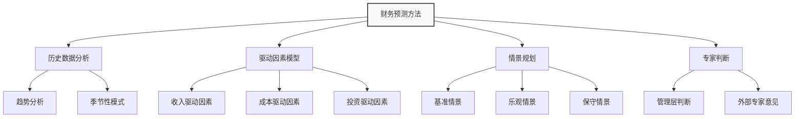
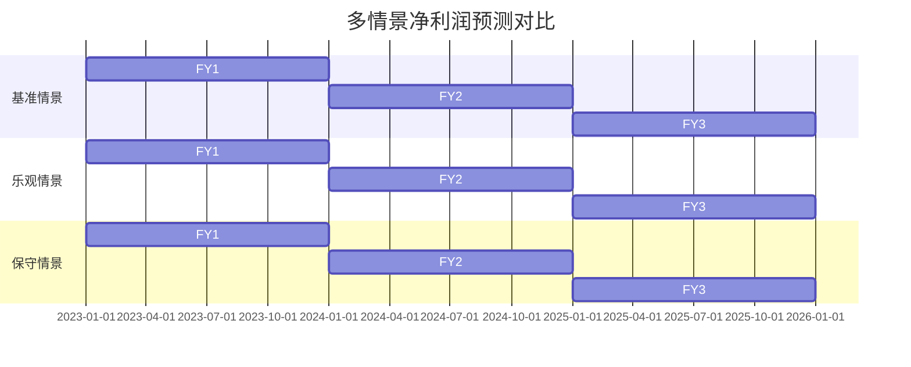
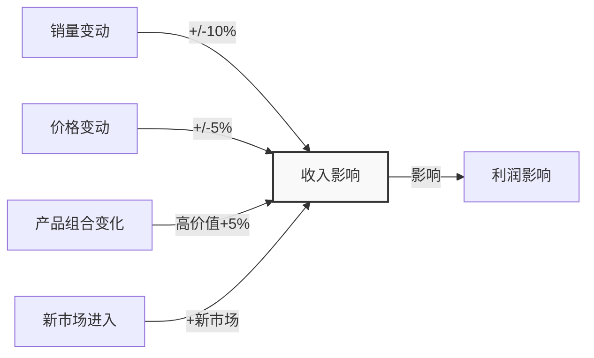

---
{"dg-publish":true,"tags":["财务BP","财务预测","报告模板","决策支持","预测分析"],"创建日期":"2024-07-21","permalink":"/知识共享/001_财务/01_财务BP/04_模板/02_报告/财务预测报告模板/","dgPassFrontmatter":true}
---

# 财务预测报告模板

## 报告概览

**报告标题：** \[公司名称\] \[年度/季度/项目\] 财务预测报告

**报告编号：** FIN-FORECAST-\[年份\]-\[序号\]

**编制日期：** YYYY-MM-DD

**报告期间：** YYYY-MM-DD 至 YYYY-MM-DD

**编制部门：** 财务部/财务BP团队

**审核人员：** \[姓名\] \[职位\]

**报告分发：** \[高管团队\] \[业务部门负责人\] \[董事会\]

**保密级别：** □ 公开 □ 内部公开 □ 管理层 □ 机密

## 报告摘要

> [!note] 摘要提示
> 提供财务预测的核心发现、关键假设和主要结论的精炼总结（200-300字）。突出预测期内的预期业绩表现、重要风险和机遇，以及建议的行动方向。

[在此填写财务预测报告摘要内容]

## 1. 预测背景与目的

### 1.1 预测目的

- □ 年度财务规划
- □ 战略规划支持
- □ 投资决策分析
- □ 融资需求评估
- □ 业务转型/调整评估
- □ 其他：________________

### 1.2 业务与市场环境

#### 1.2.1 宏观经济环境

[描述宏观经济走势、利率环境、汇率变化预期等对公司财务的潜在影响]

#### 1.2.2 行业发展趋势

[分析行业增长前景、竞争格局变化、技术发展趋势等对公司业务的影响]

#### 1.2.3 公司战略重点

[概述公司当前战略目标、业务重点转变和计划中的重大举措]

### 1.3 预测范围与期限

- **预测期间**：____ 年
- **预测颗粒度**：□ 月度 □ 季度 □ 年度
- **预测范围**：□ 集团整体 □ 业务单元 □ 产品线 □ 区域 □ 项目
- **比较基准**：□ 上年同期 □ 预算目标 □ 战略规划 □ 行业标准

## 2. 预测方法与假设

### 2.1 预测方法概述

### 2.2 关键假设

| 假设类别 | 基准情景假设 | 乐观情景假设 | 保守情景假设 | 假设依据 |
|---------|------------|------------|------------|---------|
| **宏观经济假设** |  |  |  |  |
| GDP增长率 |  |  |  |  |
| 通货膨胀率 |  |  |  |  |
| 利率水平 |  |  |  |  |
| 汇率 |  |  |  |  |
| **行业假设** |  |  |  |  |
| 市场增长率 |  |  |  |  |
| 价格趋势 |  |  |  |  |
| 竞争格局 |  |  |  |  |
| **业务假设** |  |  |  |  |
| 销量增长 |  |  |  |  |
| 价格变动 |  |  |  |  |
| 新产品贡献 |  |  |  |  |
| 市场份额 |  |  |  |  |
| **运营假设** |  |  |  |  |
| 毛利率 |  |  |  |  |
| 费用率 |  |  |  |  |
| 人员变动 |  |  |  |  |
| **投资假设** |  |  |  |  |
| 资本支出 |  |  |  |  |
| 并购活动 |  |  |  |  |
| 研发投入 |  |  |  |  |
| **财务政策假设** |  |  |  |  |
| 股利政策 |  |  |  |  |
| 融资结构 |  |  |  |  |
| 税率 |  |  |  |  |

### 2.3 预测限制与不确定性

[说明预测中的主要限制因素、数据可靠性问题和其他可能影响预测准确性的因素]

## 3. 财务预测结果

### 3.1 利润表预测

#### 3.1.1 利润表摘要（基准情景）

| 利润表项目 | 实际 FY__ | 预测 FY__ | 预测 FY__ | 预测 FY__ | 年均复合 增长率 |
|-----------|:------------:|:------------:|:------------:|:------------:|:------------------:|
| **营业收入** |  |  |  |  |  |
| - 产品/业务线1 |  |  |  |  |  |
| - 产品/业务线2 |  |  |  |  |  |
| - 产品/业务线3 |  |  |  |  |  |
| **营业成本** |  |  |  |  |  |
| **毛利** |  |  |  |  |  |
| 毛利率% |  |  |  |  |  |
| **运营费用** |  |  |  |  |  |
| - 销售费用 |  |  |  |  |  |
| - 管理费用 |  |  |  |  |  |
| - 研发费用 |  |  |  |  |  |
| **运营利润(EBIT)** |  |  |  |  |  |
| EBIT利润率% |  |  |  |  |  |
| **财务费用** |  |  |  |  |  |
| **税前利润** |  |  |  |  |  |
| **所得税** |  |  |  |  |  |
| **净利润** |  |  |  |  |  |
| 净利率% |  |  |  |  |  |
| **EBITDA** |  |  |  |  |  |
| EBITDA利润率% |  |  |  |  |  |

#### 3.1.2 收入预测分析

[详细分析收入预测的驱动因素、增长来源、产品/区域/客户组合变化等]

#### 3.1.3 成本与利润率预测分析

[分析成本结构变化趋势、利润率波动原因、提升利润的关键杠杆等]

#### 3.1.4 多情景利润预测比较

### 3.2 资产负债表预测

#### 3.2.1 资产负债表摘要（基准情景）

| 资产负债表项目 | 实际 FY__ | 预测 FY__ | 预测 FY__ | 预测 FY__ | 年均 变化率 |
|--------------|:------------:|:------------:|:------------:|:------------:|:-------------:|
| **资产** |  |  |  |  |  |
| **流动资产** |  |  |  |  |  |
| - 现金及现金等价物 |  |  |  |  |  |
| - 应收账款 |  |  |  |  |  |
| - 存货 |  |  |  |  |  |
| - 其他流动资产 |  |  |  |  |  |
| **非流动资产** |  |  |  |  |  |
| - 固定资产 |  |  |  |  |  |
| - 无形资产 |  |  |  |  |  |
| - 长期投资 |  |  |  |  |  |
| - 其他非流动资产 |  |  |  |  |  |
| **资产总额** |  |  |  |  |  |
| **负债** |  |  |  |  |  |
| **流动负债** |  |  |  |  |  |
| - 短期借款 |  |  |  |  |  |
| - 应付账款 |  |  |  |  |  |
| - 其他流动负债 |  |  |  |  |  |
| **非流动负债** |  |  |  |  |  |
| - 长期借款 |  |  |  |  |  |
| - 其他非流动负债 |  |  |  |  |  |
| **负债总额** |  |  |  |  |  |
| **所有者权益** |  |  |  |  |  |
| - 股本 |  |  |  |  |  |
| - 资本公积 |  |  |  |  |  |
| - 留存收益 |  |  |  |  |  |
| **负债与所有者权益总额** |  |  |  |  |  |

#### 3.2.2 资产结构分析

[分析资产结构变化趋势、资产周转效率、投资重点等]

#### 3.2.3 负债与资本结构分析

[分析负债水平变化、资本结构优化、偿债能力评估等]

### 3.3 现金流量表预测

#### 3.3.1 现金流量表摘要（基准情景）

| 现金流量表项目 | 实际 FY__ | 预测 FY__ | 预测 FY__ | 预测 FY__ | 三年 累计 |
|--------------|:------------:|:------------:|:------------:|:------------:|:----------:|
| **经营活动现金流** |  |  |  |  |  |
| - 净利润 |  |  |  |  |  |
| - 非现金项目调整 |  |  |  |  |  |
| - 营运资金变动 |  |  |  |  |  |
| **经营活动现金流净额** |  |  |  |  |  |
| **投资活动现金流** |  |  |  |  |  |
| - 资本支出 |  |  |  |  |  |
| - 收购支出 |  |  |  |  |  |
| - 其他投资活动 |  |  |  |  |  |
| **投资活动现金流净额** |  |  |  |  |  |
| **融资活动现金流** |  |  |  |  |  |
| - 债务变动净额 |  |  |  |  |  |
| - 股利支付 |  |  |  |  |  |
| - 股票回购/发行 |  |  |  |  |  |
| - 其他融资活动 |  |  |  |  |  |
| **融资活动现金流净额** |  |  |  |  |  |
| **现金净增加额** |  |  |  |  |  |
| **期初现金余额** |  |  |  |  |  |
| **期末现金余额** |  |  |  |  |  |
| **自由现金流** |  |  |  |  |  |

#### 3.3.2 现金流状况分析

[分析经营现金流变化趋势、现金转换效率、自由现金流水平等]

#### 3.3.3 资金需求与资金来源分析

[分析投资需求、融资需求、现金盈余/缺口、资金平衡策略等]

### 3.4 关键财务指标预测

#### 3.4.1 盈利能力指标

| 盈利能力指标 | 实际 FY__ | 预测 FY__ | 预测 FY__ | 预测 FY__ | 变化趋势 |
|------------|:------------:|:------------:|:------------:|:------------:|:--------:|
| 销售毛利率 |  |  |  |  |  |
| 营业利润率 |  |  |  |  |  |
| 净利率 |  |  |  |  |  |
| ROE |  |  |  |  |  |
| ROA |  |  |  |  |  |
| ROIC |  |  |  |  |  |
| 每股收益(EPS) |  |  |  |  |  |

#### 3.4.2 运营效率指标

| 运营效率指标 | 实际 FY__ | 预测 FY__ | 预测 FY__ | 预测 FY__ | 变化趋势 |
|------------|:------------:|:------------:|:------------:|:------------:|:--------:|
| 总资产周转率 |  |  |  |  |  |
| 存货周转天数 |  |  |  |  |  |
| 应收账款周转天数 |  |  |  |  |  |
| 应付账款周转天数 |  |  |  |  |  |
| 现金转换周期 |  |  |  |  |  |
| 固定资产利用率 |  |  |  |  |  |

#### 3.4.3 财务结构与偿债能力指标

| 财务结构指标 | 实际 FY__ | 预测 FY__ | 预测 FY__ | 预测 FY__ | 变化趋势 |
|------------|:------------:|:------------:|:------------:|:------------:|:--------:|
| 资产负债率 |  |  |  |  |  |
| 权益乘数 |  |  |  |  |  |
| 利息保障倍数 |  |  |  |  |  |
| 流动比率 |  |  |  |  |  |
| 速动比率 |  |  |  |  |  |
| 债务/EBITDA |  |  |  |  |  |

#### 3.4.4 增长与价值指标

| 增长与价值指标 | 实际 FY__ | 预测 FY__ | 预测 FY__ | 预测 FY__ | 变化趋势 |
|--------------|:------------:|:------------:|:------------:|:------------:|:--------:|
| 收入增长率 |  |  |  |  |  |
| 净利润增长率 |  |  |  |  |  |
| 经营活动现金流增长率 |  |  |  |  |  |
| 可持续增长率 |  |  |  |  |  |
| 企业价值(EV) |  |  |  |  |  |
| EV/EBITDA |  |  |  |  |  |

## 4. 财务预测分析

### 4.1 关键业务驱动因素分析

#### 4.1.1 收入驱动因素敏感性

[添加驱动因素对收入的影响分析，包括敏感性分析结果]

#### 4.1.2 成本驱动因素敏感性

[分析主要成本驱动因素及其对利润的影响，识别成本管理的重点领域]

#### 4.1.3 资金需求驱动因素

[分析影响资金需求的主要因素，包括业务增长、运营资金需求、投资计划等]

### 4.2 情景分析

#### 4.2.1 多情景财务预测比较

| 财务指标 | 基准情景 | 乐观情景 | 乐观vs基准 变化% | 保守情景 | 保守vs基准 变化% |
|---------|:-------:|:-------:|:------------------:|:-------:|:------------------:|
| **第一年预测** |  |  |  |  |  |
| 收入 |  |  |  |  |  |
| EBITDA |  |  |  |  |  |
| 净利润 |  |  |  |  |  |
| 经营现金流 |  |  |  |  |  |
| 资本支出 |  |  |  |  |  |
| 自由现金流 |  |  |  |  |  |
| **三年累计预测** |  |  |  |  |  |
| 累计收入 |  |  |  |  |  |
| 累计净利润 |  |  |  |  |  |
| 累计经营现金流 |  |  |  |  |  |
| 累计资本支出 |  |  |  |  |  |
| 累计自由现金流 |  |  |  |  |  |
| **第三年末预测** |  |  |  |  |  |
| ROE |  |  |  |  |  |
| 资产负债率 |  |  |  |  |  |
| 现金余额 |  |  |  |  |  |

#### 4.2.2 情景因素影响量化分析

[详细分析不同情景假设对关键财务指标的影响程度，识别最敏感的假设因素]

### 4.3 风险分析

#### 4.3.1 业务风险评估

| 风险类别 | 风险描述 | 影响领域 | 财务影响估计 | 风险应对策略 |
|---------|---------|---------|------------|------------|
| 市场风险 |  | 收入/利润率 |  |  |
| 运营风险 |  | 成本/效率 |  |  |
| 供应链风险 |  | 成本/供应连续性 |  |  |
| 竞争风险 |  | 市场份额/价格 |  |  |
| 产品风险 |  | 收入/增长 |  |  |
| 其他风险 |  |  |  |  |

#### 4.3.2 财务风险评估

| 风险类别 | 风险描述 | 影响指标 | 财务影响估计 | 风险应对策略 |
|---------|---------|---------|------------|------------|
| 流动性风险 |  | 现金流/短债 |  |  |
| 利率风险 |  | 财务费用/利润 |  |  |
| 汇率风险 |  | 收入/成本/利润 |  |  |
| 信用风险 |  | 应收账款/坏账 |  |  |
| 税务风险 |  | 税负/净利润 |  |  |
| 其他风险 |  |  |  |  |

#### 4.3.3 压力测试结果

[提供极端情景下的财务表现压力测试结果，评估企业财务韧性]

### 4.4 业务单元/产品线分析

#### 4.4.1 业务单元贡献分析

| 业务单元 | 收入占比 FY__ | 收入占比 FY__ | 利润占比 FY__ | 利润占比 FY__ | 增长贡献 | 投资分配 |
|---------|:---------------:|:---------------:|:---------------:|:---------------:|:--------:|:--------:|
| 业务单元1 |  |  |  |  |  |  |
| 业务单元2 |  |  |  |  |  |  |
| 业务单元3 |  |  |  |  |  |  |
| 其他业务 |  |  |  |  |  |  |
| **合计** | 100% | 100% | 100% | 100% | 100% | 100% |

#### 4.4.2 产品线分析

[分析主要产品线的财务表现预测、生命周期状态、投资回报等]

## 5. 资本配置与投资计划

### 5.1 资本支出计划

| 资本支出类别 | FY__ 计划 （金额） | FY__ 计划 （金额） | FY__ 计划 （金额） | 三年总计 （金额） | 占比 |
|------------|:------------------:|:------------------:|:------------------:|:------------------:|:----:|
| 维持性投资 |  |  |  |  |  |
| 增长性投资 |  |  |  |  |  |
| - 产能扩张 |  |  |  |  |  |
| - 新产品开发 |  |  |  |  |  |
| - 市场扩展 |  |  |  |  |  |
| 信息技术投资 |  |  |  |  |  |
| 数字化转型 |  |  |  |  |  |
| 并购投资 |  |  |  |  |  |
| 其他投资 |  |  |  |  |  |
| **总计** |  |  |  |  | 100% |

### 5.2 投资回报分析

| 投资项目 | 投资总额 | 实施时间 | NPV | IRR | 回收期 | 战略意义 |
|---------|----------|---------|-----|-----|--------|---------|
| 项目1 |  |  |  |  |  |  |
| 项目2 |  |  |  |  |  |  |
| 项目3 |  |  |  |  |  |  |

### 5.3 研发投入计划

[分析研发投入规划、重点项目及预期回报]

## 6. 资金规划与融资方案

### 6.1 资金需求分析

#### 6.1.1 资金需求预测

| 资金需求类别 | FY__ 预测 （金额） | FY__ 预测 （金额） | FY__ 预测 （金额） | 备注 |
|------------|:------------------:|:------------------:|:------------------:|:----:|
| 运营资金需求 |  |  |  |  |
| 资本支出需求 |  |  |  |  |
| 并购资金需求 |  |  |  |  |
| 债务偿还需求 |  |  |  |  |
| 股东回报需求 |  |  |  |  |
| 其他资金需求 |  |  |  |  |
| **总资金需求** |  |  |  |  |
| 经营现金流入 |  |  |  |  |
| **资金缺口/盈余** |  |  |  |  |

#### 6.1.2 资金缺口分析

[分析资金缺口的时间分布、性质和应对策略]

### 6.2 融资方案

#### 6.2.1 融资来源规划

| 融资来源 | FY__ 计划 （金额） | FY__ 计划 （金额） | FY__ 计划 （金额） | 融资成本估计 | 实施条件 |
|---------|:------------------:|:------------------:|:------------------:|:------------:|:--------:|
| 内部融资 |  |  |  |  |  |
| - 留存收益 |  |  |  |  |  |
| - 资产优化 |  |  |  |  |  |
| 债务融资 |  |  |  |  |  |
| - 银行贷款 |  |  |  |  |  |
| - 债券发行 |  |  |  |  |  |
| - 其他债务工具 |  |  |  |  |  |
| 权益融资 |  |  |  |  |  |
| - 股权融资 |  |  |  |  |  |
| - 战略投资者 |  |  |  |  |  |
| 其他融资 |  |  |  |  |  |
| **总融资金额** |  |  |  |  |  |

#### 6.2.2 资本结构变化分析

[分析融资方案对企业资本结构的影响，包括债务比例、融资成本等]

#### 6.2.3 融资风险分析

[评估融资方案的主要风险，包括再融资风险、利率风险等]

## 7. 预测背后的战略思考

### 7.1 财务战略与业务战略协同

[分析财务预测如何支持公司整体战略目标，以及业务战略与财务战略的匹配度]

### 7.2 核心价值驱动因素

[识别对企业价值创造最关键的财务和业务驱动因素，以及管理层如何优化这些因素]

### 7.3 竞争优势与可持续性

[评估企业财务表现的竞争优势来源及其可持续性]

## 8. 关键建议与行动计划

### 8.1 主要发现和建议摘要

| 领域 | 主要发现 | 建议措施 | 预期影响 | 优先级 |
|-----|---------|---------|----------|-------|
| 增长战略 |  |  |  |  |
| 盈利能力 |  |  |  |  |
| 成本结构 |  |  |  |  |
| 资本配置 |  |  |  |  |
| 资金管理 |  |  |  |  |
| 风险管理 |  |  |  |  |

### 8.2 短期行动计划（0-12个月）

[列出短期优先行动项目、责任人、时间表和关键绩效指标]

### 8.3 中长期战略举措（1-3年）

[概述需要长期推进的战略性举措、里程碑和资源要求]

## 附录

### 附录A：预测模型说明

[详细说明预测模型的构建方法、主要公式和运算逻辑]

### 附录B：敏感性分析详细结果

[提供完整的敏感性分析结果，包括不同变量对财务预测的影响]

### 附录C：行业对标分析

[提供与行业竞争对手的财务表现对比分析]

### 附录D：历史预测准确性回顾

[分析过去预测与实际结果的差异，总结经验教训]

### 附录E：术语表

[解释报告中使用的专业术语和缩写]

---

## 使用指南

1. **准备阶段**
   - 收集最新的财务历史数据和业务计划
   - 与业务部门确认关键假设和业务预期
   - 明确预测的具体目的和决策需求

2. **填写流程**
   - 按顺序填写各个章节
   - 对于不适用的部分可以删除或简化
   - 重点关注对决策最有价值的分析内容

3. **报告定制**
   - 根据受众调整分析深度和技术术语使用
   - 针对高管团队，强化摘要和关键信息
   - 针对业务部门，增强驱动因素和业务连接分析
   - 针对董事会，突出战略层面分析和风险评估

4. **图表使用建议**
   - 使用图表展示关键趋势和对比分析
   - 确保图表简洁清晰，聚焦关键信息
   - 图表颜色应有一致性，通常用绿色表示积极趋势，红色表示消极趋势

5. **更新维护**
   - 建议季度更新滚动预测
   - 重大事件发生后及时更新相关预测
   - 实际结果与预测出现显著差异时进行分析和调整

## 财务预测最佳实践

- **预测透明度**：清晰说明所有重要假设和方法论
- **合理保守**：预测应倾向于合理保守而非过度乐观
- **多情景思维**：始终考虑多种可能的业务发展路径
- **整合反馈**：吸收业务部门和高管的反馈来优化预测
- **量化不确定性**：使用区间、概率和敏感性分析而非单一预测值
- **连接战略**：预测应明确支持企业战略决策
- **持续改进**：不断回顾和改进预测方法和假设 