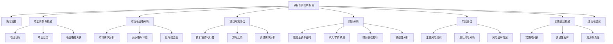

---
{"dg-publish":true,"tags":["财务BP","项目投资","投资分析","报告模板","ROI分析"],"创建日期":"2024-04-28","permalink":"/知识共享/001_财务/01_财务BP/04_模板/02_报告/项目投资分析报告模板/","dgPassFrontmatter":true}
---

# 项目投资分析报告模板

## 模板概述

本模板提供了一个全面的项目投资分析报告框架，用于企业评估特定投资项目的财务可行性、风险状况和战略价值。本报告适用于新建项目、并购活动、产能扩张、技术升级等各类投资决策，旨在帮助管理层系统评估项目价值并做出合理决策。

## 前期准备

### 所需数据与资料

- [ ] 项目基本方案
  - 项目定义与范围说明
  - 技术/商业解决方案详情
  - 投资金额与资金规划
  - 时间进度安排
- [ ] 市场与行业资料
  - 目标市场分析报告
  - 行业趋势研究
  - 竞争格局分析
  - 客户需求调研
- [ ] 财务与经济数据
  - 详细成本预算
  - 收入/节约预测
  - 历史类似项目数据
  - 资金成本数据
- [ ] 风险管理资料
  - 风险清单与初步评估
  - 敏感性因素识别
  - 行业基准数据
  - 专家意见与建议

### 编制团队

**核心团队**:
- 项目负责人（提供项目信息）
- 财务分析师（负责财务建模与分析）
- 业务专家（提供业务洞见）
- 风险分析师（评估项目风险）

**支持团队**:
- 技术/运营专家（技术可行性评估）
- 市场/销售代表（市场预测与验证）
- 法务代表（合规与法律风险评估）
- 外部顾问（根据需要）

## 报告结构

## 报告内容框架

### 1. 封面与目录

**封面内容**:
- 报告标题: "[项目名称]投资分析报告"
- 项目编号: "[项目代码/编号]"
- 报告日期: "[YYYY-MM-DD]"
- 编制部门: "[部门名称]"
- 报告版本: "[版本号]"
- 保密级别: "[保密级别]"

**目录要素**:
- 主要章节与子章节
- 图表清单
- 附件清单
- 页码

### 2. 执行摘要

*[1-2页，简洁明了地概述整个报告的核心内容]*

**核心要素**:
- 项目简述与目标
- 投资金额与资金结构
- 关键财务指标(NPV/IRR/回收期)
- 主要风险与应对措施
- 战略价值要点
- 最终建议与条件

**执行摘要模板**:

> [项目名称]投资分析报告对总投资额为[金额]的[项目简述]进行了全面评估。项目旨在[主要目标]，预计将为公司带来[主要收益]。
> 
> 财务分析表明，该项目的净现值(NPV)为[金额]，内部收益率(IRR)为[百分比]，投资回收期为[年数]，[超过/低于]公司要求的[投资门槛]。敏感性分析显示，该项目对[关键变量]变化最为敏感。
> 
> 主要风险包括[列举1-2项主要风险]，我们建议通过[主要缓解措施]来管理这些风险。
> 
> 从战略角度看，该项目将[战略价值概述]，与公司[相关战略目标]高度一致。
> 
> 基于综合分析，我们建议[批准/有条件批准/不批准]该项目，并建议[关键建议或条件]。

### 3. 项目背景与概述

#### 3.1 项目背景

**项目起源**:
- 项目提出的背景
- 解决的问题/机会
- 前期工作概述
- 与过往项目的关系

**项目分类**:
- 扩张性投资/效率提升投资/创新投资/合规性投资
- 主导部门与受益部门
- 项目发起时间与过程

#### 3.2 项目目标与范围

| 目标类型 | 具体目标 | 衡量指标 | 目标值 | 与战略的联系 |
|---------|---------|---------|-------|------------|
| 财务目标 |  |  |  |  |
| 市场目标 |  |  |  |  |
| 运营目标 |  |  |  |  |
| 战略目标 |  |  |  |  |
| 其他目标 |  |  |  |  |

**项目范围说明**:
- 包含内容:
  - [列出项目包含的主要工作内容]
- 排除内容:
  - [列出项目明确不包含的内容]
- 边界条件:
  - [列出项目的约束条件或假设]

#### 3.3 与公司战略的关联

| 战略方向 | 关联度 | 贡献机制 | 战略重要性评级 |
|---------|-------|---------|--------------|
| [战略1] | 高/中/低 |  | 关键/重要/支持 |
| [战略2] | 高/中/低 |  | 关键/重要/支持 |
| [战略3] | 高/中/低 |  | 关键/重要/支持 |

**战略价值陈述**:
> [简明扼要地描述项目如何服务于公司总体战略，以及推动战略目标实现的机制]

### 4. 市场与战略分析

#### 4.1 市场需求分析

| 市场维度 | 当前状况 | 预测趋势 | 数据来源/可靠性 | 对项目的影响 |
|---------|---------|---------|--------------|------------|
| 市场规模 |  |  |  |  |
| 增长率 |  |  |  |  |
| 价格趋势 |  |  |  |  |
| 客户需求 |  |  |  |  |
| 季节性/周期性 |  |  |  |  |

**市场分析图表**:
*[此处应插入市场规模/趋势图表]*

**市场需求验证**:
- 客户访谈/调研结果
- 已获得意向/合同
- 第三方市场研究数据
- 内部销售团队反馈

#### 4.2 竞争格局分析

| 竞争因素 | 分析结果 | 对项目的影响 | 应对策略 |
|---------|---------|------------|---------|
| 直接竞争对手 |  |  |  |
| 新进入者威胁 |  |  |  |
| 替代品威胁 |  |  |  |
| 供应商议价能力 |  |  |  |
| 客户议价能力 |  |  |  |

**竞争优势分析**:
> [分析项目如何创造竞争优势，以及这些优势的可持续性]

#### 4.3 战略契合度评估

| 评估维度 | 评分(1-10) | 权重 | 加权分数 | 评价依据 |
|---------|-----------|------|---------|---------|
| 与企业愿景一致性 |  | __% |  |  |
| 与核心竞争力关联 |  | __% |  |  |
| 市场定位强化 |  | __% |  |  |
| 差异化贡献 |  | __% |  |  |
| 长期价值创造 |  | __% |  |  |
| **总评分** |  | 100% |  |  |

*评分标准：9-10=极高，7-8=高，5-6=中等，3-4=较低，1-2=低*

### 5. 项目方案评估

#### 5.1 技术与操作可行性

| 可行性维度 | 评估结果 | 关键挑战 | 解决方案 | 可行性评级 |
|-----------|---------|---------|---------|-----------|
| 技术可行性 |  |  |  | 高/中/低 |
| 资源可获得性 |  |  |  | 高/中/低 |
| 时间约束 |  |  |  | 高/中/低 |
| 操作复杂性 |  |  |  | 高/中/低 |
| 扩展性 |  |  |  | 高/中/低 |
| 整合难度 |  |  |  | 高/中/低 |

**技术风险评估**:
> [概述主要技术风险及其影响程度，以及可能的缓解措施]

#### 5.2 方案比较分析

| 评估维度 | 权重 | 方案A | 方案B | 方案C | 评分标准 |
|---------|------|-------|-------|-------|---------|
| 投资金额 | __% |  |  |  | 1-10分 |
| 实施时间 | __% |  |  |  | 1-10分 |
| 技术成熟度 | __% |  |  |  | 1-10分 |
| 风险水平 | __% |  |  |  | 1-10分 |
| 预期收益 | __% |  |  |  | 1-10分 |
| 战略价值 | __% |  |  |  | 1-10分 |
| 运营影响 | __% |  |  |  | 1-10分 |
| **加权总分** | 100% |  |  |  |  |
| **排名** |  |  |  |  |  |

**方案优化建议**:
> [基于比较分析，提出优化首选方案的建议]

#### 5.3 资源需求分析

| 资源类别 | 详细需求 | 获取方式 | 成本估算 | 资源风险 | 缓解措施 |
|---------|---------|---------|---------|---------|---------|
| 人力资源 |  |  |  |  |  |
| 设备资源 |  |  |  |  |  |
| 技术资源 |  |  |  |  |  |
| 资金资源 |  |  |  |  |  |
| 时间资源 |  |  |  |  |  |
| 外部资源 |  |  |  |  |  |

**资源调配计划**:
> [描述如何有效调配和管理各项资源，以确保项目顺利实施]

### 6. 财务分析

#### 6.1 投资金额与资金结构

| 投资类别 | 金额 | 占比 | 支出时间 | 资金来源 | 备注 |
|---------|------|------|---------|---------|------|
| 土地/房产 |  | __% |  |  |  |
| 设备购置 |  | __% |  |  |  |
| 技术获取 |  | __% |  |  |  |
| 安装调试 |  | __% |  |  |  |
| 培训与启动 |  | __% |  |  |  |
| 流动资金 |  | __% |  |  |  |
| 预备费用 |  | __% |  |  |  |
| **总投资** |  | 100% |  |  |  |

**资金来源结构**:

| 资金来源 | 金额 | 占比 | 成本 | 条件 | 获取难度 |
|---------|------|------|------|------|---------|
| 自有资金 |  | __% | __% |  | 高/中/低 |
| 银行贷款 |  | __% | __% |  | 高/中/低 |
| 债券融资 |  | __% | __% |  | 高/中/低 |
| 股权融资 |  | __% | __% |  | 高/中/低 |
| 项目融资 |  | __% | __% |  | 高/中/低 |
| 其他来源 |  | __% | __% |  | 高/中/低 |
| **总计** |  | 100% | 加权平均: __% |  |  |

**投资时间分布**:
*[此处应插入投资支出时间分布图]*

#### 6.2 收入/节约预测

| 收益类型 | 年度1 | 年度2 | 年度3 | 年度4 | 年度5 | ... | 年度N |
|---------|------|------|------|------|------|-----|------|
| 新增收入 |  |  |  |  |  |  |  |
| 成本节约 |  |  |  |  |  |  |  |
| 资产处置 |  |  |  |  |  |  |  |
| 税收优惠 |  |  |  |  |  |  |  |
| 其他收益 |  |  |  |  |  |  |  |
| **总收益** |  |  |  |  |  |  |  |

**收益来源分析**:
> [详细说明收益的主要来源和计算依据，以及收益预测的主要假设]

**收益预测依据**:
- 市场研究/客户调研数据
- 历史运营经验
- 行业标杆分析
- 专家判断/团队共识

#### 6.3 财务评估指标

| 财务指标 | 计算结果 | 门槛值 | 评价 | 行业平均 | 敏感性 |
|---------|---------|-------|------|---------|-------|
| 净现值(NPV) |  |  | 通过/不通过 |  | 高/中/低 |
| 内部收益率(IRR) |  |  | 通过/不通过 |  | 高/中/低 |
| 投资回收期 |  |  | 通过/不通过 |  | 高/中/低 |
| 账面回报率(ARR) |  |  | 通过/不通过 |  | 高/中/低 |
| 获利指数(PI) |  |  | 通过/不通过 |  | 高/中/低 |
| EBITDA影响 |  |  | 通过/不通过 |  | 高/中/低 |
| 每股收益影响 |  |  | 通过/不通过 |  | 高/中/低 |

**财务计算关键假设**:
- 计算期限: __年
- 折现率: __%，基于 [说明依据]
- 通货膨胀率: __%/年
- 所得税率: __%
- 汇率假设: [如适用]
- 残值估计: [项目结束时的残值估计]

#### 6.4 敏感性分析

| 变量 | 基准值 | 变动范围 | NPV影响 | IRR影响 | 临界点 | 关注度 |
|------|-------|---------|---------|---------|-------|-------|
| 投资金额 |  | ±__% |  |  |  | 高/中/低 |
| 销售收入 |  | ±__% |  |  |  | 高/中/低 |
| 运营成本 |  | ±__% |  |  |  | 高/中/低 |
| 项目期限 |  | ±__年 |  |  |  | 高/中/低 |
| 折现率 |  | ±__% |  |  |  | 高/中/低 |
| 启动延迟 |  | +__月 |  |  |  | 高/中/低 |

**情景分析**:

| 情景 | 描述 | NPV | IRR | 回收期 | 概率 | 应对策略 |
|------|------|-----|-----|-------|------|---------|
| 乐观情景 |  |  |  |  | __% |  |
| 基准情景 |  |  |  |  | __% |  |
| 悲观情景 |  |  |  |  | __% |  |
| 最差情景 |  |  |  |  | __% |  |

**敏感性图表**:
*[此处应插入敏感性分析图表，如蜘蛛图或龙卷风图]*

**财务分析结论**:
> [总结财务分析的主要发现，项目的财务可行性评价，以及需要特别关注的财务风险因素]

### 7. 风险评估

#### 7.1 主要风险识别

| 风险类别 | 具体风险 | 发生概率 | 影响程度 | 风险评级 | 可控性 | 关联方 |
|---------|---------|---------|---------|---------|-------|-------|
| **市场风险** |  |  |  |  |  |  |
| 需求风险 |  | 高/中/低 | 高/中/低 | A/B/C/D |  |  |
| 竞争风险 |  | 高/中/低 | 高/中/低 | A/B/C/D |  |  |
| 价格风险 |  | 高/中/低 | 高/中/低 | A/B/C/D |  |  |
| **技术风险** |  |  |  |  |  |  |
| 技术成熟度 |  | 高/中/低 | 高/中/低 | A/B/C/D |  |  |
| 技术变革 |  | 高/中/低 | 高/中/低 | A/B/C/D |  |  |
| 实施风险 |  | 高/中/低 | 高/中/低 | A/B/C/D |  |  |
| **财务风险** |  |  |  |  |  |  |
| 成本超支 |  | 高/中/低 | 高/中/低 | A/B/C/D |  |  |
| 收益不达标 |  | 高/中/低 | 高/中/低 | A/B/C/D |  |  |
| 融资风险 |  | 高/中/低 | 高/中/低 | A/B/C/D |  |  |
| **其他风险** |  |  |  |  |  |  |
| 法规/政策风险 |  | 高/中/低 | 高/中/低 | A/B/C/D |  |  |
| 人力资源风险 |  | 高/中/低 | 高/中/低 | A/B/C/D |  |  |
| 合作伙伴风险 |  | 高/中/低 | 高/中/低 | A/B/C/D |  |  |

*风险评级：A=重大风险，B=高风险，C=中等风险，D=低风险*

**风险图谱**:
*[此处应插入风险矩阵图，横轴为概率，纵轴为影响]*

#### 7.2 风险缓解方案

| 主要风险 | 缓解策略 | 具体措施 | 所需资源 | 实施难度 | 责任方 |
|---------|---------|---------|---------|---------|-------|
|  |  |  |  | 高/中/低 |  |
|  |  |  |  | 高/中/低 |  |
|  |  |  |  | 高/中/低 |  |
|  |  |  |  | 高/中/低 |  |
|  |  |  |  | 高/中/低 |  |

**风险管控流程**:
> [描述项目实施过程中如何持续监控和管理风险的流程和机制]

#### 7.3 风险评估结论

**主要风险总结**:
> [总结项目面临的主要风险及其可能的整体影响]

**风险可接受性评价**:
> [评估项目整体风险水平是否在公司可接受范围内，以及风险与回报的平衡性]

**风险管理建议**:
> [提出改进风险管理的建议，包括监控频率、预警机制和应急预案等]

### 8. 实施计划概述

#### 8.1 实施时间表

| 阶段 | 开始时间 | 完成时间 | 持续时间 | 前置依赖 | 负责部门 |
|------|---------|---------|---------|---------|---------|
| 前期准备 |  |  |  |  |  |
| 设计阶段 |  |  |  |  |  |
| 采购阶段 |  |  |  |  |  |
| 建设/开发 |  |  |  |  |  |
| 测试/调试 |  |  |  |  |  |
| 培训 |  |  |  |  |  |
| 上线/投产 |  |  |  |  |  |
| 验收评估 |  |  |  |  |  |

**关键路径分析**:
> [识别项目实施的关键路径和时间节点，以及对项目进度的潜在影响因素]

#### 8.2 关键里程碑

| 里程碑 | 计划日期 | 可交付成果 | 验收标准 | 责任人 |
|-------|---------|-----------|---------|-------|
|  |  |  |  |  |
|  |  |  |  |  |
|  |  |  |  |  |
|  |  |  |  |  |
|  |  |  |  |  |

#### 8.3 实施团队与责任

| 角色 | 责任范围 | 所需技能 | 人员来源 | 到位时间 |
|------|---------|---------|---------|---------|
| 项目经理 |  |  |  |  |
| 技术负责人 |  |  |  |  |
| 财务代表 |  |  |  |  |
| 运营代表 |  |  |  |  |
| 采购代表 |  |  |  |  |
| 质量负责人 |  |  |  |  |
| 其他角色 |  |  |  |  |

**沟通与汇报机制**:
> [描述项目实施过程中的沟通频率、方式和汇报流程]

### 9. 结论与建议

#### 9.1 综合评估表

| 评估维度 | 权重 | 评分(1-10) | 加权得分 | 评价 |
|---------|------|-----------|---------|------|
| 战略价值 | __% |  |  |  |
| 财务回报 | __% |  |  |  |
| 市场前景 | __% |  |  |  |
| 技术可行性 | __% |  |  |  |
| 风险水平 | __% |  |  |  |
| 资源需求 | __% |  |  |  |
| 实施难度 | __% |  |  |  |
| **总得分** | 100% |  |  |  |

*评分标准: 9-10=优秀，7-8=良好，5-6=一般，3-4=较差，1-2=差*

#### 9.2 结论

**项目可行性结论**:
> [基于综合分析，对项目的整体可行性做出明确结论]

**核心优势**:
- [列出项目的3-5个核心优势]

**主要风险/挑战**:
- [列出项目的3-5个主要风险或挑战]

#### 9.3 建议

**决策建议**:
- [ ] 立即批准并实施
- [ ] 有条件批准（需满足以下条件）
- [ ] 修改后重新评估
- [ ] 推迟决策
- [ ] 不予批准

**条件与限制**:
> [如选择有条件批准，列出需要满足的具体条件]

**后续行动建议**:
1. [建议1]
2. [建议2]
3. [建议3]
4. [建议4]

### 10. 附录

#### 10.1 财务模型详情

*[包含财务模型的详细假设、计算过程和结果]*

#### 10.2 市场研究详情

*[包含市场研究的方法、样本和详细发现]*

#### 10.3 风险评估详情

*[包含风险评估的详细方法和结果]*

#### 10.4 技术评估详情

*[包含技术可行性评估的详细内容]*

## 应用指南

### 报告编制说明

**编制流程**:
1. 收集项目基础信息(1-2周)
2. 进行市场与技术可行性分析(2-3周)
3. 构建财务模型与风险评估(2-3周)
4. 整合分析结果并形成初稿(1周)
5. 内部评审与修订(1-2周)
6. 定稿与提交(1周)

**报告复杂度调整**:
- 小型项目(<__万元): 简化版本，重点关注财务和实施计划
- 中型项目(__-__万元): 标准版本，平衡各个分析维度
- 大型项目(>__万元): 完整版本，深入分析各个维度，可能需要外部专家参与

**跨部门协作建议**:
- 明确各部门的数据提供责任
- 设立定期协调会议
- 使用项目管理工具跟踪进展
- 建立数据共享机制

### 决策支持使用说明

**适用的决策场景**:
- 新产品/市场开发决策
- 产能扩张决策
- 技术升级决策
- 并购决策
- 重大资产投资决策

**向不同层级的呈现建议**:
- 高管层: 聚焦执行摘要、战略价值和财务指标
- 管理层: 关注实施计划、资源需求和风险管理
- 技术团队: 重点讨论技术可行性与实施挑战

**常见问题解答**:
- Q: 如何处理数据不完整的情况?
  A: 明确标识数据来源和可靠性，使用情景分析和敏感性分析呈现不确定性

- Q: 项目边界如何界定?
  A: 与相关部门共同确定项目的确切范围，明确包含与排除内容

- Q: 如何平衡定量与定性分析?
  A: 尽可能量化关键因素，同时在结论中综合考虑定性因素的影响

## 示例与最佳实践

> 注: 以下为简化示例，帮助理解如何填充本模板。

### 示例: 执行摘要

智能制造产线升级项目投资分析报告对总投资额为2,500万元的自动化生产线改造项目进行了全面评估。项目旨在提高生产效率、降低人工成本并提升产品质量，预计将为公司带来年均1,200万元的成本节约和增量收入。

财务分析表明，该项目的净现值(NPV)为1,850万元，内部收益率(IRR)为22%，投资回收期为3.8年，超过公司15%的投资回报率要求。敏感性分析显示，该项目对设备价格和产能利用率变化最为敏感。

主要风险包括自动化技术整合难度和产能过渡期管理，我们建议通过分阶段实施和提前员工培训来管理这些风险。

从战略角度看，该项目将显著提升公司在行业中的成本竞争力，与公司"智能制造升级"战略高度一致。

基于综合分析，我们建议有条件批准该项目，并建议通过分两阶段实施来控制风险，第一阶段完成后进行评估再决定第二阶段投入。

### 最佳实践: 风险分析

1. **使用定量与定性相结合的方法**
   - 定量评估风险的概率与影响
   - 定性分析风险的根本原因
   - 结合专家经验与历史数据

2. **针对高级别风险制定详细应对计划**
   - 明确风险缓解措施
   - 分配具体责任人
   - 设定监控指标和阈值
   - 准备应急预案

3. **展示风险与收益的平衡**
   - 通过图表直观展示风险与收益关系
   - 比较不同方案的风险收益特征
   - 明确公司风险偏好与项目风险的匹配度

## 参考资源

1. Damodaran, A. (2021). *Investment Valuation: Tools and Techniques for Determining the Value of Any Asset*. Wiley Finance.
2. Project Management Institute. (2021). *A Guide to the Project Management Body of Knowledge (PMBOK Guide)*.
3. Harvard Business Review. (2019). *Making Capital Investment Decisions*.
4. 《投资项目经济评价方法与参数》，国家发改委，2020.
5. 《企业投资管理最佳实践》，机械工业出版社，2022. 