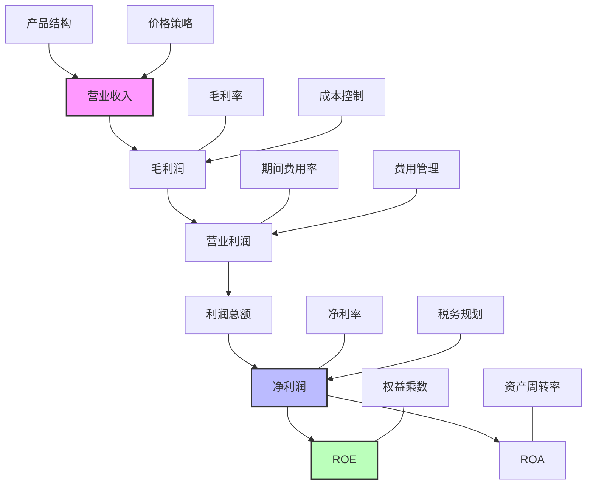

---
{"dg-publish":true,"tags":["财务BI","数据模型","指标体系","利润分析","盈利能力"],"aliases":["盈利指标体系","利润指标集"],"permalink":"/知识共享/001_财务/02_财务BI看板项目/数据模型设计/指标体系设计/利润相关指标/","dgPassFrontmatter":true}
---

# 利润相关指标

## 概述

利润相关指标是财务分析中最核心的指标集合，直接反映企业的盈利能力和经营成果。本文档系统梳理了从收入到净利润的各层级利润指标，以及相关的盈利能力比率，为利润分析看板提供指标支持。

## 收入指标

| 指标名称 | 计算公式 | 指标含义 | 应用场景 | 展示建议 |
| ---- | ---- | ---- | ---- | ---- |
| 营业收入 | 主营业务收入+其他业务收入 | 企业经营规模 | 规模分析 | 趋势图、目标达成率 |
| 主营业务收入 | 各业务线收入之和 | 核心业务规模 | 主业分析 | 趋势图、构成分析 |
| 其他业务收入 | 非主营业务产生的收入 | 非核心收入规模 | 多元化分析 | 趋势图、占比分析 |
| 收入环比增长率 | (本期收入-上期收入)/上期收入 | 短期增长状况 | 短期增长分析 | 趋势图、热力图 |
| 收入同比增长率 | (本期收入-去年同期收入)/去年同期收入 | 长期增长状况 | 长期增长分析 | 趋势图、目标对比 |

## 利润层级指标

| 指标名称 | 计算公式 | 指标含义 | 应用场景 | 展示建议 |
| ---- | ---- | ---- | ---- | ---- |
| 毛利润 | 营业收入-营业成本 | 基础盈利能力 | 产品盈利分析 | 趋势图、瀑布图 |
| 营业利润 | 毛利润-期间费用+其他收益 | 主营业务盈利能力 | 业务盈利分析 | 趋势图、瀑布图 |
| 利润总额 | 营业利润+营业外收入-营业外支出 | 企业整体盈利 | 整体盈利分析 | 趋势图、目标对比 |
| 净利润 | 利润总额-所得税费用 | 最终盈利成果 | 盈利成果分析 | 趋势图、目标对比 |
| EBITDA | 净利润+所得税+利息+折旧+摊销 | 剔除非经营因素的盈利 | 经营绩效分析 | 趋势图、同业对比 |
| 经营性现金流量 | 经营活动产生的现金流量净额 | 现金创造能力 | 经营质量分析 | 趋势图、与净利润对比 |

## 利润率指标

| 指标名称 | 计算公式 | 指标含义 | 应用场景 | 展示建议 |
| ---- | ---- | ---- | ---- | ---- |
| 毛利率 | 毛利润/营业收入 | 产品基础盈利能力 | 产品分析 | 趋势图、条形图 |
| 净利率 | 净利润/营业收入 | 整体盈利能力 | 整体盈利分析 | 趋势图、目标对比 |
| EBITDA利润率 | EBITDA/营业收入 | 经营绩效 | 经营分析 | 趋势图、同业对比 |
| 销售费用率 | 销售费用/营业收入 | 销售效率 | 销售效率分析 | 趋势图、部门对比 |
| 管理费用率 | 管理费用/营业收入 | 管理效率 | 管理效率分析 | 趋势图、部门对比 |
| 研发费用率 | 研发费用/营业收入 | 研发投入情况 | 研发分析 | 趋势图、行业对比 |
| 财务费用率 | 财务费用/营业收入 | 财务成本控制 | 财务成本分析 | 趋势图、结构分析 |

## 资本回报指标

| 指标名称 | 计算公式 | 指标含义 | 应用场景 | 展示建议 |
| ---- | ---- | ---- | ---- | ---- |
| ROE | 净利润/平均股东权益 | 股东资本回报率 | 股东回报分析 | 趋势图、目标对比 |
| ROA | 净利润/平均总资产 | 资产使用效率 | 资产效率分析 | 趋势图、同业对比 |
| ROIC | 税后营业利润/(总资产-流动负债) | 投入资本回报率 | 资本效率分析 | 趋势图、资本成本对比 |
| 杜邦分析 | ROE = 净利率×资产周转率×权益乘数 | ROE影响因素拆解 | 管理改进分析 | 组合图表、杜邦图 |

## 利润分布分析

| 指标名称 | 计算公式 | 指标含义 | 应用场景 | 展示建议 |
| ---- | ---- | ---- | ---- | ---- |
| 产品利润贡献率 | 某产品利润/总利润 | 产品利润贡献 | 产品组合分析 | 饼图、帕累托图 |
| 客户利润贡献率 | 某客户利润/总利润 | 客户利润贡献 | 客户价值分析 | 饼图、帕累托图 |
| 区域利润贡献率 | 某区域利润/总利润 | 区域利润贡献 | 区域分析 | 地图、热力图 |
| 利润集中度 | 前20%产品/客户的利润占比 | 利润来源集中度 | 风险分析 | 洛伦兹曲线 |

## 利润增长分析

| 指标名称 | 计算公式 | 指标含义 | 应用场景 | 展示建议 |
| ---- | ---- | ---- | ---- | ---- |
| 利润增长率 | (本期利润-上期利润)/上期利润 | 利润增长速度 | 增长分析 | 趋势图、目标对比 |
| 利润增长贡献因素 | 各因素对利润增长的贡献额 | 增长驱动因素 | 因素分析 | 瀑布图、贡献度图 |
| 增收增利比 | 利润增长率/收入增长率 | 收入转化为利润效率 | 增长质量分析 | 散点图、象限分析 |

## 利润指标分析框架

## 看板设计应用

1. **财务概览看板**：展示净利润、净利率、ROE等核心指标及其趋势
2. **利润结构看板**：通过瀑布图展示从收入到净利润的结构
3. **利润驱动因素看板**：展示影响利润变动的主要因素及贡献度
4. **利润预测看板**：基于历史数据和驱动因素建立利润预测模型
5. **多维度利润分析**：按产品、客户、区域等维度展示利润分布 