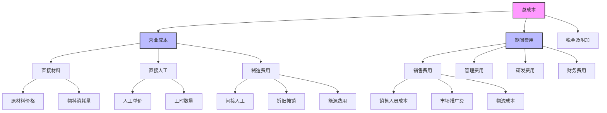
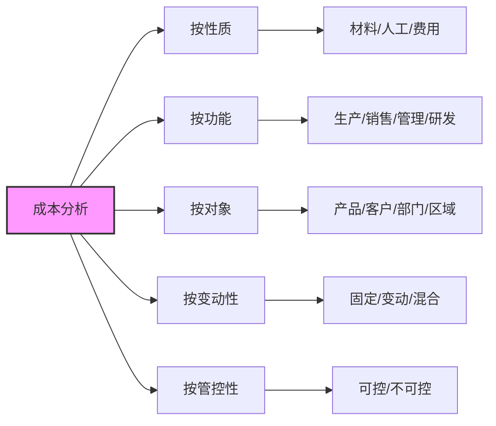

---
{"dg-publish":true,"tags":["财务BI","数据模型","指标体系","成本分析","成本控制"],"aliases":["成本指标体系","成本分析框架"],"permalink":"/知识共享/001_财务/02_财务BI看板项目/数据模型设计/指标体系设计/成本相关指标/","dgPassFrontmatter":true}
---

# 成本相关指标

## 概述

成本相关指标是企业财务管理的重要组成部分，直接影响企业的盈利能力和竞争优势。本文档系统梳理了成本分析的核心指标体系，包括生产成本、期间费用、成本结构分析等维度，为成本控制和分析提供指标支持。

## 基础成本指标

| 指标名称 | 计算公式 | 指标含义 | 应用场景 | 展示建议 |
| ---- | ---- | ---- | ---- | ---- |
| 总成本 | 营业成本+期间费用+税金 | 企业总体成本规模 | 成本总量分析 | 趋势图、构成分析 |
| 营业成本 | 主营业务成本+其他业务成本 | 与收入直接相关的成本 | 生产成本分析 | 趋势图、收入对比 |
| 期间费用 | 销售费用+管理费用+研发费用+财务费用 | 非直接生产的各项费用 | 费用结构分析 | 趋势图、构成分析 |
| 单位成本 | 营业成本/产量 | 平均每单位产品成本 | 生产效率分析 | 趋势图、目标对比 |
| 成本收入比 | 总成本/营业收入 | 成本占收入比例 | 运营效率分析 | 趋势图、行业对比 |

## 生产成本分解

| 指标名称 | 计算公式 | 指标含义 | 应用场景 | 展示建议 |
| ---- | ---- | ---- | ---- | ---- |
| 直接材料成本 | 生产耗用的直接材料 | 材料投入规模 | 材料成本分析 | 趋势图、构成分析 |
| 直接人工成本 | 生产部门直接人工支出 | 人力投入规模 | 人工成本分析 | 趋势图、效率分析 |
| 制造费用 | 间接材料+间接人工+折旧等 | 间接生产支出 | 间接成本分析 | 趋势图、构成分析 |
| 材料成本占比 | 直接材料成本/营业成本 | 材料成本比重 | 成本结构分析 | 饼图、趋势图 |
| 人工成本占比 | 直接人工成本/营业成本 | 人工成本比重 | 成本结构分析 | 饼图、趋势图 |
| 制造费用占比 | 制造费用/营业成本 | 制造费用比重 | 成本结构分析 | 饼图、趋势图 |

## 期间费用指标

| 指标名称 | 计算公式 | 指标含义 | 应用场景 | 展示建议 |
| ---- | ---- | ---- | ---- | ---- |
| 销售费用率 | 销售费用/营业收入 | 销售活动成本比例 | 销售效率分析 | 趋势图、收入对比 |
| 管理费用率 | 管理费用/营业收入 | 管理活动成本比例 | 管理效率分析 | 趋势图、同业对比 |
| 研发费用率 | 研发费用/营业收入 | 研发投入比例 | 研发投入分析 | 趋势图、行业对比 |
| 财务费用率 | 财务费用/营业收入 | 融资成本比例 | 融资效率分析 | 趋势图、利率对比 |
| 期间费用增长率 | (本期费用-上期费用)/上期费用 | 费用增长速度 | 费用控制分析 | 趋势图、收入增长对比 |
| 销售人员效能 | 营业收入/销售人员数量 | 销售人员创收能力 | 人效分析 | 趋势图、人员对比 |

## 成本效率指标

| 指标名称 | 计算公式 | 指标含义 | 应用场景 | 展示建议 |
| ---- | ---- | ---- | ---- | ---- |
| 成本弹性系数 | 成本增长率/收入增长率 | 收入增长带动成本增长程度 | 规模效应分析 | 趋势图、阈值对比 |
| 边际成本 | 新增成本/新增产量 | 多生产一单位产品的额外成本 | 产量决策分析 | 趋势图、盈亏平衡分析 |
| 固定成本占比 | 固定成本/总成本 | 固定成本比重 | 成本结构分析 | 饼图、杠杆分析 |
| 变动成本占比 | 变动成本/总成本 | 变动成本比重 | 成本结构分析 | 饼图、敏感性分析 |
| 闲置成本率 | 闲置产能相关成本/总成本 | 产能未充分利用产生的成本 | 产能优化分析 | 趋势图、预警监控 |

## 成本控制指标

| 指标名称 | 计算公式 | 指标含义 | 应用场景 | 展示建议 |
| ---- | ---- | ---- | ---- | ---- |
| 成本预算执行率 | 实际成本/预算成本 | 成本预算执行情况 | 预算管理 | 仪表盘、热力图 |
| 成本节约率 | (标准成本-实际成本)/标准成本 | 相对标准的成本节约程度 | 成本控制评估 | 趋势图、部门对比 |
| 成本异常指数 | 超出正常范围的成本项/总成本项 | 成本异常情况监控 | 成本异常监控 | 预警指示器、热力图 |
| 采购价格指数 | 当期采购价格/基期采购价格 | 原材料价格变动监控 | 采购管理 | 趋势图、预警线 |
| 质量成本率 | 质量相关成本/总成本 | 质量问题导致的成本比例 | 质量管理 | 趋势图、构成分析 |

## 多维度成本分析

| 指标名称 | 计算公式 | 指标含义 | 应用场景 | 展示建议 |
| ---- | ---- | ---- | ---- | ---- |
| 产品单位成本 | 某产品总成本/该产品产量 | 单个产品的平均成本 | 产品成本分析 | 条形图、产品对比 |
| 部门成本占比 | 部门成本/总成本 | 各部门成本比重 | 部门成本分析 | 饼图、雷达图 |
| 区域成本占比 | 区域成本/总成本 | 各区域成本比重 | 区域成本分析 | 地图、热力图 |
| 成本集中度 | 前20%成本项目占总成本比例 | 成本集中分布情况 | 成本重点管控 | 帕累托图 |

## 成本分析框架

## 成本分析维度

## 看板设计应用

1. **成本概览看板**：展示总成本、成本构成及其变化趋势
2. **成本结构看板**：通过多层级饼图展示成本的多维度构成
3. **成本异常监控**：设置预警机制，监控异常成本波动
4. **成本预算执行**：对比预算与实际成本，分析差异原因
5. **多维度成本分析**：按产品、部门、区域等维度展开成本分析
6. **成本优化看板**：识别成本改进机会，跟踪优化效果 