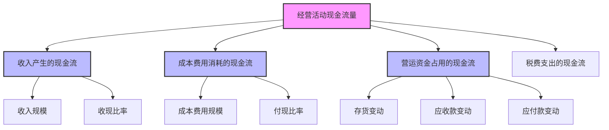
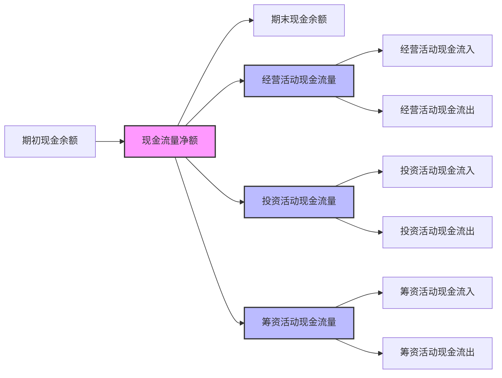

---
{"dg-publish":true,"tags":["财务BI","数据模型","指标体系","现金流","流动性"],"aliases":["现金流指标体系","现金流量分析"],"permalink":"/知识共享/001_财务/02_财务BI看板项目/数据模型设计/指标体系设计/现金流相关指标/","dgPassFrontmatter":true}
---

# 现金流相关指标

## 概述

现金流相关指标是衡量企业流动性和财务健康状况的关键指标体系，直接反映企业创造和使用现金的能力。本文档系统梳理了现金流量表各部分相关指标及其分析应用，为企业现金流管理与分析提供指标支持。

## 基础现金流指标

| 指标名称 | 计算公式 | 指标含义 | 应用场景 | 展示建议 |
| ---- | ---- | ---- | ---- | ---- |
| 经营活动现金流量净额 | 经营活动现金流入-经营活动现金流出 | 主营业务创造现金能力 | 经营质量分析 | 趋势图、与净利润对比 |
| 投资活动现金流量净额 | 投资活动现金流入-投资活动现金流出 | 投资扩张或收缩状况 | 投资分析 | 趋势图、构成分析 |
| 筹资活动现金流量净额 | 筹资活动现金流入-筹资活动现金流出 | 融资状况与股利支付 | 融资分析 | 趋势图、构成分析 |
| 现金流量净额 | 经营+投资+筹资活动现金流量净额 | 现金整体变动情况 | 整体现金流分析 | 瀑布图、趋势图 |
| 自由现金流量 | 经营活动现金流量净额-资本支出 | 企业可自由支配现金 | 债务偿还/分红能力 | 趋势图、目标对比 |

## 经营活动现金流指标

| 指标名称 | 计算公式 | 指标含义 | 应用场景 | 展示建议 |
| ---- | ---- | ---- | ---- | ---- |
| 销售商品收到的现金 | 直接获取 | 销售回款情况 | 销售回款分析 | 趋势图、与收入对比 |
| 经营活动现金流入 | 直接获取 | 经营获取现金总量 | 经营活动分析 | 趋势图、构成分析 |
|.购买商品支付的现金 | 直接获取 | 采购付款情况 | 供应链分析 | 趋势图、与成本对比 |
| 支付给员工的现金 | 直接获取 | 人力成本支出 | 人力成本分析 | 趋势图、与人员对比 |
| 支付的税费 | 直接获取 | 税费支出情况 | 税务成本分析 | 趋势图、与利润对比 |
| 经营活动现金流出 | 直接获取 | 经营消耗现金总量 | 经营活动分析 | 趋势图、构成分析 |

## 现金流效率与质量指标

| 指标名称 | 计算公式 | 指标含义 | 应用场景 | 展示建议 |
| ---- | ---- | ---- | ---- | ---- |
| 经营现金流量比率 | 经营活动现金流量净额/营业收入 | 收入转化为现金能力 | 收入质量分析 | 趋势图、阈值对比 |
| 现金流量充足率 | 经营活动现金流量净额/净利润 | 利润转现能力 | 盈利质量分析 | 趋势图、警戒线对比 |
| 现金收入比 | 销售商品收到的现金/营业收入 | 销售收现效率 | 收款政策分析 | 趋势图、目标对比 |
| 全部资产现金回收率 | 经营活动现金流量净额/平均资产总额 | 资产创现能力 | 资产效率分析 | 趋势图、同业对比 |
| 债务现金保障倍数 | 经营活动现金流量净额/本期到期债务 | 偿债保障能力 | 债务风险分析 | 趋势图、预警线 |

## 现金流结构指标

| 指标名称 | 计算公式 | 指标含义 | 应用场景 | 展示建议 |
| ---- | ---- | ---- | ---- | ---- |
| 经营现金流占比 | 经营活动现金流量净额/现金流入总额 | 经营活动贡献占比 | 现金来源分析 | 饼图、趋势图 |
| 投资现金流占比 | 投资活动现金流量净额/现金流入总额 | 投资活动影响占比 | 现金来源分析 | 饼图、趋势图 |
| 筹资现金流占比 | 筹资活动现金流量净额/现金流入总额 | 筹资活动贡献占比 | 现金来源分析 | 饼图、趋势图 |
| 资本支出率 | 资本支出/经营活动现金流量净额 | 再投资强度 | 增长分析 | 趋势图、阈值对比 |
| 现金股利支付率 | 分配股利支付的现金/经营活动现金流量净额 | 股东回报比例 | 分红政策分析 | 趋势图、目标对比 |

## 现金流预测与管理指标

| 指标名称 | 计算公式 | 指标含义 | 应用场景 | 展示建议 |
| ---- | ---- | ---- | ---- | ---- |
| 现金流预测准确率 | 1-\|实际值-预测值\|/预测值 | 预测模型精度 | 预测模型评估 | 趋势图、误差带 |
| 现金周转周期 | 存货周转天数+应收账款周转天数-应付账款周转天数 | 现金占用时间 | 营运资金管理 | 趋势图、构成分析 |
| 现金缺口 | 预计现金流出-预计现金流入-期初现金余额 | 现金缺口规模 | 融资规划 | 趋势图、阈值预警 |
| 现金余额充足率 | 货币资金/(月均经营现金流出×安全系数) | 现金储备充足度 | 流动性管理 | 仪表盘、警戒线 |
| 现金流波动系数 | 现金流量标准差/现金流量平均值 | 现金流稳定性 | 风险评估 | 趋势图、阈值对比 |

## 行业特殊现金流指标

### 制造业

| 指标名称 | 计算公式 | 指标含义 | 应用场景 | 展示建议 |
| ---- | ---- | ---- | ---- | ---- |
| 单位产品现金成本 | 经营活动现金流出/产量 | 生产单位产品耗现 | 成本控制 | 趋势图、目标对比 |
| 设备投资回收期 | 设备投资额/年均现金流增加额 | 投资回收时间 | 投资决策 | 历史对比、项目排序 |

### 零售业

| 指标名称 | 计算公式 | 指标含义 | 应用场景 | 展示建议 |
| ---- | ---- | ---- | ---- | ---- |
| 每平米现金创造额 | 经营活动现金流量净额/经营面积 | 单位面积创现能力 | 门店评估 | 对比分析、热力图 |
| 现金流旺季指数 | 旺季现金流/年均现金流 | 季节性特征 | 资金规划 | 季节波动图 |

### 互联网企业

| 指标名称 | 计算公式 | 指标含义 | 应用场景 | 展示建议 |
| ---- | ---- | ---- | ---- | ---- |
| 获客现金成本 | 营销相关现金支出/新增用户数 | 获取用户成本 | 营销效率分析 | 趋势图、渠道对比 |
| 用户现金贡献 | 用户相关现金流入/活跃用户数 | 用户价值 | 用户价值分析 | 趋势图、分群对比 |

## 现金流分析模型

### 因素分解模型

### 现金流量表结构

## 现金流预警机制

| 预警级别 | 触发条件 | 预警内容 | 建议措施 |
| ---- | ---- | ---- | ---- |
| 红色预警 | 经营现金流连续两期为负 | 经营现金流恶化 | 审查收款政策、控制采购支出 |
| 橙色预警 | 现金余额低于月均支出的1.5倍 | 现金储备不足 | 加强回款催收、延缓非必要支出 |
| 黄色预警 | 经营现金流/净利润<0.8 | 盈利质量下降 | 分析应收账款和存货状况 |
| 蓝色预警 | 现金流波动系数>0.5 | 现金流波动较大 | 平滑现金流入流出时间 |

## 看板设计应用

1. **现金流概览看板**：展示主要现金流量指标及趋势
   - 三大活动现金流趋势图
   - 现金流构成饼图
   - 现金流量与净利润对比图

2. **经营现金流分析看板**：聚焦经营活动现金创造能力
   - 经营现金流构成明细
   - 收入与现金流对比分析
   - 现金流质量指标监控

3. **现金流预测看板**：提供未来现金流预测
   - 滚动现金流预测图
   - 现金缺口分析
   - 敏感性分析

4. **资金需求看板**：分析未来资金需求
   - 未来债务到期分布
   - 资本支出计划与现金流匹配
   - 营运资金需求预测 