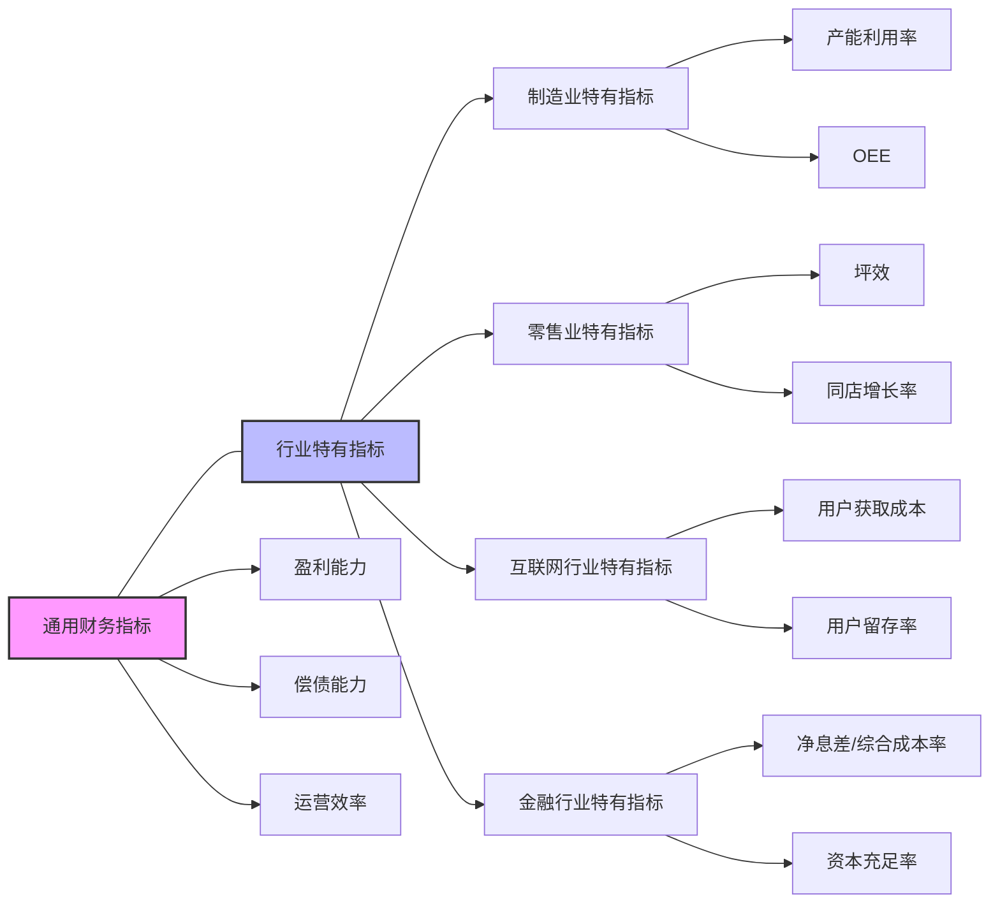

---
{"dg-publish":true,"tags":["财务BI","数据模型","指标体系","行业指标","行业分析"],"aliases":["行业财务指标","特定行业KPI"],"permalink":"/知识共享/001_财务/02_财务BI看板项目/数据模型设计/指标体系设计/行业特定指标/","dgPassFrontmatter":true}
---

# 行业特定指标

## 概述

行业特定指标是针对不同行业特点和运营模式定制的财务与运营指标体系，用于反映特定行业内企业的经营状况和竞争力。由于行业间商业模式、资产结构、成本构成等方面的差异，通用财务指标往往无法完全满足分析需求，需要结合行业特性设计专属指标。本文档系统梳理了主要行业的特定指标体系，为行业化财务BI看板提供指标支持。

## 制造业特定指标

### 生产效率指标

| 指标名称 | 计算公式 | 指标含义 | 应用场景 | 展示建议 |
| ---- | ---- | ---- | ---- | ---- |
| 产能利用率 | 实际产量/设计产能 | 产能利用效率 | 产能规划分析 | 仪表盘、产线对比 |
| 设备综合效率(OEE) | 可用性×绩效×质量 | 设备整体效率 | 设备管理分析 | 雷达图、设备对比 |
| 单位产品人工成本 | 直接人工成本/产量 | 人力利用效率 | 生产效率分析 | 趋势图、产品对比 |
| 单位产品能耗 | 能源消耗量/产量 | 能源利用效率 | 节能分析 | 趋势图、行业基准对比 |
| 物料消耗率 | 实际耗用量/标准耗用量 | 物料利用效率 | 成本控制分析 | 趋势图、物料对比 |
| 生产周期 | 产品完工时间-生产开始时间 | 生产速度 | 生产计划分析 | 趋势图、产品对比 |
| 直接人工生产率 | 产量/直接人工工时 | 人工效率 | 人效分析 | 趋势图、部门对比 |

### 质量与供应链指标

| 指标名称 | 计算公式 | 指标含义 | 应用场景 | 展示建议 |
| ---- | ---- | ---- | ---- | ---- |
| 一次合格率 | 一次合格产品数/总产品数 | 产品质量水平 | 质量分析 | 趋势图、产线对比 |
| 质量成本率 | 质量成本/销售收入 | 质量管理投入 | 质量管理分析 | 趋势图、构成分析 |
| 供应商按时交付率 | 按时交付批次数/总交付批次数 | 供应链稳定性 | 供应商管理 | 热力图、供应商排名 |
| 供应商合格率 | 合格供应批次/总供应批次 | 供应质量水平 | 供应商质量分析 | 趋势图、物料分类 |
| 库存周转天数 | 365/存货周转率 | 库存运营效率 | 库存管理分析 | 趋势图、物料分析 |
| 生产计划达成率 | 实际产量/计划产量 | 计划执行能力 | 生产计划分析 | 趋势图、产品分析 |
| 产品研发周期 | 上市时间-立项时间 | 研发速度 | 研发管理分析 | 趋势图、产品对比 |

## 零售业特定指标

### 销售与门店指标

| 指标名称 | 计算公式 | 指标含义 | 应用场景 | 展示建议 |
| ---- | ---- | ---- | ---- | ---- |
| 同店销售增长率 | (本期同店销售额-去年同期销售额)/去年同期销售额 | 存量店铺增长 | 门店分析 | 趋势图、区域热力图 |
| 坪效 | 销售额/销售面积 | 单位面积产出 | 空间效率分析 | 条形图、门店排名 |
| 客单价 | 销售额/客流量 | 单次消费金额 | 营销效果分析 | 趋势图、品类分析 |
| 交叉销售率 | 购买多品类顾客数/总顾客数 | 关联销售成功率 | 商品组合分析 | 趋势图、促销分析 |
| 库存周转天数 | 365/存货周转率 | 库存周转效率 | 库存管理分析 | 趋势图、品类分析 |
| 存货损耗率 | 商品损耗金额/平均库存金额 | 库存管理质量 | 库存管理分析 | 热力图、门店对比 |
| 促销投入产出比 | 促销增量销售额/促销费用 | 促销效率 | 促销效果分析 | 散点图、促销活动对比 |

### 会员与全渠道指标

| 指标名称 | 计算公式 | 指标含义 | 应用场景 | 展示建议 |
| ---- | ---- | ---- | ---- | ---- |
| 会员销售占比 | 会员销售额/总销售额 | 会员贡献度 | 会员价值分析 | 趋势图、层级分析 |
| 会员活跃率 | 活跃会员数/总会员数 | 会员活跃度 | 会员管理分析 | 趋势图、层级分析 |
| 会员复购率 | 复购会员数/总会员数 | 会员忠诚度 | 会员忠诚度分析 | 趋势图、商品分析 |
| 会员年度价值 | 会员年消费额/会员数 | 会员平均价值 | 会员价值分析 | 分布图、层级分析 |
| 线上销售占比 | 线上渠道销售额/总销售额 | 线上渠道贡献 | 渠道分析 | 趋势图、品类分析 |
| 全渠道转化率 | 线上引流到店消费人数/线上浏览人数 | 全渠道协同效果 | 全渠道分析 | 趋势图、活动分析 |
| 到店转化率 | 成交顾客数/客流量 | 进店转化效率 | 门店运营分析 | 趋势图、门店排名 |

## 互联网与科技行业指标

### 用户与收入指标

| 指标名称 | 计算公式 | 指标含义 | 应用场景 | 展示建议 |
| ---- | ---- | ---- | ---- | ---- |
| 日活跃用户数(DAU) | 日独立活跃用户数 | 日常活跃规模 | 用户活跃分析 | 趋势图、功能分析 |
| 月活跃用户数(MAU) | 月独立活跃用户数 | 月度活跃规模 | 用户活跃分析 | 趋势图、渠道分析 |
| DAU/MAU比率 | DAU/MAU | 用户粘性指标 | 用户粘性分析 | 趋势图、产品对比 |
| 用户获取成本(CAC) | 获客营销支出/新增用户数 | 获客效率 | 营销效率分析 | 趋势图、渠道对比 |
| 每用户平均收入(ARPU) | 收入/活跃用户数 | 用户价值 | 产品定价分析 | 趋势图、区域对比 |
| 付费用户比例 | 付费用户数/总用户数 | 转化效果 | 商业模式分析 | 趋势图、产品对比 |
| 用户留存率 | 特定时段后仍活跃用户数/初始用户数 | 用户留存能力 | 产品粘性分析 | 热力图、同期群分析 |

### 增长与盈利指标

| 指标名称 | 计算公式 | 指标含义 | 应用场景 | 展示建议 |
| ---- | ---- | ---- | ---- | ---- |
| 客户生命周期价值(LTV) | 用户生命周期内总收入 | 用户长期价值 | 用户价值分析 | 分布图、渠道对比 |
| LTV/CAC比率 | 客户生命周期价值/获客成本 | 获客投资回报 | 营销效率分析 | 趋势图、部门对比 |
| 收入增长率 | (本期收入-上期收入)/上期收入 | 业务增长速度 | 增长分析 | 趋势图、产品对比 |
| 研发费用占比 | 研发费用/营业收入 | 研发投入强度 | 创新能力分析 | 趋势图、行业对比 |
| 续费率 | 续费用户数/到期用户数 | 续订能力 | 订阅业务分析 | 趋势图、产品对比 |
| 员工人均收入 | 营业收入/员工数 | 人效产出 | 组织效率分析 | 散点图、部门对比 |
| 现金消耗率 | 经营现金流出/现金余额 | 资金可持续性 | 现金流管理 | 趋势图、预警线 |

## 金融行业特定指标

### 银行业指标

| 指标名称 | 计算公式 | 指标含义 | 应用场景 | 展示建议 |
| ---- | ---- | ---- | ---- | ---- |
| 净息差(NIM) | 利息净收入/生息资产平均余额 | 利息收益水平 | 盈利能力分析 | 趋势图、同业对比 |
| 成本收入比 | 营业费用/营业收入 | 成本控制水平 | 效率分析 | 趋势图、业务线分析 |
| 不良贷款率 | 不良贷款余额/贷款总额 | 资产质量状况 | 风险管理分析 | 热力图、产品分析 |
| 拨备覆盖率 | 贷款损失准备金/不良贷款余额 | 风险抵补能力 | 风险缓冲分析 | 趋势图、预警线 |
| 资本充足率 | 资本总额/风险加权资产 | 资本安全性 | 资本管理分析 | 趋势图、监管线 |
| 流动性覆盖率 | 优质流动性资产/短期现金流出 | 短期流动性 | 流动性风险分析 | 趋势图、监管线 |
| 净稳定资金比例 | 可用稳定资金/所需稳定资金 | 长期流动性 | 资金结构分析 | 趋势图、监管线 |

### 保险业指标

| 指标名称 | 计算公式 | 指标含义 | 应用场景 | 展示建议 |
| ---- | ---- | ---- | ---- | ---- |
| 综合成本率 | (赔付支出+费用)/已赚保费 | 承保盈利能力 | 承保利润分析 | 趋势图、产品分析 |
| 赔付率 | 赔付支出/已赚保费 | 赔付水平 | 理赔管理分析 | 趋势图、险种分析 |
| 费用率 | 承保费用/保费收入 | 成本控制水平 | 效率分析 | 趋势图、渠道分析 |
| 续保率 | 续保保费/到期保费 | 客户留存能力 | 客户管理分析 | 趋势图、产品分析 |
| 新业务价值率 | 新业务价值/首年保费 | 新业务质量 | 业务发展分析 | 趋势图、渠道分析 |
| 偿付能力充足率 | 实际资本/最低资本 | 资本充足性 | 资本管理分析 | 趋势图、监管线 |
| 投资收益率 | 投资收益/平均投资资产 | 投资能力 | 资产管理分析 | 趋势图、产品对比 |

## 医疗健康行业指标

### 医院与医疗服务指标

| 指标名称 | 计算公式 | 指标含义 | 应用场景 | 展示建议 |
| ---- | ---- | ---- | ---- | ---- |
| 床位使用率 | 实际占用床日数/可用床日数 | 资源利用效率 | 资源配置分析 | 热力图、科室对比 |
| 平均住院日 | 总住院日数/出院人次 | 治疗效率 | 医疗质量分析 | 趋势图、疾病对比 |
| 门诊人均费用 | 门诊收入/门诊人次 | 门诊收费水平 | 收费结构分析 | 趋势图、科室对比 |
| 住院人均费用 | 住院收入/出院人次 | 住院收费水平 | 收费结构分析 | 趋势图、疾病对比 |
| 药占比 | 药品收入/医疗收入 | 药品收入比重 | 收入结构分析 | 趋势图、科室对比 |
| 病床周转次数 | 出院人次/平均开放床位数 | 床位利用效率 | 资源效率分析 | 趋势图、科室排名 |
| 手术室使用率 | 手术时间/可用手术室时间 | 手术资源利用 | 资源配置分析 | 热力图、时段分析 |

### 医药行业指标

| 指标名称 | 计算公式 | 指标含义 | 应用场景 | 展示建议 |
| ---- | ---- | ---- | ---- | ---- |
| 研发投入比例 | 研发费用/营业收入 | 研发强度 | 创新能力分析 | 趋势图、同业对比 |
| 新产品销售占比 | 新产品销售额/总销售额 | 创新贡献度 | 产品结构分析 | 趋势图、产品分析 |
| 医保报销比例 | 医保报销品种销售额/总销售额 | 医保依赖度 | 政策风险分析 | 趋势图、产品分析 |
| 专利产品收入占比 | 专利产品销售额/总销售额 | 专利保护水平 | 产品结构分析 | 趋势图、产品分析 |
| 研发管线产品数 | 各阶段研发产品总数 | 未来产品储备 | 发展潜力分析 | 漏斗图、阶段分析 |
| 销售费用率 | 销售费用/营业收入 | 营销效率 | 渠道效率分析 | 趋势图、区域对比 |
| 生产合格率 | 合格批次/总生产批次 | 生产质量水平 | 质量管理分析 | 趋势图、产品分析 |

## 房地产行业指标

### 开发经营指标

| 指标名称 | 计算公式 | 指标含义 | 应用场景 | 展示建议 |
| ---- | ---- | ---- | ---- | ---- |
| 土地储备周转率 | 年度开工面积/期末土地储备面积 | 土地利用效率 | 土地资源分析 | 趋势图、区域对比 |
| 开发周期 | 竣工时间-开工时间 | 开发速度 | 项目管理分析 | 趋势图、项目分类 |
| 销售回款率 | 销售回款额/合同销售额 | 回款效率 | 资金管理分析 | 趋势图、项目对比 |
| 存货周转天数 | 365/(开发成本/平均存货) | 存货周转效率 | 存货管理分析 | 趋势图、类型分析 |
| 租售比 | 租金收入/销售收入 | 经营结构 | 业务模式分析 | 趋势图、项目分析 |
| 净负债率 | (有息负债-现金)/股东权益 | 杠杆水平 | 财务风险分析 | 趋势图、预警线 |
| 利息保障倍数 | EBITDA/利息支出 | 偿债能力 | 偿债风险分析 | 趋势图、预警线 |

### 项目盈利指标

| 指标名称 | 计算公式 | 指标含义 | 应用场景 | 展示建议 |
| ---- | ---- | ---- | ---- | ---- |
| 项目销售均价 | 项目销售额/销售面积 | 价格水平 | 定价分析 | 热力图、项目对比 |
| 土地成本占比 | 土地成本/销售收入 | 土地成本比重 | 成本结构分析 | 趋势图、项目对比 |
| 建安成本占比 | 建安成本/销售收入 | 建设成本比重 | 成本结构分析 | 趋势图、项目对比 |
| 销售费用占比 | 销售费用/销售收入 | 销售成本控制 | 营销效率分析 | 趋势图、区域对比 |
| 项目毛利率 | (销售收入-销售成本)/销售收入 | 项目盈利能力 | 项目利润分析 | 条形图、项目排名 |
| 投资回报率(ROI) | 项目净利润/项目总投资 | 投资回报水平 | 投资效益分析 | 散点图、项目分布 |
| 资金周转率 | 年销售额/平均占用资金 | 资金利用效率 | 资金效率分析 | 趋势图、项目对比 |

## 行业指标组合应用

### 跨行业指标比较

### 行业指标映射与转化

| 通用指标 | 制造业映射 | 零售业映射 | 互联网行业映射 | 金融行业映射 |
| ---- | ---- | ---- | ---- | ---- |
| 收入增长率 | 产量增长率 | 同店销售增长率 | 用户增长率 | 保费/贷款增长率 |
| 毛利率 | 单位产品毛利 | 品类毛利率 | ARPU | 净息差/承保利润率 |
| 资产周转率 | 设备利用率 | 存货周转率 | 服务器利用率 | 资本利用率 |
| 现金流量 | 生产现金流量 | 门店现金流量 | 获客/留存现金流 | 承保/投资现金流 |
| 人效 | 人均产量 | 人均销售额 | 人均用户数 | 人均创收 |

## 看板设计应用

1. **行业标杆对比看板**：对比企业与行业标杆的关键指标
   - 行业核心指标对标分析
   - 差距分解与原因剖析
   - 改进空间与目标设定

2. **行业特定预警看板**：针对行业特性设置预警
   - 行业特有风险指标监控
   - 阈值预警与异常提示
   - 风险影响评估

3. **行业趋势分析看板**：展示行业关键指标趋势
   - 行业景气指标追踪
   - 企业与行业同步性分析
   - 趋势预测与应对建议

4. **行业竞争力分析看板**：分析企业在行业中的竞争优势
   - 核心竞争力指标对比
   - 相对市场地位评估
   - 竞争优势维持策略 