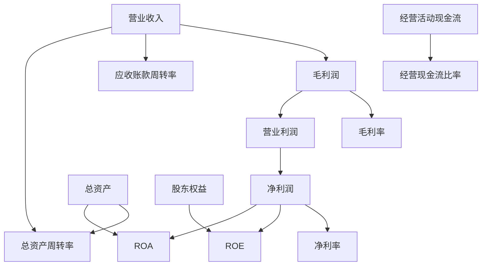

---
{"dg-publish":true,"tags":["财务BI","数据模型","指标体系","核心指标","KPI"],"aliases":["财务关键指标","财务KPI体系"],"permalink":"/知识共享/001_财务/02_财务BI看板项目/数据模型设计/指标体系设计/财务核心指标体系/","dgPassFrontmatter":true}
---

# 财务核心指标体系

## 概述

财务核心指标体系是财务BI看板的基础，通过系统化的指标结构反映企业财务状况、经营效益和发展趋势。本文档定义了常用的财务核心指标，包括计算方法、适用场景和展示建议。

## 指标分类体系

### 1. 盈利能力指标

| 指标名称 | 计算公式 | 指标含义 | 适用场景 | 展示方式 |
| ---- | ---- | ---- | ---- | ---- |
| 毛利率 | (营业收入-营业成本)/营业收入 | 衡量产品基础盈利能力 | 产品线分析、定价策略 | 趋势图、分组条形图 |
| 净利率 | 净利润/营业收入 | 反映企业整体盈利水平 | 公司整体盈利分析 | 趋势图、目标对比 |
| EBITDA利润率 | EBITDA/营业收入 | 剔除折旧摊销影响的盈利能力 | 跨行业比较、并购分析 | 趋势图、同业对比 |
| ROE | 净利润/平均股东权益 | 股东投入资本回报率 | 投资回报分析 | 趋势图、目标对比 |
| ROA | 净利润/平均总资产 | 资产创造收益能力 | 资产效率分析 | 趋势图、同业对比 |

### 2. 运营效率指标

| 指标名称 | 计算公式 | 指标含义 | 适用场景 | 展示方式 |
| ---- | ---- | ---- | ---- | ---- |
| 存货周转率 | 营业成本/平均存货 | 存货运营效率 | 库存管理分析 | 趋势图、同业对比 |
| 应收账款周转率 | 营业收入/平均应收账款 | 应收账款管理效率 | 信用政策分析 | 趋势图、账龄分析 |
| 总资产周转率 | 营业收入/平均总资产 | 资产利用效率 | 资产管理分析 | 趋势图、部门对比 |
| 经营周期 | 存货周转天数+应收账款周转天数 | 业务循环所需时间 | 运营效率分析 | 趋势图、组成分析 |

### 3. 偿债能力指标

| 指标名称 | 计算公式 | 指标含义 | 适用场景 | 展示方式 |
| ---- | ---- | ---- | ---- | ---- |
| 流动比率 | 流动资产/流动负债 | 短期偿债能力 | 流动性风险分析 | 趋势图、阈值对比 |
| 速动比率 | (流动资产-存货)/流动负债 | 即时偿债能力 | 短期债务风险分析 | 趋势图、阈值对比 |
| 资产负债率 | 总负债/总资产 | 长期偿债能力 | 财务结构分析 | 趋势图、行业基准 |
| 利息保障倍数 | EBIT/利息费用 | 偿还利息能力 | 债务风险分析 | 趋势图、预警线 |

### 4. 成长性指标

| 指标名称 | 计算公式 | 指标含义 | 适用场景 | 展示方式 |
| ---- | ---- | ---- | ---- | ---- |
| 营收增长率 | (本期收入-上期收入)/上期收入 | 业务规模扩张速度 | 业务增长分析 | 趋势图、目标对比 |
| 净利润增长率 | (本期净利-上期净利)/上期净利 | 盈利能力提升速度 | 盈利增长分析 | 趋势图、目标对比 |
| 总资产增长率 | (期末资产-期初资产)/期初资产 | 企业规模扩张速度 | 规模扩张分析 | 趋势图、历史对比 |

### 5. 现金流指标

| 指标名称 | 计算公式 | 指标含义 | 适用场景 | 展示方式 |
| ---- | ---- | ---- | ---- | ---- |
| 经营现金流比率 | 经营活动现金流/营业收入 | 收入转化为现金能力 | 现金创造分析 | 趋势图、阈值对比 |
| 现金流量比率 | 经营活动现金流/流动负债 | 偿债能力与质量 | 流动性风险分析 | 趋势图、阈值对比 |
| 现金循环周期 | 存货周转天数+应收账款周转天数-应付账款周转天数 | 现金占用时间 | 运营资金管理 | 趋势图、构成分析 |

## 核心指标联动关系

## 指标展示优先级

根据管理层级和关注重点，推荐以下展示优先级：

### 高管层级
- 净利率、ROE、营收增长率、经营现金流比率

### 财务经理层级
- 毛利率、费用率、资产负债率、现金循环周期

### 业务经理层级
- 部门收入达成率、成本控制率、相关周转率指标

## 看板应用建议

1. **仪表板顶层**：选择3-5个最核心指标（如净利率、ROE、营收增长率）作为顶层监控
2. **二级分析**：按业务条线、产品线展开核心财务指标
3. **定期对比**：设置同比、环比、预算对比等多维度分析视角
4. **预警机制**：为关键指标设置阈值，超出范围时视觉强调提示
5. **联动钻取**：从核心指标可下钻至更详细的组成分析 