---
{"dg-publish":true,"tags":["财务BI","数据模型","指标体系","资产负债","财务结构"],"aliases":["资产负债指标体系","资产负债表分析"],"permalink":"/知识共享/001_财务/02_财务BI看板项目/数据模型设计/指标体系设计/资产负债相关指标/","dgPassFrontmatter":true}
---

# 资产负债相关指标

## 概述

资产负债相关指标是反映企业财务状况、资金结构和偿债能力的核心指标体系，基于资产负债表数据构建，用于评估企业的财务稳健性、资金利用效率和长短期偿债风险。本文档系统梳理了资产负债分析的关键指标及其应用场景，为财务结构分析提供指标支持。

## 资产结构指标

| 指标名称 | 计算公式 | 指标含义 | 应用场景 | 展示建议 |
| ---- | ---- | ---- | ---- | ---- |
| 流动资产比率 | 流动资产/总资产 | 短期资产占比 | 资产结构分析 | 饼图、趋势图 |
| 非流动资产比率 | 非流动资产/总资产 | 长期资产占比 | 资产结构分析 | 饼图、趋势图 |
| 货币资金比率 | 货币资金/总资产 | 现金类资产占比 | 流动性分析 | 趋势图、行业对比 |
| 应收账款比率 | 应收账款/总资产 | 应收账款占比 | 信用政策分析 | 趋势图、预警线 |
| 存货比率 | 存货/总资产 | 存货资金占用比例 | 库存管理分析 | 趋势图、行业对比 |
| 固定资产比率 | 固定资产/总资产 | 固定资产投入比例 | 投资结构分析 | 趋势图、部门对比 |
| 无形资产比率 | 无形资产/总资产 | 无形资产价值占比 | 知识产权分析 | 趋势图、同业对比 |

## 负债结构指标

| 指标名称 | 计算公式 | 指标含义 | 应用场景 | 展示建议 |
| ---- | ---- | ---- | ---- | ---- |
| 流动负债比率 | 流动负债/负债总额 | 短期负债占比 | 负债结构分析 | 饼图、趋势图 |
| 非流动负债比率 | 非流动负债/负债总额 | 长期负债占比 | 负债结构分析 | 饼图、趋势图 |
| 短期借款比率 | 短期借款/负债总额 | 短期借款依赖度 | 短期偿债风险分析 | 趋势图、预警线 |
| 应付账款比率 | 应付账款/负债总额 | 商业信用占比 | 供应商关系分析 | 趋势图、账期分析 |
| 长期借款比率 | 长期借款/负债总额 | 长期借款依赖度 | 长期融资结构分析 | 趋势图、期限分布 |
| 应付职工薪酬比率 | 应付职工薪酬/负债总额 | 人力成本负债占比 | 人力资源分析 | 趋势图、部门分析 |
| 应交税费比率 | 应交税费/负债总额 | 税务负债占比 | 税务管理分析 | 趋势图、税种分析 |

## 资本结构指标

| 指标名称 | 计算公式 | 指标含义 | 应用场景 | 展示建议 |
| ---- | ---- | ---- | ---- | ---- |
| 资产负债率 | 负债总额/资产总额 | 债务融资比例 | 偿债风险分析 | 趋势图、警戒线 |
| 权益乘数 | 资产总额/股东权益 | 财务杠杆水平 | 杠杆风险分析 | 趋势图、行业对比 |
| 产权比率 | 负债总额/股东权益 | 债权人与股东权益比 | 资本结构分析 | 趋势图、同业对比 |
| 长期资产适合率 | 长期资金/非流动资产 | 长期资金匹配度 | 资本配置分析 | 趋势图、阈值对比 |
| 长期负债比率 | 非流动负债/(非流动负债+股东权益) | 长期资本中负债占比 | 长期资本结构分析 | 趋势图、行业对比 |
| 有形净值债务率 | 负债总额/(股东权益-无形资产) | 实质资产负债水平 | 实质偿债能力分析 | 趋势图、警戒线 |

## 短期偿债能力指标

| 指标名称 | 计算公式 | 指标含义 | 应用场景 | 展示建议 |
| ---- | ---- | ---- | ---- | ---- |
| 流动比率 | 流动资产/流动负债 | 短期偿债能力 | 短期偿债风险分析 | 仪表盘、警戒线 |
| 速动比率 | (流动资产-存货)/流动负债 | 即时偿债能力 | 短期流动性分析 | 仪表盘、警戒线 |
| 现金比率 | 货币资金/流动负债 | 现金偿债能力 | 极端偿债风险分析 | 仪表盘、预警线 |
| 净营运资本 | 流动资产-流动负债 | 营运资金规模 | 营运资金管理 | 趋势图、目标对比 |
| 营运资本比率 | 净营运资本/总资产 | 营运资金占比 | 资产流动性分析 | 趋势图、行业对比 |
| 现金到期债务比 | 经营现金流量/本期到期债务 | 现金流偿债保障 | 偿债风险分析 | 趋势图、预警线 |

## 长期偿债能力指标

| 指标名称 | 计算公式 | 指标含义 | 应用场景 | 展示建议 |
| ---- | ---- | ---- | ---- | ---- |
| 利息保障倍数 | EBIT/利息费用 | 偿还利息能力 | 债务风险分析 | 趋势图、预警线 |
| 现金流量利息保障倍数 | 经营现金流量/利息费用 | 用现金流偿还利息能力 | 债务风险分析 | 趋势图、预警线 |
| 长期债务与营运资金比率 | 长期负债/净营运资本 | 长期债务与短期偿付能力匹配度 | 资本结构分析 | 趋势图、阈值对比 |
| 现金流量债务比 | 经营现金流量/负债总额 | 用现金流偿还债务能力 | 整体偿债能力分析 | 趋势图、同业对比 |
| 清算价值比率 | 可快速变现资产/负债总额 | 紧急清偿能力 | 极端情景测试 | 趋势图、阈值预警 |

## 资产质量指标

| 指标名称 | 计算公式 | 指标含义 | 应用场景 | 展示建议 |
| ---- | ---- | ---- | ---- | ---- |
| 应收账款周转率 | 营业收入/平均应收账款 | 应收账款回收效率 | 收款政策分析 | 趋势图、账龄分析 |
| 存货周转率 | 营业成本/平均存货 | 存货运营效率 | 库存管理分析 | 趋势图、产品分析 |
| 总资产周转率 | 营业收入/平均总资产 | 总资产利用效率 | 资产效率分析 | 趋势图、部门对比 |
| 固定资产周转率 | 营业收入/平均固定资产 | 固定资产利用效率 | 设备效率分析 | 趋势图、产线对比 |
| 流动资产周转率 | 营业收入/平均流动资产 | 流动资产利用效率 | 营运资金效率分析 | 趋势图、业务对比 |
| 坏账率 | 坏账准备/应收账款总额 | 应收账款质量 | 信用风险分析 | 趋势图、客户分析 |
| 存货跌价准备率 | 存货跌价准备/存货总额 | 存货质量 | 库存风险分析 | 趋势图、品类分析 |

## 增长与变动指标

| 指标名称 | 计算公式 | 指标含义 | 应用场景 | 展示建议 |
| ---- | ---- | ---- | ---- | ---- |
| 总资产增长率 | (期末资产-期初资产)/期初资产 | 企业规模扩张速度 | 成长性分析 | 趋势图、目标对比 |
| 固定资产增长率 | (期末固定资产-期初固定资产)/期初固定资产 | 产能扩张速度 | 投资分析 | 趋势图、项目明细 |
| 负债增长率 | (期末负债-期初负债)/期初负债 | 负债规模变化 | 杠杆变动分析 | 趋势图、构成分析 |
| 股东权益增长率 | (期末权益-期初权益)/期初权益 | 所有者权益变化 | 股东回报分析 | 趋势图、原因分析 |
| 营运资本增长率 | (期末营运资本-期初营运资本)/期初营运资本 | 营运资金需求变化 | 资金需求分析 | 趋势图、业务关联 |

## 资产负债表结构分析

```mermaid
graph TD
    A[资产总额] --> B[流动资产]
    A --> C[非流动资产]
    
    D[负债及股东权益] --> E[流动负债]
    D --> F[非流动负债]
    D --> G[股东权益]
    
    B --> B1[货币资金]
    B --> B2[应收账款]
    B --> B3[存货]
    B --> B4[其他流动资产]
    
    C --> C1[固定资产]
    C --> C2[无形资产]
    C --> C3[长期投资]
    C --> C4[其他非流动资产]
    
    E --> E1[短期借款]
    E --> E2[应付账款]
    E --> E3[其他流动负债]
    
    F --> F1[长期借款]
    F --> F2[应付债券]
    F --> F3[其他非流动负债]
    
    G --> G1[实收资本]
    G --> G2[资本公积]
    G --> G3[盈余公积]
    G --> G4[未分配利润]
    
    style A fill:#f9f,stroke:#333,stroke-width:2px
    style D fill:#f9f,stroke:#333,stroke-width:2px
    style B fill:#bbf,stroke:#333,stroke-width:2px
    style C fill:#bbf,stroke:#333,stroke-width:2px
    style E fill:#bbf,stroke:#333,stroke-width:2px
    style F fill:#bbf,stroke:#333,stroke-width:2px
    style G fill:#bbf,stroke:#333,stroke-width:2px
```

## 资产负债预警体系

| 风险类型 | 预警指标 | 预警阈值（示例） | 风险等级 | 应对建议 |
| ---- | ---- | ---- | ---- | ---- |
| 短期偿债风险 | 流动比率 | <1.0 | 高 | 优化资金结构，增加流动资产 |
| 短期偿债风险 | 速动比率 | <0.7 | 高 | 加速存货周转，提升现金储备 |
| 长期偿债风险 | 资产负债率 | >70% | 高 | 控制负债规模，增加股本融资 |
| 长期偿债风险 | 利息保障倍数 | <2.0 | 高 | 降低融资成本，提升盈利能力 |
| 资产质量风险 | 应收账款周转率 | 低于行业均值30% | 中 | 加强应收账款管理，调整信用政策 |
| 资产质量风险 | 存货周转率 | 低于行业均值30% | 中 | 优化库存管理，清理呆滞库存 |
| 资本配置风险 | 长期资产适合率 | <1.0 | 中 | 调整长期资金结构，匹配长期投资 |
| 增长风险 | 负债增长率>资产增长率 | 连续2期 | 中 | 控制负债增速，平衡发展规模 |

## 看板设计应用

1. **资产负债概览看板**：展示资产负债结构及变动趋势
   - 资产负债构成图
   - 资本结构演变图
   - 关键偿债指标仪表盘

2. **资产质量分析看板**：评估资产质量与利用效率
   - 各类资产周转率趋势
   - 资产质量风险指标
   - 资产收益贡献分析

3. **负债管理看板**：分析负债结构与风险
   - 负债期限结构分析
   - 债务成本分析
   - 未来到期债务分布

4. **资本结构优化看板**：提供资本结构优化建议
   - 最优资本结构模拟
   - 融资成本与风险分析
   - 资本回报效率分析

5. **财务风险预警看板**：监控关键财务风险指标
   - 偿债能力预警指标
   - 资产质量预警指标
   - 资本结构预警指标 