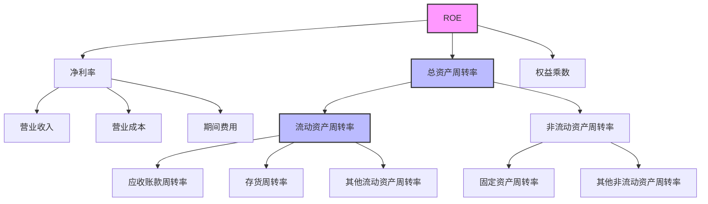
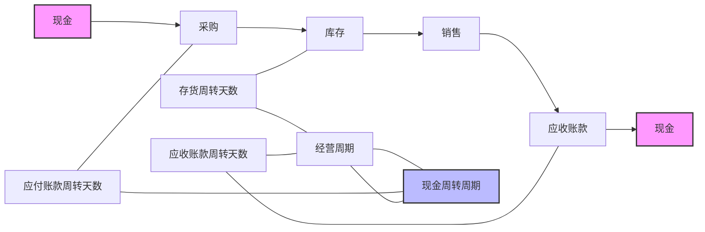

---
{"dg-publish":true,"tags":["财务BI","数据模型","指标体系","运营效率","周转率"],"aliases":["经营效率指标","运营能力指标"],"permalink":"/知识共享/001_财务/02_财务BI看板项目/数据模型设计/指标体系设计/运营效率指标/","dgPassFrontmatter":true}
---

# 运营效率指标

## 概述

运营效率指标是评估企业资源利用能力和经营管理水平的重要衡量标准，重点考察企业各类资产的运转效率、资金周转速度及业务流程效率。本文档系统梳理了运营效率分析的关键指标体系，为提升企业运营绩效提供数据支持和决策参考。

## 资产运营效率指标

| 指标名称 | 计算公式 | 指标含义 | 应用场景 | 展示建议 |
| ---- | ---- | ---- | ---- | ---- |
| 总资产周转率 | 营业收入/平均总资产 | 总体资产运营效率 | 整体效率分析 | 趋势图、同业对比 |
| 流动资产周转率 | 营业收入/平均流动资产 | 短期资产利用效率 | 营运资金效率分析 | 趋势图、部门对比 |
| 固定资产周转率 | 营业收入/平均固定资产 | 长期资产利用效率 | 产能利用分析 | 趋势图、产线对比 |
| 净资产周转率 | 营业收入/平均净资产 | 股东资本效率 | 资本效率分析 | 趋势图、投资回报分析 |
| 资源产出率 | 营业收入/资源投入 | 投入资源产出效率 | 资源配置分析 | 组合图表、投入产出分析 |

## 存货管理效率指标

| 指标名称 | 计算公式 | 指标含义 | 应用场景 | 展示建议 |
| ---- | ---- | ---- | ---- | ---- |
| 存货周转率 | 营业成本/平均存货 | 存货运营效率 | 库存管理分析 | 趋势图、产品分析 |
| 存货周转天数 | 365/存货周转率 | 存货周转一次所需天数 | 库存周期分析 | 趋势图、预警线 |
| 原材料周转率 | 原材料耗用/平均原材料 | 原材料利用效率 | 采购管理分析 | 趋势图、材料分类分析 |
| 在产品周转率 | 生产成本/平均在产品 | 生产过程效率 | 生产效率分析 | 趋势图、产线对比 |
| 产成品周转率 | 销售成本/平均产成品 | 产成品销售效率 | 销售效率分析 | 趋势图、产品对比 |
| 库存商品天数 | 库存商品/日均销售成本 | 商品可销售天数 | 销售计划分析 | 热力图、品类分析 |
| 呆滞库存率 | 呆滞库存金额/存货总额 | 库存质量状况 | 库存质量分析 | 趋势图、构成分析 |

## 应收账款管理效率指标

| 指标名称 | 计算公式 | 指标含义 | 应用场景 | 展示建议 |
| ---- | ---- | ---- | ---- | ---- |
| 应收账款周转率 | 营业收入/平均应收账款 | 应收账款回收效率 | 信用政策分析 | 趋势图、客户分析 |
| 应收账款周转天数 | 365/应收账款周转率 | 平均收款天数 | 回款管理分析 | 趋势图、账龄分析 |
| 应收账款账龄结构 | 各账龄段应收账款/应收账款总额 | 账龄分布情况 | 回款风险分析 | 堆叠柱状图、趋势图 |
| 逾期应收账款率 | 逾期应收账款/应收账款总额 | 逾期账款比例 | 信用风险分析 | 趋势图、预警线 |
| 坏账率 | 坏账损失/平均应收账款 | 坏账风险水平 | 信用风险管理 | 趋势图、客户分析 |
| 收款效率指数 | 实际回款天数/信用政策天数 | 回款及时性 | 收款绩效分析 | 仪表盘、部门对比 |

## 应付账款管理效率指标

| 指标名称 | 计算公式 | 指标含义 | 应用场景 | 展示建议 |
| ---- | ---- | ---- | ---- | ---- |
| 应付账款周转率 | 采购额/平均应付账款 | 付款频率 | 付款政策分析 | 趋势图、供应商分析 |
| 应付账款周转天数 | 365/应付账款周转率 | 平均付款天数 | 资金占用分析 | 趋势图、账期分析 |
| 供应商账期利用率 | 实际付款天数/供应商账期 | 商业信用利用效率 | 资金管理效率 | 热力图、供应商矩阵 |
| 提前付款比例 | 提前付款金额/应付账款总额 | 提前付款情况 | 现金折扣分析 | 趋势图、折扣分析 |
| 逾期付款率 | 逾期付款金额/应付账款总额 | 逾期付款比例 | 供应商关系管理 | 趋势图、预警监控 |

## 现金周期指标

| 指标名称 | 计算公式 | 指标含义 | 应用场景 | 展示建议 |
| ---- | ---- | ---- | ---- | ---- |
| 经营周期 | 存货周转天数+应收账款周转天数 | 资金投入周期 | 业务运营分析 | 趋势图、构成分析 |
| 现金周转周期 | 存货周转天数+应收账款周转天数-应付账款周转天数 | 现金占用时间 | 营运资金管理 | 趋势图、组成分析 |
| 现金周期缺口 | 现金周转周期×日均销售成本 | 运营资金需求 | 资金需求分析 | 趋势图、预测线 |
| 现金周期优化潜力 | 目标现金周期-实际现金周期 | 改进空间 | 运营优化分析 | 瀑布图、影响因素 |
| 现金周期行业对比 | 公司现金周期/行业均值 | 与行业的相对水平 | 竞争力分析 | 雷达图、同业对比 |

## 运营效率综合指标

| 指标名称 | 计算公式 | 指标含义 | 应用场景 | 展示建议 |
| ---- | ---- | ---- | ---- | ---- |
| 营业收入增长率 | (本期收入-上期收入)/上期收入 | 业务增长速度 | 业务发展分析 | 趋势图、目标对比 |
| 净资产收益率 | 净利润/平均净资产 | 股东资本回报率 | 投资效率分析 | 趋势图、同业对比 |
| 总资产收益率 | 净利润/平均总资产 | 整体资产回报率 | 资产效率分析 | 趋势图、部门对比 |
| 人均创收 | 营业收入/平均员工人数 | 人力资源产出效率 | 人效分析 | 趋势图、部门对比 |
| 人均利润 | 净利润/平均员工人数 | 人力资源盈利能力 | 人效分析 | 趋势图、同业对比 |
| 单位面积产出 | 营业收入/经营面积 | 空间利用效率 | 场地效率分析 | 热力图、区域对比 |
| 运营费用率 | 运营费用/营业收入 | 运营成本控制水平 | 成本效率分析 | 趋势图、部门对比 |

## 业务流程效率指标

| 指标名称 | 计算公式 | 指标含义 | 应用场景 | 展示建议 |
| ---- | ---- | ---- | ---- | ---- |
| 订单转化率 | 成交订单数/询盘数 | 销售转化效率 | 销售过程分析 | 趋势图、漏斗图 |
| 订单履行周期 | 交付时间-订单时间 | 订单处理速度 | 流程效率分析 | 趋势图、流程分析 |
| 采购周期 | 收货时间-采购申请时间 | 采购效率 | 采购管理分析 | 趋势图、物料分析 |
| 生产周期 | 产品完工时间-生产开始时间 | 生产效率 | 生产管理分析 | 趋势图、产品分析 |
| 库存周转次数 | 销售数量/平均库存数量 | 库存流转速度 | 库存管理分析 | 趋势图、产品分析 |
| 产能利用率 | 实际产量/设计产能 | 产能利用效率 | 生产计划分析 | 仪表盘、设备分析 |
| 交付准时率 | 准时交付订单数/总订单数 | 交付效率 | 客户服务分析 | 趋势图、预警监控 |
| 返工率 | 返工产品数/总产品数 | 质量管理效率 | 质量分析 | 趋势图、生产线对比 |

## 行业特殊运营效率指标

### 制造业

| 指标名称 | 计算公式 | 指标含义 | 应用场景 | 展示建议 |
| ---- | ---- | ---- | ---- | ---- |
| 设备效率(OEE) | 可用性×绩效×质量 | 设备综合效率 | 生产效率分析 | 仪表盘、设备对比 |
| 物料转换率 | 产成品数量/原材料投入量 | 材料利用效率 | 生产效率分析 | 趋势图、材料分析 |
| 生产线平衡率 | 最低工位产出/最高工位产出 | 生产线均衡度 | 生产线优化 | 条形图、工位分析 |

### 零售业

| 指标名称 | 计算公式 | 指标含义 | 应用场景 | 展示建议 |
| ---- | ---- | ---- | ---- | ---- |
| 坪效 | 营业收入/经营面积 | 单位面积创收能力 | 门店效率分析 | 热力图、门店排名 |
| 存货周转率 | 销售成本/平均库存 | 商品流转速度 | 商品管理分析 | 趋势图、品类分析 |
| 客单价 | 营业收入/客户数 | 单客户消费金额 | 营销效率分析 | 趋势图、促销分析 |

### 服务业

| 指标名称 | 计算公式 | 指标含义 | 应用场景 | 展示建议 |
| ---- | ---- | ---- | ---- | ---- |
| 客户转化率 | 成交客户数/接触客户数 | 销售转化效率 | 营销效率分析 | 漏斗图、阶段分析 |
| 客户留存率 | 重复购买客户数/总客户数 | 客户忠诚度 | 客户关系分析 | 趋势图、客群分析 |
| 员工产值 | 营业收入/员工数 | 人力资源效率 | 人效分析 | 散点图、员工分析 |

## 运营效率模型与分析框架

### 杜邦分析延伸框架

### 现金转换周期模型

## 运营效率优化方向

| 效率维度 | 关键指标 | 优化方向 | 潜在举措 |
| ---- | ---- | ---- | ---- |
| 存货管理 | 存货周转率 | 提高 | 优化库存结构、实施JIT管理、科学预测需求 |
| 应收账款管理 | 应收账款周转率 | 提高 | 改进信用政策、加强催收流程、提供提前付款折扣 |
| 应付账款管理 | 应付账款周转天数 | 延长(合理范围内) | 协商供应商账期、集中采购增加议价能力 |
| 固定资产管理 | 固定资产周转率 | 提高 | 优化产能配置、提高设备利用率、淘汰低效资产 |
| 人力资源效率 | 人均创收/利润 | 提高 | 优化人员结构、提供培训、改进激励机制 |
| 业务流程效率 | 订单履行周期 | 缩短 | 流程再造、消除瓶颈、信息系统支持 |

## 看板设计应用

1. **运营效率概览看板**：展示核心运营效率指标及趋势
   - 资产周转率仪表盘
   - 现金周转周期趋势图
   - 各类运营效率指标对比分析

2. **存货管理效率看板**：聚焦库存运营效率
   - 存货周转率分析
   - 库存结构优化
   - 库存预警监控

3. **应收应付管理看板**：分析应收应付账款管理效率
   - 应收账款账龄分析
   - 回款效率跟踪
   - 应付账款策略分析

4. **运营效率改进看板**：识别效率提升机会
   - 效率差距对比分析
   - 改进影响模拟
   - 优化措施追踪

5. **行业对标看板**：与行业标杆对比分析
   - 关键指标行业对标
   - 差距识别与分析
   - 最佳实践参考 