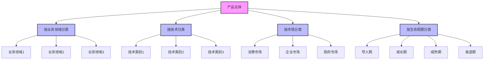
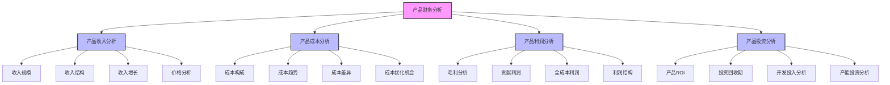
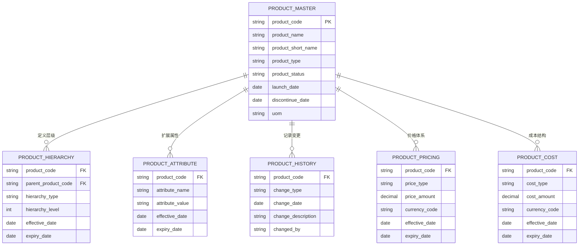

---
{"dg-publish":true,"tags":["财务BI","数据模型","维度设计","产品维度","数据分析"],"aliases":["产品结构维度","产品层级设计"],"permalink":"/知识共享/001_财务/02_财务BI看板项目/数据模型设计/数据维度设计/产品维度设计/","dgPassFrontmatter":true}
---

# 产品维度设计

## 概述

产品维度是财务BI系统中的核心业务维度，用于从产品角度分析企业的盈利能力、成本结构和市场表现。一个设计良好的产品维度体系能够支持从不同粒度和视角对产品进行财务分析，帮助企业了解各类产品的价值贡献，为产品组合优化、定价策略和资源分配提供决策依据。本文档系统梳理产品维度的设计方法和应用场景，为财务BI系统提供产品分析框架。

## 产品维度层级结构

### 标准产品层级模型

| 层级名称 | 维度属性 | 层级说明 | 应用场景 | 设计建议 |
| ---- | ---- | ---- | ---- | ---- |
| 产品线 | 产品线编码、名称、负责人 | 最高层产品集合 | 战略产品方向分析 | 与业务板块对应 |
| 产品族 | 产品族编码、名称、类别 | 相似产品集合 | 产品组合分析 | 基于技术或市场特性分组 |
| 产品系列 | 系列编码、名称、定位 | 同一系列不同型号 | 系列比较分析 | 基于价格或功能定位分类 |
| 产品 | 产品编码、名称、规格 | 标准销售单元 | 产品级财务分析 | 具有独立定价的销售单元 |
| 产品变体 | 变体编码、属性组合 | 同产品不同特性 | 细分市场分析 | 如颜色、规格、配置等变化 |
| SKU | SKU编码、名称、条码 | 库存管理基本单元 | 库存和销售分析 | 最小库存管理单位 |

### 多维产品分类体系

## 产品维度关键属性

### 基础属性

| 属性类别 | 属性名称 | 属性说明 | 设计考虑 |
| ---- | ---- | ---- | ---- |
| 标识属性 | 产品编码 | 唯一标识 | 设计有意义的编码规则 |
| 标识属性 | 产品名称 | 正式名称 | 支持多语言，考虑显示名和全称 |
| 标识属性 | 产品简称 | 简短名称 | 用于报表和图表展示 |
| 标识属性 | 产品条码 | 外部标识 | 如EAN、UPC等 |
| 分类属性 | 产品类别 | 所属类别 | 支持多种分类体系 |
| 分类属性 | 产品层级 | 产品层级关系 | 定义父子关系 |
| 状态属性 | 产品状态 | 在售状态 | 如：在售、停售、替代等 |
| 时间属性 | 上市日期 | 产品上市时间 | 用于生命周期分析 |
| 时间属性 | 停产日期 | 产品停产时间 | 用于退市分析 |

### 业务属性

| 属性类别 | 属性名称 | 属性说明 | 设计考虑 |
| ---- | ---- | ---- | ---- |
| 销售属性 | 销售单位 | 销售计量单位 | 如：个、套、箱等 |
| 销售属性 | 标准价格 | 基准售价 | 可设置多级价格体系 |
| 销售属性 | 目标客群 | 目标客户群体 | 客户细分标识 |
| 销售属性 | 销售渠道 | 销售渠道限制 | 渠道可售标识 |
| 生产属性 | 生产方式 | 生产模式 | 如：自产、OEM、ODM等 |
| 生产属性 | 生产周期 | 标准生产天数 | 用于生产计划分析 |
| 生产属性 | 生产基地 | 主要生产地 | 生产地区标识 |
| 财务属性 | 成本核算方法 | 成本计算方式 | 如：标准成本、实际成本等 |
| 财务属性 | 会计科目 | 关联会计科目 | 与总账对接 |
| 财务属性 | 税率 | 适用税率 | 税务分析用 |

### 扩展属性

| 属性类别 | 属性名称 | 属性说明 | 设计考虑 |
| ---- | ---- | ---- | ---- |
| 物理属性 | 重量 | 产品重量 | 物流分析用 |
| 物理属性 | 体积 | 产品体积 | 仓储分析用 |
| 技术属性 | 技术指标 | 关键技术参数 | 技术分析用 |
| 技术属性 | 质保期 | 保修期限 | 质保成本分析 |
| 市场属性 | 竞品信息 | 主要竞争产品 | 竞争分析用 |
| 市场属性 | 市场地位 | 市场份额等级 | 市场分析用 |
| 关联属性 | 替代产品 | 可替代的产品 | 产品转换分析 |
| 关联属性 | 配套产品 | 配套销售产品 | 交叉销售分析 |

## 产品维度历史与变更管理

| 变更类型 | 处理方式 | 数据影响 | 设计建议 |
| ---- | ---- | ---- | ---- |
| 产品新增 | 创建新产品记录 | 新增数据关联新产品 | 设置上市日期，记录生命起点 |
| 产品停售 | 更新产品状态 | 历史数据保持不变 | 设置停售日期，而非删除 |
| 产品替代 | 建立产品映射关系 | 历史数据保持原关联 | 记录替代关系，支持趋势分析 |
| 产品合并 | 一个存续，其他停售 | 历史数据各自保持 | 提供合并映射，支持合并分析 |
| 产品拆分 | 原产品停售，新增产品 | 新数据关联新产品 | 设计拆分比例，说明关系变化 |
| 产品属性变更 | 记录属性变更历史 | 根据时间确定适用属性 | 维护属性生效历史，支持时间点分析 |
| 产品层级变更 | 更新层级关系 | 汇总分析逻辑变化 | 记录层级变更历史，支持不同时期结构 |

## 产品维度设计原则

1. **业务对齐原则**：产品维度设计应与企业产品管理体系对齐，反映业务实际分类方式
2. **多视角原则**：支持多种产品分类视角，满足不同业务部门的分析需求
3. **稳定与灵活平衡**：核心产品结构保持稳定，同时支持灵活的分析视角
4. **统一编码原则**：在全企业范围内采用统一的产品编码体系
5. **历史追溯原则**：保留产品变更历史，支持任意时点的产品结构分析
6. **粒度适宜原则**：产品层级粒度设计应与分析需求和数据采集能力相匹配
7. **与主数据同步原则**：产品维度应与企业产品主数据保持同步，确保一致性

## 产品维度关联分析

### 与其他维度的关联

| 关联维度 | 关联方式 | 关联说明 | 应用场景 |
| ---- | ---- | ---- | ---- |
| 组织维度 | 产品-事业部映射 | 确定产品归属部门 | 部门产品组合分析 |
| 客户维度 | 产品-客户购买关系 | 建立产品与客户关系 | 客户产品偏好分析 |
| 渠道维度 | 产品-渠道可售性 | 确定渠道销售权限 | 渠道产品分析 |
| 供应商维度 | 产品-供应商关系 | 确定产品供应来源 | 采购策略分析 |
| 时间维度 | 产品-时间点事件 | 记录产品生命周期事件 | 产品生命周期分析 |
| 地域维度 | 产品-销售区域关系 | 确定产品销售区域 | 区域产品组合分析 |

### 产品维度财务分析框架

## 产品维度数据模型

### 实体关系模型

### 维度表设计示例

**产品主表(DIM_PRODUCT)**

| 字段名 | 数据类型 | 是否主键 | 描述 |
| ---- | ---- | ---- | ---- |
| PRODUCT_CODE | VARCHAR(50) | 是 | 产品编码 |
| PRODUCT_NAME | VARCHAR(200) | 否 | 产品名称 |
| PRODUCT_SHORT_NAME | VARCHAR(100) | 否 | 产品简称 |
| PRODUCT_DESCRIPTION | VARCHAR(500) | 否 | 产品描述 |
| PRODUCT_TYPE | VARCHAR(50) | 否 | 产品类型 |
| PRODUCT_CATEGORY | VARCHAR(50) | 否 | 产品类别 |
| PRODUCT_LINE | VARCHAR(50) | 否 | 产品线 |
| PRODUCT_FAMILY | VARCHAR(50) | 否 | 产品族 |
| PRODUCT_SERIES | VARCHAR(50) | 否 | 产品系列 |
| PRODUCT_STATUS | VARCHAR(20) | 否 | 产品状态 |
| UNIT_OF_MEASURE | VARCHAR(20) | 否 | 计量单位 |
| LAUNCH_DATE | DATE | 否 | 上市日期 |
| DISCONTINUE_DATE | DATE | 否 | 停产日期 |
| STD_COST | DECIMAL(18,4) | 否 | 标准成本 |
| LIST_PRICE | DECIMAL(18,4) | 否 | 标准价格 |
| BUSINESS_UNIT | VARCHAR(50) | 否 | 所属事业部 |
| PRODUCTION_TYPE | VARCHAR(50) | 否 | 生产方式 |
| LIFE_CYCLE_STAGE | VARCHAR(20) | 否 | 生命周期阶段 |
| IS_ACTIVE | CHAR(1) | 否 | 是否活跃 |
| CREATED_DATE | TIMESTAMP | 否 | 创建时间 |
| UPDATED_DATE | TIMESTAMP | 否 | 更新时间 |

## 产品维度应用场景

### 产品盈利能力分析

| 应用场景 | 实现方式 | 分析价值 | 展示建议 |
| ---- | ---- | ---- | ---- |
| 产品毛利分析 | 按产品维度计算毛利 | 识别高低毛利产品 | 散点图、排名表 |
| 产品线贡献分析 | 计算产品线利润贡献 | 评估产品线价值 | 瀑布图、贡献度图 |
| 产品组合优化 | 分析产品盈利组合 | 优化产品战略 | 波士顿矩阵、四象限图 |
| 产品生命周期利润 | 跟踪产品全生命周期利润 | 评估长期价值 | 生命周期曲线、累计利润图 |
| 产品定价分析 | 价格与利润关系分析 | 优化定价策略 | 价格弹性图、情景模拟 |

### 产品成本分析

| 应用场景 | 实现方式 | 分析价值 | 展示建议 |
| ---- | ---- | ---- | ---- |
| 产品成本构成 | 分解产品成本结构 | 了解成本驱动因素 | 堆叠图、树图 |
| 产品成本趋势 | 跟踪产品成本变化 | 控制成本上升 | 趋势图、预警线 |
| 产品间成本比较 | 同类产品成本对比 | 识别成本优化机会 | 雷达图、对比图 |
| 产品成本差异分析 | 计算标准成本与实际成本差异 | 控制生产偏差 | 差异对比表、帕累托图 |
| 产品目标成本分析 | 目标成本与实际对比 | 促进成本改进 | 目标差距图、进度仪表盘 |

### 产品投资分析

| 应用场景 | 实现方式 | 分析价值 | 展示建议 |
| ---- | ---- | ---- | ---- |
| 产品研发投资回报 | 计算产品ROI | 评估研发投资效益 | 回报率图、项目比较 |
| 产品开发效率 | 分析开发成本与时间 | 提升开发效率 | 效率对比图、趋势分析 |
| 产品资源分配 | 分析产品资源使用情况 | 优化资源分配 | 资源分配图、利用率分析 |
| 新品投资决策 | 新产品投资分析 | 支持投资决策 | 情景分析、决策矩阵 |
| 产能投资分析 | 产能与产品需求匹配 | 优化产能配置 | 产能利用率图、缺口分析 |

## 产品维度设计最佳实践

1. **业务驱动的设计**：
   - 深入了解企业产品管理模式和业务流程
   - 将产品维度设计与企业战略和管理需求对齐
   - 考虑不同部门对产品分析的差异化需求

2. **灵活的分类体系**：
   - 设计支持多种分类体系的产品结构
   - 实现业务视角、财务视角、市场视角等多视角分类
   - 建立分类体系之间的映射关系

3. **全生命周期管理**：
   - 记录产品从概念到退市的全生命周期事件
   - 支持按生命周期阶段的财务分析
   - 实现产品代际间的关联和趋势分析

4. **产品编码体系设计**：
   - 采用有意义的分层编码规则
   - 通过编码反映产品层级和分类信息
   - 预留编码空间，支持未来扩展

5. **历史数据管理**：
   - 实现产品版本控制和历史追溯
   - 记录产品属性和关系的变更历史
   - 支持按任意历史时点的产品结构分析

6. **主数据协同机制**：
   - 建立与企业产品主数据的同步机制
   - 确定产品数据权威来源和更新流程
   - 建立数据一致性检查和异常处理机制

## 产品维度分析应用示例

### 产品盈利能力看板

- **目标**：全面评估产品盈利能力，识别最具价值和亟待改进的产品
- **维度组合**：产品维度 × 时间维度 × 盈利指标
- **交互功能**：产品层级钻取、多维过滤、时间比较
- **展示方式**：产品盈利热力图、毛利率排名、产品组合矩阵

### 产品成本优化看板

- **目标**：识别产品成本改进机会，支持成本优化决策
- **维度组合**：产品维度 × 成本类型 × 时间维度
- **交互功能**：成本构成分析、标准与实际对比、趋势追踪
- **展示方式**：成本瀑布图、差异分析表、成本趋势预警

### 产品生命周期管理看板

- **目标**：管理产品生命周期财务表现，优化产品组合结构
- **维度组合**：产品维度 × 生命周期阶段 × 财务指标
- **交互功能**：生命周期模拟、产品替代分析、退市决策支持
- **展示方式**：生命周期矩阵、产品年龄分布、替代产品关系图 