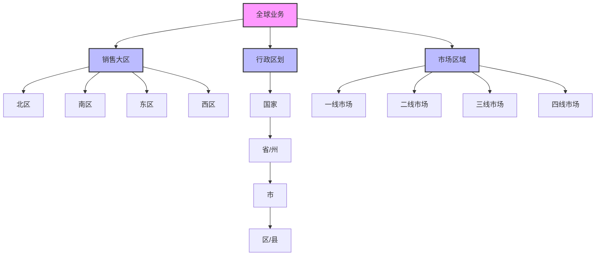
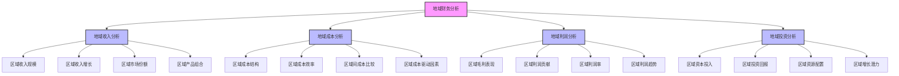
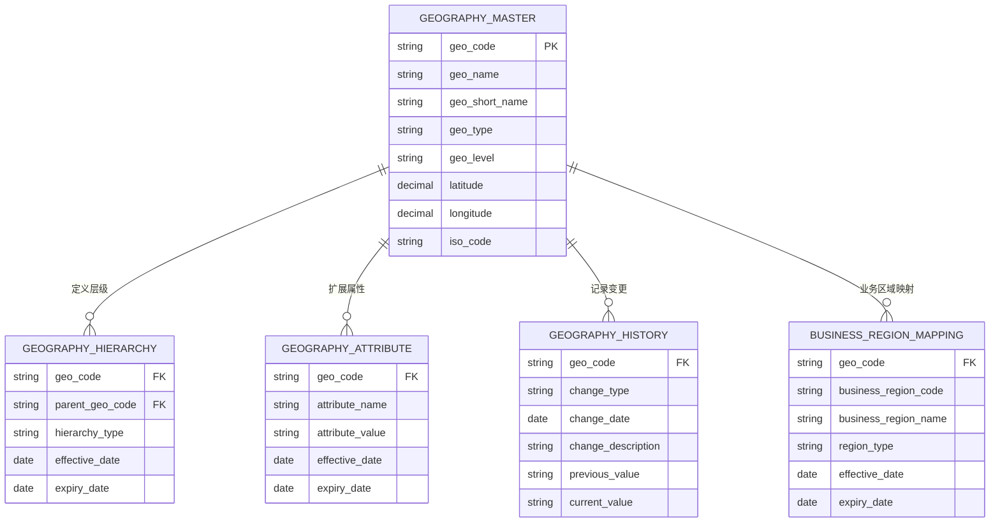

---
{"dg-publish":true,"tags":["财务BI","数据模型","维度设计","地域维度","数据分析"],"aliases":["区域维度设计","地理维度设计"],"permalink":"/知识共享/001_财务/02_财务BI看板项目/数据模型设计/数据维度设计/地域维度设计/","dgPassFrontmatter":true}
---

# 地域维度设计

## 概述

地域维度是财务BI系统中的基础分析维度，用于从地理空间角度分析企业的经营状况、市场表现和业务分布。一个设计良好的地域维度体系能够支持企业进行区域绩效评估、市场潜力分析和资源配置决策，对于拥有跨区域业务的企业尤为重要。本文档系统梳理地域维度的设计方法和应用场景，为财务BI系统提供地域分析框架。

## 地域维度层级结构

### 标准地域层级模型

| 层级名称 | 维度属性 | 层级说明 | 应用场景 | 设计建议 |
| ---- | ---- | ---- | ---- | ---- |
| 全球 | 全球编码、名称 | 全球总体 | 全球业务总览 | 作为顶层聚合 |
| 洲际 | 洲际编码、名称 | 大洲划分 | 洲际业务比较 | 跨国企业使用 |
| 国家/地区 | 国家编码、名称、国家代码 | 国家级行政区 | 国家级业务分析 | 采用ISO标准编码 |
| 省/州 | 省级编码、名称 | 省级行政区 | 省级业务分析 | 兼顾行政与业务需求 |
| 市 | 市级编码、名称 | 市级行政区 | 城市业务分析 | 考虑直辖市特殊性 |
| 区/县 | 区县编码、名称 | 区县级行政区 | 基层业务分析 | 适用精细化管理 |

### 业务区域模型

## 地域维度关键属性

### 基础属性

| 属性类别 | 属性名称 | 属性说明 | 设计考虑 |
| ---- | ---- | ---- | ---- |
| 标识属性 | 地域编码 | 唯一标识 | 采用标准编码体系 |
| 标识属性 | 地域名称 | 官方名称 | 支持多语言显示 |
| 标识属性 | 地域简称 | 简略名称 | 用于报表和图表展示 |
| 标识属性 | 国际标准代码 | ISO代码 | 如ISO 3166国家代码 |
| 层级属性 | 层级级别 | 层级深度 | 用于层级管理 |
| 层级属性 | 上级地域 | 所属上级地域 | 构建层级关系 |

### 地理属性

| 属性类别 | 属性名称 | 属性说明 | 设计考虑 |
| ---- | ---- | ---- | ---- |
| 空间属性 | 经度 | 经度坐标 | 用于地理定位和可视化 |
| 空间属性 | 纬度 | 纬度坐标 | 用于地理定位和可视化 |
| 空间属性 | 边界坐标 | 地域边界定义 | 用于地图展示 |
| 空间属性 | 面积 | 地域面积 | 用于密度分析 |
| 时区属性 | 时区 | 标准时区 | 跨时区运营管理 |
| 气候属性 | 气候类型 | 主要气候特征 | 特定行业分析 |

### 业务属性

| 属性类别 | 属性名称 | 属性说明 | 设计考虑 |
| ---- | ---- | ---- | ---- |
| 业务属性 | 所属销售大区 | 销售区域归属 | 销售管理结构 |
| 业务属性 | 市场等级 | 市场重要程度 | 市场分级管理 |
| 业务属性 | 市场成熟度 | 市场发展阶段 | 市场策略制定 |
| 业务属性 | 负责部门 | 管理责任部门 | 责任划分 |
| 业务属性 | 责任人 | 区域负责人 | 责任制管理 |

### 社会经济属性

| 属性类别 | 属性名称 | 属性说明 | 设计考虑 |
| ---- | ---- | ---- | ---- |
| 人口属性 | 人口数量 | 常住人口 | 市场规模评估 |
| 人口属性 | 人口密度 | 单位面积人口 | 市场密度分析 |
| 人口属性 | 人口结构 | 年龄、性别等 | 目标客群分析 |
| 经济属性 | GDP | 地区生产总值 | 经济规模评估 |
| 经济属性 | 人均GDP | 人均产值 | 消费能力评估 |
| 经济属性 | 支柱产业 | 主要经济产业 | 行业关联分析 |
| 消费属性 | 消费水平 | 人均消费支出 | 市场潜力评估 |
| 消费属性 | 消费倾向 | 消费习惯特征 | 市场策略定制 |

## 地域维度历史与变更管理

| 变更类型 | 处理方式 | 数据影响 | 设计建议 |
| ---- | ---- | ---- | ---- |
| 行政区划调整 | 记录变更关系 | 历史数据保持原关联 | 维护变更映射表，记录生效时间 |
| 区域名称变更 | 记录新旧名称 | 按时间点区分显示 | 保留曾用名信息，便于查询和分析 |
| 区域合并 | 建立区域映射关系 | 历史数据保持原区域 | 记录合并关系，提供趋势比较分析 |
| 区域拆分 | 建立区域拆分关系 | 历史数据保持原区域 | 记录拆分关系，设计比例分配规则 |
| 业务区域调整 | 记录调整前后关系 | 按时间维度区分归属 | 记录业务区域变更历史，支持模拟分析 |
| 责任归属变更 | 记录责任变更历史 | 按时间维度区分归属 | 记录责任人变更轨迹，便于责任追溯 |

## 地域维度设计原则

1. **标准化原则**：采用标准地理编码和分类体系，如ISO国家代码、行政区划代码
2. **层级清晰原则**：明确定义地域层级结构，支持从不同粒度分析
3. **业务适配原则**：地域结构设计应与企业业务管理结构相匹配
4. **完整覆盖原则**：地域体系应覆盖企业所有业务区域，避免数据孤岛
5. **稳定与灵活平衡**：基础地域结构保持稳定，同时支持灵活的业务视角
6. **历史追溯原则**：记录地域变更历史，支持任意时点的结构分析
7. **未来扩展原则**：预留未来业务拓展的地域扩展空间

## 地域维度关联分析

### 与其他维度的关联

| 关联维度 | 关联方式 | 关联说明 | 应用场景 |
| ---- | ---- | ---- | ---- |
| 组织维度 | 地域-组织映射 | 确定地域负责组织 | 区域责任分析 |
| 客户维度 | 客户-地域归属 | 客户地理分布 | 客户地域分析 |
| 产品维度 | 产品-地域关联 | 产品区域表现 | 产品区域策略 |
| 渠道维度 | 渠道-地域覆盖 | 渠道地域分布 | 渠道覆盖分析 |
| 供应商维度 | 供应商-地域分布 | 供应商地理布局 | 供应链分析 |
| 时间维度 | 地域-时间点事件 | 地域时间特征 | 季节性分析 |

### 地域财务分析框架

## 地域维度数据模型

### 实体关系模型

### 维度表设计示例

**地域主表(DIM_GEOGRAPHY)**

| 字段名 | 数据类型 | 是否主键 | 描述 |
| ---- | ---- | ---- | ---- |
| GEO_CODE | VARCHAR(50) | 是 | 地域编码 |
| GEO_NAME | VARCHAR(200) | 否 | 地域名称 |
| GEO_SHORT_NAME | VARCHAR(100) | 否 | 地域简称 |
| GEO_TYPE | VARCHAR(50) | 否 | 地域类型 |
| GEO_LEVEL | VARCHAR(20) | 否 | 地域层级 |
| PARENT_GEO_CODE | VARCHAR(50) | 否 | 上级地域编码 |
| LATITUDE | DECIMAL(10,6) | 否 | 纬度 |
| LONGITUDE | DECIMAL(10,6) | 否 | 经度 |
| ISO_CODE | VARCHAR(20) | 否 | 国际标准代码 |
| REGION_CODE | VARCHAR(50) | 否 | 大区编码 |
| MARKET_TIER | VARCHAR(20) | 否 | 市场等级 |
| MARKET_MATURITY | VARCHAR(20) | 否 | 市场成熟度 |
| RESPONSIBLE_DEPT | VARCHAR(50) | 否 | 负责部门 |
| RESPONSIBLE_PERSON | VARCHAR(100) | 否 | 责任人 |
| POPULATION | INTEGER | 否 | 人口数量 |
| GDP | DECIMAL(18,2) | 否 | 地区生产总值 |
| GDP_PER_CAPITA | DECIMAL(18,2) | 否 | 人均GDP |
| EFFECTIVE_DATE | DATE | 否 | 生效日期 |
| EXPIRY_DATE | DATE | 否 | 失效日期 |
| IS_ACTIVE | CHAR(1) | 否 | 是否活跃 |
| CREATED_DATE | TIMESTAMP | 否 | 创建时间 |
| UPDATED_DATE | TIMESTAMP | 否 | 更新时间 |

## 地域维度应用场景

### 区域绩效分析

| 应用场景 | 实现方式 | 分析价值 | 展示建议 |
| ---- | ---- | ---- | ---- |
| 区域销售表现 | 按地域维度聚合销售指标 | 评估区域市场表现 | 地图热力图、排名图 |
| 区域增长分析 | 计算区域增长率和贡献 | 识别增长和衰退区域 | 增长矩阵、趋势图 |
| 区域市场占有率 | 计算各区域市场份额 | 评估市场地位 | 地图气泡图、份额图 |
| 区域盈利能力 | 分析区域利润率结构 | 发现盈利问题和机会 | 利润热力图、对比图 |
| 区域间对标分析 | 对比相似区域绩效差异 | 发现最佳实践和改进空间 | 雷达图、差异分析表 |

### 区域市场分析

| 应用场景 | 实现方式 | 分析价值 | 展示建议 |
| ---- | ---- | ---- | ---- |
| 区域市场规模分析 | 评估各区域市场规模 | 识别关键市场 | 市场规模地图、对比图 |
| 区域产品渗透率 | 计算产品在各区域渗透情况 | 发现产品覆盖差距 | 渗透率热力图、差距图 |
| 区域客户分布 | 分析客户地理分布特征 | 了解客户集中度 | 客户分布图、密度图 |
| 区域季节性分析 | 研究区域季节性波动 | 优化区域资源配置 | 季节波动图、热力图 |
| 区域竞争态势 | 分析区域竞争格局 | 制定区域竞争策略 | 竞争格局图、市场份额图 |

### 区域资源配置

| 应用场景 | 实现方式 | 分析价值 | 展示建议 |
| ---- | ---- | ---- | ---- |
| 区域投资分析 | 评估各区域投资回报 | 优化资本分配 | 投资回报图、优先级矩阵 |
| 区域人力资源配置 | 分析人力资源与业绩关系 | 优化人员配置 | 人效分析图、配置建议 |
| 区域营销效率 | 计算区域营销投入产出 | 优化营销资源 | 效率对比图、资源配置图 |
| 区域渠道覆盖 | 分析渠道覆盖与业绩关系 | 优化渠道布局 | 渠道覆盖图、空白分析 |
| 区域物流网络优化 | 评估物流网络效率 | 优化供应链结构 | 物流网络图、效率热图 |

### 区域风险管理

| 应用场景 | 实现方式 | 分析价值 | 展示建议 |
| ---- | ---- | ---- | ---- |
| 区域业务集中度 | 计算区域收入占比 | 评估区域依赖风险 | 集中度指标、占比图 |
| 区域政策风险 | 监控区域政策变化影响 | 预警政策风险 | 风险评级图、影响预测 |
| 区域自然风险 | 评估自然灾害风险概率 | 制定风险应对策略 | 风险地图、预警指标 |
| 区域汇率风险 | 分析汇率波动影响 | 管理汇率风险 | 影响分析、敏感性图 |
| 区域信用风险 | 评估区域客户信用状况 | 管理应收账款风险 | 风险热力图、趋势预警 |

## 地域维度设计最佳实践

1. **采用标准编码体系**：
   - 使用国际通用的地理编码标准，如ISO 3166国家代码
   - 采用国家行政区划标准编码体系
   - 为业务区域设计规范化的编码规则

2. **多层次地理视图**：
   - 支持行政区划与业务区域双重视图
   - 设计清晰的层级关系和聚合逻辑
   - 提供灵活的区域划分和组合能力

3. **考虑国际化需求**：
   - 支持多语言地域名称
   - 处理不同国家的地址格式差异
   - 考虑时区、货币等区域特性

4. **优化地理数据可视化**：
   - 收集地理坐标和边界数据
   - 支持多精度的地图展示
   - 设计色彩标准和图例规范

5. **区域变更管理机制**：
   - 设计变更历史跟踪机制
   - 提供时间点查询能力
   - 支持变更前后数据对比分析

6. **地理数据质量管理**：
   - 建立地理数据验证规则
   - 定期更新地理参考数据
   - 与权威地理数据源保持同步

7. **业务与地理整合**：
   - 将业务指标与地理位置关联
   - 设计地理级别的KPI体系
   - 支持空间分析功能

## 地域维度分析应用示例

### 区域绩效看板

- **目标**：全面评估各区域业务表现，识别增长机会和问题区域
- **维度组合**：地域维度 × 时间维度 × 业绩指标
- **交互功能**：区域层级钻取、多维指标切换、时间比较
- **展示方式**：业绩热力地图、区域排名图、增长率矩阵

### 市场潜力分析看板

- **目标**：评估各区域市场潜力，指导市场拓展策略
- **维度组合**：地域维度 × 市场指标 × 产品维度
- **交互功能**：区域选择、潜力因素权重调整、情景模拟
- **展示方式**：潜力评分地图、机会矩阵、市场空白分析

### 区域资源配置看板

- **目标**：优化区域资源配置，提升投资回报
- **维度组合**：地域维度 × 资源类型 × 绩效指标
- **交互功能**：资源分配模拟、效率对比、投资组合优化
- **展示方式**：资源分配地图、效率散点图、优先级矩阵

### 区域风险监测看板

- **目标**：监控各类区域风险，提供预警和应对建议
- **维度组合**：地域维度 × 风险类型 × 时间维度
- **交互功能**：风险等级筛选、趋势分析、影响评估
- **展示方式**：风险热力地图、预警指标仪表盘、影响矩阵 