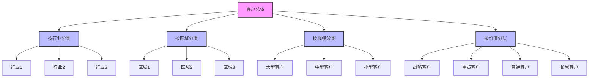
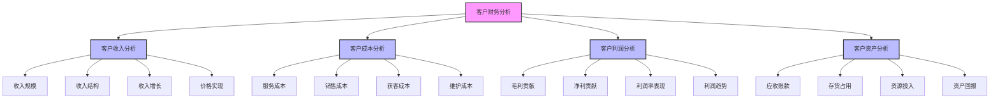
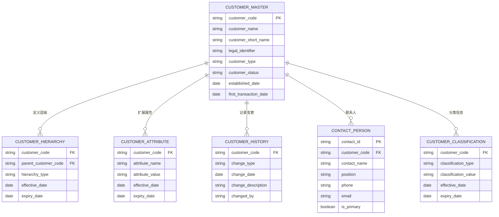

---
{"dg-publish":true,"tags":["财务BI","数据模型","维度设计","客户维度","数据分析"],"aliases":["客户结构维度","客户分层设计"],"permalink":"/知识共享/001_财务/02_财务BI看板项目/数据模型设计/数据维度设计/客户维度设计/","dgPassFrontmatter":true}
---

# 客户维度设计

## 概述

客户维度是财务BI系统中最重要的业务维度之一，用于从客户视角分析企业的收入来源、盈利能力和业务发展。一个全面的客户维度设计能够支持企业识别最有价值的客户群体，分析客户贡献和成本，评估客户关系的发展趋势，为客户关系管理、销售策略和资源分配提供决策支持。本文档系统梳理客户维度的设计方法和应用场景，为财务BI系统提供客户分析框架。

## 客户维度层级结构

### 标准客户层级模型

| 层级名称 | 维度属性 | 层级说明 | 应用场景 | 设计建议 |
| ---- | ---- | ---- | ---- | ---- |
| 客户集团 | 集团编码、名称、总部 | 最高层法律实体集合 | 全球客户管理 | 处理复杂企业关系 |
| 客户公司 | 公司编码、名称、注册地 | 独立法人实体 | 合同与发票管理 | 与财务系统对接 |
| 客户部门 | 部门编码、名称、地址 | 公司内业务单元 | 业务往来管理 | 支持多层级组织 |
| 联系人 | 联系人ID、姓名、职位 | 个人联系人 | 客户沟通管理 | 明确数据隐私政策 |

### 客户分类与分层体系

## 客户维度关键属性

### 基础信息属性

| 属性类别 | 属性名称 | 属性说明 | 设计考虑 |
| ---- | ---- | ---- | ---- |
| 标识属性 | 客户编码 | 唯一标识 | 兼容各系统编码规则 |
| 标识属性 | 客户名称 | 正式名称 | 支持多语言，考虑简称和全称 |
| 标识属性 | 统一社会信用代码 | 法定标识 | 与外部系统识别匹配 |
| 标识属性 | 客户来源 | 获客渠道 | 客户来源分析 |
| 基本信息 | 客户类型 | 客户性质 | 如：企业、政府、个人等 |
| 基本信息 | 成立日期 | 客户成立时间 | 客户生命周期分析 |
| 基本信息 | 员工规模 | 员工数量 | 客户规模评估 |
| 基本信息 | 年收入 | 年营业额 | 客户规模评估 |

### 分类与分层属性

| 属性类别 | 属性名称 | 属性说明 | 设计考虑 |
| ---- | ---- | ---- | ---- |
| 行业属性 | 行业大类 | 主要行业门类 | 行业分析用 |
| 行业属性 | 行业中类 | 细分行业类别 | 具体行业分析 |
| 行业属性 | 行业细分 | 最细行业分类 | 精细行业定位 |
| 区域属性 | 所属国家 | 注册国家 | 全球业务分析 |
| 区域属性 | 所属省份 | 省级行政区 | 区域业务分析 |
| 区域属性 | 所属城市 | 城市级行政区 | 城市业务分析 |
| 分层属性 | 客户等级 | 客户价值等级 | 客户价值管理 |
| 分层属性 | 客户生命周期阶段 | 客户发展阶段 | 生命周期管理 |
| 分层属性 | 风险等级 | 客户风险评级 | 风险管理 |

### 业务属性

| 属性类别 | 属性名称 | 属性说明 | 设计考虑 |
| ---- | ---- | ---- | ---- |
| 关系属性 | 客户建立日期 | 首次成为客户时间 | 客户关系分析 |
| 关系属性 | 最后交易日期 | 最近交易时间 | 客户活跃度分析 |
| 关系属性 | 合作年限 | 客户合作时长 | 客户稳定性分析 |
| 销售属性 | 销售区域 | 负责销售区域 | 销售区域管理 |
| 销售属性 | 销售渠道 | 主要销售渠道 | 渠道管理 |
| 销售属性 | 销售代表 | 负责销售人员 | 客户关系维护 |
| 财务属性 | 信用等级 | 客户信用评级 | 信用风险管理 |
| 财务属性 | 账期 | 标准付款账期 | 应收账款管理 |
| 财务属性 | 结算方式 | 主要结算方式 | 收款管理 |

## 客户维度历史与变更管理

| 变更类型 | 处理方式 | 数据影响 | 设计建议 |
| ---- | ---- | ---- | ---- |
| 客户新增 | 创建新客户记录 | 新交易关联新客户 | 记录客户来源信息 |
| 客户失活 | 更新客户状态 | 历史数据不变 | 记录失活原因和时间 |
| 客户合并 | 建立关联关系，保留原记录 | 历史数据维持原关联 | 记录合并关系，支持合并分析 |
| 客户拆分 | 保留原客户，创建新客户 | 新交易关联新客户 | 记录拆分关系，支持趋势分析 |
| 客户重组 | 更新组织结构关系 | 历史数据保持不变 | 维护组织关系变更历史 |
| 客户迁移 | 更新区域、行业等信息 | 按变更时间判断历史归属 | 记录变更轨迹，支持分析连续性 |
| 客户属性变更 | 记录属性变更历史 | 按时间应用正确属性 | 实现属性有效期管理 |

## 客户维度设计原则

1. **唯一标识原则**：确保企业范围内客户标识的唯一性，消除重复客户记录
2. **层级清晰原则**：明确定义客户之间的隶属关系，支持从不同层级分析客户
3. **分类体系完整原则**：建立覆盖全部客户的分类体系，避免"其他"类比例过高
4. **多维分析支持原则**：支持从行业、区域、规模等多个维度分析客户
5. **历史变更管理原则**：跟踪客户信息变更历史，支持时点和趋势分析
6. **数据质量保障原则**：建立客户数据质量管理机制，确保数据准确性和完整性
7. **与主数据同步原则**：与企业客户主数据保持同步，确保一致性

## 客户维度关联分析

### 与其他维度的关联

| 关联维度 | 关联方式 | 关联说明 | 应用场景 |
| ---- | ---- | ---- | ---- |
| 产品维度 | 客户-产品采购关系 | 客户购买产品组合 | 客户产品偏好分析 |
| 组织维度 | 客户-销售组织关系 | 客户归属销售团队 | 销售团队业绩分析 |
| 渠道维度 | 客户-销售渠道关系 | 客户获取和服务渠道 | 渠道效率分析 |
| 地域维度 | 客户-区域归属关系 | 客户地理位置分布 | 区域市场分析 |
| 时间维度 | 客户-时间事件关系 | 客户生命周期事件 | 客户发展历程分析 |
| 项目维度 | 客户-项目关系 | 客户相关项目活动 | 客户项目组合分析 |

### 客户财务分析框架

## 客户维度数据模型

### 实体关系模型

### 维度表设计示例

**客户主表(DIM_CUSTOMER)**

| 字段名 | 数据类型 | 是否主键 | 描述 |
| ---- | ---- | ---- | ---- |
| CUSTOMER_CODE | VARCHAR(50) | 是 | 客户编码 |
| CUSTOMER_NAME | VARCHAR(200) | 否 | 客户名称 |
| CUSTOMER_SHORT_NAME | VARCHAR(100) | 否 | 客户简称 |
| LEGAL_IDENTIFIER | VARCHAR(50) | 否 | 统一社会信用代码/注册号 |
| CUSTOMER_TYPE | VARCHAR(50) | 否 | 客户类型 |
| INDUSTRY_L1 | VARCHAR(50) | 否 | 行业大类 |
| INDUSTRY_L2 | VARCHAR(50) | 否 | 行业中类 |
| INDUSTRY_L3 | VARCHAR(50) | 否 | 行业小类 |
| COUNTRY | VARCHAR(50) | 否 | 国家 |
| PROVINCE | VARCHAR(50) | 否 | 省份 |
| CITY | VARCHAR(50) | 否 | 城市 |
| CUSTOMER_SIZE | VARCHAR(20) | 否 | 客户规模 |
| CUSTOMER_LEVEL | VARCHAR(20) | 否 | 客户等级 |
| LIFECYCLE_STAGE | VARCHAR(30) | 否 | 生命周期阶段 |
| CREDIT_LEVEL | VARCHAR(20) | 否 | 信用等级 |
| PAYMENT_TERM | INTEGER | 否 | 账期天数 |
| SALES_REGION | VARCHAR(50) | 否 | 销售区域 |
| SALES_CHANNEL | VARCHAR(50) | 否 | 销售渠道 |
| SALES_REP | VARCHAR(100) | 否 | 销售代表 |
| FIRST_TRANSACTION_DATE | DATE | 否 | 首次交易日期 |
| LAST_TRANSACTION_DATE | DATE | 否 | 最近交易日期 |
| CUSTOMER_STATUS | VARCHAR(20) | 否 | 客户状态 |
| PARENT_CUSTOMER_CODE | VARCHAR(50) | 否 | 上级客户编码 |
| IS_ACTIVE | CHAR(1) | 否 | 是否活跃 |
| CREATED_DATE | TIMESTAMP | 否 | 创建时间 |
| UPDATED_DATE | TIMESTAMP | 否 | 更新时间 |

## 客户维度应用场景

### 客户价值分析

| 应用场景 | 实现方式 | 分析价值 | 展示建议 |
| ---- | ---- | ---- | ---- |
| 客户价值分层 | RFM模型或客户贡献 | 识别高价值客户 | 价值矩阵、金字塔图 |
| 客户贡献分析 | 按客户计算收入/利润贡献 | 优化资源分配 | 帕累托图、贡献度表 |
| 客户增长分析 | 客户年度收入增长率 | 识别增长型客户 | 增长矩阵、气泡图 |
| 客户利润率分析 | 客户级别利润率计算 | 发现利润改进机会 | 散点图、利润率分布 |
| 客户终身价值分析 | 预测客户生命周期价值 | 长期客户价值评估 | 客户细分比较、趋势线 |

### 客户结构分析

| 应用场景 | 实现方式 | 分析价值 | 展示建议 |
| ---- | ---- | ---- | ---- |
| 客户行业分布 | 按行业统计收入占比 | 评估行业集中度和风险 | 树图、占比图 |
| 客户区域分布 | 按区域统计客户分布 | 区域市场评估 | 地图、热力图 |
| 客户规模分布 | 按规模统计客户结构 | 客户组合评估 | 堆叠图、结构图 |
| 客户集中度分析 | 计算客户集中度指标 | 业务依赖风险评估 | 集中度指标、前N占比 |
| 客户生命周期分布 | 统计各生命周期阶段客户 | 客户结构健康度评估 | 生命周期漏斗、分布图 |

### 客户关系管理

| 应用场景 | 实现方式 | 分析价值 | 展示建议 |
| ---- | ---- | ---- | ---- |
| 客户获取分析 | 分析新增客户来源和成本 | 优化获客策略 | 来源漏斗、获客成本图 |
| 客户留存分析 | 计算客户留存率和流失率 | 改善客户保持策略 | 同期群分析、留存热图 |
| 客户活跃度分析 | 评估客户活跃状态 | 激活休眠客户 | 活跃度矩阵、RFM分析 |
| 客户升级分析 | 跟踪客户等级变化 | 促进客户价值提升 | 等级迁移图、升级路径 |
| 客户产品采购分析 | 分析客户产品组合 | 交叉销售机会识别 | 产品关联图、采购热图 |

### 客户财务风险分析

| 应用场景 | 实现方式 | 分析价值 | 展示建议 |
| ---- | ---- | ---- | ---- |
| 应收账款风险分析 | 客户应收账款账龄分析 | 管理信用风险 | 账龄分析表、风险地图 |
| 信用额度管理 | 跟踪客户信用额度使用情况 | 控制信用风险 | 额度使用仪表盘、预警指标 |
| 客户付款行为分析 | 分析客户付款习惯 | 预测现金流和风险 | 付款模式图、延迟统计 |
| 坏账风险预测 | 建立客户违约预测模型 | 提前预警潜在坏账 | 风险评分卡、预警指标 |
| 客户流失风险分析 | 识别有流失风险的客户 | 主动挽留重要客户 | 风险矩阵、预警列表 |

## 客户维度设计最佳实践

1. **客户主数据管理**：
   - 建立企业级客户主数据管理体系
   - 明确客户数据治理责任和流程
   - 实施客户数据质量监控和改进机制
   
2. **客户唯一标识设计**：
   - 利用法定标识符作为外部标识（如统一社会信用代码）
   - 设计内部客户编码规则，确保系统间一致性
   - 建立客户匹配和去重机制

3. **多层次客户层级**：
   - 支持法律实体和业务实体的双重视角
   - 处理复杂的企业集团关系
   - 适应不同业务场景的客户层级需求

4. **客户分类体系设计**：
   - 采用标准行业分类体系（如国民经济行业分类）
   - 设计支持多级分类的灵活结构
   - 定期审核并更新客户分类

5. **客户价值评估模型**：
   - 建立客户价值评估框架（收入、利润、增长等维度）
   - 制定客户分层标准和管理策略
   - 定期更新客户价值评估

6. **客户生命周期管理**：
   - 定义客户生命周期阶段（如获取、发展、保持、挽回）
   - 跟踪客户在生命周期中的移动
   - 针对不同生命周期阶段制定财务策略

7. **客户历史分析支持**：
   - 记录客户信息变更历史
   - 支持时点和时期分析
   - 提供客户发展轨迹分析

## 客户维度分析应用示例

### 客户价值管理看板

- **目标**：全面评估客户价值，支持客户资源优化配置
- **维度组合**：客户维度 × 时间维度 × 价值指标
- **交互功能**：客户分层筛选、价值指标切换、趋势比较
- **展示方式**：客户价值矩阵、价值分布图、价值趋势图

### 客户结构分析看板

- **目标**：分析客户组合结构，评估业务布局和风险
- **维度组合**：客户维度(行业/区域/规模) × 收入/利润指标
- **交互功能**：多维结构切换、占比分析、集中度计算
- **展示方式**：客户分布地图、行业占比图、集中度指标

### 客户关系健康看板

- **目标**：监控客户关系健康状况，提前预警风险
- **维度组合**：客户维度 × 关系健康指标 × 时间维度
- **交互功能**：健康度评分、风险预警、趋势跟踪
- **展示方式**：客户健康度仪表盘、风险预警矩阵、留存趋势图

### 客户盈利能力看板

- **目标**：深入分析客户盈利能力，优化客户服务策略
- **维度组合**：客户维度 × 成本/利润指标 × 产品维度
- **交互功能**：盈利分解、成本归因、情景模拟
- **展示方式**：客户盈利热力图、成本瀑布图、利润改进机会矩阵 