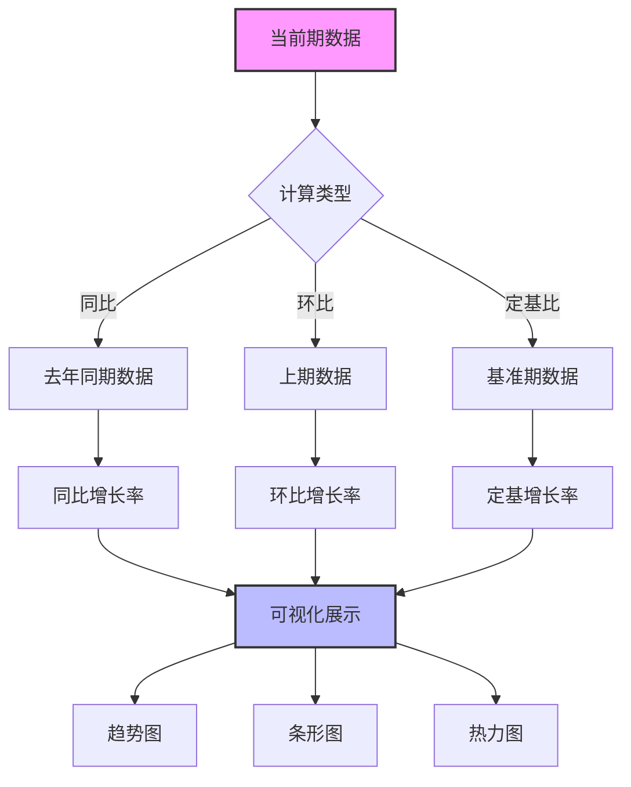
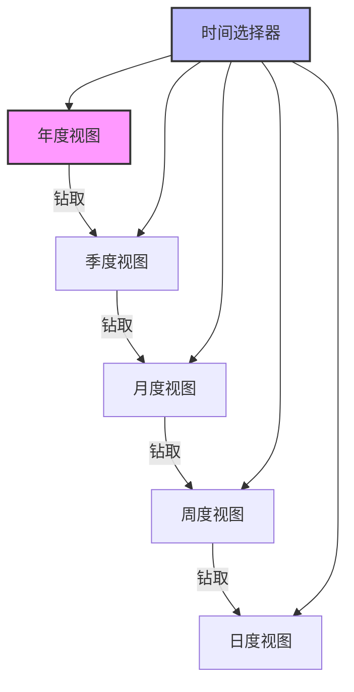
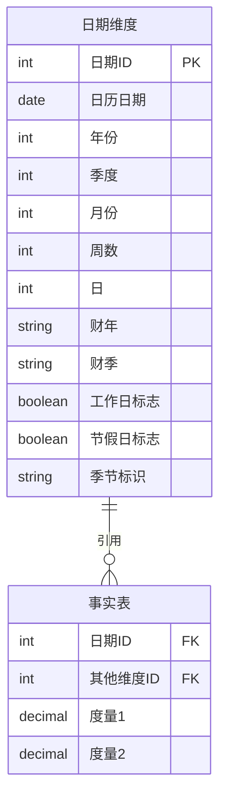

---
{"dg-publish":true,"tags":["财务BI","数据模型","维度设计","时间维度","数据粒度"],"aliases":["时间维度分析","时间周期设计"],"permalink":"/知识共享/001_财务/02_财务BI看板项目/数据模型设计/数据维度设计/时间维度设计/","dgPassFrontmatter":true}
---

# 时间维度设计

## 概述

时间维度是财务BI看板中最基础也是最重要的分析维度，它为所有财务指标提供时序参照系。合理设计时间维度能够满足不同周期的财务分析需求，支持趋势观察、周期对比和预测分析等多种应用场景。本文档定义时间维度的层级结构、粒度设计及其在财务看板中的应用方式。

## 时间维度层级结构

### 基础时间层级

| 时间层级 | 数据粒度 | 应用场景 | 展示建议 |
| ---- | ---- | ---- | ---- |
| 年度 | 年 | 战略分析、长期趋势 | 年度趋势图、同比分析 |
| 季度 | 季 | 季度报表、季节性分析 | 季度对比图、环比分析 |
| 月度 | 月 | 月度经营分析、预算控制 | 月度趋势图、目标达成率 |
| 周度 | 周 | 短期经营监控 | 周度波动图、连续监控 |
| 日度 | 日 | 日常经营监控、现金流跟踪 | 日历热图、异常监控 |

### 业务相关时间周期

| 时间周期 | 定义方式 | 应用场景 | 展示建议 |
| ---- | ---- | ---- | ---- |
| 会计年度 | 企业定义的财年 | 年度报表、财务分析 | 财年对比图、目标达成 |
| 业务季节 | 行业季节性周期 | 季节性波动分析 | 季节性指数图、周期叠加 |
| 促销周期 | 营销活动周期 | 营销效果分析 | 活动前后对比图 |
| 预算周期 | 预算编制与执行周期 | 预算执行监控 | 预算执行跟踪图 |

## 时间维度属性设计

### 基础属性

| 属性名称 | 数据类型 | 示例值 | 用途 |
| ---- | ---- | ---- | ---- |
| 日期ID | 整型 | 20240101 | 主键，日期唯一标识 |
| 日历日期 | 日期型 | 2024-01-01 | 自然日期 |
| 年份 | 整型 | 2024 | 年度聚合 |
| 季度 | 整型 | 1 | 季度聚合 |
| 月份 | 整型 | 1 | 月度聚合 |
| 周数 | 整型 | 1 | 周度聚合 |
| 日 | 整型 | 1 | 日聚合 |

### 扩展属性

| 属性名称 | 数据类型 | 示例值 | 用途 |
| ---- | ---- | ---- | ---- |
| 财年 | 字符型 | FY2024 | 企业财年标识 |
| 财季 | 字符型 | FY2024Q1 | 企业财季标识 |
| 工作日标志 | 布尔型 | 是/否 | 区分工作日与非工作日 |
| 节假日标志 | 布尔型 | 是/否 | 标记法定节假日 |
| 季节标识 | 字符型 | 淡季/旺季 | 业务季节性标记 |
| 月份名称 | 字符型 | 一月 | 展示友好月份名 |
| 周末标志 | 布尔型 | 是/否 | 标记周末 |

### 辅助计算属性

| 属性名称 | 计算方式 | 用途 |
| ---- | ---- | ---- |
| 是否当前月 | 与系统当前月份比较 | 突出显示当前月 |
| 是否当前季 | 与系统当前季度比较 | 突出显示当前季 |
| 是否当前年 | 与系统当前年份比较 | 突出显示当前年 |
| 上月同日 | 当前日期减去一个月 | 环比计算 |
| 去年同日 | 当前日期减去一年 | 同比计算 |
| 月度天数 | 当月总天数 | 日均值计算 |
| 季度天数 | 当季总天数 | 日均值计算 |

## 时间周期定义与计算

### 同环比计算

### 累计值计算

| 计算方式 | 计算公式 | 应用场景 | 展示建议 |
| ---- | ---- | ---- | ---- |
| 月度累计 | 当年从1月到当月的累计值 | 累计业绩分析 | 阶梯图、目标进度 |
| 季度累计 | 当季从第一个月到当月的累计值 | 季度业绩分析 | 进度图、预测线 |
| 滚动12个月 | 最近12个月的累计值 | 年化业绩估算 | 滚动趋势图 |
| 年度累计同比 | (当年累计-去年同期累计)/去年同期累计 | 年度增长分析 | 进度对比图 |

## 时间维度应用场景

### 财务报表场景

| 应用场景 | 时间粒度 | 对比方式 | 展示建议 |
| ---- | ---- | ---- | ---- |
| 资产负债表 | 月末/季末/年末 | 期初期末对比 | 对比条形图、变动分析 |
| 利润表 | 月度/季度/年度 | 同比、环比、预算对比 | 趋势图、瀑布图 |
| 现金流量表 | 月度/季度/年度 | 同比、预算对比 | 趋势图、堆叠图 |

### 经营分析场景

| 应用场景 | 时间粒度 | 对比方式 | 展示建议 |
| ---- | ---- | ---- | ---- |
| 销售分析 | 日/周/月 | 同比、环比、目标对比 | 趋势图、热力图 |
| 成本分析 | 月度 | 同比、预算对比 | 趋势图、构成图 |
| 费用控制 | 月度 | 预算对比、同比 | 差异图、预警指示 |
| 现金流监控 | 日/周 | 预测对比 | 趋势图、预警线 |

## 时间维度交互设计

### 时间筛选器设计

| 筛选器类型 | 实现方式 | 适用场景 | 交互建议 |
| ---- | ---- | ---- | ---- |
| 年度选择器 | 下拉列表 | 年度报表分析 | 默认当前年 |
| 季度选择器 | 下拉列表/按钮组 | 季度分析 | 与年份联动 |
| 月份选择器 | 下拉列表/滑块 | 月度分析 | 与年份联动 |
| 日期范围选择器 | 日历控件 | 自定义期间分析 | 提供快捷选项 |
| 相对时间选择器 | 快捷按钮 | 近期数据分析 | 最近7/30/90天 |

### 时间钻取设计

## 时间维度数据模型

## 看板设计建议

1. **默认视图设计**：根据不同用户角色设置合适的默认时间粒度
   - 高管：季度/月度视图为主
   - 财务经理：月度视图为主
   - 业务经理：周/日视图为主

2. **时间轴设计**：
   - 提供直观的时间轴导航
   - 突出显示重要时间点（如财报发布日、季末等）
   - 支持拖拽和缩放操作

3. **对比分析设计**：
   - 同环比一键切换
   - 支持选择基准期进行对比
   - 多期间叠加对比功能

4. **预测延展**：
   - 基于历史数据延展未来趋势
   - 显示预算/目标线进行对比
   - 提供置信区间范围 