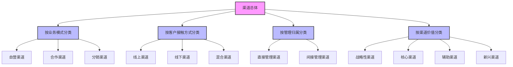
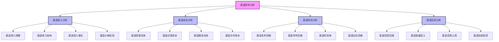
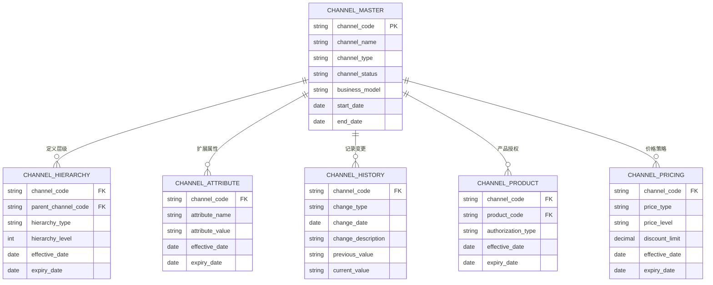

---
{"dg-publish":true,"tags":["财务BI","数据模型","维度设计","渠道维度","数据分析"],"aliases":["销售渠道维度","渠道分析框架"],"permalink":"/知识共享/001_财务/02_财务BI看板项目/数据模型设计/数据维度设计/渠道维度设计/","dgPassFrontmatter":true}
---

# 渠道维度设计

## 概述

渠道维度是财务BI系统中的关键业务维度，用于分析企业销售和服务的不同途径及其财务表现。一个完善的渠道维度设计能够帮助企业全面评估各渠道的盈利能力、运营效率和投资回报，支持渠道策略优化和资源配置决策。随着全渠道销售模式的普及，渠道维度分析对于统一客户体验和提升整体渠道协同效率变得愈发重要。本文档系统梳理渠道维度的设计方法和应用场景，为财务BI系统提供渠道分析框架。

## 渠道维度层级结构

### 标准渠道层级模型

| 层级名称 | 维度属性 | 层级说明 | 应用场景 | 设计建议 |
| ---- | ---- | ---- | ---- | ---- |
| 渠道类型 | 类型编码、名称 | 最高层渠道分类 | 渠道类型分析 | 如线上/线下/合作渠道 |
| 渠道大类 | 大类编码、名称 | 渠道大类划分 | 渠道战略分析 | 如直营/分销/电商 |
| 渠道中类 | 中类编码、名称 | 渠道中类细分 | 渠道策略分析 | 如专卖店/百货/超市 |
| 渠道小类 | 小类编码、名称 | 渠道小类分组 | 渠道战术分析 | 如旗舰店/标准店/网点 |
| 具体渠道 | 渠道编码、名称 | 特定渠道实体 | 渠道绩效分析 | 如具体门店/网站/APP |

### 多视角渠道模型

## 渠道维度关键属性

### 基础属性

| 属性类别 | 属性名称 | 属性说明 | 设计考虑 |
| ---- | ---- | ---- | ---- |
| 标识属性 | 渠道编码 | 唯一标识 | 设计有意义的编码规则 |
| 标识属性 | 渠道名称 | 渠道正式名称 | 提供简称和全称两种格式 |
| 标识属性 | 渠道类型 | 渠道基本类型 | 渠道类型标准化分类 |
| 标识属性 | 外部编码 | 外部系统编码 | 与外部系统对接参考 |
| 层级属性 | 渠道层级 | 渠道层级分类 | 构建渠道层级体系 |
| 层级属性 | 上级渠道 | 所属上级渠道 | 定义渠道上下级关系 |

### 业务属性

| 属性类别 | 属性名称 | 属性说明 | 设计考虑 |
| ---- | ---- | ---- | ---- |
| 属性定位 | 渠道市场定位 | 目标市场定位 | 如高端/大众/经济型 |
| 属性定位 | 渠道客群定位 | 目标客户群体 | 客户细分对应关系 |
| 业务属性 | 经营模式 | 经营方式 | 如直营/加盟/代理 |
| 业务属性 | 业务范围 | 可经营业务范围 | 产品与服务授权 |
| 业务属性 | 渠道层级 | 渠道价值层级 | 战略/核心/辅助分类 |
| 业务属性 | 渠道状态 | 当前运营状态 | 活跃/暂停/关闭等 |

### 财务属性

| 属性类别 | 属性名称 | 属性说明 | 设计考虑 |
| ---- | ---- | ---- | ---- |
| 成本属性 | 成本模式 | 成本归属方式 | 成本核算模式 |
| 成本属性 | 费用分担比例 | 费用分担方式 | 合作费用分担规则 |
| 定价属性 | 价格体系 | 适用价格政策 | 定价策略与折扣规则 |
| 定价属性 | 折扣权限 | 允许折扣范围 | 促销与价格管控 |
| 结算属性 | 结算方式 | 资金结算模式 | 付款与结算流程 |
| 结算属性 | 结算周期 | 结算时间频率 | 现金流规划参考 |

### 管理属性

| 属性类别 | 属性名称 | 属性说明 | 设计考虑 |
| ---- | ---- | ---- | ---- |
| 管理属性 | 管理归属 | 负责管理部门 | 组织管理对应关系 |
| 管理属性 | 渠道经理 | 负责管理人员 | 渠道管理责任人 |
| 管理属性 | 区域归属 | 所属销售区域 | 地域管理对应关系 |
| 管理属性 | 开始合作日期 | 合作起始时间 | 渠道生命周期管理 |
| 管理属性 | 合作到期日期 | 合约到期时间 | 续约提醒与管理 |
| 管理属性 | 评级等级 | 渠道评估等级 | 渠道绩效评估结果 |

## 渠道维度历史与变更管理

| 变更类型 | 处理方式 | 数据影响 | 设计建议 |
| ---- | ---- | ---- | ---- |
| 渠道新增 | 创建新渠道记录 | 新交易关联新渠道 | 记录开立时间与渠道来源 |
| 渠道关闭 | 更新渠道状态 | 历史数据保持不变 | 记录关闭原因和时间点 |
| 渠道转型 | 更新渠道类型 | 按时间区分历史归属 | 记录转型过程和时间点 |
| 渠道合并 | 建立渠道映射关系 | 历史数据保持原渠道 | 记录合并关系，支持合并分析 |
| 渠道拆分 | 创建新渠道，保留原渠道 | 新交易关联新渠道 | 记录拆分关系，支持整体分析 |
| 渠道属性变更 | 记录属性变更历史 | 按时间应用正确属性 | 维护属性生效期，支持时点分析 |
| 渠道层级调整 | 更新层级关系 | 汇总分析逻辑变化 | 记录层级变更，支持历史结构查询 |

## 渠道维度设计原则

1. **全渠道覆盖原则**：渠道维度设计应覆盖企业所有销售和服务渠道，包括传统渠道、数字渠道和新兴渠道
2. **层级清晰原则**：明确定义渠道层级结构，支持从不同粒度分析渠道表现
3. **业务对齐原则**：渠道分类应与企业渠道管理体系和业务流程保持一致
4. **多视角支持原则**：支持多种渠道分类视角，满足不同业务部门的分析需求
5. **变更管理原则**：有效管理渠道变更历史，支持不同时点的渠道结构分析
6. **全渠道协同原则**：设计应支持跨渠道协同分析，识别渠道间交叉影响
7. **战略驱动原则**：渠道维度设计应支持企业渠道战略评估和优化

## 渠道维度关联分析

### 与其他维度的关联

| 关联维度 | 关联方式 | 关联说明 | 应用场景 |
| ---- | ---- | ---- | ---- |
| 产品维度 | 渠道-产品授权关系 | 确定渠道可售产品 | 渠道产品组合分析 |
| 客户维度 | 渠道-客户获取关系 | 确定客户获取渠道 | 获客成本分析 |
| 组织维度 | 渠道-组织管理关系 | 确定渠道管理归属 | 渠道责任分析 |
| 地域维度 | 渠道-地域分布关系 | 确定渠道地理覆盖 | 渠道覆盖分析 |
| 时间维度 | 渠道-时间事件关系 | 记录渠道重要事件 | 渠道生命周期分析 |
| 活动维度 | 渠道-营销活动关系 | 确定活动执行渠道 | 营销效果分析 |

### 渠道财务分析框架

## 渠道维度数据模型

### 实体关系模型

### 维度表设计示例

**渠道主表(DIM_CHANNEL)**

| 字段名 | 数据类型 | 是否主键 | 描述 |
| ---- | ---- | ---- | ---- |
| CHANNEL_CODE | VARCHAR(50) | 是 | 渠道编码 |
| CHANNEL_NAME | VARCHAR(200) | 否 | 渠道名称 |
| CHANNEL_SHORT_NAME | VARCHAR(100) | 否 | 渠道简称 |
| CHANNEL_TYPE | VARCHAR(50) | 否 | 渠道类型 |
| CHANNEL_CATEGORY | VARCHAR(50) | 否 | 渠道大类 |
| CHANNEL_SUBCATEGORY | VARCHAR(50) | 否 | 渠道中类 |
| CHANNEL_GROUP | VARCHAR(50) | 否 | 渠道小类 |
| BUSINESS_MODEL | VARCHAR(50) | 否 | 经营模式 |
| CHANNEL_LEVEL | VARCHAR(20) | 否 | 渠道层级 |
| CHANNEL_STATUS | VARCHAR(20) | 否 | 渠道状态 |
| PARENT_CHANNEL_CODE | VARCHAR(50) | 否 | 上级渠道编码 |
| CHANNEL_MANAGER | VARCHAR(100) | 否 | 渠道经理 |
| DEPARTMENT_CODE | VARCHAR(50) | 否 | 管理部门编码 |
| REGION_CODE | VARCHAR(50) | 否 | 区域编码 |
| TARGET_MARKET | VARCHAR(50) | 否 | 目标市场 |
| TARGET_CUSTOMER | VARCHAR(50) | 否 | 目标客户 |
| COST_MODEL | VARCHAR(50) | 否 | 成本模式 |
| PRICE_SYSTEM | VARCHAR(50) | 否 | 价格体系 |
| SETTLEMENT_TYPE | VARCHAR(50) | 否 | 结算方式 |
| SETTLEMENT_PERIOD | INTEGER | 否 | 结算周期天数 |
| RATING | VARCHAR(20) | 否 | 评级等级 |
| START_DATE | DATE | 否 | 开始合作日期 |
| END_DATE | DATE | 否 | 合作到期日期 |
| EFFECTIVE_DATE | DATE | 否 | 生效日期 |
| EXPIRY_DATE | DATE | 否 | 失效日期 |
| IS_ACTIVE | CHAR(1) | 否 | 是否活跃 |
| CREATED_DATE | TIMESTAMP | 否 | 创建时间 |
| UPDATED_DATE | TIMESTAMP | 否 | 更新时间 |

## 渠道维度应用场景

### 渠道绩效分析

| 应用场景 | 实现方式 | 分析价值 | 展示建议 |
| ---- | ---- | ---- | ---- |
| 渠道收入分析 | 按渠道维度聚合收入 | 评估渠道销售表现 | 收入排名、趋势图 |
| 渠道增长分析 | 计算渠道增长率 | 识别高增长渠道 | 增长矩阵、同比图 |
| 渠道转化分析 | 计算渠道转化率指标 | 评估渠道效率 | 漏斗图、转化率图 |
| 渠道产品组合分析 | 分析各渠道产品销售结构 | 优化渠道产品策略 | 产品组合热图、结构图 |
| 渠道客户价值分析 | 评估渠道获取客户价值 | 识别高价值渠道 | 客户价值矩阵、分布图 |

### 渠道效率与成本分析

| 应用场景 | 实现方式 | 分析价值 | 展示建议 |
| ---- | ---- | ---- | ---- |
| 渠道获客成本分析 | 计算渠道获客成本 | 优化营销资源分配 | 获客成本对比、趋势图 |
| 渠道运营效率分析 | 评估渠道运营效率指标 | 提升渠道运营效率 | 效率雷达图、指标仪表盘 |
| 渠道服务成本分析 | 计算渠道客户服务成本 | 优化服务资源配置 | 成本构成图、单位成本图 |
| 渠道占用资源分析 | 分析渠道资源占用情况 | 优化资源配置 | 资源占用图、效益指标 |
| 渠道库存周转分析 | 计算渠道库存周转效率 | 优化库存配置 | 周转率图、库存效率图 |

### 渠道盈利能力分析

| 应用场景 | 实现方式 | 分析价值 | 展示建议 |
| ---- | ---- | ---- | ---- |
| 渠道毛利分析 | 计算渠道毛利率 | 评估渠道基础盈利能力 | 毛利率图、四象限分析 |
| 渠道贡献利润分析 | 计算渠道贡献利润 | 评估渠道实际价值 | 贡献利润图、瀑布图 |
| 渠道投资回报分析 | 计算渠道ROI | 评估渠道投资效益 | ROI对比图、回报周期图 |
| 渠道成本结构分析 | 分析渠道成本构成 | 识别成本优化机会 | 成本构成图、对比分析 |
| 渠道价格实现分析 | 分析实际价格与目标差异 | 评估渠道定价执行力 | 价格实现率图、折扣分析 |

### 全渠道协同分析

| 应用场景 | 实现方式 | 分析价值 | 展示建议 |
| ---- | ---- | ---- | ---- |
| 渠道触点分析 | 分析客户渠道触点路径 | 优化渠道协同体验 | 路径分析图、触点热图 |
| 渠道转化漏斗分析 | 构建跨渠道转化漏斗 | 识别优化机会点 | 漏斗流失图、路径图 |
| 渠道协同效果分析 | 评估渠道协同营销效果 | 优化全渠道策略 | 协同效果图、归因分析 |
| 渠道冲突分析 | 识别渠道间竞争与冲突 | 减少渠道内耗 | 冲突热图、重叠分析 |
| 全渠道客户行为分析 | 分析客户跨渠道行为 | 理解客户偏好 | 行为序列图、偏好图 |

## 渠道维度设计最佳实践

1. **全渠道整合设计**：
   - 设计统一的渠道标识和分类体系
   - 支持线上与线下渠道的无缝整合
   - 构建渠道间关联映射机制

2. **渠道分类体系设计**：
   - 基于业务实际需求设计渠道分类
   - 考虑多维度的渠道分类视角
   - 设计灵活的分类组合能力

3. **渠道成本与利润核算**：
   - 定义清晰的渠道成本归属规则
   - 设计合理的渠道贡献利润计算方法
   - 提供多层次的渠道盈利能力分析

4. **渠道变更管理机制**：
   - 记录渠道信息变更历史
   - 维护渠道结构的历史版本
   - 支持渠道调整前后的比较分析

5. **渠道绩效评估框架**：
   - 构建多维度的渠道评估指标体系
   - 设计渠道绩效评分和等级机制
   - 提供渠道绩效改进建议

6. **渠道归因分析设计**：
   - 设计跨渠道客户旅程追踪机制
   - 构建渠道贡献归因模型
   - 支持多种归因方法的灵活应用

7. **渠道战略支持机制**：
   - 提供渠道投资回报分析
   - 支持渠道组合优化决策
   - 设计渠道情景模拟能力

## 渠道维度分析应用示例

### 渠道绩效看板

- **目标**：全面评估各渠道的业务表现，支持渠道优化决策
- **维度组合**：渠道维度 × 时间维度 × 绩效指标
- **交互功能**：渠道层级钻取、指标切换、时间比较
- **展示方式**：渠道绩效矩阵、排名图、趋势比较图

### 渠道盈利能力看板

- **目标**：分析各渠道的盈利表现，发现盈利改进机会
- **维度组合**：渠道维度 × 盈利指标 × 成本结构
- **交互功能**：盈利构成分析、成本归因、渠道对比
- **展示方式**：盈利热力图、成本瀑布图、盈利能力矩阵

### 全渠道协同看板

- **目标**：分析渠道间协同效果，优化渠道整合策略
- **维度组合**：渠道组合 × 客户旅程 × 转化指标
- **交互功能**：路径分析、渠道触点追踪、协同模拟
- **展示方式**：客户旅程地图、渠道协同矩阵、触点分析图

### 渠道资源配置看板

- **目标**：优化各渠道资源配置，提升整体资源效率
- **维度组合**：渠道维度 × 资源类型 × 投资回报
- **交互功能**：资源分配模拟、效率对比、优先级设定
- **展示方式**：资源配置图、效率散点图、投资组合矩阵 