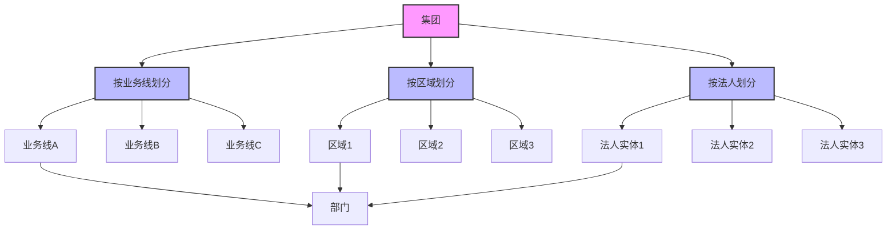
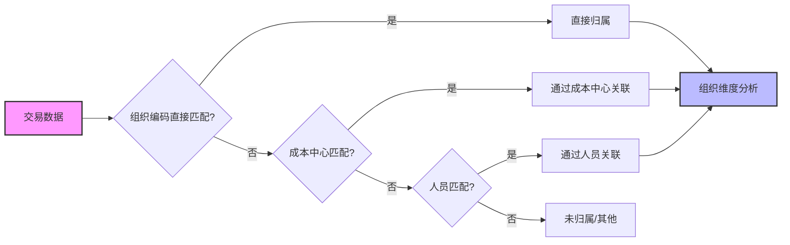
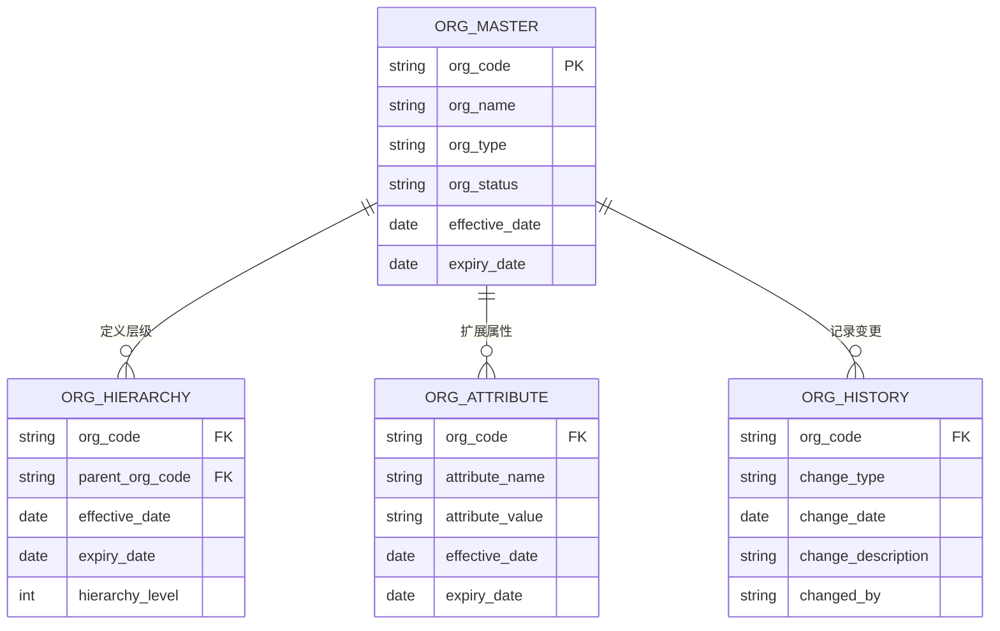

---
{"dg-publish":true,"tags":["财务BI","数据模型","维度设计","组织维度","数据分析"],"aliases":["组织架构维度","企业组织层级"],"permalink":"/知识共享/001_财务/02_财务BI看板项目/数据模型设计/数据维度设计/组织维度设计/","dgPassFrontmatter":true}
---

# 组织维度设计

## 概述

组织维度是财务BI系统中最基础的分析维度之一，用于反映企业的管理架构和责任体系，支持按组织层级进行数据聚合、下钻和比较分析。一个设计良好的组织维度体系，能够准确映射企业的内部结构，使财务数据的归属清晰，责任界定明确，为管理决策和绩效评估提供多层次、多视角的数据支持。

## 组织维度层级结构

### 标准层级模型

| 层级名称 | 维度属性 | 层级说明 | 应用场景 | 设计建议 |
| ---- | ---- | ---- | ---- | ---- |
| 集团 | 集团编码、集团名称、成立日期 | 最顶层企业实体 | 集团整体分析 | 支持多集团并存 |
| 公司 | 公司编码、公司名称、法人、注册资本 | 独立法人实体 | 公司层财务报表 | 识别内外部公司 |
| 事业部 | 事业部编码、事业部名称、总经理 | 业务板块单元 | 业务线绩效分析 | 按业务或区域划分 |
| 部门 | 部门编码、部门名称、部门主管 | 职能管理单元 | 部门预算与执行 | 与职责中心对应 |
| 团队/小组 | 团队编码、团队名称、团队负责人 | 基础工作单元 | 精细化绩效管理 | 可选层级，视需求设计 |

### 多维组织结构支持

## 组织维度关键属性

| 属性分类 | 属性名称 | 属性说明 | 设计考虑 |
| ---- | ---- | ---- | ---- |
| 基础信息 | 组织编码 | 唯一标识符 | 采用有规则编码，支持层级识别 |
| 基础信息 | 组织名称 | 组织单元名称 | 支持多语言，考虑显示与全称 |
| 基础信息 | 组织类型 | 组织单元类型 | 如：法人、成本中心、利润中心等 |
| 基础信息 | 组织状态 | 是否有效 | 如：正常、撤销、合并等 |
| 时间属性 | 生效日期 | 组织设立日期 | 支持组织历史变更追踪 |
| 时间属性 | 失效日期 | 组织撤销日期 | 支持组织历史变更追踪 |
| 关联属性 | 上级组织 | 直接管理上级 | 构建组织层级关系 |
| 关联属性 | 分管领导 | 负责人信息 | 可与人员维度关联 |
| 业务属性 | 责任中心类型 | 财务管理属性 | 如：成本中心、利润中心、投资中心 |
| 业务属性 | 业务领域 | 所属业务范畴 | 跨组织的业务分类 |
| 财务属性 | 核算主体 | 是否独立核算 | 独立核算标识 |
| 财务属性 | 预算单位 | 是否预算单位 | 预算管理标识 |

## 组织变更与历史管理

| 变更类型 | 处理方式 | 数据影响 | 设计建议 |
| ---- | ---- | ---- | ---- |
| 组织新增 | 创建新组织节点 | 新增数据只对应新组织 | 设定生效日期，确保统计口径准确 |
| 组织撤销 | 标记失效状态 | 历史数据保留组织归属 | 设定失效日期，而非直接删除 |
| 组织合并 | 一个存续，其他撤销 | 历史数据维持原归属 | 提供映射关系，支持历史数据重组 |
| 组织拆分 | 原组织存续，新增拆分组织 | 新数据分别归属 | 设计数据分配规则，说明指标计算口径变化 |
| 组织更名 | 保持编码不变，更新名称 | 数据归属不变 | 维护名称生效历史，支持时点查询 |
| 组织上移/下移 | 更新上下级关系 | 层级汇总逻辑变化 | 记录层级关系变更历史，支持时点分析 |

## 组织维度设计原则

1. **稳定性原则**：组织维度设计应尽量稳定，避免频繁变更
2. **灵活性原则**：支持多视角的组织结构，如法人视角、业务视角、区域视角
3. **完整性原则**：组织结构全面覆盖企业所有单元，避免数据孤岛
4. **一致性原则**：与企业ERP、OA等系统的组织架构保持一致
5. **历史性原则**：保留组织变更历史，支持不同时点的历史分析
6. **权限适配原则**：组织结构设计应支持数据权限管理需求
7. **编码规范原则**：采用有意义的编码规则，便于识别和维护

## 组织维度关联分析

### 与其他维度的关联

| 关联维度 | 关联方式 | 关联说明 | 应用场景 |
| ---- | ---- | ---- | ---- |
| 人员维度 | 部门-人员映射 | 确定人员所属组织 | 人力成本分析 |
| 职责中心维度 | 组织-责任中心映射 | 确定责任归属 | 业绩考核分析 |
| 产品维度 | 组织-产品线映射 | 确定产品归属 | 产品盈利分析 |
| 客户维度 | 销售组织-客户映射 | 确定客户归属 | 客户贡献分析 |
| 供应商维度 | 采购组织-供应商映射 | 确定供应商归属 | 采购分析 |
| 地域维度 | 组织-区域映射 | 确定地域覆盖 | 区域绩效分析 |

### 组织维度多级匹配逻辑

## 组织维度数据模型

### 实体关系模型

### 维度表设计示例

**组织主表(DIM_ORGANIZATION)**

| 字段名 | 数据类型 | 是否主键 | 描述 |
| ---- | ---- | ---- | ---- |
| ORG_CODE | VARCHAR(50) | 是 | 组织编码 |
| ORG_NAME | VARCHAR(200) | 否 | 组织名称 |
| ORG_SHORT_NAME | VARCHAR(100) | 否 | 组织简称 |
| ORG_TYPE | VARCHAR(50) | 否 | 组织类型 |
| ORG_LEVEL | INTEGER | 否 | 组织层级 |
| PARENT_ORG_CODE | VARCHAR(50) | 否 | 上级组织编码 |
| ORG_MANAGER | VARCHAR(100) | 否 | 负责人 |
| COST_CENTER_FLAG | CHAR(1) | 否 | 成本中心标识 |
| PROFIT_CENTER_FLAG | CHAR(1) | 否 | 利润中心标识 |
| EFFECTIVE_DATE | DATE | 否 | 生效日期 |
| EXPIRY_DATE | DATE | 否 | 失效日期 |
| IS_ACTIVE | CHAR(1) | 否 | 是否活跃 |
| CREATED_DATE | TIMESTAMP | 否 | 创建时间 |
| UPDATED_DATE | TIMESTAMP | 否 | 更新时间 |

## 组织维度应用场景

### 财务报表分析

| 应用场景 | 实现方式 | 分析价值 | 展示建议 |
| ---- | ---- | ---- | ---- |
| 组织单元财务状况 | 按组织维度聚合财务数据 | 评估各组织单元财务健康度 | 组织层级联动下钻 |
| 组织间业绩对比 | 同级组织平行对比分析 | 识别业绩差异和最佳实践 | 条形图排名、雷达图 |
| 组织贡献分析 | 计算各组织对上级的贡献率 | 评估组织对整体的价值 | 瀑布图、树图 |
| 组织历史趋势 | 跟踪组织指标历史变化 | 判断组织发展趋势 | 趋势图、同比环比图 |
| 组织异常监测 | 设置组织KPI预警阈值 | 及时发现组织异常情况 | 仪表盘、异常标记 |

### 预算与资源分配

| 应用场景 | 实现方式 | 分析价值 | 展示建议 |
| ---- | ---- | ---- | ---- |
| 预算分配分析 | 按组织层级分解预算 | 合理分配资源 | 资金分配图、占比图 |
| 预算执行监控 | 组织维度预算实际对比 | 控制预算执行偏差 | 进度条、预警指示 |
| 资源利用效率 | 计算组织投入产出比 | 优化资源分配 | 散点图、效率对比表 |
| 成本中心分析 | 组织维度成本构成分析 | 识别成本控制机会 | 堆叠图、成本树图 |
| 投资回报分析 | 计算组织ROI指标 | 评估投资效益 | ROI热力图、回报曲线 |

## 组织维度设计最佳实践

1. **与企业管理体系协同**：组织维度设计应反映企业实际管理体系，与预算体系、绩效考核体系保持一致

2. **考虑层级扩展需求**：预留组织层级扩展空间，应对企业成长和架构调整需求

3. **合理处理历史变更**：
   - 设计组织历史版本表，记录所有变更信息
   - 实现时点有效分析功能，支持任意历史时点的组织结构查询
   - 提供数据重组功能，支持新旧组织结构对比分析

4. **支持多视角分析**：
   - 实现多种组织视图，如法人视图、业务视图、区域视图等
   - 设计视图切换功能，满足不同角色用户需求
   - 提供组织关系图，直观展示组织结构

5. **编码结构化设计**：
   - 采用层级编码，如前2位表示公司，中间3位表示部门，后2位表示团队
   - 便于识别上下级关系，支持编码排序自动形成层级
   - 预留足够编码空间，应对未来扩展

6. **增强元数据管理**：
   - 构建组织维度元数据字典，明确定义和口径
   - 实现元数据变更审核机制，控制随意变更
   - 提供元数据查询工具，帮助用户理解数据含义

## 组织维度应用示例

### 组织层级业绩看板

- **目标**：分析各级组织单元的业绩贡献和达成情况
- **维度组合**：组织维度 × 时间维度 × 业绩指标
- **交互功能**：层级钻取、平行对比、时间切换
- **展示方式**：多级树图、贡献度热力图、目标达成仪表盘

### 组织资源配置看板

- **目标**：分析各组织单元的资源投入和产出效率
- **维度组合**：组织维度 × 资源类型 × 效率指标
- **交互功能**：资源分配调整、效率对标、历史比较
- **展示方式**：资源分配桑基图、效率对比雷达图、投入产出散点图 