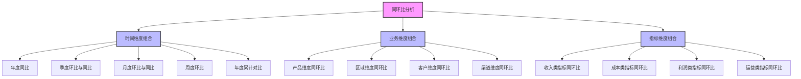

---
{"dg-publish":true,"tags":["财务BI","数据模型","计算逻辑","同环比","趋势分析"],"aliases":["同比环比计算","时间对比分析"],"permalink":"/知识共享/001_财务/02_财务BI看板项目/数据模型设计/计算逻辑设计/同环比计算方法/","dgPassFrontmatter":true}
---


# 同环比计算方法

## 概述

同环比分析是财务BI系统中最常用的时间序列分析方法，通过对不同时间点数据的对比，揭示业务发展趋势、季节性波动和周期性变化，为管理决策提供重要参考。本文档系统梳理同环比计算的方法、应用场景和最佳实践，为财务BI看板的时间序列分析提供标准化的计算逻辑框架。

## 基本概念

### 同比与环比定义

| 概念 | 定义 | 计算公式 | 应用场景 | 优势 |
| ---- | ---- | ---- | ---- | ---- |
| 同比 (YoY) | 与去年同期比较 | (本期值-去年同期值)/去年同期值 | 年度趋势分析、消除季节性影响 | 消除季节性因素，反映真实业务增长 |
| 环比 (MoM/QoQ) | 与上一期比较 | (本期值-上期值)/上期值 | 短期趋势分析、及时发现变化 | 敏感反映短期波动，及时发现趋势变化 |
| 定基比 | 与固定基期比较 | (本期值-基期值)/基期值 | 长期发展评估、战略目标跟踪 | 清晰展示与起点的差距，评估长期发展 |
| 累计同比 | 年初至今与去年同期累计比较 | (本年累计值-去年同期累计值)/去年同期累计值 | 年度进度评估、消除月度波动 | 平滑短期波动，反映整体进度 |

### 同环比分析的意义

1. **趋势识别**：发现业务增长或下滑趋势，判断业务发展方向
2. **季节性分析**：识别业务的季节性模式，优化资源配置
3. **异常监测**：检测数据异常波动，及时发现业务问题
4. **效果评估**：评估业务策略、市场活动的实施效果
5. **预测基础**：为业务预测提供历史变化模式参考

## 计算公式与方法

### 标准计算公式

| 指标类型 | 计算公式 | 说明 | 示例 |
| ---- | ---- | ---- | ---- |
| 同比增长率 | (当期值-去年同期值)/去年同期值 | 与去年同期相比的增长率 | 2023年6月销售额同比增长15% |
| 同比增长额 | 当期值-去年同期值 | 与去年同期相比的绝对增长额 | 2023年6月销售额同比增加100万元 |
| 环比增长率 | (当期值-上期值)/上期值 | 与上期相比的增长率 | 2023年6月销售额环比增长5% |
| 环比增长额 | 当期值-上期值 | 与上期相比的绝对增长额 | 2023年6月销售额环比增加30万元 |
| 定基增长率 | (当期值-基期值)/基期值 | 与基期相比的增长率 | 相比基准年2020年，增长率为45% |
| 累计同比增长率 | (当期累计值-去年同期累计值)/去年同期累计值 | 累计值的同比增长率 | 2023年1-6月累计销售同比增长12% |
| 占比变动 | 当期占比-去年同期占比 | 占比的变动百分点 | 市场份额同比提升2个百分点 |

### 特殊情况处理

| 特殊情况 | 处理方法 | 呈现建议 | 注意事项 |
| ---- | ---- | ---- | ---- |
| 基期为零 | 1. 显示为"N/A"<br>2. 使用绝对值变动代替<br>3. 计算累计期间增长率 | 明确标注计算不适用，展示绝对增长额 | 避免使用"∞"符号，可能引起误解 |
| 基期为负 | 按标准公式计算，但结果需特别解读 | 同时显示绝对值变动和比率变动 | 小心解读增长率正负号含义 |
| 增长率过大 | 1. 设置显示上限(如>1000%)<br>2. 强调绝对值变动 | 使用特殊标记，并辅以绝对值变化 | 分析异常增长的原因，注意数据质量 |
| 小数基期 | 考虑使用更大的计量单位或绝对值变动 | 同时展示比率和绝对变动 | 小基数导致的大比率变化需谨慎解读 |
| 季节性强 | 使用季节性调整后的同比 | 展示调整前后的对比 | 说明季节性调整的方法和影响 |
| 周期不等长 | 按日均值计算后再比较 | 明确说明已进行周期调整 | 标注原始数据和调整后的计算方法 |

### 同环比计算SQL实现示例

**标准同比计算**
```sql
SELECT 
    current_period.year,
    current_period.month,
    current_period.value AS current_value,
    previous_period.value AS previous_value,
    (current_period.value - previous_period.value) AS absolute_change,
    CASE 
        WHEN previous_period.value = 0 THEN NULL
        ELSE (current_period.value - previous_period.value) / previous_period.value 
    END AS yoy_growth_rate
FROM 
    monthly_data current_period
LEFT JOIN 
    monthly_data previous_period 
    ON current_period.month = previous_period.month 
    AND current_period.year = previous_period.year + 1
WHERE 
    current_period.year = 2023;
```

**标准环比计算**
```sql
SELECT 
    current_period.year,
    current_period.month,
    current_period.value AS current_value,
    previous_period.value AS previous_value,
    (current_period.value - previous_period.value) AS absolute_change,
    CASE 
        WHEN previous_period.value = 0 THEN NULL
        ELSE (current_period.value - previous_period.value) / previous_period.value 
    END AS mom_growth_rate
FROM 
    monthly_data current_period
LEFT JOIN 
    monthly_data previous_period 
    ON (current_period.year = previous_period.year AND current_period.month = previous_period.month + 1)
    OR (current_period.year = previous_period.year + 1 AND current_period.month = 1 AND previous_period.month = 12)
WHERE 
    current_period.year = 2023;
```

**累计同比计算**
```sql
WITH current_ytd AS (
    SELECT 
        year, 
        month, 
        SUM(value) OVER (PARTITION BY year ORDER BY month) AS ytd_value
    FROM 
        monthly_data
    WHERE 
        year = 2023
),
previous_ytd AS (
    SELECT 
        year, 
        month, 
        SUM(value) OVER (PARTITION BY year ORDER BY month) AS ytd_value
    FROM 
        monthly_data
    WHERE 
        year = 2022
)
SELECT 
    c.year,
    c.month,
    c.ytd_value AS current_ytd,
    p.ytd_value AS previous_ytd,
    (c.ytd_value - p.ytd_value) AS absolute_change,
    CASE 
        WHEN p.ytd_value = 0 THEN NULL
        ELSE (c.ytd_value - p.ytd_value) / p.ytd_value 
    END AS ytd_growth_rate
FROM 
    current_ytd c
JOIN 
    previous_ytd p ON c.month = p.month;
```

## 同环比分析应用

### 适用场景与指标选择

| 业务场景 | 建议使用的时间比较 | 关键指标 | 展示方式 |
| ---- | ---- | ---- | ---- |
| 季节性业务分析 | 同比为主，辅以环比 | 销售额、订单量、客户数、利润率 | 同比柱状图、环比趋势线 |
| 快速变化的业务 | 环比为主，辅以同比 | 用户增长、转化率、市场份额 | 环比热力图、短期趋势图 |
| 长期战略评估 | 年度同比、定基比较 | 市场占有率、营收增长、ROI | 多年同比趋势、战略目标对比 |
| 预算执行跟踪 | 累计同比、预算比 | 收入、成本、利润、现金流 | 预算执行仪表盘、差异分析图 |
| 营销活动评估 | 活动期环比、同期对比 | 销售额、客单价、转化率、ROI | 活动前后对比图、效果归因分析 |
| 产品销售分析 | 同比、环比结合 | 销量、单价、市场份额、毛利率 | 产品矩阵图、增长热力图 |

### 分析维度组合



### 多维度同环比分析矩阵

| 维度组合 | 分析目标 | 计算方法 | 展示建议 |
| ---- | ---- | ---- | ---- |
| 产品 × 时间 | 不同产品的时间表现趋势 | 各产品独立计算同环比 | 产品-时间热力图、产品增长曲线 |
| 区域 × 时间 | 区域业务发展与比较 | 各区域独立计算同环比 | 区域同比地图、区域排名变化图 |
| 渠道 × 时间 | 渠道效率与发展趋势 | 各渠道独立计算同环比 | 渠道贡献变化图、渠道增长对比 |
| 客户 × 时间 | 客户价值变化与流失风险 | 客户群组同环比分析 | 客户价值迁移图、留存变化图 |
| 产品 × 区域 × 时间 | 产品在不同区域的表现差异 | 产品-区域组合同环比 | 产品区域增长矩阵、区域产品热力图 |

## 计算逻辑最佳实践

### 数据准备与质量控制

1. **数据一致性检查**
   - 确保时间周期定义一致（如月初/月末）
   - 验证计算基准的一致性
   - 检查数据收集的完整性与准确性

2. **数据预处理**
   - 处理缺失值与异常值
   - 进行必要的季节性调整
   - 考虑工作日调整（尤其对日/周级数据）

3. **基期选择**
   - 避免选择异常期间作为基期
   - 定基比分析中选择具有代表性的基期
   - 考虑使用移动平均作为基期减少波动影响

### 展示与解读建议

1. **可视化最佳实践**
   - 同比环比结合展示，相互印证
   - 使用条形图展示增长率，折线图展示趋势
   - 用热力图展示多维度同环比矩阵

2. **警戒值与目标设置**
   - 设置合理的同环比警戒阈值
   - 将实际同环比与目标值对比
   - 根据历史波动范围设置异常提醒

3. **结果解读指南**
   - 关注数值背后的业务含义
   - 结合绝对值和比率进行解读
   - 注意基数效应对增长率的影响
   - 识别周期性、季节性与趋势性变化

### 高级分析技巧

1. **因素分解分析**
   - 将同环比变化分解为数量、价格、结构等因素
   - 构建贡献度分析，识别驱动因素
   - 使用瀑布图展示各因素贡献

2. **趋势调整技术**
   - 使用移动平均平滑短期波动
   - 应用季节性调整方法（如X-12-ARIMA）
   - 考虑工作日/节假日调整因素

3. **预测与目标设定**
   - 基于历史同环比模式设定合理预期
   - 构建同环比预测模型
   - 设定层级目标分解机制

## 常见问题与解决方案

| 问题类型 | 表现症状 | 解决方案 | 预防措施 |
| ---- | ---- | ---- | ---- |
| 基数效应 | 低基数导致异常高增长率 | 1. 结合绝对值变化<br>2. 使用较长周期平均值<br>3. 计算复合增长率 | 设置合理预警阈值，关注中长期趋势 |
| 日历效应 | 工作日数量不同导致扭曲 | 1. 按工作日均值比较<br>2. 应用日历调整算法<br>3. 使用滚动周期比较 | 建立工作日调整模型，规范周期定义 |
| 季节性影响 | 季节性因素干扰趋势判断 | 1. 重点关注同比<br>2. 应用季节性调整<br>3. 使用年化增长率 | 构建季节性指数，预设季节性预期 |
| 结构变化 | 业务结构变化导致不可比 | 1. 使用可比口径重算<br>2. 分离新旧业务分析<br>3. 构建调整后指标 | 记录业务变更事件，保留历史结构 |
| 政策影响 | 政策变化导致非正常波动 | 1. 标注政策影响期间<br>2. 剔除特殊因素影响<br>3. 细分常规与政策影响 | 维护政策事件库，预设影响评估 |

## 同环比分析应用示例

### 收入增长分析看板

**目标**：全面分析企业收入增长趋势，发现增长动力与风险

**核心指标**：
- 月度收入同比增长率与环比增长率
- 年度累计收入同比增长率
- 分产品线收入同比贡献度
- 分区域收入环比变化热力图

**交互功能**：
- 时间周期切换（月/季/年）
- 维度下钻（总体→产品线→具体产品）
- 同比/环比/累计同比视图切换
- 增长率/绝对值变化切换

**分析价值**：识别增长引擎，发现衰退风险，支持资源优化配置

### 预算执行监控看板

**目标**：跟踪预算执行情况，及时发现与预期的偏差

**核心指标**：
- 月度预算完成率及同比
- 累计预算执行率及同比
- 主要费用类别同比变化
- 预算偏差趋势分析

**交互功能**：
- 按组织单位筛选
- 费用类别展开/合并
- 预警阈值调整
- 执行率/同比/绝对值切换

**分析价值**：控制预算执行偏差，优化资源分配，提升财务预测准确性 