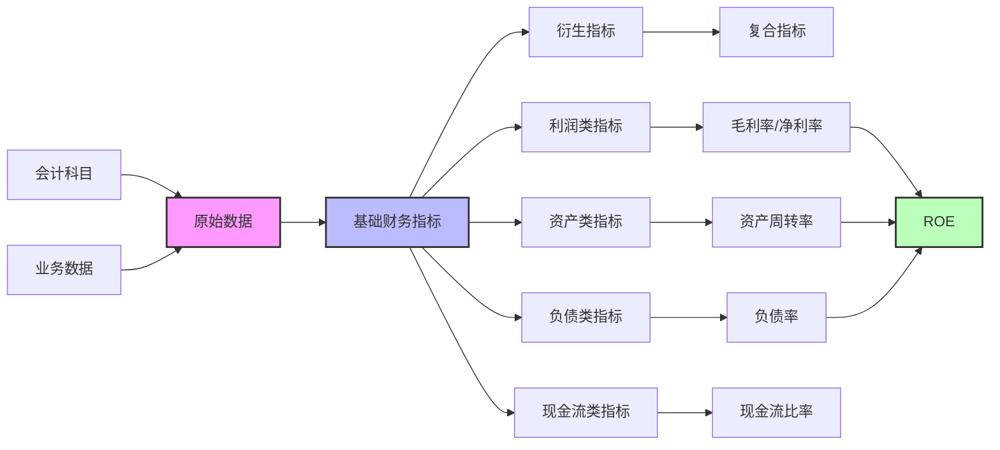

---
{"dg-publish":true,"tags":["财务BI","数据模型","计算逻辑","公式库","指标计算"],"aliases":["财务指标计算公式","指标计算规则库"],"permalink":"/知识共享/001_财务/02_财务BI看板项目/数据模型设计/计算逻辑设计/指标计算公式库/","dgPassFrontmatter":true}
---


# 指标计算公式库

## 概述

指标计算公式库是财务BI看板的核心组成部分，提供了所有财务指标的标准计算逻辑和实现方法。本文档系统整理了常用财务指标的计算公式、应用场景和实现注意事项，确保指标口径一致、计算准确，为决策提供可靠依据。

## 公式库使用说明

1. **应用场景**：本公式库适用于财务BI看板开发过程中的指标定义与实现
2. **实现方式**：公式可通过BI工具的计算字段、SQL脚本或ETL过程实现
3. **数据源假设**：基于标准的财务报表数据结构（资产负债表、利润表、现金流量表）
4. **更新机制**：定期审核并更新，确保与最新财务规则和需求保持一致

## 盈利能力指标公式

| 指标名称 | 计算公式 | SQL实现示例 | 注意事项 |
| ---- | ---- | ---- | ---- |
| 毛利率 | (营业收入-营业成本)/营业收入 | `(revenue - cost) / revenue * 100` | 营业成本需剔除非营业部分 |
| 净利率 | 净利润/营业收入 | `net_profit / revenue * 100` | 考虑非经常性损益影响 |
| 销售费用率 | 销售费用/营业收入 | `selling_expense / revenue * 100` | 注意跨期分摊销售费用 |
| 管理费用率 | 管理费用/营业收入 | `admin_expense / revenue * 100` | 包含非生产部门费用 |
| 研发费用率 | 研发费用/营业收入 | `r_and_d_expense / revenue * 100` | 核算口径是否包含资本化部分 |
| 财务费用率 | 财务费用/营业收入 | `financial_expense / revenue * 100` | 含利息支出和汇兑损益 |
| ROE | 净利润/平均股东权益 | `net_profit / ((equity_start + equity_end) / 2) * 100` | 使用期初期末平均值 |
| ROA | 净利润/平均总资产 | `net_profit / ((assets_start + assets_end) / 2) * 100` | 使用期初期末平均值 |
| EBITDA利润率 | EBITDA/营业收入 | `(net_profit + income_tax + interest_expense + depreciation + amortization) / revenue * 100` | 确保折旧摊销数据完整 |

## 运营效率指标公式

| 指标名称 | 计算公式 | SQL实现示例 | 注意事项 |
| ---- | ---- | ---- | ---- |
| 存货周转率 | 营业成本/平均存货 | `cost / ((inventory_start + inventory_end) / 2)` | 使用期初期末平均值 |
| 应收账款周转率 | 营业收入/平均应收账款 | `revenue / ((ar_start + ar_end) / 2)` | 应收账款含应收票据 |
| 应付账款周转率 | 营业成本/平均应付账款 | `cost / ((ap_start + ap_end) / 2)` | 应付账款含应付票据 |
| 存货周转天数 | 365/存货周转率 | `365 / (cost / ((inventory_start + inventory_end) / 2))` | 季度数据需调整天数 |
| 应收账款周转天数 | 365/应收账款周转率 | `365 / (revenue / ((ar_start + ar_end) / 2))` | 季度数据需调整天数 |
| 应付账款周转天数 | 365/应付账款周转率 | `365 / (cost / ((ap_start + ap_end) / 2))` | 季度数据需调整天数 |
| 总资产周转率 | 营业收入/平均总资产 | `revenue / ((assets_start + assets_end) / 2)` | 反映资产利用效率 |
| 流动资产周转率 | 营业收入/平均流动资产 | `revenue / ((current_assets_start + current_assets_end) / 2)` | 反映营运资金效率 |
| 现金循环周期 | 存货周转天数+应收账款周转天数-应付账款周转天数 | `dso + dio - dpo` | 反映现金占用天数 |

## 偿债能力指标公式

| 指标名称 | 计算公式 | SQL实现示例 | 注意事项 |
| ---- | ---- | ---- | ---- |
| 流动比率 | 流动资产/流动负债 | `current_assets / current_liabilities` | 反映短期偿债能力 |
| 速动比率 | (流动资产-存货)/流动负债 | `(current_assets - inventory) / current_liabilities` | 剔除存货影响 |
| 现金比率 | 货币资金/流动负债 | `cash / current_liabilities` | 最严格的偿债能力测试 |
| 资产负债率 | 总负债/总资产 | `total_liabilities / total_assets * 100` | 反映长期偿债能力 |
| 权益乘数 | 总资产/股东权益 | `total_assets / equity` | 反映财务杠杆程度 |
| 利息保障倍数 | EBIT/利息费用 | `(profit_before_tax + interest_expense) / interest_expense` | 反映偿还利息能力 |
| 现金流量比率 | 经营活动现金流量净额/流动负债 | `operating_cash_flow / current_liabilities` | 以现金流衡量偿债能力 |
| 长期债务与营运资金比率 | 长期负债/(流动资产-流动负债) | `long_term_debt / (current_assets - current_liabilities)` | 长期负债相对于营运资金的比例 |

## 成长能力指标公式

| 指标名称 | 计算公式 | SQL实现示例 | 注意事项 |
| ---- | ---- | ---- | ---- |
| 营业收入增长率 | (本期收入-上期收入)/上期收入 | `(revenue - prev_revenue) / prev_revenue * 100` | 消除季节性因素 |
| 净利润增长率 | (本期净利润-上期净利润)/上期净利润 | `(net_profit - prev_net_profit) / prev_net_profit * 100` | 注意非经常损益影响 |
| 总资产增长率 | (期末总资产-期初总资产)/期初总资产 | `(assets_end - assets_start) / assets_start * 100` | 考虑新增投资影响 |
| 复合年增长率(CAGR) | (期末值/期初值)^(1/年数)-1 | `POWER(end_value / start_value, 1/years) - 1` | 反映平均增长速度 |
| 可持续增长率 | ROE×(1-股利支付率) | `roe * (1 - dividend_payout_ratio)` | 不依赖外部融资的增长率 |

## 现金流指标公式

| 指标名称 | 计算公式 | SQL实现示例 | 注意事项 |
| ---- | ---- | ---- | ---- |
| 经营现金流比率 | 经营活动现金流/营业收入 | `operating_cash_flow / revenue * 100` | 反映收入质量 |
| 现金销售比 | 销售商品提供劳务收到的现金/营业收入 | `cash_from_sales / revenue` | 销售回款质量 |
| 现金流量充当比 | 经营活动现金流/净利润 | `operating_cash_flow / net_profit * 100` | 利润转化为现金能力 |
| 资本支出比率 | 资本支出/经营活动现金流 | `capital_expenditure / operating_cash_flow * 100` | 反映再投资强度 |
| 自由现金流 | 经营活动现金流-资本支出 | `operating_cash_flow - capital_expenditure` | 企业可自由支配的现金 |
| 现金转换周期 | 存货周转天数+应收账款周转天数-应付账款周转天数 | `dso + dio - dpo` | 与现金循环周期相同 |
| 现金流对债务比 | 经营活动现金流/总债务 | `operating_cash_flow / total_debt` | 以现金流偿还债务能力 |

## 杜邦分析公式

```
ROE = 净利润/营业收入 × 营业收入/总资产 × 总资产/股东权益
    = 净利率 × 总资产周转率 × 权益乘数
```

SQL实现：
```sql
-- 净利率
SET @net_margin = net_profit / revenue;

-- 总资产周转率
SET @asset_turnover = revenue / ((assets_start + assets_end) / 2);

-- 权益乘数
SET @equity_multiplier = total_assets / equity;

-- ROE计算
SET @roe = @net_margin * @asset_turnover * @equity_multiplier;
```

注意事项：
- 分解可进一步细化，如净利率可拆分为营业利润率、营业外收支等
- 可用于对比分析ROE变动的具体驱动因素

## 预算差异分析公式

| 指标名称 | 计算公式 | SQL实现示例 | 注意事项 |
| ---- | ---- | ---- | ---- |
| 预算差异 | 实际值-预算值 | `actual - budget` | 正值为超预算，负值为低于预算 |
| 预算达成率 | 实际值/预算值 | `actual / budget * 100` | 反映预算完成情况 |
| 预算差异率 | (实际值-预算值)/预算值 | `(actual - budget) / budget * 100` | 差异的相对比例 |
| 弹性预算差异 | 实际值-调整后预算值 | `actual - adjusted_budget` | 考虑业务量变化的差异分析 |
| 价格差异 | (实际价格-标准价格)×实际数量 | `(actual_price - standard_price) * actual_quantity` | 价格因素造成的差异 |
| 数量差异 | (实际数量-预算数量)×标准价格 | `(actual_quantity - budget_quantity) * standard_price` | 数量因素造成的差异 |

## 指标公式数据流



## 指标实现注意事项

### 数据时效性处理

| 数据类型 | 更新频率 | 处理策略 |
| ---- | ---- | ---- |
| 资产负债数据 | 月末更新 | 使用最近可用月末数据 |
| 利润表数据 | 按月累计 | 当月数据=累计数据-上月累计数据 |
| 现金流数据 | 按月累计 | 当月数据=累计数据-上月累计数据 |
| 日常经营数据 | 实时/日更新 | 可使用最新数据或月度汇总 |

### 异常值处理

| 异常情况 | 处理方法 | 实现示例 |
| ---- | ---- | ---- |
| 分母为零 | 返回NULL或指定值 | `CASE WHEN denominator = 0 THEN NULL ELSE numerator/denominator END` |
| 同比基期为零 | 显示具体值而非增长率 | `CASE WHEN prev_value = 0 THEN NULL ELSE (current_value - prev_value) / prev_value END` |
| 极端异常值 | 设置合理阈值 | `CASE WHEN value > threshold THEN threshold ELSE value END` |
| 缺失数据 | 插值或使用最近有效值 | `COALESCE(value, LAG(value) OVER(ORDER BY date))` |

### 计算性能优化

1. **预计算策略**：
   - 高频访问指标预先计算并存储
   - 低频复杂指标按需计算

2. **计算层次**：
   - 数据仓库层：基础指标、通用衍生指标
   - BI工具层：个性化展示指标、临时分析指标

3. **缓存机制**：
   - 根据数据更新频率设置合理缓存策略
   - 关键路径指标优先缓存

## 公式库维护机制

1. **版本控制**：
   - 记录公式变更历史
   - 保留旧版本计算逻辑以支持历史数据对比

2. **审核流程**：
   - 新增或修改指标需经专业审核
   - 提供测试案例验证计算准确性

3. **文档更新**：
   - 定期更新公式说明和使用指南
   - 增加常见问题与最佳实践 