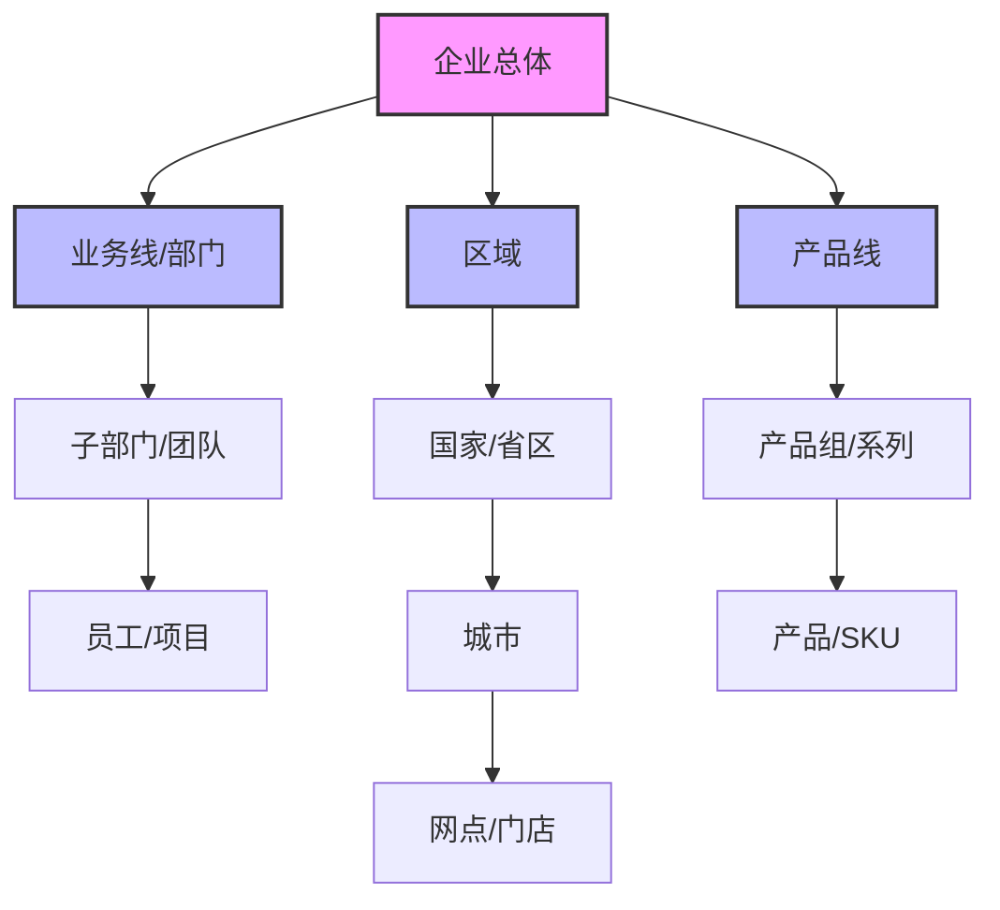

---
{"dg-publish":true,"tags":["财务BI","数据模型","计算逻辑","汇总拆解","数据分析"],"aliases":["层级计算逻辑","上卷下钻"],"permalink":"/知识共享/001_财务/02_财务BI看板项目/数据模型设计/计算逻辑设计/汇总与拆解逻辑/","dgPassFrontmatter":true}
---


# 汇总与拆解逻辑

## 概述

汇总与拆解逻辑是财务BI系统中的核心计算模型，用于处理不同维度层级和粒度的数据聚合与分解，支持从宏观到微观的多层次分析。一个设计良好的汇总拆解逻辑框架能够确保数据在各层级间的一致性、可追溯性和可理解性，为财务分析提供坚实基础。本文档系统梳理汇总拆解逻辑的设计方法和应用场景，为财务BI看板提供标准化的计算框架。

## 汇总拆解基本原理

### 核心概念

| 概念 | 定义 | 应用场景 | 实现方式 |
| ---- | ---- | ---- | ---- |
| 汇总(Roll-up) | 将低级别数据聚合到高级别 | 综合报表、管理视图 | SUM/AVG/COUNT等聚合函数 |
| 拆解(Drill-down) | 将高级别数据分解到低级别 | 原因分析、追根溯源 | 维度下钻、明细查询 |
| 分配(Allocation) | 将高级别数据按规则分配到低级别 | 成本分摊、预算分解 | 比例分配、驱动因素分配 |
| 合并(Consolidation) | 考虑内部交易的多实体汇总 | 集团报表、消除内部交易 | 抵消分录、合并调整 |
| 衍生计算(Derived Calculation) | 基于已有指标的计算生成新指标 | 比率分析、增长率计算 | 公式计算、条件逻辑 |

### 汇总拆解的层级关系



## 汇总逻辑设计

### 常见汇总类型及适用指标

| 汇总类型 | 计算方法 | 适用指标 | 设计考虑 |
| ---- | ---- | ---- | ---- |
| 加法汇总 | SUM() | 销售额、成本、利润、数量 | 确保单位一致性、避免重复计算 |
| 平均值汇总 | AVG() | 价格、比率、评分、时长 | 考虑加权平均的必要性 |
| 加权平均汇总 | SUM(指标×权重)/SUM(权重) | 利润率、单价、汇率 | 选择合适的权重因素 |
| 计数汇总 | COUNT() | 客户数、订单数、产品数 | 处理重复记录、设置计数规则 |
| 去重计数汇总 | COUNT(DISTINCT) | 不重复客户数、不重复产品数 | 确保唯一标识字段的准确性 |
| 最大/最小值汇总 | MAX()/MIN() | 最高价格、最低库存、极值 | 处理异常值影响 |
| 时间汇总 | 按时间单位聚合 | 日→周→月→季→年 | 处理不同时间周期长度差异 |
| 百分比汇总 | 加权平均或重新计算 | 利润率、增长率、占比 | 避免简单平均导致的偏差 |

### 汇总设计原则

1. **指标一致性**：确保同一指标在不同层级具有一致的定义和计算方法
2. **避免重复计算**：设计数据模型防止重复计算，特别是交叉维度分析时
3. **汇总路径明确**：清晰定义每个指标的汇总路径和层级依赖关系
4. **处理特殊值**：明确定义如何处理汇总过程中的NULL值、零值和负值
5. **汇总时间选择**：根据数据更新频率和查询性能需求，选择预计算或实时计算
6. **汇总粒度定义**：根据分析需求定义合理的汇总粒度，在存储空间和查询性能间取得平衡

### 汇总计算SQL实现示例

**简单汇总**
```sql
-- 销售额按产品类别汇总
SELECT 
    product_category,
    SUM(sales_amount) AS total_sales
FROM 
    sales_fact
GROUP BY 
    product_category;
```

**多层级汇总**
```sql
-- 销售额按产品类别、区域的层级汇总
WITH sales_by_category_region AS (
    SELECT 
        product_category,
        region,
        SUM(sales_amount) AS sales_amount
    FROM 
        sales_fact
    GROUP BY 
        product_category, region
),
sales_by_category AS (
    SELECT 
        product_category,
        'ALL' AS region,
        SUM(sales_amount) AS sales_amount
    FROM 
        sales_fact
    GROUP BY 
        product_category
),
sales_by_region AS (
    SELECT 
        'ALL' AS product_category,
        region,
        SUM(sales_amount) AS sales_amount
    FROM 
        sales_fact
    GROUP BY 
        region
),
total_sales AS (
    SELECT 
        'ALL' AS product_category,
        'ALL' AS region,
        SUM(sales_amount) AS sales_amount
    FROM 
        sales_fact
)
SELECT * FROM sales_by_category_region
UNION ALL SELECT * FROM sales_by_category
UNION ALL SELECT * FROM sales_by_region
UNION ALL SELECT * FROM total_sales;
```

**加权平均汇总**
```sql
-- 产品毛利率按销售额加权平均汇总到产品类别
SELECT 
    product_category,
    SUM(gross_profit) / SUM(sales_amount) AS category_margin
FROM 
    sales_fact
GROUP BY 
    product_category;
```

## 拆解逻辑设计

### 常见拆解类型及应用

| 拆解类型 | 实现方式 | 应用场景 | 设计考虑 |
| ---- | ---- | ---- | ---- |
| 维度拆解 | 按维度层级下钻 | 销售额拆解为产品、区域、客户贡献 | 确保维度层级清晰，支持多路径下钻 |
| 结构拆解 | 按组成部分拆分 | 成本拆解为直接成本、间接成本 | 明确定义组成部分，确保加总一致 |
| 因素拆解 | 按影响因素分解 | 销售额变化拆解为价格、数量、结构影响 | 设计因素分解算法，处理交叉影响 |
| 时间拆解 | 按时间单位细分 | 年度指标拆解为季度、月度表现 | 处理时间周期不等长问题 |
| 归因拆解 | 按贡献来源归因 | 新客户来源拆解为不同获客渠道 | 设计归因规则，处理多触点归因 |
| 贡献度拆解 | 按贡献比例分解 | 总利润变化拆解为各产品贡献度 | 计算各组成部分对总体的影响程度 |

### 拆解设计原则

1. **层级一致性**：确保拆解结果与汇总数据保持一致，避免数据出入
2. **粒度合理性**：根据分析需求和数据可获得性，设计合适的拆解粒度
3. **追溯能力**：支持逐层下钻，提供数据追溯能力
4. **计算高效性**：在设计拆解路径时兼顾计算效率和存储成本
5. **展示清晰性**：设计直观的拆解视图，易于理解和解读
6. **动态拆解**：支持用户自定义拆解维度和路径，提高分析灵活性

### 拆解计算SQL实现示例

**维度拆解**
```sql
-- 将总销售额拆解为各产品类别的贡献
SELECT 
    product_category,
    SUM(sales_amount) AS category_sales,
    SUM(sales_amount) / SUM(SUM(sales_amount)) OVER() AS contribution_pct
FROM 
    sales_fact
GROUP BY 
    product_category
ORDER BY 
    category_sales DESC;
```

**因素拆解**
```sql
-- 将销售额变化拆解为价格、数量和结构因素
WITH current_period AS (
    SELECT 
        product_id,
        SUM(quantity) AS qty,
        SUM(sales_amount) AS sales,
        SUM(sales_amount) / SUM(quantity) AS price
    FROM 
        sales_fact
    WHERE 
        period = 'current'
    GROUP BY 
        product_id
),
previous_period AS (
    SELECT 
        product_id,
        SUM(quantity) AS qty,
        SUM(sales_amount) AS sales,
        SUM(sales_amount) / SUM(quantity) AS price
    FROM 
        sales_fact
    WHERE 
        period = 'previous'
    GROUP BY 
        product_id
),
total_change AS (
    SELECT 
        SUM(c.sales) - SUM(p.sales) AS total_change
    FROM 
        current_period c
    JOIN 
        previous_period p ON c.product_id = p.product_id
),
factor_analysis AS (
    SELECT 
        c.product_id,
        -- 价格因素影响
        (c.price - p.price) * p.qty AS price_effect,
        -- 数量因素影响
        (c.qty - p.qty) * p.price AS quantity_effect,
        -- 结构因素影响(交叉项)
        (c.price - p.price) * (c.qty - p.qty) AS mix_effect
    FROM 
        current_period c
    JOIN 
        previous_period p ON c.product_id = p.product_id
)
SELECT 
    'Price Effect' AS factor,
    SUM(price_effect) AS effect_value,
    SUM(price_effect) / (SELECT total_change FROM total_change) AS contribution_pct
FROM 
    factor_analysis
UNION ALL
SELECT 
    'Quantity Effect' AS factor,
    SUM(quantity_effect) AS effect_value,
    SUM(quantity_effect) / (SELECT total_change FROM total_change) AS contribution_pct
FROM 
    factor_analysis
UNION ALL
SELECT 
    'Mix Effect' AS factor,
    SUM(mix_effect) AS effect_value,
    SUM(mix_effect) / (SELECT total_change FROM total_change) AS contribution_pct
FROM 
    factor_analysis;
```

## 特殊计算逻辑

### 分配与分摊计算

| 分配类型 | 计算方法 | 应用场景 | 设计考虑 |
| ---- | ---- | ---- | ---- |
| 均等分配 | 按数量平均分配 | 简单成本分摊，资源平均分配 | 适用于相对均质的分配对象 |
| 比例分配 | 按指定指标比例分配 | 按收入/成本/利润占比分配 | 选择合适的分配基准指标 |
| 加权分配 | 按权重系数分配 | 按资源消耗权重分配成本 | 设计合理的权重系数体系 |
| 驱动因素分配 | 按业务驱动因素分配 | 按实际业务情况分配间接成本 | 识别核心业务驱动因素 |
| 优先级分配 | 按优先级顺序分配 | 有限资源优先分配规则 | 明确定义优先级规则 |
| 阶梯式分配 | 按阶梯标准分配 | 递进式分配，如奖金分配 | 设计合理的阶梯标准 |

### 合并调整计算

| 调整类型 | 计算方法 | 应用场景 | 设计考虑 |
| ---- | ---- | ---- | ---- |
| 内部交易抵消 | 识别并抵消内部交易 | 集团合并报表 | 准确识别内部交易，保留必要明细 |
| 合并调整分录 | 添加合并级别的调整分录 | 商誉调整、公允价值调整 | 设计调整分录的应用层级和范围 |
| 少数股东权益计算 | 按持股比例计算少数股东权益 | 非全资子公司合并 | 跟踪持股比例变化，计算权益份额 |
| 分步合并计算 | 处理多层股权关系 | 复杂股权结构合并 | 设计多级持股链路的数据模型 |
| 权益法调整 | 按权益法调整长期股权投资 | 联营企业合并 | 跟踪投资收益和其他权益变动 |

### 衍生指标计算

| 衍生类型 | 计算方法 | 应用场景 | 设计考虑 |
| ---- | ---- | ---- | ---- |
| 比率计算 | 两个指标的比值 | 利润率、周转率、资产负债率 | 处理分母为零情况，设置计算精度 |
| 复合增长率 | 终值/始值^(1/期数)-1 | 多期增长率计算 | 确保期间长度一致，处理负值情况 |
| 累计计算 | 连续求和或求积 | 年度累计、滚动12个月 | 定义累计起始点，处理期间不完整情况 |
| 移动平均 | N期数值的平均值 | 趋势分析、季节性平滑 | 选择合适的窗口大小，处理边界数据 |
| 同环比计算 | (本期-对比期)/对比期 | 业务增长分析 | 确保可比性，处理基期为零情况 |
| 占比计算 | 部分/整体 | 结构分析、贡献分析 | 保证占比之和为100%，处理小数点精度 |

## 数据一致性保障

### 一致性挑战与解决方案

| 挑战类型 | 常见问题 | 解决方案 | 实施建议 |
| ---- | ---- | ---- | ---- |
| 数据粒度不一致 | 不同粒度数据难以关联分析 | 设计统一的粒度体系，建立粒度转换规则 | 基于最细粒度构建汇总层，保持计算一致性 |
| 计算路径差异 | 不同路径汇总结果不一致 | 统一计算路径，明确计算优先级 | 文档化汇总规则，实施汇总结果校验 |
| 指标定义混淆 | 相同指标名称不同含义 | 建立统一指标词典，规范指标定义 | 实施指标审核机制，确保概念清晰 |
| 时间域不一致 | 不同时间口径导致数据不一致 | 统一时间定义，明确时间边界 | 建立标准时间维度，规范时间汇总逻辑 |
| 汇率与单位不一致 | 不同币种和单位混用 | 建立统一汇率和单位转换体系 | 明确展示币种和单位，提供转换功能 |
| 舍入与精度问题 | 汇总数据与明细加总有差异 | 统一精度和舍入规则，记录汇总差异 | 在数据仓库保留高精度数据，在前端展示时统一精度 |

### 一致性验证机制

1. **汇总一致性验证**：汇总值应等于所有下级明细的总和（允许可控的舍入差异）
2. **交叉一致性验证**：不同维度视角下的汇总值应保持一致
3. **时间一致性验证**：期初余额+本期变动应等于期末余额
4. **内外一致性验证**：内部管理报表与对外报告数据应能够勾稽
5. **历史一致性验证**：保证历史数据在汇总逻辑变更后的连续性
6. **数据质量监控**：实施持续的数据质量监控，及时发现和解决一致性问题

## 应用场景与最佳实践

### 财务报表分析

| 应用场景 | 汇总拆解设计 | 关键指标 | 实现建议 |
| ---- | ---- | ---- | ---- |
| 利润表分析 | 按产品/区域/部门拆解利润构成 | 收入、成本、费用、利润 | 设计利润层级结构，支持多维拆解 |
| 资产负债表分析 | 按资产/负债类别分析结构变化 | 资产、负债、所有者权益 | 建立资金来源与运用双向视图 |
| 现金流量表分析 | 按业务/投资/筹资活动分析现金流 | 经营/投资/筹资现金流 | 构建现金流来源与用途追踪体系 |
| 综合财务分析 | 整合三大报表构建财务全景图 | 盈利能力、营运能力、偿债能力 | 建立报表间关联关系和联动分析 |

### 业务绩效分析

| 应用场景 | 汇总拆解设计 | 关键指标 | 实现建议 |
| ---- | ---- | ---- | ---- |
| 销售绩效分析 | 按产品/客户/渠道/区域拆解 | 销售额、销量、客单价、毛利 | 构建多维销售分析立方体 |
| 成本绩效分析 | 按成本类型/责任中心拆解 | 直接成本、间接成本、单位成本 | 设计成本归因模型，跟踪成本驱动因素 |
| 经营效率分析 | 按效率指标拆解业绩差异 | 资产周转率、人效、坪效 | 建立效率分解树，识别改进机会 |
| 战略目标分解 | 将总体目标拆解到业务单元 | KPI完成率、战略举措进度 | 实施目标级联，支持自上而下分解和自下而上汇总 |

### 管理决策支持

| 应用场景 | 汇总拆解设计 | 关键指标 | 实现建议 |
| ---- | ---- | ---- | ---- |
| 预算编制与分解 | 将总预算分解到各责任主体 | 预算额度、分配比例、目标值 | 支持自上而下和自下而上的预算编制流程 |
| 资源配置优化 | 基于投入产出分析优化资源分配 | ROI、资源使用效率、边际收益 | 构建资源配置模拟场景，支持多方案对比 |
| 投资组合管理 | 分析投资组合收益风险结构 | 投资回报率、风险指标、投资比例 | 建立投资组合视图，支持投资结构调整 |
| 价值创造分析 | 识别价值创造与价值流失环节 | EVA、价值贡献、价值漏损 | 实施价值链分析，追踪价值流动 |

## 汇总拆解分析应用示例

### 利润结构分析看板

**目标**：深入分析企业利润构成及影响因素，识别利润增长点和改进机会

**核心指标**：
- 利润构成（按产品/渠道/区域拆解）
- 利润变化因素（量价/结构/成本变化影响）
- 利润贡献度（各业务单元对总利润的贡献）
- 利润率结构（各环节毛利率/营业利润率/净利率）

**交互功能**：
- 多维度利润拆解切换
- 利润瀑布图因素分析
- 利润贡献热力图
- 利润结构同环比对比

**分析价值**：明确利润来源，识别优势和劣势业务，优化资源配置，提升整体利润水平

### 预算执行拆解看板

**目标**：跟踪预算执行情况，发现偏差并分析原因，支持预算调整决策

**核心指标**：
- 预算执行差异（按科目/部门拆解）
- 预算完成率分布
- 差异原因分解（价格/数量/效率因素）
- 预算执行趋势与预测

**交互功能**：
- 预算差异钻取分析
- 执行率区间分布切换
- 差异归因分析
- 预算调整场景模拟

**分析价值**：及时发现预算执行异常，分析根本原因，采取纠偏措施，优化预算管理流程

### 销售业绩归因看板

**目标**：全面分析销售业绩的驱动因素，明确各因素的贡献度，优化销售策略

**核心指标**：
- 销售增长因素拆解（价格/数量/产品结构/客户结构/渠道结构）
- 客户贡献度分析（新客户/老客户，不同客户群贡献）
- 产品组合贡献分析
- 渠道效率与贡献分析

**交互功能**：
- 多维度增长因素切换
- 贡献度瀑布图分析
- 客户/产品生命周期视图
- 渠道投入产出分析

**分析价值**：明确销售增长驱动因素，优化销售策略和资源配置，提升销售效率和效果 