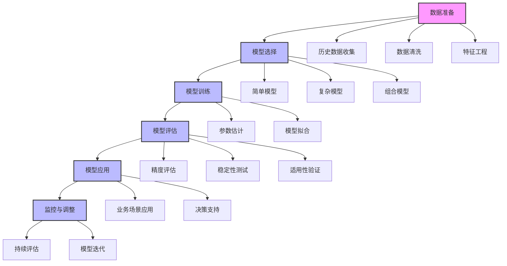

---
{"dg-publish":true,"tags":["财务BI","数据模型","计算逻辑","预测模型","预测分析"],"aliases":["财务预测模型","业务预测"],"permalink":"/知识共享/001_财务/02_财务BI看板项目/数据模型设计/计算逻辑设计/预测模型设计/","dgPassFrontmatter":true}
---


# 预测模型设计

## 概述

预测模型是财务BI系统中的高级分析功能，通过对历史数据的分析和挖掘，预测未来业务走势和财务表现，为管理决策提供前瞻性指导。一个设计良好的预测模型能够提高企业对未来的洞察力，优化资源配置，提升决策质量。本文档系统梳理财务BI看板中常用的预测模型类型、设计方法和应用场景，提供预测分析的标准化框架。

## 预测模型基本框架

### 核心预测类型

| 预测类型 | 特点 | 应用场景 | 实现方法 |
| ---- | ---- | ---- | ---- |
| 趋势预测 | 基于历史趋势的延伸 | 相对稳定的业务环境 | 趋势线、移动平均、指数平滑 |
| 季节性预测 | 考虑周期性波动因素 | 具有明显季节特征的业务 | 季节性分解、SARIMA模型 |
| 因果预测 | 分析影响因素建立关系模型 | 受多因素影响的复杂业务 | 回归分析、因子模型 |
| 情景预测 | 模拟不同假设下的多种场景 | 高不确定性环境 | 情景规划、敏感性分析 |
| 组合预测 | 结合多种预测方法的优势 | 追求更稳健的预测结果 | 加权平均、集成学习 |

### 预测周期与粒度

| 预测周期 | 特点 | 应用场景 | 方法选择 |
| ---- | ---- | ---- | ---- |
| 短期预测(1-3个月) | 高精度，注重细节 | 运营决策、资金管理 | 时间序列、短期趋势 |
| 中期预测(季度-1年) | 平衡精度与前瞻性 | 预算规划、资源配置 | 因果模型、滚动预测 |
| 长期预测(1-3年) | 关注趋势，较低精度 | 战略规划、投资决策 | 趋势分析、情景规划 |
| 超长期预测(3年以上) | 战略方向，定性为主 | 长期战略、重大投资 | 情景分析、专家判断 |

## 常用预测模型方法

### 时间序列预测模型

| 模型类型 | 适用场景 | 实现方法 | 优缺点 |
| ---- | ---- | ---- | ---- |
| 移动平均 | 平滑短期波动 | 计算过去N期的平均值 | 简单直观，但滞后性强 |
| 指数平滑 | 具有趋势的数据 | 对近期数据赋予更高权重 | 响应迅速，但容易受异常值影响 |
| ARIMA | 有自相关性的数据 | 差分+自回归+移动平均 | 捕捉复杂模式，但需较多历史数据 |
| SARIMA | 季节性数据 | ARIMA+季节性因素 | 适合季节性数据，模型复杂 |
| Holt-Winters | 趋势+季节性数据 | 三参数指数平滑 | 平衡简单性和精度，广泛应用 |

### 因果预测模型

| 模型类型 | 适用场景 | 实现方法 | 优缺点 |
| ---- | ---- | ---- | ---- |
| 线性回归 | 简单线性关系 | 最小二乘法拟合 | 直观易解释，但假设严格 |
| 多元回归 | 受多因素影响 | 多自变量拟合 | 考虑多因素，但存在多重共线性风险 |
| 时间序列回归 | 时间相关+因果 | 加入时间因素的回归 | 结合时间和因果，复杂度适中 |
| 弹性分析 | 价格-需求关系 | 基于弹性系数的预测 | 经济学理论支持，适合价格决策 |
| 机器学习模型 | 复杂非线性关系 | 随机森林/神经网络等 | 捕捉复杂模式，但解释性较差 |

### 预测评估与优化

| 评估维度 | 评估方法 | 关键指标 | 优化方向 |
| ---- | ---- | ---- | ---- |
| 准确性 | 预测值与实际值比较 | MAE/RMSE/MAPE | 减小预测误差 |
| 偏差性 | 系统性高估或低估 | 平均偏差、偏差趋势 | 消除系统性偏差 |
| 稳定性 | 预测结果的一致性 | 预测方差、区间宽度 | 提高预测稳定性 |
| 前瞻性 | 反映趋势变化的能力 | 拐点识别率、趋势一致性 | 增强趋势预判能力 |
| 适应性 | 应对环境变化的能力 | 异常环境下的表现 | 提高模型适应性 |

## 财务预测模型应用

### 销售预测模型

| 应用场景 | 预测方法 | 关键因素 | 设计建议 |
| ---- | ---- | ---- | ---- |
| 总体销售预测 | 趋势+季节性模型 | 历史销售、季节因素、市场趋势 | 结合宏观因素和微观指标 |
| 产品销售预测 | 生命周期+市场因素 | 产品生命周期阶段、竞争状况 | 考虑产品特性和市场定位 |
| 区域销售预测 | 地域特性+经济因素 | 区域经济指标、消费者行为 | 区分不同市场特性，分别建模 |
| 客户需求预测 | 客户行为+关系模型 | 客户历史、行业趋势、关系强度 | 细分客户群体，差异化预测 |
| 新产品销售预测 | 类比法+扩散模型 | 相似产品表现、市场接受度 | 借鉴类似产品经验，考虑创新扩散 |

### 成本预测模型

| 应用场景 | 预测方法 | 关键因素 | 设计建议 |
| ---- | ---- | ---- | ---- |
| 原材料成本预测 | 价格趋势+市场分析 | 商品价格、供需关系、政策变化 | 关注价格驱动因素，建立早期预警 |
| 人工成本预测 | 人员结构+薪资趋势 | 人员规模、薪资水平、效率变化 | 考虑组织发展和效率提升因素 |
| 制造成本预测 | 作业成本+效率模型 | 产能利用率、效率改进、规模效应 | 分析固定成本和变动成本结构 |
| 运营成本预测 | 活动驱动+关联分析 | 业务量、服务水平、运营效率 | 基于业务驱动因素建模 |
| 间接成本预测 | 趋势分析+分配模型 | 组织规模、支持活动、管理效率 | 建立成本与价值驱动因素的关联 |

### 现金流预测模型

| 应用场景 | 预测方法 | 关键因素 | 设计建议 |
| ---- | ---- | ---- | ---- |
| 经营现金流预测 | 利润调整+周期模型 | 利润表现、运营资本变化 | 考虑盈利能力和资金周转效率 |
| 投资现金流预测 | 项目计划+时序调整 | 资本支出计划、投资回收 | 基于投资计划和历史执行率 |
| 筹资现金流预测 | 融资需求+还款计划 | 偿债能力、融资环境、资本结构 | 结合负债管理战略和市场变化 |
| 流动性预测 | 敏感性+压力测试 | 极端情况、风险事件、缓冲能力 | 评估不同情景下的流动性安全边际 |
| 资金缺口预测 | 累计流量+临界点 | 收支时间差、资金缓冲、季节性 | 精细化预测现金流入流出时间 |

## 预测模型实现方法

### 基本实现模式



### 常用算法实现示例

**线性回归预测销售额**

```python
import pandas as pd
import numpy as np
from sklearn.linear_model import LinearRegression
from sklearn.model_selection import train_test_split

# 准备数据
df = pd.DataFrame({
    'advertising': [150, 200, 250, 300, 350, 400, 450, 500, 550, 600],
    'competitor_price': [120, 110, 115, 130, 140, 125, 135, 145, 150, 155],
    'consumer_sentiment': [0.8, 0.7, 0.9, 0.8, 0.85, 0.9, 0.95, 0.85, 0.9, 0.95],
    'sales': [180, 200, 250, 280, 320, 350, 370, 400, 440, 480]
})

# 特征和目标变量
X = df[['advertising', 'competitor_price', 'consumer_sentiment']]
y = df['sales']

# 划分训练集和测试集
X_train, X_test, y_train, y_test = train_test_split(X, y, test_size=0.2, random_state=42)

# 训练模型
model = LinearRegression()
model.fit(X_train, y_train)

# 预测
y_pred = model.predict(X_test)

# 评估
from sklearn.metrics import mean_absolute_error, mean_squared_error, r2_score
mae = mean_absolute_error(y_test, y_pred)
rmse = np.sqrt(mean_squared_error(y_test, y_pred))
r2 = r2_score(y_test, y_pred)

print(f"MAE: {mae}")
print(f"RMSE: {rmse}")
print(f"R2: {r2}")

# 系数解读
coefficients = pd.DataFrame({
    'Feature': X.columns,
    'Coefficient': model.coef_
})
print(coefficients)

# 预测未来销售
future_conditions = pd.DataFrame({
    'advertising': [650],
    'competitor_price': [160],
    'consumer_sentiment': [0.92]
})
future_sales = model.predict(future_conditions)
print(f"Predicted future sales: {future_sales[0]}")
```

**时间序列预测现金流**

```python
import pandas as pd
import numpy as np
from statsmodels.tsa.holtwinters import ExponentialSmoothing

# 准备月度现金流数据
cash_flow_data = pd.Series([
    120000, 125000, 130000, 135000, 140000, 138000,
    142000, 145000, 148000, 151000, 149000, 153000,
    156000, 159000, 162000, 164000, 167000, 169000
], index=pd.date_range(start='2022-01-01', periods=18, freq='M'))

# 训练Holt-Winters季节性模型
model = ExponentialSmoothing(
    cash_flow_data, 
    trend='add',
    seasonal='add', 
    seasonal_periods=12
)
results = model.fit()

# 预测未来6个月
forecast_horizon = 6
forecast = results.forecast(forecast_horizon)

# 可视化
import matplotlib.pyplot as plt
plt.figure(figsize=(12, 6))
plt.plot(cash_flow_data, label='历史现金流')
plt.plot(forecast, label='预测现金流')
plt.title('现金流预测')
plt.xlabel('日期')
plt.ylabel('现金流量')
plt.legend()
plt.grid(True)
plt.savefig('cash_flow_forecast.png')

# 评估指标
from sklearn.metrics import mean_absolute_percentage_error
train_size = int(len(cash_flow_data) * 0.8)
train_data = cash_flow_data[:train_size]
test_data = cash_flow_data[train_size:]

validation_model = ExponentialSmoothing(
    train_data, 
    trend='add',
    seasonal='add', 
    seasonal_periods=12
)
validation_results = validation_model.fit()
validation_forecast = validation_results.forecast(len(test_data))

mape = mean_absolute_percentage_error(test_data, validation_forecast)
print(f"MAPE: {mape:.2%}")

# 区间预测
forecast_ci = pd.DataFrame({
    'forecast': forecast,
    'lower_bound': forecast - 1.96 * results.sse,
    'upper_bound': forecast + 1.96 * results.sse
})
print(forecast_ci)
```

## 预测模型应用最佳实践

### 预测模型设计原则

1. **简单优先**：从简单模型开始，逐步增加复杂性，避免过度拟合
2. **商业洞察**：将业务知识融入模型设计，提高预测的实用性和可解释性
3. **稳健性**：优先考虑在各种情况下表现稳定的模型，而非仅在特定条件下高精度的模型
4. **多视角验证**：使用多种方法交叉验证预测结果，提高预测可靠性
5. **持续评估**：定期评估预测准确性，及时调整和优化预测模型
6. **情景多元化**：提供基准、乐观和保守等多种预测情景，支持风险管理
7. **易于理解**：确保预测模型和结果易于业务人员理解和应用

### 常见问题与解决方案

| 问题类型 | 表现症状 | 解决方案 | 预防措施 |
| ---- | ---- | ---- | ---- |
| 数据质量问题 | 预测结果不稳定或偏差大 | 加强数据清洗，处理异常值和缺失值 | 建立数据质量监控机制，确保源数据准确性 |
| 过度拟合 | 历史拟合好但预测差 | 简化模型，增加正则化，交叉验证 | 在模型设计初期注重泛化能力 |
| 变量选择不当 | 关键变量缺失或冗余变量过多 | 变量重要性分析，逐步回归 | 结合业务理解选择变量，定期评估变量有效性 |
| 模型假设违反 | 实际情况与模型假设不符 | 选择更合适的模型类型，放宽假设 | 充分了解业务特性，选择匹配的模型 |
| 环境变化影响 | 模型对突发事件反应不灵敏 | 引入调整因子，定期重新校准 | 构建异常事件检测机制，快速调整预测 |
| 预测区间过窄 | 低估不确定性和风险 | 提供合理的预测区间，考虑预测方差 | 基于历史预测误差构建合理置信区间 |

## 预测模型展示与应用

### 销售预测看板

**目标**：提供多维度、多场景的销售预测，支持销售计划和库存管理决策

**核心指标**：
- 总体销售预测趋势
- 产品/客户/区域销售预测
- 预测准确性评估
- 风险与机会评估

**交互功能**：
- 预测周期调整（月/季/年）
- 预测维度切换
- 情景模拟（基准/乐观/保守）
- 影响因素敏感性分析

**关键价值**：优化库存管理，提高市场响应速度，支持资源优化配置

### 现金流预测看板

**目标**：准确预测短期和中期现金流，支持流动性管理和融资决策

**核心指标**：
- 经营/投资/筹资现金流预测
- 现金余额趋势预测
- 资金缺口预测与预警
- 现金流风险评估

**交互功能**：
- 时间粒度调整（日/周/月）
- 情景假设调整
- 资金缺口分析
- 压力测试模拟

**关键价值**：优化现金管理，降低流动性风险，提高资金使用效率

### 利润预测看板

**目标**：预测未来利润表现，评估盈利能力变化趋势，支持战略决策

**核心指标**：
- 收入/成本/利润预测
- 利润率变化趋势
- 盈亏平衡分析
- 利润驱动因素贡献

**交互功能**：
- 预测期间调整
- 收入/成本假设调整
- 敏感性分析
- 情景对比分析

**关键价值**：支持价格策略优化，成本控制，业务结构调整决策 