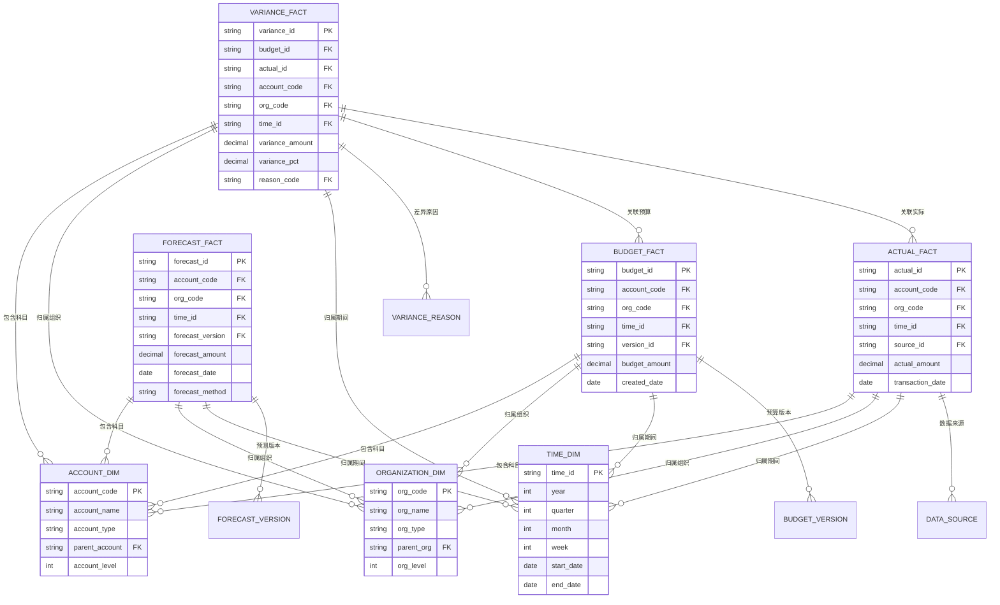

---
{"dg-publish":true,"tags":["财务BI","数据模型","计算逻辑","预算分析","预算执行"],"aliases":["预算实际差异","预算执行分析"],"permalink":"/知识共享/001_财务/02_财务BI看板项目/数据模型设计/计算逻辑设计/预算与实际对比/","dgPassFrontmatter":true}
---


# 预算与实际对比

## 概述

预算与实际对比是财务BI系统中的核心分析模型，通过比较预算目标与实际结果，评估经营绩效，发现偏差原因，支持及时调整和管理决策。一个设计合理的预算实际对比框架能够帮助企业强化预算管理，提高预测准确性，优化资源配置。本文档系统梳理预算与实际对比的计算方法、分析模型和应用场景，为财务BI看板提供预算分析的标准化解决方案。

## 基本概念与框架

### 核心术语定义

| 术语 | 定义 | 应用场景 | 计算说明 |
| ---- | ---- | ---- | ---- |
| 预算(Budget) | 计划期内的目标值 | 目标设定、资源分配 | 可细分为各类预算类型 |
| 实际(Actual) | 已发生的实际值 | 业绩评估、差异分析 | 来自交易系统的实际数据 |
| 预测(Forecast) | 对未来期间的预测值 | 趋势预测、调整决策 | 基于实际和趋势的滚动预测 |
| 差异(Variance) | 实际与预算的差额 | 差异分析、原因追踪 | 实际值-预算值 |
| 完成率(Completion Rate) | 实际值占预算值的比例 | 预算执行评估 | 实际值/预算值 |
| 差异率(Variance Rate) | 差异值占预算值的比例 | 偏差严重程度评估 | (实际值-预算值)/预算值 |
| 偏差警戒线(Threshold) | 允许的差异范围 | 异常监控、预警 | 根据业务特性设定的容差范围 |

### 预算分析框架


## 预算实际对比计算方法

### 基础对比计算

| 计算指标 | 计算公式 | 应用场景 | 解读指南 |
| ---- | ---- | ---- | ---- |
| 绝对差异 | 实际值 - 预算值 | 差异大小评估 | 正值表示超预算，负值表示未达预算 |
| 相对差异(%) | (实际值 - 预算值) / 预算值 × 100% | 差异程度评估 | 更直观反映偏差程度 |
| 预算完成率(%) | 实际值 / 预算值 × 100% | 预算达成评估 | 100%表示刚好达成预算 |
| 剩余预算 | 预算值 - 已用金额 | 预算控制 | 评估剩余可用预算 |
| 预算消耗率(%) | 已用金额 / 预算值 × 100% | 预算使用进度 | 评估预算使用节奏 |
| 预算偏差状态 | 根据差异率与警戒线比较 | 异常监控 | 超差、正常、节余等状态划分 |

### 时间维度对比

| 对比类型 | 计算方法 | 应用场景 | 设计考虑 |
| ---- | ---- | ---- | ---- |
| 月度对比 | 当月实际 vs 当月预算 | 月度绩效评估 | 消除月份天数差异 |
| 累计对比 | 年初至今实际 vs 年初至今预算 | 年度进度评估 | 平滑月度波动，反映整体趋势 |
| 滚动周期对比 | 最近N月实际 vs 最近N月预算 | 短期趋势分析 | 消除季节性影响 |
| 同比预算对比 | 今年预算执行 vs 去年预算执行 | 预算管理改进评估 | 评估预算管理能力提升 |
| 全年预测对比 | 全年预测值 vs 全年预算 | 全年目标达成预测 | 支持及时调整决策 |

### 因素分解计算

| 分解维度 | 分解方法 | 应用场景 | 实施建议 |
| ---- | ---- | ---- | ---- |
| 价格/数量分解 | 将收入差异分解为价格和数量因素 | 销售预算差异分析 | 识别核心驱动因素，明确责任主体 |
| 成本结构分解 | 将成本差异分解为各成本要素 | 成本预算差异分析 | 关注主要成本项目和异常变化 |
| 效率/效果分解 | 将业绩差异分解为效率和效果因素 | 运营预算差异分析 | 区分内部效率和外部市场因素 |
| 固定/变动分解 | 将费用差异分解为固定和变动部分 | 费用预算差异分析 | 识别成本结构问题，优化资源配置 |
| 组织责任分解 | 将总体差异分解到责任部门 | 责任划分与绩效考核 | 明确责任边界，支持问责机制 |

### 预算执行预测计算

| 预测方法 | 计算逻辑 | 应用场景 | 实施建议 |
| ---- | ---- | ---- | ---- |
| 线性预测 | 基于已完成比例线性外推 | 简单趋势预测 | 适用于稳定业务，季节性弱的场景 |
| 季节性预测 | 结合历史季节性模式的预测 | 有明显季节波动的业务 | 利用历史同期数据修正预测 |
| 趋势调整预测 | 基于最近趋势调整的预测 | 业务结构变化情况 | 加大最近期间数据权重 |
| 综合因素预测 | 考虑多种内外部因素的复合预测 | 复杂业务环境 | 构建多因素预测模型，包含关键变量 |
| 情景模拟预测 | 基于不同假设的多情景预测 | 高不确定性环境 | 设定乐观、中性、保守多种情景 |

## 预算实际对比SQL实现

### 基本对比计算SQL

```sql
-- 月度预算实际对比
SELECT 
    dept_code,
    dept_name,
    budget_month,
    budget_amount,
    actual_amount,
    actual_amount - budget_amount AS variance,
    (actual_amount - budget_amount) / NULLIF(budget_amount, 0) * 100 AS variance_pct,
    actual_amount / NULLIF(budget_amount, 0) * 100 AS completion_rate,
    CASE 
        WHEN (actual_amount - budget_amount) / NULLIF(budget_amount, 0) > 0.1 THEN 'Over Budget'
        WHEN (actual_amount - budget_amount) / NULLIF(budget_amount, 0) < -0.1 THEN 'Under Budget'
        ELSE 'On Track'
    END AS status
FROM 
    budget_vs_actual
WHERE 
    budget_year = 2023
    AND budget_month = 6
ORDER BY 
    dept_code;
```

### 累计对比计算SQL

```sql
-- 年度累计预算实际对比
WITH budget_ytd AS (
    SELECT 
        dept_code,
        SUM(budget_amount) AS ytd_budget
    FROM 
        budget_table
    WHERE 
        budget_year = 2023
        AND budget_month <= 6
    GROUP BY 
        dept_code
),
actual_ytd AS (
    SELECT 
        dept_code,
        SUM(actual_amount) AS ytd_actual
    FROM 
        actual_table
    WHERE 
        actual_year = 2023
        AND actual_month <= 6
    GROUP BY 
        dept_code
)
SELECT 
    b.dept_code,
    d.dept_name,
    b.ytd_budget,
    a.ytd_actual,
    a.ytd_actual - b.ytd_budget AS ytd_variance,
    (a.ytd_actual - b.ytd_budget) / NULLIF(b.ytd_budget, 0) * 100 AS ytd_variance_pct,
    a.ytd_actual / NULLIF(b.ytd_budget, 0) * 100 AS ytd_completion_rate
FROM 
    budget_ytd b
JOIN 
    actual_ytd a ON b.dept_code = a.dept_code
JOIN 
    department d ON b.dept_code = d.dept_code
ORDER BY 
    ytd_variance_pct DESC;
```

### 预测计算SQL

```sql
-- 基于当前执行情况的年度预测
WITH actual_ytd AS (
    SELECT 
        dept_code,
        SUM(actual_amount) AS ytd_actual
    FROM 
        actual_table
    WHERE 
        actual_year = 2023
        AND actual_month <= 6
    GROUP BY 
        dept_code
),
budget_full_year AS (
    SELECT 
        dept_code,
        SUM(budget_amount) AS annual_budget
    FROM 
        budget_table
    WHERE 
        budget_year = 2023
    GROUP BY 
        dept_code
),
budget_ytd AS (
    SELECT 
        dept_code,
        SUM(budget_amount) AS ytd_budget
    FROM 
        budget_table
    WHERE 
        budget_year = 2023
        AND budget_month <= 6
    GROUP BY 
        dept_code
),
budget_remaining AS (
    SELECT 
        dept_code,
        SUM(budget_amount) AS remaining_budget
    FROM 
        budget_table
    WHERE 
        budget_year = 2023
        AND budget_month > 6
    GROUP BY 
        dept_code
)
SELECT 
    a.dept_code,
    d.dept_name,
    b_full.annual_budget,
    a.ytd_actual,
    b_ytd.ytd_budget,
    a.ytd_actual / NULLIF(b_ytd.ytd_budget, 0) * 100 AS ytd_completion_rate,
    -- 线性预测
    a.ytd_actual + b_rem.remaining_budget * (a.ytd_actual / NULLIF(b_ytd.ytd_budget, 0)) AS forecast_amount,
    -- 预测与预算差异
    (a.ytd_actual + b_rem.remaining_budget * (a.ytd_actual / NULLIF(b_ytd.ytd_budget, 0))) - b_full.annual_budget AS forecast_variance,
    -- 预测完成率
    (a.ytd_actual + b_rem.remaining_budget * (a.ytd_actual / NULLIF(b_ytd.ytd_budget, 0))) / NULLIF(b_full.annual_budget, 0) * 100 AS forecast_completion_rate
FROM 
    actual_ytd a
JOIN 
    budget_ytd b_ytd ON a.dept_code = b_ytd.dept_code
JOIN 
    budget_full_year b_full ON a.dept_code = b_full.dept_code
JOIN 
    budget_remaining b_rem ON a.dept_code = b_rem.dept_code
JOIN 
    department d ON a.dept_code = d.dept_code
ORDER BY 
    forecast_variance DESC;
```

## 预算实际对比数据模型

### 核心数据实体

| 实体 | 主要属性 | 关系 | 设计考虑 |
| ---- | ---- | ---- | ---- |
| 预算数据 | 预算期间、预算科目、预算组织、预算金额、预算类型 | 1:n 关联维度表 | 支持多版本预算，跟踪预算调整历史 |
| 实际数据 | 实际期间、实际科目、实际组织、实际金额、数据来源 | 1:n 关联维度表 | 细化到交易明细，支持多层次汇总 |
| 预测数据 | 预测期间、预测科目、预测组织、预测金额、预测版本 | 1:n 关联维度表 | 支持多种预测方法，记录预测版本 |
| 差异数据 | 差异期间、差异科目、差异组织、差异金额、差异原因 | 关联预算和实际 | 记录差异分析结果和归因信息 |
| 预算科目 | 科目编码、科目名称、科目类型、上级科目 | 构成科目树 | 支持多层次科目结构，明确科目属性 |
| 预算组织 | 组织编码、组织名称、组织类型、上级组织 | 构成组织树 | 支持多层次组织结构，明确责任主体 |
| 预算期间 | 期间编码、期间名称、期间类型、开始日期、结束日期 | 构成期间层级 | 支持不同时间粒度的预算分析 |

### 实体关系模型



## 预算实际对比分析场景

### 预算执行监控

| 分析场景 | 分析方法 | 关键指标 | 应用价值 |
| ---- | ---- | ---- | ---- |
| 整体预算执行概览 | 总体预算与实际对比 | 总体完成率、差异率、预警指标 | 快速掌握整体预算执行状况 |
| 预算执行趋势分析 | 按时间序列分析趋势 | 月度执行率、累计执行率、趋势指标 | 评估预算执行节奏，预判年度结果 |
| 预算执行异常监控 | 超出警戒线的预算项 | 异常项数量、严重程度、影响范围 | 及时发现问题，采取纠偏措施 |
| 预算执行排名分析 | 按执行率排序分析 | 完成率排名、差异率排名、改进空间 | 识别最佳实践和问题单位 |
| 预算控制点分析 | 关键预算控制点监控 | 控制点达成率、风险指数、趋势预警 | 关注核心管控指标，提高管控效率 |

### 差异分析与原因追踪

| 分析场景 | 分析方法 | 关键指标 | 应用价值 |
| ---- | ---- | ---- | ---- |
| 差异分布分析 | 差异大小和分布特征 | 差异分布图、聚类分析、异常检测 | 识别系统性问题和个别异常 |
| 差异结构分析 | 按科目、组织等维度分析结构 | 差异构成、结构变化、主要差异项 | 了解差异的主要来源和结构特征 |
| 差异因素分解 | 拆分为价格、数量等因素 | 各因素贡献度、因素互动关系 | 识别差异背后的深层次原因 |
| 差异责任归因 | 将差异归责到责任主体 | 责任归属、责任边界、改进措施 | 明确责任，推动改进 |
| 差异影响评估 | 分析差异对整体目标的影响 | 影响程度、连锁反应、应对策略 | 评估整体风险，制定应对方案 |

### 预测与调整决策

| 分析场景 | 分析方法 | 关键指标 | 应用价值 |
| ---- | ---- | ---- | ---- |
| 滚动预测分析 | 基于实际调整未来预测 | 预测趋势、预测准确率、预测区间 | 提供动态前瞻视图，支持及时调整 |
| 全年目标达成预测 | 预测全年结果与目标对比 | 预计完成率、风险概率、信心指数 | 评估年度目标达成可能性 |
| 预算调整分析 | 模拟不同调整方案的效果 | 调整空间、调整效果、资源重配 | 支持科学调整决策，优化资源配置 |
| 修正措施效果评估 | 评估纠偏措施的潜在效果 | 措施影响、成本效益、实施难度 | 选择最佳纠偏方案，提高执行效率 |
| 经验学习与改进 | 分析预算偏差模式 | 偏差规律、改进机会、经验教训 | 持续提升预算管理能力 |

## 预算分析展示模板

### 预算执行仪表盘

**目标**：直观展示预算执行状况，及时发现异常，支持监控决策

**核心指标**：
- 预算总体完成率和差异率
- 关键预算项执行状态
- 预算执行趋势图
- 主要差异项分析

**交互功能**：
- 时间粒度切换（月/季/年）
- 组织层级下钻
- 科目类别筛选
- 异常预警阈值调整

**展示元素**：
- 预算执行状态信号灯
- 完成率仪表盘
- 趋势走势图
- 差异排名列表
- 动态预警提示

### 预算差异分析看板

**目标**：深入分析预算与实际差异原因，识别问题，明确责任，指导改进

**核心指标**：
- 差异绝对值和相对比例
- 差异因素分解
- 差异趋势变化
- 差异责任归属

**交互功能**：
- 多维度差异分析
- 因素贡献度分解
- 同环比差异对比
- 责任单位筛选

**展示元素**：
- 差异瀑布图
- 因素分解饼图
- 差异热力图
- 责任矩阵
- 改进建议卡片

### 预算预测与调整看板

**目标**：基于当前执行情况预测未来结果，支持预算调整决策

**核心指标**：
- 全年预测完成情况
- 调整空间与优先级
- 风险与机会评估
- 调整建议与影响

**交互功能**：
- 预测模型选择
- 情景模拟参数调整
- 调整方案比较
- 敏感性分析

**展示元素**：
- 预测趋势区间图
- 调整模拟器
- 情景比较矩阵
- 调整建议排序
- 风险提示板

## 最佳实践与注意事项

### 预算对比设计最佳实践

1. **预算口径统一**：确保预算与实际数据的科目、组织、时间等口径完全一致
2. **责任边界明确**：清晰定义预算责任主体和权限边界，便于追踪和问责
3. **预警机制分层**：根据业务特性和重要性，设置分层分级的预算差异预警机制
4. **柔性与刚性结合**：关键控制点采用刚性控制，非关键点保持适度弹性
5. **历史经验利用**：分析历史预算执行模式，改进预算编制准确性和预测能力
6. **多维度分析**：支持从多个维度分析预算执行情况，全面了解业务状况
7. **与业务协同**：预算分析应与业务流程紧密结合，提供及时有效的决策支持

### 常见问题与应对策略

| 问题类型 | 表现症状 | 解决方案 | 预防措施 |
| ---- | ---- | ---- | ---- |
| 口径不一致 | 预算与实际无法匹配对比 | 建立统一的映射关系，规范数据定义 | 预算编制前统一科目体系和组织结构 |
| 预算过于僵化 | 无法适应业务变化，差异过大 | 实施滚动预算和及时调整机制 | 建立更灵活的预算体系，提高响应能力 |
| 预算脱离业务 | 预算执行与业务活动不同步 | 加强预算与业务协同，基于驱动因素预算 | 采用业务驱动的预算模型，提高关联性 |
| 预算粒度不合理 | 过细导致管理负担，过粗失去控制 | 根据重要性和风险设置合理粒度 | 关键领域细化，非关键领域适度粗放 |
| 预算游戏行为 | 为达成指标操纵数据或行为 | 完善预算激励约束机制，防范操纵 | 建立合理评价体系，平衡短期与长期目标 |
| 分析过于复杂 | 分析难以理解和应用 | 简化分析逻辑，关注关键问题 | 确保分析有针对性，直指决策点 |
| 缺乏行动指导 | 分析未转化为具体行动 | 增加行动建议，跟踪改进效果 | 建立分析-决策-行动-评估的闭环机制 |

## 应用案例

### 销售预算分析案例

**业务背景**：某消费品企业需要加强销售预算管理，提高预测准确性和资源配置效率

**核心设计**：
- 按产品、渠道、区域、客户多维度设计销售预算
- 将销售差异分解为价格、数量、产品结构、渠道结构等因素
- 建立基于历史模式和市场趋势的预测模型
- 设计动态资源重分配机制

**关键成果**：
- 销售预测准确率提升20%
- 库存周转率提高15%
- 资源配置效率提升25%
- 市场响应速度加快30%

### 费用预算控制案例

**业务背景**：某制造企业面临成本压力，需要加强费用预算控制，提高成本效率

**核心设计**：
- 按费用类型、责任部门、费用动因设计多层次预算
- 建立费用控制点和分级审批机制
- 实施费用趋势预警和超支分析
- 设计成本优化激励措施

**关键成果**：
- 费用预算偏差控制在±5%以内
- 间接费用占比降低3个百分点
- 成本意识和预算纪律显著提升
- 实现持续性成本改进机制 