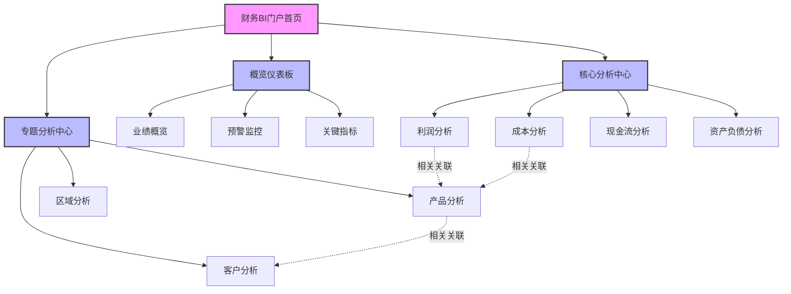
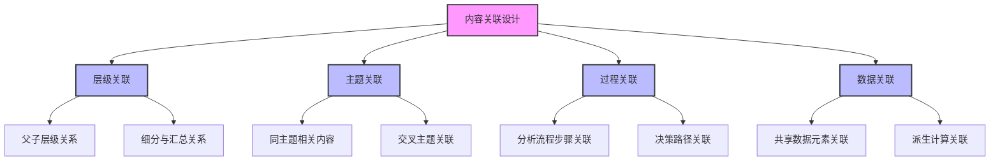
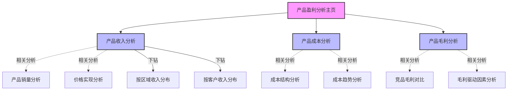
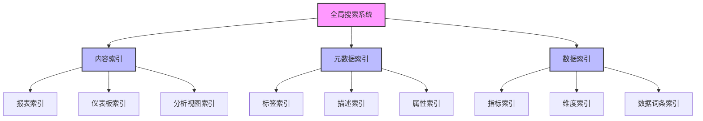
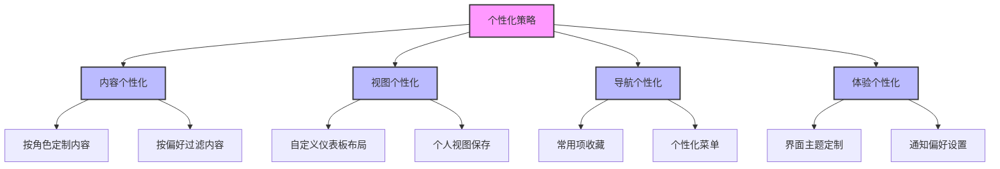
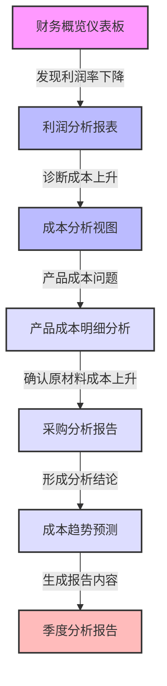
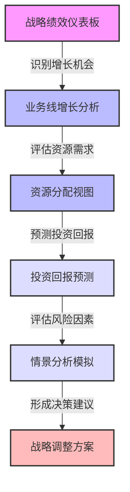

---
{"dg-publish":true,"tags":["财务BI","架构设计","信息架构","数据组织","内容规划"],"aliases":["财务BI信息结构","信息组织框架"],"permalink":"/知识共享/001_财务/02_财务BI看板项目/看板架构设计/整体架构规划/信息架构规划/","dgPassFrontmatter":true}
---

# 信息架构规划

## 概述

信息架构是财务BI看板系统的基础骨架，它定义了信息的组织方式、分类体系以及内容间的关联关系，为用户提供直观的信息获取路径。一个设计良好的信息架构能够降低用户认知负担，提高信息查找效率，支持复杂分析任务的顺利完成。本文档系统梳理财务BI看板的信息架构设计方法和组织原则，为整体系统提供清晰的信息结构框架。

## 信息架构设计原则

### 核心设计原则

1. **用户中心原则**：信息架构应围绕用户需求和使用场景设计，而非系统功能或数据结构
2. **简明清晰原则**：信息分类和标签应简洁明确，易于理解和记忆
3. **一致性原则**：在整个系统中保持分类逻辑、命名规则和导航方式的一致性
4. **可发现性原则**：重要信息容易被发现，相关信息之间可以便捷连接
5. **灵活性原则**：信息架构应具有适应性，能够容纳新增内容和功能扩展
6. **可扩展性原则**：考虑未来系统规模和复杂度增长的架构适应性
7. **多路径原则**：为不同用户提供多种查找和导航路径，满足不同使用习惯

## 信息分类体系

### 主要分类维度

财务BI看板系统采用多维度分类方法，支持从不同视角组织和访问信息：

```mermaid
graph TD
    A[信息分类体系] --> B[按主题分类]
    A --> C[按业务流程分类]
    A --> D[按用户角色分类]
    A --> E[按数据粒度分类]
    A --> F[按分析类型分类]
    
    B --> B1[收入相关]
    B --> B2[成本相关]
    B --> B3[现金流相关]
    B --> B4[资产负债相关]
    
    C --> C1[计划与预算]
    C --> C2[执行与监控]
    C --> C3[分析与评估]
    C --> C4[调整与优化]
    
    D --> D1[高管视角]
    D --> D2[财务视角]
    D --> D3[业务视角]
    D --> D4[分析师视角]
    
    E --> E1[战略层]
    E --> E2[战术层]
    E --> E3[操作层]
    
    F --> F1[描述性分析]
    F --> F2[诊断性分析]
    F --> F3[预测性分析]
    F --> F4[指导性分析]
    
    style A fill:#f9f,stroke:#333,stroke-width:2px
    style B fill:#bbf,stroke:#333,stroke-width:2px
    style C fill:#bbf,stroke:#333,stroke-width:2px
    style D fill:#bbf,stroke:#333,stroke-width:2px
    style E fill:#bbf,stroke:#333,stroke-width:2px
    style F fill:#bbf,stroke:#333,stroke-width:2px
```

### 分类维度属性与应用

| 分类维度 | 主要特征 | 适用场景 | 优势 | 挑战 |
| ---- | ---- | ---- | ---- | ---- |
| 主题分类 | 基于财务主题领域 | 专业分析、深度研究 | 符合专业人员思维模式 | 跨主题分析不便 |
| 业务流程分类 | 基于业务活动和流程 | 流程监控、任务导向 | 融入业务工作流 | 需维护流程映射 |
| 用户角色分类 | 基于使用者职责和需求 | 角色化访问、个性化 | 符合不同角色心智模型 | 角色重叠时体验不一致 |
| 数据粒度分类 | 基于信息聚合层级 | 多层次分析、层级报告 | 支持从概览到明细的路径 | 层级间连贯性要求高 |
| 分析类型分类 | 基于分析问题性质 | 不同分析思路和方法 | 支持完整分析思维过程 | 实现和维护复杂度高 |

## 信息架构结构模型

### 主体架构模型

财务BI看板采用"层级结构+关联网络"的混合架构模型：

### 架构模型特点与价值

1. **层级结构**：
   - 提供清晰的导航路径，降低认知负担
   - 支持从概览到细节的分析流程
   - 符合组织级数据分析的逻辑思维

2. **关联网络**：
   - 建立内容间的语义关联，支持灵活探索
   - 提供相关分析推荐，促进深度分析
   - 支持多维度视角切换，全面理解业务

3. **混合价值**：
   - 同时满足结构化任务和探索性分析需求
   - 降低导航复杂度，同时提高内容发现能力
   - 适应不同分析习惯和偏好的用户

## 信息组织框架

### 内容类型分类

| 内容类型 | 定义 | 组织方式 | 访问路径 | 呈现形式 |
| ---- | ---- | ---- | ---- | ---- |
| 仪表板 | 关键指标和可视化聚合 | 主题组织，用户个性化 | 直接导航，角色首页 | 卡片式布局，多图表组合 |
| 报表 | 结构化数据展示 | 业务流程，周期性 | 报表中心，定期推送 | 表格为主，辅以图表 |
| 分析视图 | 特定分析主题的深度展示 | 分析主题，维度组织 | 主题导航，相关推荐 | 交互式可视化，多视图联动 |
| 数据洞察 | 自动发现的数据见解 | 重要性排序，相关性 | 推送提醒，集中查看 | 卡片式摘要，可展开详情 |
| 预测模型 | 前瞻性分析结果 | 时间维度，情景分类 | 预测中心，情景模拟 | 趋势图表，区间预测，情景对比 |

### 主要内容模块设计

| 信息模块 | 主要内容 | 组织逻辑 | 优先用户 | 更新频率 |
| ---- | ---- | ---- | ---- | ---- |
| 业绩概览中心 | KPI指标、趋势图、预警信息 | 重要性排序，性能指标分类 | 管理层、决策者 | 实时/日更新 |
| 财务分析中心 | 财务报表、比率分析、结构分析 | 报表类型，时间序列 | 财务人员、分析师 | 月/季/年更新 |
| 业务监控中心 | 运营指标、差异分析、预算执行 | 业务流程，责任部门 | 业务主管、运营人员 | 日/周更新 |
| 预测分析中心 | 趋势预测、情景模拟、敏感性分析 | 时间框架，情景类型 | 规划人员、决策者 | 季/年更新 |
| 专题分析库 | 深度分析报告、专项分析、优化建议 | 主题分类，问题导向 | 分析师、专业用户 | 不定期更新 |

## 信息关联设计

### 内容关联类型

### 关联实现机制

| 关联类型 | 实现方式 | 用户体验 | 技术要求 | 应用示例 |
| ---- | ---- | ---- | ---- | ---- |
| 直接链接 | 硬编码链接，固定路径 | 简单明确的跳转路径 | 实现简单，维护成本高 | 固定报表之间的导航链接 |
| 上下文跳转 | 参数化链接，保留上下文 | 连贯的分析体验 | 需处理参数传递和状态保持 | 带筛选条件的下钻分析 |
| 元数据关联 | 基于元数据标签的自动关联 | 智能推荐相关内容 | 需完善的元数据管理体系 | 推荐关联的指标和维度 |
| 使用行为关联 | 基于用户行为的智能关联 | 个性化推荐，提高效率 | 需分析用户行为数据 | "其他用户还查看了"推荐 |
| 语义关联 | 基于内容语义的智能匹配 | 发现非预设的关联 | 需NLP和语义分析能力 | 相关主题的智能推荐 |

### 关联导航设计

**场景示例：产品盈利能力分析**

## 标签与命名体系

### 标签体系设计

| 标签类型 | 应用范围 | 设计规则 | 示例 | 管理策略 |
| ---- | ---- | ---- | ---- | ---- |
| 主题标签 | 内容主题分类 | 使用标准业务术语，层级清晰 | 收入分析、成本控制、现金管理 | 受控词表，分层管理 |
| 数据标签 | 指标和维度 | 遵循数据标准，一致命名 | 销售收入、毛利率、营销费用 | 与数据字典同步 |
| 功能标签 | 分析功能和工具 | 动词+名词形式，明确操作 | 趋势分析、同比对比、预测模拟 | 功能分类管理 |
| 业务标签 | 业务流程和场景 | 采用业务语言，面向任务 | 月度关账、预算编制、费用控制 | 业务流程映射 |
| 个人标签 | 用户自定义分类 | 自由格式，个人意义 | 我的关注、重要项目、待处理 | 用户个性化管理 |

### 命名规范

1. **一致性原则**：
   - 同类内容使用一致的命名模式
   - 保持术语在系统各处的一致性
   - 避免同义词和缩写混用

2. **清晰性原则**：
   - 名称应自解释，避免晦涩术语
   - 优先使用业务用户熟悉的术语
   - 必要时提供简短描述或提示

3. **简洁性原则**：
   - 使用精确简洁的表述
   - 避免不必要的修饰词和冗长表达
   - 平衡简洁性和描述性

4. **特定命名模式**：
   | 内容类型 | 命名模式 | 示例 | 避免使用 |
   | ---- | ---- | ---- | ---- |
   | 仪表板 | [主题]+[目的] | 销售业绩概览、成本结构分析 | DB001、销售-1 |
   | 报表 | [周期]+[主题]+[报表] | 月度销售收入报表、年度费用分析 | Report_Sales、销售表 |
   | 指标 | [度量]+[对象]+[限定符] | 月度销售收入、客户获取成本 | KPI01、增长率 |
   | 维度 | [维度名称] | 产品、客户、区域、时间 | Dim1、分类A |
   | 分析视图 | [分析类型]+[主题] | 趋势分析-收入、归因分析-成本 | View01、分析1 |

## 搜索与发现系统设计

### 搜索系统架构

### 搜索体验设计

| 功能组件 | 用户价值 | 设计要点 | 实现建议 |
| ---- | ---- | ---- | ---- |
| 智能搜索框 | 快速直达内容 | 全局访问，智能提示 | 关键词高亮，实时建议 |
| 搜索结果分类 | 清晰组织结果 | 多维度分类，相关性排序 | 标签分类，类型筛选 |
| 自然语言查询 | 简化复杂搜索 | 理解业务问题表述 | NLP技术，意图识别 |
| 搜索历史记忆 | 提高重复搜索效率 | 个人历史记录，热门搜索 | 历史记录持久化，热门聚合 |
| 搜索建议优化 | 引导有效搜索 | 提供搜索建议，纠错功能 | 拼写检查，同义词扩展 |

### 内容发现机制

1. **推荐系统**：
   - 基于用户角色和权限的内容推荐
   - 基于使用历史和偏好的个性化推荐
   - 基于相似用户行为的协同过滤推荐

2. **内容展示策略**：
   - 热门内容展示（最常访问的报表和仪表板）
   - 新增内容提醒（新发布的分析和报告）
   - 相关内容推荐（当前内容的关联分析）

3. **智能提醒**：
   - 数据更新提醒（报表刷新通知）
   - 异常指标提醒（KPI异常波动提示）
   - 目标达成提醒（与预设目标的对比）

## 个性化与定制策略

### 个性化维度

### 个性化实现机制

| 个性化类型 | 实现方式 | 用户价值 | 管理策略 |
| ---- | ---- | ---- | ---- |
| 基于角色的内容定制 | 角色与内容映射配置 | 只看相关内容，减少干扰 | 集中管理角色模板，定期审核 |
| 用户自定义视图 | 保存个人设置和筛选条件 | 快速恢复常用分析场景 | 设置保存限制，提供重置选项 |
| 个人收藏与组织 | 用户收藏夹功能 | 快速访问高频内容 | 提供默认组织结构，支持个人调整 |
| 个性化推荐 | 基于行为分析的动态推荐 | 发现相关内容，提高效率 | 算法透明度，提供反馈机制 |
| 个人指标监控 | 自定义KPI监控仪表板 | 聚焦关键指标，减少干扰 | 保证基础指标可见，支持添加个性指标 |

### 标准化与个性化平衡

1. **标准化基础**：
   - 核心报表和指标的标准定义
   - 统一的术语和命名规范
   - 一致的导航结构和界面框架

2. **个性化空间**：
   - 个人仪表板的布局和内容选择
   - 分析视图的保存和组织
   - 通知和提醒的偏好设置

3. **平衡策略**：
   - 提供标准模板作为起点，允许个性化调整
   - 个性化设置不影响数据定义和计算逻辑
   - 保留重置为标准设置的选项
   - 推广最佳实践的个性化配置

## 信息架构实施策略

### 分阶段实施路径

| 阶段 | 重点工作 | 关键成果 | 评估指标 |
| ---- | ---- | ---- | ---- |
| 基础架构阶段 | 建立核心分类体系和标签系统 | 信息分类框架，标准术语库 | 分类覆盖率，术语一致性 |
| 内容建设阶段 | 建立核心报表和仪表板 | 标准报表库，基础仪表板 | 内容覆盖度，基础需求满足率 |
| 关联构建阶段 | 完善内容间关联关系 | 内容关联网络，导航路径 | 关联完整性，导航效率 |
| 搜索优化阶段 | 强化搜索和发现机制 | 全面索引，智能搜索 | 搜索成功率，内容发现效率 |
| 个性化阶段 | 实现个性化和定制功能 | 个性化机制，自定义能力 | 用户满意度，效率提升度 |

### 架构治理机制

1. **架构管理团队**：
   - 成立信息架构管理小组
   - 定义架构标准和规范
   - 审核内容组织和标签应用

2. **内容管理流程**：
   - 建立内容发布审核流程
   - 定期进行内容清理和更新
   - 实施版本控制和变更管理

3. **质量监控机制**：
   - 定期评估架构有效性
   - 跟踪用户行为和使用模式
   - 收集用户反馈和改进建议

4. **持续优化策略**：
   - 基于使用数据的架构调整
   - 响应新需求的架构扩展
   - 技术演进下的架构更新

## 信息架构最佳实践

1. **用户驱动设计**：深入理解用户需求和使用场景，设计符合用户心智模型的信息架构
2. **简单优于复杂**：保持分类简洁明确，避免过度复杂的层级和关系
3. **一致性体验**：在整个系统中保持分类逻辑、命名规则和导航方式的一致性
4. **灵活与标准平衡**：建立标准化的框架，同时为个性化提供空间
5. **内容关联优化**：精心设计内容间的关联关系，支持分析流程和思维路径
6. **持续用户测试**：通过卡片分类、树形测试等方法持续验证和优化架构
7. **渐进式实施**：采用迭代方法，逐步构建和完善信息架构

## 实际应用案例

### 财务分析师工作流程支持

**场景**：季度财务分析与报告准备

**信息架构支持**：
- 主题分类支持从利润到成本到产品的分析路径
- 内容关联提供从高层指标到根因分析的导航线索
- 搜索系统支持快速查找相关历史数据和参考资料
- 个人工作区保存分析过程和中间结果

### 管理层决策支持场景

**场景**：业务战略调整决策过程

**信息架构支持**：
- 角色化视图提供管理层关注的战略指标
- 多维度分析支持从不同角度评估机会和风险
- 预测分析和模拟工具支持决策情景评估
- 相关内容推荐提供全面的决策参考信息 