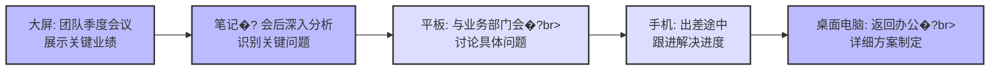
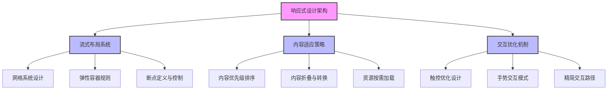
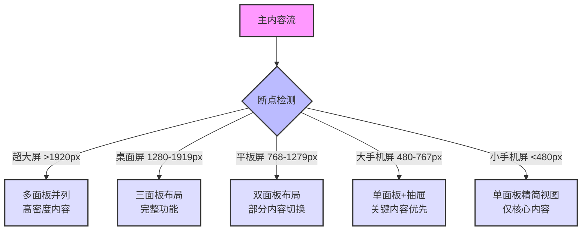
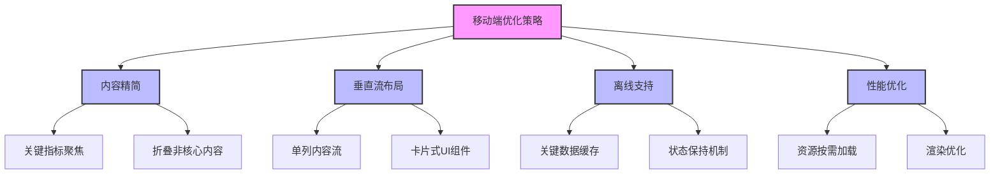
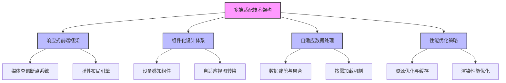
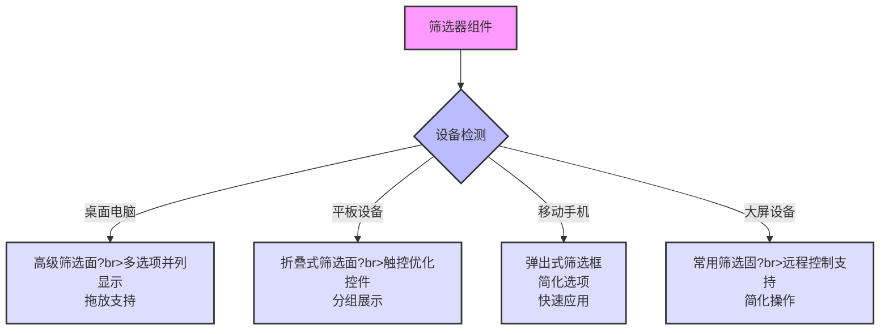

---
{"dg-publish":true,"tags":["财务BI","架构设计","多端适配","响应式设�? 移动端优化"],"aliases":["跨平台适配策略","多设备兼容设计"],"permalink":"/知识共享/001_财务/02_财务BI看板项目/看板架构设计/整体架构规划/多端适配策略/","dgPassFrontmatter":true}
---

# 多端适配策略

## 概述

随着移动办公和远程协作的普及，财务BI看板系统需要在多种设备和平台上提供一致且优化的用户体验。多端适配策略旨在确保财务BI系统能够在桌面电脑、平板设备、移动手机甚至大屏幕展示设备上高效运行，满足不同场景下的分析和决策需求。本文档系统梳理财务BI看板的多端适配设计方法、技术实现和最佳实践，为整体系统提供跨设备的用户体验框架�?

## 多端适配设计原则

### 核心设计原则

1. **内容优先原则**：以内容为中心，确保关键信息在各种设备上都清晰可见和易于访问
2. **渐进增强原则**：从最小设备体验开始设计，随着屏幕尺寸增大逐步增强功能和复杂度
3. **一致性体验原�?*：在不同设备上保持品牌视觉、交互逻辑和核心功能的一致�?
4. **适配性原�?*：根据设备特性和使用场景优化布局、内容密度和交互方式
5. **性能关注原则**：考虑不同设备的性能限制，确保在各种条件下都能提供流畅体�?
6. **离线使用原则**：支持关键功能的离线访问和数据缓存，适应移动场景网络不稳定情�?
7. **易用性原�?*：针对不同输入方式（触控、鼠标、键盘）优化交互设计

## 多端使用场景分析

### 设备类型及使用场�?

| 设备类型 | 主要用户 | 典型使用场景 | 关键功能需�?| 使用限制 |
| ---- | ---- | ---- | ---- | ---- |
| 桌面电脑 | 财务分析师、专业用�?| 深度分析、报告制作、数据处�?| 复杂分析、多视图并列、高级操�?| 固定场景、需专注使用 |
| 笔记本电�?| 管理层、出差员�?| 会议汇报、出差办公、演�?| 完整功能、便携性、演示模�?| 屏幕尺寸、续航考量 |
| 平板设备 | 管理层、移动办公人�?| 会议查阅、移动审批、简报浏�?| 触控优化、关键数据查看、简单操�?| 输入效率、屏幕尺�?|
| 移动手机 | 全员、外勤人�?| 快速查阅、提醒通知、简单决�?| 关键指标、预警信息、简化视�?| 小屏限制、网络波�?|
| 大屏设备 | 团队协作、展示区�?| 团队会议、数据展示、监控中�?| 视觉冲击、远距离可读、实时更�?| 交互复杂度、视距考量 |

### 多端使用流程

**跨设备使用流程示�?*：管理层季度业绩审视

**设备特性与内容优先�?*�?

| 设备类型 | 屏幕尺寸 | 内容优先�?| 功能优先�?| 交互特�?|
| ---- | ---- | ---- | ---- | ---- |
| 桌面电脑 | 大屏�?24"+) | 全面信息、多维度并列 | 完整分析工具、高级功�?| 精确鼠标操作、键盘快捷键 |
| 笔记本电�?| 中屏�?13-16") | 完整信息、有序呈�?| 大部分分析功能、导出能�?| 触控�?键盘、部分触�?|
| 平板设备 | 中小屏幕(9-12") | 重点信息、简洁呈�?| 查看分析、简单操作、批�?| 主要触控、手势操�?|
| 移动手机 | 小屏�?5-6") | 核心指标、警报信�?| 简化查看、基础筛选、分�?| 单手触控、垂直滚�?|
| 大屏设备 | 超大屏幕(55"+) | 视觉冲击、远距可�?| 自动演示、实时监�?| 远程控制、有限互�?|

## 响应式设计架�?

### 响应式框架设�?

财务BI看板采用"内容优先、弹性布局、断点响�?的响应式设计架构�?

### 响应式布局系统

**网格系统设计**�?

| 屏幕类型 | 栅格列数 | 主要容器宽度 | 间距规则 | 布局特点 |
| ---- | ---- | ---- | ---- | ---- |
| 超大�?1920px+) | 16�?| 1800px固定�?00%流式 | 24px外边距，16px间隔 | 多面板并列，丰富细节 |
| 桌面�?1280-1919px) | 12�?| 1200px固定�?5%流式 | 24px外边距，16px间隔 | 三面板布局，完整功�?|
| 平板�?768-1279px) | 8�?| 95%流式 | 16px外边距，12px间隔 | 双面板或单面�?抽屉 |
| 大手机屏(480-767px) | 4�?| 95%流式 | 16px外边距，8px间隔 | 单一面板，叠加内�?|
| 小手机屏(<480px) | 4�?| 100%流式 | 8px外边距，4px间隔 | 垂直排列，核心内�?|

**关键断点与适配策略**�?

### 组件响应式行为模?

| 组件类型 | 大屏行为 | 平板行为 | 手机行为 | 适配策略 |
| ---- | ---- | ---- | ---- | ---- |
| 导航菜单 | 侧边栏固定展开 | 可折叠侧边栏 | 底部导航栏或汉堡菜单 | 内容结构转换，保留关键入?|
| 数据表格 | 多列同时显示，固定表?| 重要列优先，横向滚动 | 卡片式转换，关键数据优先 | 列优先级，自适应布局转换 |
| 数据图表 | 详细图例，多轴，丰富标签 | 简化图例，保留主轴 | 单一维度，简化交互，垂直优化 | 数据精简，视觉层次强?|
| 筛选器 | 并列显示，高级选项 | 折叠面板，基础选项 | 弹出式，最小必要选项 | 控件简化，层级化呈?|
| 仪表?| 多卡片网格布局 | 重排?-1列布局 | 单列卡片流，可折叠详?| 卡片优先级，按需加载 |
| 提示信息 | 内联显示，丰富上下文 | 悬浮显示，简化内?| 弹出式，核心内容 | 信息层级，渐进披?|

## 设备特化优化

### 触控设备优化

**触控交互优化策略**?

1. **触控目标尺寸**?
   - 主要交互元素最小尺?4×44像素
   - 高频操作区域增大点击热区
   - 关键按钮间距最小为8像素

2. **手势交互设计**?
   - 实现常见手势：轻触、滑动、捏合缩?
   - 图表特化手势：长按查看详情、双指平?
   - 提供手势操作提示和教?

3. **输入优化**?
   - 简化表单设计，减少输入需?
   - 适配虚拟键盘弹出后的布局调整
   - 提供快捷输入方式（下拉、选择代替输入?

### 移动设备优化

**移动端特化设?*?

**移动端功能优先级**?

| 功能类型 | 移动端优先级 | 实现策略 | 示例 |
| ---- | ---- | ---- | ---- |
| 核心KPI监控 | 最?| 首屏展示，突出视?| 关键财务指标卡片，趋势迷你图 |
| 预警通知 | 最?| 推送提醒，醒目展示 | 预算偏差警报，异常指标提?|
| 简报查?| ?| 优化阅读体验 | 日报/周报摘要，关键变化提?|
| 基础筛?| ?| 简化选项，快速应?| 时间范围选择，主要维度筛?|
| 审批操作 | 中高 | 简化流程，一键操?| 预算审批，费用确?|
| 简单分?| ?| 关键视图，简化交?| 同比趋势，完成率分析 |
| 数据钻取 | 中低 | 限制层级，优化导?| 关键指标下钻，有限层次探?|
| 报告生成 | ?| 模板选择，简化参?| 简报分享，截图标注 |
| 高级分析 | 最?| 引导至桌面版 | 复杂模型分析，多维交叉分?|

### 大屏幕设备优?

**大屏展示特化设计**?

1. **视觉设计优化**?
   - 提高对比度，增强远距离可读?
   - 使用大号字体和图标（最?4px文本?
   - 简化视觉元素，突出关键信息

2. **布局优化**?
   - 分区展示，有效利用大屏空?
   - 信息分层，主次分?
   - 支持多人同时查看的信息布局

3. **交互模式**?
   - 支持远程控制和演示模?
   - 自动轮播和切换视?
   - 简化交互，适应远距离操?

## 技术实现策?

### 前端架构设计

### 技术实现方案对?

| 技术方?| 优势 | 挑战 | 适用场景 | 建议策略 |
| ---- | ---- | ---- | ---- | ---- |
| 响应式单一应用 | 代码统一维护，一致体?| 兼顾各端体验，优化复?| 功能相对简单，体验要求适中 | 渐进增强，按断点优化 |
| 桌面+移动双版?| 各端体验最优，针对性强 | 双重维护成本，功能同步难 | 桌面端复杂度高，移动端简?| 共享核心代码，UI单独实现 |
| 渐进式Web应用(PWA) | 接近原生体验，离线支?| 浏览器兼容性，开发复杂度 | 移动端使用频繁，需离线支持 | 核心功能PWA化，增强体验 |
| 混合原生应用 | 原生体验，设备功能访?| 开发维护成本高，多平台适配 | 高频核心业务，体验要求高 | 核心流程原生实现，辅助Web |

**推荐技术路?*?

基于实际需求和资源情况，建议采?*响应式核?关键场景优化**的混合方案：

1. **基础架构**：响应式Web应用，覆盖全平台基础功能
2. **移动优化**：实现PWA支持离线访问和通知推?
3. **大屏模式**：专门的大屏展示模式，优化远距离查看体验
4. **关键场景**：针对高频使用场景提供原生应用支?

### 关键技术组?

| 技术组?| 主要功能 | 实现要点 | 优先?|
| ---- | ---- | ---- | ---- |
| 响应式布局引擎 | 根据屏幕动态调整布局 | 弹性网格系统，断点控制逻辑 | 最?|
| 自适应组件?| 跨设备一致体验的UI组件 | 设备感知能力，自动转换规?| 最?|
| 数据适配?| 根据设备能力优化数据请求 | 数据裁剪，聚合计算，缓存策略 | ?|
| 交互适配?| 转换不同输入方法的交?| 触控/鼠标行为映射，手势支?| ?|
| 离线数据管理 | 支持关键数据离线访问 | 本地存储策略，同步冲突处?| 中高 |
| 设备检测服?| 识别设备类型和能?| 客户端信息分析，能力检?| ?|
| 性能监测优化 | 保障各端性能体验 | 性能指标收集，自适应优化 | ?|

## 测试与质量保?

### 多端测试策略

| 测试类型 | 测试目标 | 测试方法 | 质量标准 |
| ---- | ---- | ---- | ---- |
| 响应式布局测试 | 验证各断点布局正确?| 断点模拟，真机测?| 无布局溢出，内容完整可访问 |
| 跨设备功能测?| 验证核心功能在各端可?| 功能测试矩阵，场景测?| 关键功能无阻塞性问?|
| 触控交互测试 | 验证触控操作体验 | 手势测试，触控易用性评?| 点击成功?95%，操作顺?|
| 性能测试 | 验证各端性能符合预期 | 加载时间测试，操作响应测?| 首屏<3秒，操作响应<1?|
| 兼容性测?| 验证关键浏览?设备兼容?| 浏览器矩阵测试，设备矩阵测试 | 支持目标98%的用户设?|
| 离线功能测?| 验证离线可用?| 网络断开测试，恢复同步测?| 核心功能离线可用，同步无数据丢失 |

### 设备测试矩阵

**优先级设备矩?*?

| 设备类型 | 高优先级设备 | 中优先级设备 | 低优先级设备 |
| ---- | ---- | ---- | ---- |
| 桌面电脑 | Windows PC (1080p/1440p) Mac (Retina显示? | 高分辨率显示?(4K) 小屏笔记?(13") | 超宽屏显示器 触控一体机 |
| 平板设备 | iPad Pro/Air Surface Pro | iPad Mini Android平板 (三星) | 小型Windows平板 其他Android平板 |
| 移动手机 | iPhone 14/13/12系列 三星Galaxy S22/S21 | iPhone SE 小屏Android手机 | 折叠屏手?br>超大屏手?|
| 大屏设备 | 55"会议室显示屏 交互式智能屏 | 投影仪显?br>多屏拼接 | 超大显示?br>异形显示设备 |

## 用户体验与交互设?

### 跨设备一致性设?

**视觉一致性策?*?

1. **品牌和视觉语言**?
   - 定义设备无关的品牌标识和色彩系统
   - 建立可扩展的图标字体和视觉资?
   - 确保视觉层次在各设备上保持一?

2. **内容结构一致?*?
   - 保持信息架构的核心结构在各端一?
   - 确保数据定义和指标展示在各端保持一?
   - 维持功能命名和术语的统一?

3. **交互模式映射**?
   - 建立设备间交互模式的对应关系
   - 确保功能操作路径逻辑一?
   - 在不同输入方式间创建一致的心智模型

### 设备特化交互设计

**设备交互优化策略**?

| 设备类型 | 优化交互模式 | 设计策略 | 特化功能 |
| ---- | ---- | ---- | ---- |
| 桌面电脑 | 精确选择，多任务处理 | 高密度信息，键盘快捷?| 高级分析工具，批量操?|
| 平板设备 | 直接触控，中等精?| 适中信息密度，手势操?| 演示模式，注释功?|
| 移动手机 | 单手操作，浏览为?| 垂直流布局，大触控区域 | 提醒通知，快速概?|
| 大屏设备 | 远距离查看，协作讨论 | 高对比度，精简信息 | 数据展示，自动轮?|

**自适应交互设计示例**：数据筛选器

## 实施路径与迭代策?

### 分阶段实施路?

| 阶段 | 重点工作 | 交付成果 | 时间参?|
| ---- | ---- | ---- | ---- |
| 基础架构阶段 | 响应式框架搭建，核心组件设计 | 响应式布局系统，设备检测机?| 1-2个月 |
| 桌面端优化阶?| 完整功能实现，专业分析优?| 桌面端完整体验，高级功能支持 | 2-3个月 |
| 移动适配阶段 | 移动布局优化，核心功能适配 | 移动友好界面，关键功能支?| 2-3个月 |
| 触控体验阶段 | 平板触控优化，手势交互增?| 平板端优化体验，直观手势操作 | 1-2个月 |
| 离线能力阶段 | 离线数据支持，同步机制开?| PWA支持，关键数据离线访?| 1-2个月 |
| 大屏优化阶段 | 大屏展示模式，远程控制支?| 会议室展示模式，团队协作支持 | 1个月 |

### 迭代优化策略

1. **基于数据的优?*?
   - 收集各设备使用数据和性能指标
   - 识别使用瓶颈和体验问?
   - 针对高频场景优先优化

2. **用户反馈驱动**?
   - 建立多端用户反馈渠道
   - 进行定期可用性测?
   - 识别设备特定的体验问?

3. **持续技术更?*?
   - 跟踪设备技术和平台更新
   - 评估新兴交互模式和能?
   - 逐步引入新技术增强体?

## 多端适配最佳实?

1. **内容优先设计**：首先确定内容优先级，然后根据设备优化呈现方?
2. **渐进式增?*：从基础体验开始，根据设备能力逐步增加功能和复杂度
3. **统一设计语言**：建立跨设备统一的设计语言和组件系?
4. **设备同步体验**：支持用户在设备间无缝切换，保持状态和上下?
5. **性能预算意识**：为不同设备设定性能预算，确保良好的响应体验
6. **离线优先思维**：设计支持离线使用的核心功能，增强移动场景可靠?
7. **包容性设?*：考虑各种使用环境和辅助技术，确保广泛可用?

## 实际应用案例

### 财务仪表板多端适配案例

**场景**：核心财务KPI仪表板在不同设备上的呈现和交?

#### 桌面版设?

- **布局**：三列布局，左侧导航，中间主内容，右侧详情面板
- **内容密度**：高，同时展示多个KPI卡片和详细图?
- **交互方式**：鼠标悬停显示详情，点击下钻，右键上下文菜单
- **特殊功能**：多维度并列分析，高级筛选，导出报告

#### 平板版设?

- **布局**：双列布局，可折叠侧边导航，主内容区域
- **内容密度**：中，重点KPI卡片，简化图?
- **交互方式**：触控优化按钮，轻触显示详情，手势支?
- **特殊功能**：演示模式，简单注释，基础筛?

#### 移动版设?

- **布局**：单列布局，底部导航栏，垂直内容流
- **内容密度**：低，关键KPI优先，简化视?
- **交互方式**：大按钮，上下滑动，简单点击操?
- **特殊功能**：通知提醒，简报视图，快速筛?

#### 大屏版设?

- **布局**：区域划分布局，关键KPI突出显示
- **内容密度**：中低，远距离可见的大字体和图表
- **交互方式**：远程控制，自动轮播，简化操?
- **特殊功能**：自动更新，实时数据流，展示模式

### 跨设备协作场?

**场景**：季度财务审核和分析的跨设备协作流程

1. **财务总监（平板设备）**?
   - 在管理会议上通过平板展示季度概览
   - 使用触控操作展示关键趋势和问题区?
   - 记录会议决策要点和关注事?

2. **财务分析师（桌面电脑?*?
   - 收到总监标记的问题区域通知
   - 在桌面版进行深度分析和原因调?
   - 创建详细分析报告和建议方?

3. **业务经理（移动手机）**?
   - 在外勤途中收到分析报告通知
   - 通过手机快速查看关键发现和建议
   - 添加业务角度的反馈和意见

4. **团队会议（大屏设备）**?
   - 在大屏上展示完整分析和建?
   - 团队共同查看和讨论解决方?
   - 实时记录决策和后续行?
