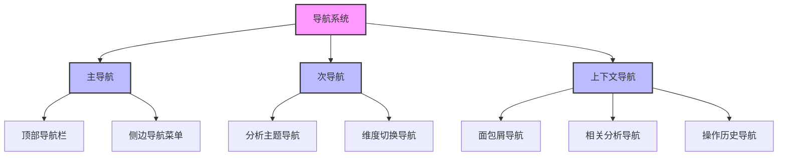
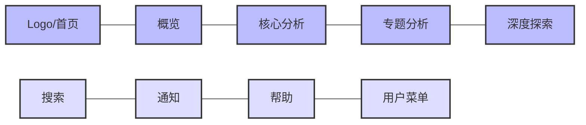
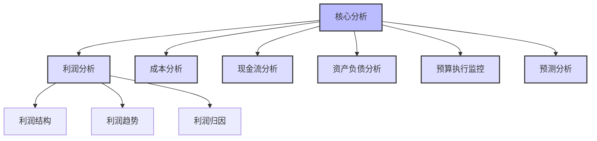
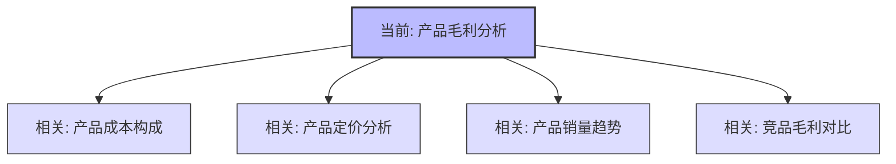
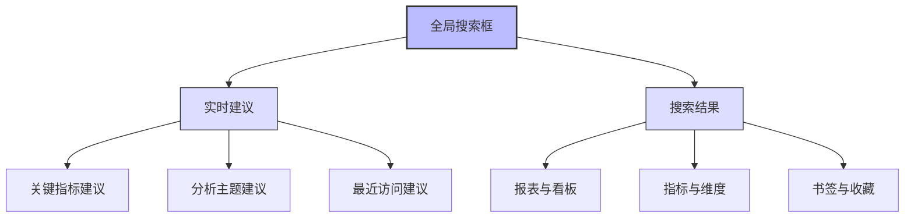

---
{"dg-publish":true,"tags":["财务BI","架构设计","导航系统","用户体验","交互设计"],"aliases":["财务BI导航设计","看板导航框架"],"permalink":"/知识共享/001_财务/02_财务BI看板项目/看板架构设计/整体架构规划/导航系统设计/","dgPassFrontmatter":true}
---

# 导航系统设计

## 概述

导航系统是财务BI看板的核心用户体验组件，它决定了用户如何在系统中移动、获取信息以及进行分析。一个优秀的导航系统应当简洁明了、逻辑一致、符合用户心智模型，能够有效降低用户学习成本，提高分析工作效率。本文档系统梳理财务BI看板的导航系统设计方法、结构组织和实现策略，为整体系统提供清晰的导航框架。

## 导航系统设计原则

### 核心设计原则

1. **简洁性原则**：导航结构清晰简单，避免过度复杂的层级和选项
2. **一致性原则**：在整个系统中保持导航元素的视觉和行为一致性
3. **可发现性原则**：关键功能和路径容易被发现，降低探索成本
4. **上下文感知原则**：导航能够反映用户当前位置和分析上下文
5. **效率优先原则**：为频繁访问的路径提供快捷方式，减少操作步骤
6. **自适应原则**：根据用户角色、权限和使用习惯调整导航选项
7. **响应式原则**：导航系统能够适应不同设备和屏幕尺寸

## 导航系统框架设计

### 多层次导航结构

财务BI看板采用"主导航 + 次导航 + 上下文导航"的三层导航结构：

### 导航组件功能定位

| 导航组件 | 功能定位 | 交互特性 | 适用场景 | 实现建议 |
| ---- | ---- | ---- | ---- | ---- |
| 顶部导航栏 | 一级主题导航、全局功能 | 简洁固定，常驻显示 | 顶层切换、全局功能 | 简洁图标+文字，避免过多选项 |
| 侧边导航菜单 | 多级主题导航、系统功能 | 可折叠展开，层级清晰 | 分析主题导航、系统设置 | 支持多级展示，强调视觉层级 |
| 分析主题导航 | 同类分析主题间切换 | 标签式或卡片式切换 | 相关分析主题间切换 | 突出当前主题，便于横向切换 |
| 维度切换导航 | 分析维度切换 | 下拉选择或标签切换 | 多维度分析场景 | 直观显示当前维度，简化切换操作 |
| 面包屑导航 | 显示当前位置和路径 | 链接式层级路径 | 深层次分析场景 | 清晰展示完整路径，便于返回 |
| 相关分析导航 | 推荐关联分析主题 | 卡片或链接推荐 | 分析延伸和关联场景 | 基于上下文智能推荐，突出关联性 |
| 操作历史导航 | 提供历史分析路径 | 时间线或列表记录 | 分析回溯和复现 | 记录关键操作路径，支持快速恢复 |

## 导航交互设计

### 顶部导航设计

**功能定位**：提供全局导航和核心功能入口，常驻显示在界面顶部

**设计要点**：
- 保持简洁，只包含核心导航项
- 使用简明的图标和文字
- 突出当前所在位置
- 右侧集中放置全局功能
- 确保响应式布局适配

### 侧边导航设计

**功能定位**：提供多级分析主题导航，支持系统功能访问

**设计要点**：
- 采用树形层级结构，默认展开当前路径
- 支持折叠/展开以节省空间
- 清晰的视觉层级和缩进
- 突出活动项，提供视觉反馈
- 针对不同角色可定制显示内容
- 可锁定或自动隐藏适应分析空间

### 面包屑导航设计

**功能定位**：显示当前位置在整体层级中的路径，支持快速返回

**设计要点**：
- 清晰展示完整导航路径
- 每级路径支持点击导航
- 精简显示长路径（如使用截断）
- 与当前页面标题协调配合
- 在移动设备上适当简化

### 分析维度导航设计

**功能定位**：在同一分析主题下切换不同维度视角

**设计要点**：
- 标签式或下拉式切换设计
- 突出当前活动维度
- 保留维度间的筛选条件
- 提供维度组合的可能性
- 维度间切换保持分析连贯性

### 相关分析导航设计

**功能定位**：基于当前分析主题推荐相关的分析方向

**设计要点**：
- 卡片式或链接式推荐设计
- 基于数据关联进行智能推荐
- 显示关联强度或推荐理由
- 支持用户反馈调整推荐算法
- 优先展示高相关性分析

## 导航体验优化

### 搜索导航设计

**功能定位**：通过关键词快速定位到分析内容

**设计要点**：
- 全局快捷访问（如快捷键Ctrl+K）
- 实时搜索建议与自动补全
- 结构化的搜索结果分类
- 结合用户历史提供智能建议
- 支持自然语言搜索（如"上月销售额"）

### 个性化导航设计

**功能定位**：根据用户角色、偏好和使用历史提供个性化导航体验

**实现方式**：
1. **收藏夹功能**：
   - 允许用户收藏常用报表和分析
   - 支持个人收藏组织和管理
   - 提供快速访问入口

2. **最近访问历史**：
   - 记录并展示用户最近访问的内容
   - 支持快速返回最近工作
   - 提供访问频率分析

3. **个人仪表板**：
   - 可自定义组件和布局的个人首页
   - 聚合关键指标和常用分析
   - 支持个性化配置和分享

4. **角色化导航**：
   - 基于用户角色显示相关导航选项
   - 突出该角色关注的核心指标
   - 简化非核心功能的展示

### 快捷导航设计

**功能定位**：提供高效率的导航捷径，减少操作步骤

**实现方式**：
1. **快捷键导航**：
   - 设计系统级快捷键（如搜索、返回）
   - 提供功能级快捷键（如导出、刷新）
   - 在界面中提供快捷键提示

2. **快速筛选器**：
   - 常用筛选条件的快捷访问
   - 筛选条件组合的保存与应用
   - 跨报表的筛选条件同步

3. **关联上下文跳转**：
   - 数据点的相关分析一键跳转
   - 维度值的快速下钻与上卷
   - 异常指标的诊断分析跳转

## 导航交互模式

### 基本交互模式

| 交互模式 | 实现方式 | 适用场景 | 设计考虑 |
| ---- | ---- | ---- | ---- |
| 点击导航 | 链接、按钮、菜单项 | 基础导航路径 | 目标明确，反馈清晰 |
| 悬停展开 | 下拉菜单、工具提示 | 多级菜单、辅助信息 | 减少点击，但需防止误触 |
| 拖放导航 | 拖放操作、可移动组件 | 自定义布局、灵活分析 | 直观但学习成本较高 |
| 手势导航 | 滑动、捏合、多指操作 | 移动设备、触控屏 | 符合触控习惯，需提供视觉提示 |

### 高级交互模式

1. **上下文感知导航**：
   - 基于当前分析内容智能推荐下一步
   - 识别用户意图提供相关操作建议
   - 保持分析连贯性的智能跳转

2. **工作流导航**：
   - 引导式分析路径推荐
   - 基于最佳实践的分析流程
   - 分步骤引导复杂分析任务

3. **自然语言导航**：
   - 通过自然语言查询定位内容
   - 语音指令控制导航操作
   - 对话式引导分析过程

4. **行为预测导航**：
   - 学习用户行为模式预测下一步
   - 自动调整导航选项优先级
   - 基于使用频率优化导航路径

## 导航系统实现建议

### 技术实现框架

| 技术领域 | 实现方案 | 优势 | 注意事项 |
| ---- | ---- | ---- | ---- |
| 前端框架 | React/Vue组件化导航 | 复用性高，状态管理清晰 | 确保性能优化，避免过度渲染 |
| 路由系统 | 嵌套路由设计，状态保持 | 支持复杂导航结构，历史管理 | 处理好路由参数传递和状态保持 |
| 状态管理 | 统一状态存储导航上下文 | 跨组件共享导航状态 | 避免导航状态过于复杂 |
| 响应式设计 | 断点式导航组件适配 | 适应多种设备和屏幕 | 测试各种尺寸下的体验一致性 |
| 性能优化 | 惰性加载、导航缓存 | 提升导航响应速度 | 平衡加载策略和用户体验 |

### 导航系统与权限集成

1. **基于角色的导航控制**：
   - 根据用户角色显示/隐藏导航项
   - 不可访问内容的导航项灰显处理
   - 权限变更时导航动态调整

2. **权限提示与引导**：
   - 明确提示权限受限的导航操作
   - 提供申请权限的便捷路径
   - 根据权限级别调整导航体验

3. **权限传递机制**：
   - 导航跳转时保持权限上下文
   - 在URL参数中编码必要权限信息
   - 防止权限绕过的安全检查

### 导航系统测试与评估

1. **可用性测试指标**：
   - 任务完成时间和成功率
   - 导航错误率和恢复能力
   - 用户满意度和主观评分

2. **导航分析监测**：
   - 导航路径热力图分析
   - 导航项点击频率统计
   - 导航效率瓶颈识别

3. **持续优化机制**：
   - 用户反馈收集和分类
   - A/B测试导航改进方案
   - 定期导航体验审核和优化

## 导航系统最佳实践

1. **简洁为王**：保持导航结构简单清晰，避免过度复杂的嵌套和选项
2. **一致性体验**：在整个系统中保持导航元素的视觉和行为一致性
3. **清晰反馈**：为导航操作提供明确的视觉反馈，标示当前位置
4. **渐进式披露**：适时展示导航选项，避免信息过载
5. **弹性容错**：设计容错机制，允许用户轻松返回和修正导航错误
6. **自我解释**：导航元素应自解释，减少学习成本
7. **绩效导向**：导航设计应以提升用户工作效率为核心目标

## 导航系统进阶方向

1. **智能导航推荐**：
   - 基于机器学习的个性化导航推荐
   - 预测用户可能需要的下一步分析
   - 自适应调整导航结构和优先级

2. **上下文感知导航**：
   - 根据分析内容动态调整导航选项
   - 识别用户意图提供相关导航建议
   - 维持分析连贯性的智能跳转机制

3. **多模态导航交互**：
   - 结合语音、手势等多种交互方式
   - 支持自然语言理解的导航查询
   - 增强现实辅助的导航体验

4. **导航分析与优化**：
   - 深度分析用户导航行为模式
   - 发现并消除导航效率瓶颈
   - 持续优化导航体验的自学习系统 