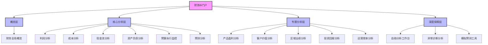
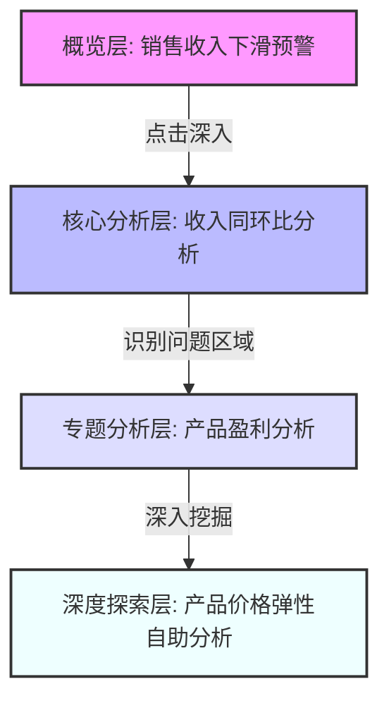
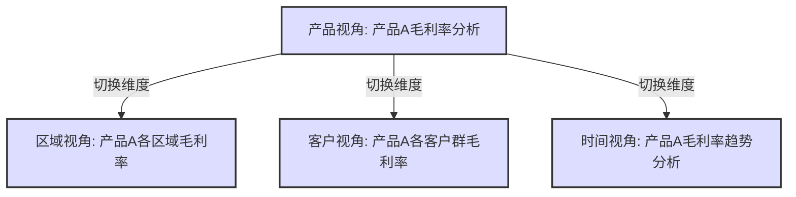
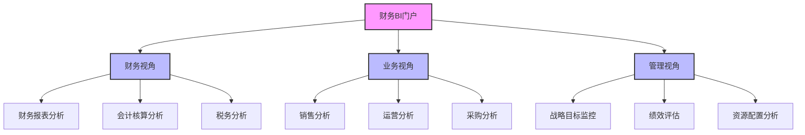
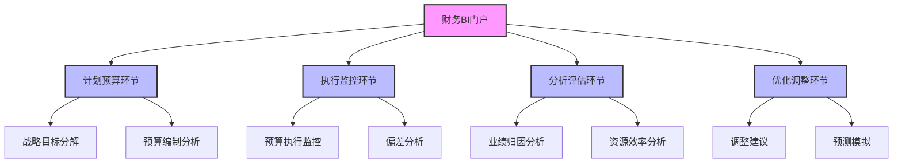
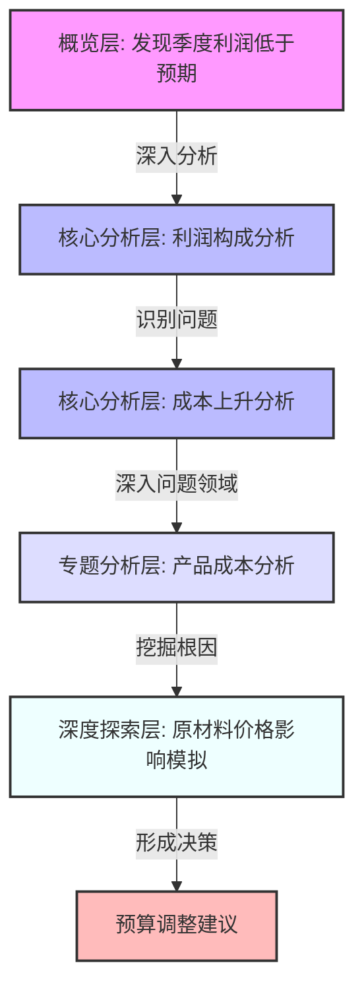
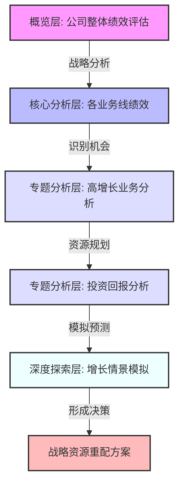

---
{"dg-publish":true,"tags":["财务BI","架构设计","层级结构","看板组织","导航设计"],"aliases":["看板层次组织","财务看板层级"],"permalink":"/知识共享/001_财务/02_财务BI看板项目/看板架构设计/整体架构规划/看板层级结构/","dgPassFrontmatter":true}
---

# 看板层级结构

## 概述

看板层级结构是财务BI系统中的核心组织框架，它决定了整个系统的信息组织方式、用户访问路径和数据展现逻辑。一个设计良好的层级结构能够帮助用户快速定位所需信息，在不同层次的分析维度间无缝切换，并形成从概览到细节的完整分析体验。本文档系统梳理财务BI看板的层级结构设计，为整体系统提供清晰的架构框架。

## 层级结构设计原则

### 基本设计原则

1. **概览到细节原则**：遵循从总体到局部、从摘要到细节的信息组织逻辑
2. **逻辑一致性原则**：保持整个系统层级划分和命名的逻辑一致性
3. **使用场景匹配原则**：层级结构应与用户工作流程和决策场景相匹配
4. **导航简洁性原则**：用户到达任何深度内容的点击次数不应超过3次
5. **扩展灵活性原则**：架构设计预留合理的扩展空间，应对未来需求变化
6. **权限适配原则**：层级结构便于实现差异化的权限控制
7. **一致性体验原则**：不同层级间保持视觉和交互的一致性体验

## 看板层级架构

### 四级层级模型

### 各层级定位与功能

| 层级名称 | 用户定位 | 核心功能 | 典型内容 | 交互特性 |
| ---- | ---- | ---- | ---- | ---- |
| 概览层 | 高管、决策者 | 全局状况把握、关键指标监控 | KPI仪表盘、趋势概览、预警指标 | 高度聚合、简洁直观、突出异常 |
| 核心分析层 | 财务管理者、业务负责人 | 系统性分析、多维对比 | 财务报表、多维分析图表、同环比分析 | 多维下钻、交互分析、数据导出 |  
| 专题分析层 | 业务分析师、专业人员 | 特定领域深度分析 | 专题分析报告、细分市场分析、专项优化 | 强分析能力、多视图联动、场景化展示 |
| 深度探索层 | 高级分析师、数据科学家 | 自助探索、高级分析 | 自助分析工具、数据探索、预测模拟 | 高度自由度、自定义分析、建模能力 |

## 层级间关系与导航

### 纵向导航设计

纵向导航关注不同层级间的跳转，实现从概览到细节的分析路径：

**纵向导航实现方式**：
- 上下文感知的下钻链接
- 面包屑导航提供返回路径
- 保持分析上下文的传递
- 视图状态的保存与恢复

### 横向导航设计

横向导航关注同一层级内不同主题间的切换，实现多维度、多视角的综合分析：

**横向导航实现方式**：
- 主题式顶部/侧边导航栏
- 相关分析推荐区
- 标签页式切换界面
- 保持筛选条件的一致性

### 交叉维度导航

交叉维度导航实现不同分析维度间的切换，如从产品视角切换到区域视角：

**交叉维度实现方式**：
- 维度切换控件
- 上下文菜单
- 智能分析推荐
- 多维视图联动

## 层级结构组织模式

### 基于角色的结构组织

### 基于业务流程的结构组织

## 层级设计关键考量点

### 层级命名规范

| 层级类型 | 命名原则 | 示例 | 避免使用 |
| ---- | ---- | ---- | ---- |
| 一级导航 | 使用简洁的名词短语 | 概览、核心分析、专题分析 | 冗长术语、技术性名称 |
| 二级导航 | 使用具体分析领域术语 | 利润分析、成本分析 | 模糊的描述、过于技术化的术语 |
| 三级导航 | 使用精确的分析主题 | 产品毛利分析、区域成本对比 | 过于笼统的描述 |
| 分析视图 | 使用描述性的视图名称 | 趋势比较图、结构占比图 | 代码式命名、技术术语 |

### 层级扩展策略

1. **水平扩展**：在同一级别添加新的分析主题或领域
   - 评估：适合新增独立分析领域，不影响现有结构
   - 示例：在专题分析层增加"供应链分析"板块

2. **垂直扩展**：增加新的层级或细化现有层级
   - 评估：在需要更精细分析时采用，但会增加导航复杂性
   - 示例：在核心分析下增加"深度分析"子层级

3. **混合扩展**：结合水平和垂直扩展
   - 评估：适合大规模功能扩展，需重点关注导航体验
   - 示例：增加行业分析模块，同时细化各行业特定分析

### 个性化与标准化平衡

1. **个性化策略**：
   - 用户可定制的仪表板
   - 个人收藏夹功能
   - 常用分析路径记忆
   - 用户偏好设置

2. **标准化策略**：
   - 核心KPI统一定义
   - 标准化报表模板
   - 一致的导航体系
   - 统一的计算逻辑

3. **平衡机制**：
   - 标准框架内的个性化配置
   - 个性化视图的共享机制
   - 个性化内容的审核流程
   - 最佳实践的标准化提升

## 层级结构实施建议

### 分阶段实施路径

| 阶段 | 重点内容 | 成功标准 | 时间参考 |
| ---- | ---- | ---- | ---- |
| 第一阶段 | 概览层与核心分析层基础框架 | 覆盖核心财务指标分析 | 1-2个月 |
| 第二阶段 | 完善核心分析层，构建专题分析层 | 满足主要业务部门需求 | 2-3个月 |
| 第三阶段 | 构建深度探索层，优化整体体验 | 支持高级分析与自助探索 | 3-4个月 |
| 持续优化 | 基于用户反馈持续迭代优化 | 用户满意度与使用频率 | 持续进行 |

### 用户适应与培训策略

1. **角色化的培训计划**：
   - 高管层：概览使用与核心指标解读
   - 管理层：多维分析与决策应用
   - 分析师：专题分析与高级工具使用

2. **渐进式的功能引导**：
   - 功能引导式教程
   - 情境式使用提示
   - 分析路径推荐
   - 内嵌式帮助文档

3. **持续的用户支持**：
   - 定期培训工作坊
   - 用户社区与最佳实践分享
   - 专家在线支持
   - 持续改进的反馈渠道

## 实际应用案例

### 财务分析决策流程

**场景**：季度财务业绩分析与决策调整

### 战略规划支持流程

**场景**：年度战略调整与资源优化配置

## 层级结构最佳实践

1. **层级清晰原则**：保持层级结构清晰、逻辑一致，避免过深的嵌套
2. **关联导航原则**：建立关联分析主题间的智能导航，减少用户操作成本
3. **上下文保持原则**：在层级间跳转时保持筛选条件和分析上下文
4. **灵活兼顾原则**：兼顾标准化与个性化需求，为不同用户提供适配体验
5. **持续优化原则**：基于用户使用数据持续优化层级结构与导航体验
6. **响应式设计原则**：确保层级结构在不同设备上都能提供良好体验
7. **性能考量原则**：设计层级结构时考虑数据加载和渲染性能 