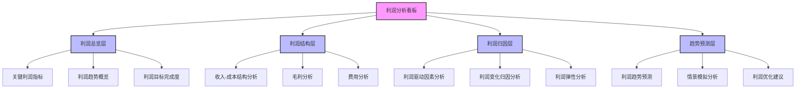
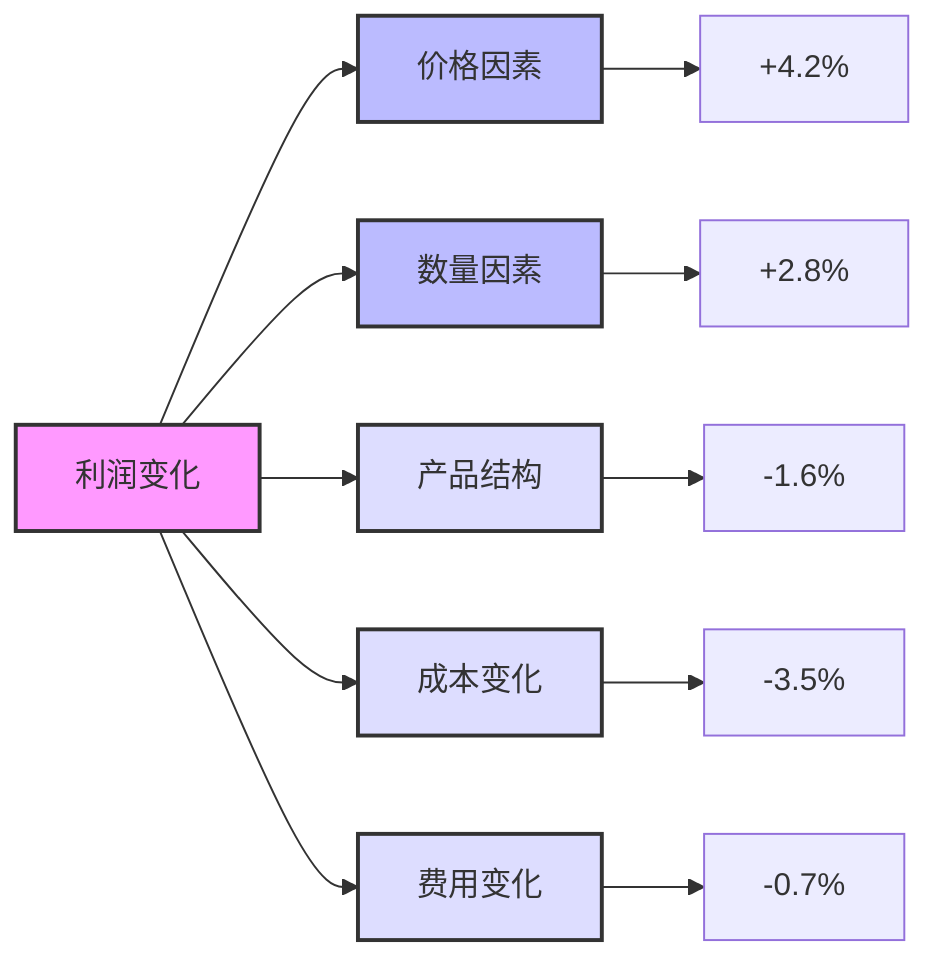
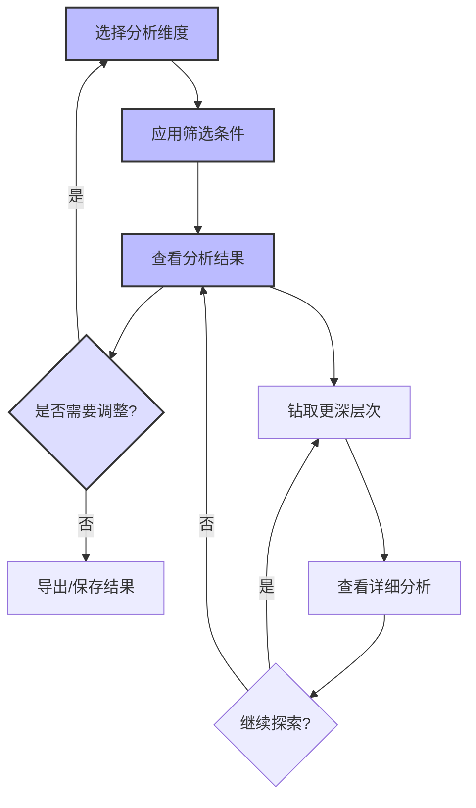

---
{"dg-publish":true,"tags":["财务BI","看板设计","利润分析","盈利能力","财务绩效"],"aliases":["盈利分析看板","利润监控看板"],"permalink":"/知识共享/001_财务/02_财务BI看板项目/看板架构设计/核心看板设计/利润分析看板/","dgPassFrontmatter":true}
---


# 利润分析看板

## 概述

利润分析看板是财务BI系统中关注企业盈利能力和利润表现的核心分析工具，通过多维度分析企业利润结构、影响因素和变化趋势，帮助管理层和财务专业人员深入理解利润形成机制，识别问题点和优化机会。本看板采用系统化的分析框架，结合高级可视化技术，提供从总体到局部、从现象到本质的完整利润分析能力。

## 设计目标与原则

### 核心设计目标

1. **利润全景洞察**：提供企业利润的多维度全景视图
2. **利润驱动因素分析**：深入分析影响利润的关键因素和作用机制
3. **业务关联理解**：建立利润表现与业务活动之间的关联理解
4. **问题诊断与优化**：支持利润问题的快速诊断和优化方向识别
5. **决策支持**：为提升盈利能力的战略和战术决策提供支持

### 设计原则

1. **全面性原则**：覆盖利润分析的各个维度和层次
2. **深度分析原则**：支持从表象指标深入至根因的分析路径
3. **关联性原则**：建立利润指标与业务指标的关联分析
4. **可比性原则**：提供多种维度的对比分析能力
5. **可行动原则**：分析结果应直接指向可行动的优化方向
6. **前瞻性原则**：不仅分析历史数据，还提供前瞻性预测和分析

## 用户与场景分析

### 目标用户群体

| 用户角色 | 关注重点 | 使用频率 | 典型需求 | 
| ---- | ---- | ---- | ---- |
| CFO/财务总监 | 整体利润表现、利润趋势 | 每周/每月 | 全面了解公司盈利能力，识别系统性问题和机会 |
| 财务分析师 | 利润构成、驱动因素、异常波动 | 每周多次 | 详细分析利润变化原因，为管理层提供分析报告 |
| 业务部门主管 | 本部门贡献利润、效率指标 | 每月/每季 | 了解部门利润贡献和改进空间，支持业务决策 |
| 产品经理 | 产品线利润、产品组合效益 | 每月/每季 | 评估产品盈利能力，指导产品策略调整 |
| 管理层 | 关键指标、异常警报、利润预测 | 每月/每季 | 了解利润变化趋势，支持战略决策 |

### 主要使用场景

1. **定期利润绩效评估**：定期评估公司整体和各部门利润绩效
2. **利润异常诊断**：当利润指标异常时进行原因分析和诊断
3. **预算与实际对比**：分析利润目标完成情况和差异原因
4. **战略决策支持**：为业务调整、产品定价等决策提供利润影响分析
5. **趋势预测与规划**：基于历史数据进行利润趋势预测和规划

## 看板结构设计

### 整体布局架构

利润分析看板采用"总览分析 + 多维钻取 + 因素分解 + 预测分析"的分层架构：



### 分析层次与导航

| 分析层次 | 主要内容 | 典型问题 | 关键可视化 |
| ---- | ---- | ---- | ---- |
| 利润总览层 | 关键利润指标、总体趋势、目标达成 | 整体利润表现如何？趋势是什么？ | 指标卡、趋势图、仪表盘 |
| 利润结构层 | 收入成本结构、毛利分析、费用分析 | 利润结构有何特点？哪些环节存在问题？ | 瀑布图、结构图、热力图 |
| 利润归因层 | 驱动因素、变化分解、弹性分析 | 利润变化的原因是什么？哪些因素影响最大？ | 归因图、敏感性分析图、因子分析 |
| 趋势预测层 | 趋势预测、情景模拟、优化建议 | 未来利润走势如何？如何提升利润？ | 预测图、情景模拟图、决策树 |

### 多维分析框架

利润分析看板支持以下多维分析视角，用户可灵活切换和组合这些维度：

1. **时间维度**：
   - 季度/月度/周度分析
   - 同比/环比/滚动分析
   - 趋势与周期性分析

2. **业务维度**：
   - 业务线/产品线分析
   - 客户群/市场细分分析
   - 销售渠道/区域分析

3. **财务维度**：
   - 利润层级分析（毛利/营业利润/净利润）
   - 成本费用类别分析
   - 固定/变动成本分析
   - 直接/间接费用分析

4. **比较维度**：
   - 预算vs实际
   - 目标vs实现
   - 历史对比
   - 行业基准对比

## 核心指标与分析模块

### 利润总览模块

**核心指标**：

| 指标名称 | 计算方法 | 分析价值 | 展示方式 |
| ---- | ---- | ---- | ---- |
| 毛利润 | 收入-销售成本 | 反映产品盈利基础 | 指标卡+趋势图 |
| 毛利率 | 毛利润/收入 | 衡量基础盈利能力 | 指标卡+对比图 |
| 营业利润 | 毛利润-运营费用 | 衡量业务运营盈利能力 | 指标卡+趋势图 |
| 营业利润率 | 营业利润/收入 | 反映总体经营效率 | 指标卡+对比图 |
| 净利润 | 税后最终利润 | 最终盈利成果 | 指标卡+趋势图 |
| 净利率 | 净利润/收入 | 综合盈利能力 | 指标卡+对比图 |
| EBITDA | 息税折旧摊销前利润 | 营运能力不考虑财务和会计政策 | 指标卡+趋势图 |

**关键分析视图**：

1. **利润层级关系图**：
   - 显示从收入到净利润的利润递进关系
   - 以瀑布图方式呈现各利润层级和扣减项
   - 支持按时间、业务线等维度对比分析

2. **利润趋势综合图**：
   - 显示多级利润指标的时间趋势
   - 包含同比、环比增长率曲线
   - 预算线和目标线对比

3. **利润完成度仪表盘**：
   - 关键利润指标目标完成情况
   - 年度/季度目标进度
   - 与预算偏差分析

### 利润结构模块

**收入-成本结构分析**：

1. **收入构成分析**：
   - 按产品线/业务线的收入构成
   - 收入对利润的贡献度分析
   - 收入结构变化对利润的影响

2. **成本构成分析**：
   - 直接成本vs间接成本分析
   - 固定成本vs变动成本分析
   - 成本结构变化对利润的影响

3. **成本收入比分析**：
   - 各成本项目占收入比重分析
   - 成本收入比趋势分析
   - 成本控制效率评估

**毛利分析视图**：

1. **产品/业务线毛利分析**：
   - 按产品/业务线的毛利贡献
   - 毛利率差异和变化分析
   - 产品组合优化分析

2. **客户/市场毛利分析**：
   - 按客户群/市场的毛利贡献
   - 客户价值与毛利关系
   - 市场策略对毛利的影响

**费用分析视图**：

1. **费用趋势分析**：
   - 主要费用类别趋势分析
   - 费用增长与收入增长的关系
   - 费用预算执行分析

2. **费用结构分析**：
   - 按职能/部门的费用分布
   - 固定vs可变费用分析
   - 费用效率评估

### 利润归因模块

**利润变化归因分析**：

1. **同比/环比变化归因**：
   - 利润变化的影响因素分解
   - 价格、数量、成本、费用等因素的贡献
   - 正负面因素对冲分析

2. **利润缺口分析**：
   - 实际vs目标利润的差距
   - 差距形成的主要原因
   - 弥补差距的潜在机会

**利润驱动因素分析**：

1. **关键驱动因素识别**：
   - 对利润影响最大的业务驱动因素
   - 驱动因素间的相互关系
   - 驱动因素的变化趋势

2. **敏感性分析**：
   - 价格、成本、销量等因素变化对利润的敏感性
   - 利润弹性系数计算
   - 风险因素识别

3. **边际贡献分析**：
   - 产品/业务线的边际贡献
   - 固定成本分摊影响
   - 产能利用率与利润关系

### 趋势预测模块

**利润趋势预测**：

1. **时间序列预测**：
   - 基于历史数据的利润趋势预测
   - 季节性和周期性因素调整
   - 预测区间与置信度分析

2. **驱动因素预测**：
   - 基于驱动因素变化的利润预测
   - 多因素综合影响模型
   - 预测准确性评估

**情景模拟分析**：

1. **假设情景分析**：
   - 不同业务假设下的利润预测
   - 最佳/最差/基准情景对比
   - 应对策略评估

2. **敏感性模拟**：
   - 关键变量变化的利润影响模拟
   - 临界点和拐点分析
   - 风险与机会评估

**利润优化建议**：

1. **改进机会识别**：
   - 基于数据分析识别利润改进机会
   - 量化潜在收益
   - 实施难度评估

2. **优化方案比较**：
   - 不同优化方案的利润影响对比
   - 投入产出比分析
   - 实施路径建议

## 可视化与交互设计

### 核心可视化组件

#### 利润瀑布图

```
┌───────────────────────────────────────────────────────────┐
│                                                           │
│                          净利润                           │
│                           15%                             │
│                            │                              │
│                            ▼                              │
│ 收入                                                      │
│ 100% ┌──┐                                                 │
│      │  │                                                 │
│      │  │   ┌──┐                                          │
│      │  │   │  │                                          │
│      │  │   │  │                       ┌──┐    ┌──┐       │
│      │  │   │  │   ┌──┐    ┌──┐        │  │    │  │       │
│      │  │   │  │   │  │    │  │        │  │    │  │       │
│      │  │   │  │   │  │    │  │        │  │    │  │       │
│      └──┘   └──┘   └──┘    └──┘        └──┘    └──┘       │
│               │      │       │           │       │        │
│               ▼      ▼       ▼           ▼       ▼        │
│              -55%   -15%    -10%       -3%     -2%        │
│            直接成本 运营费用 销售费用  管理费用  税费       │
│                                                           │
└───────────────────────────────────────────────────────────┘
```

**设计要点**：
- 清晰展示从收入到净利润的递进关系
- 使用不同颜色区分正向和负向影响
- 支持不同时期对比和维度下钻
- 显示各组成部分的百分比和绝对值

#### 利润归因分析图



**设计要点**：
- 直观展示各因素对利润变化的贡献度
- 区分正向和负向影响因素
- 支持向下钻取到更详细的归因分析
- 提供各因素的详细解释

#### 利润热力图

```
┌─────────────────────────────────────────────────┐
│              产品线毛利率热力图                  │
│                                                 │
│           │ 区域A  │ 区域B  │ 区域C  │ 区域D   │
│───────────┼────────┼────────┼────────┼─────────│
│ 产品线1   │  45%   │  42%   │  38%   │  44%    │
│───────────┼────────┼────────┼────────┼─────────│
│ 产品线2   │  32%   │  35%   │  28%   │  30%    │
│───────────┼────────┼────────┼────────┼─────────│
│ 产品线3   │  51%   │  48%   │  52%   │  47%    │
│───────────┼────────┼────────┼────────┼─────────│
│ 产品线4   │  22%   │  20%   │  18%   │  25%    │
│───────────┼────────┼────────┼────────┼─────────│
│                                                 │
│      高利润           中等利润         低利润   │
│  ┌───────────┐    ┌───────────┐    ┌──────────┐ │
│  │███████████│    │███████████│    │██████████│ │
│  └───────────┘    └───────────┘    └──────────┘ │
│                                                 │
└─────────────────────────────────────────────────┘
```

**设计要点**：
- 使用颜色深浅直观展示利润率差异
- 支持多维度交叉分析
- 点击单元格可下钻查看详情
- 灵活切换行列维度和筛选条件

#### 利润预测与模拟图

```
┌─────────────────────────────────────────────────┐
│                                                 │
│ 利润率%                                         │
│                                                 │
│ 25 │                                 /-        │
│    │                               /   \       │
│ 20 │                      /\     /      \     │
│    │                     /  \   /         \    │
│    │                    /    \_/            \  │
│ 15 │       /\         /                     \ │
│    │      /  \       /                       \ │
│    │     /    \_____/                         \│
│ 10 │____/                                      │
│    │                                           │
│  5 │                                           │
│    │                                           │
│  0 └───┬────┬────┬────┬────┬────┬────┬────┬────│
│       Q1   Q2   Q3   Q4   Q1   Q2   Q3   Q4   │
│          2023             |     2024           │
│                           |                    │
│      历史数据             |     预测数据        │
│                                                │
│  ─── 基准情景   ---- 乐观情景   ..... 悲观情景  │
│                                                │
└─────────────────────────────────────────────────┘
```

**设计要点**：
- 清晰区分历史数据和预测数据
- 展示多种情景下的预测结果
- 显示预测区间和置信度
- 支持调整预测参数和假设条件

### 交互设计与用户体验

#### 多维分析控制器

**功能设计**：
- 提供时间维度、业务维度、财务维度的灵活切换
- 支持多维度组合筛选和交叉分析
- 保存用户常用视图和筛选条件
- 智能推荐相关分析维度

**交互流程**：


#### 利润诊断向导

**功能设计**：
- 引导用户进行系统化的利润问题诊断
- 基于数据智能识别关键问题点
- 提供逐步深入的分析路径
- 生成诊断报告和改进建议

**向导流程**：
1. 识别关键利润指标异常
2. 分析指标变化趋势和模式
3. 进行利润变化归因分析
4. 识别主要影响因素
5. 深入分析问题根因
6. 提供改进方向和建议

#### 情景模拟工具

**功能设计**：
- 允许用户定义各种业务假设
- 实时计算假设对利润的影响
- 比较不同情景的结果
- 保存和分享模拟方案

**模拟参数**：
- 产品定价调整
- 销量变化
- 成本结构变化
- 费用调整
- 产品组合变化
- 宏观经济因素

## 数据需求与集成

### 核心数据来源

| 数据类型 | 主要来源 | 更新频率 | 数据粒度 |
| ---- | ---- | ---- | ---- |
| 财务报表数据 | 财务系统、ERP系统 | 日/周/月 | 公司、部门、成本中心 |
| 业务交易数据 | 销售系统、订单系统 | 日/实时 | 交易、产品、客户 |
| 成本数据 | 成本会计系统、ERP系统 | 日/周 | 产品、批次、活动 |
| 预算数据 | 预算管理系统 | 月/季 | 部门、项目、科目 |
| 市场数据 | 市场研究、行业数据库 | 月/季 | 市场、产品类别、竞争者 |

### 数据处理与计算

1. **数据聚合与转换**：
   - 各源系统数据抽取和转换
   - 不同粒度数据的聚合计算
   - 历史数据归档和访问机制

2. **高级计算模型**：
   - 归因分析计算引擎
   - 预测模型和机器学习算法
   - 情景模拟计算引擎

3. **实时性与性能**：
   - 关键指标实时/准实时更新
   - 预计算和缓存策略
   - 大数据集的高效处理机制

## 实施与集成建议

### 分阶段实施路径

| 阶段 | 重点工作 | 交付成果 | 时间参考 |
| ---- | ---- | ---- | ---- |
| 第一阶段：基础利润分析 | 核心指标和基础分析 | 利润总览模块，基础结构分析 | 6-8周 |
| 第二阶段：深度归因分析 | 归因能力和多维分析 | 利润归因模块，多维分析框架 | 8-10周 |
| 第三阶段：预测与模拟 | 预测模型和情景模拟 | 趋势预测模块，情景模拟工具 | 8-12周 |

### 与其他系统的集成

1. **与财务概览看板的集成**：
   - 关键利润指标共享和联动
   - 异常检测和预警机制联动
   - 导航路径的一致性和连贯性

2. **与其他财务分析看板的集成**：
   - 与成本分析看板的数据共享和视角切换
   - 与收入分析看板的协同分析
   - 与预算分析看板的目标对比集成

3. **与业务系统的集成**：
   - 销售系统数据实时反馈
   - 产品系统信息同步
   - 客户关系管理系统集成

## 实际应用案例

### 季度利润表现分析

**场景描述**：
财务团队需要分析季度利润表现，识别利润下滑的原因并提出改进建议。

**分析流程**：
1. 利润总览模块查看关键指标和趋势
2. 发现毛利率下降是主要原因
3. 利润结构分析显示原材料成本上升
4. 利润归因分析量化各因素影响：
   - 原材料成本上升：影响-3.2%
   - 产品结构变化：影响-1.5%
   - 价格提升：影响+2.1%
5. 深入分析原材料成本上升原因
6. 使用情景模拟工具评估不同应对方案
7. 形成分析报告和建议

### 产品线盈利优化

**场景描述**：
产品管理团队需要分析各产品线的盈利能力，优化产品组合以提升整体利润率。

**分析流程**：
1. 利润结构模块查看产品线毛利分析
2. 利用热力图识别高低利润产品和市场
3. 分析影响各产品线利润的关键因素
4. 评估产品组合优化方案：
   - 调整低利润产品的定价策略
   - 增加高利润产品的营销投入
   - 优化区域产品结构
5. 使用情景模拟工具预测优化效果
6. 形成产品组合优化建议

## 最佳实践与注意事项

1. **关注数据质量**：
   - 确保财务数据的准确性和一致性
   - 建立数据质量监控机制
   - 明确定义各指标的计算口径和规则

2. **平衡分析深度与易用性**：
   - 为不同用户提供适合的分析深度
   - 复杂分析需提供清晰的引导和解释
   - 保持界面简洁清晰，避免信息过载

3. **持续优化与更新**：
   - 定期评估分析模型的准确性和有效性
   - 根据业务变化更新指标体系和分析视角
   - 收集用户反馈持续改进用户体验

4. **促进协作分析**：
   - 支持分析结果的共享和协作
   - 整合不同视角的分析见解
   - 建立财务和业务部门的协同分析机制 