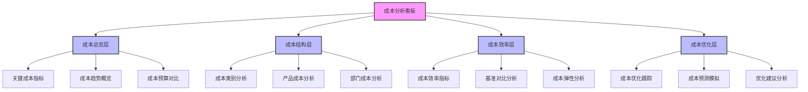
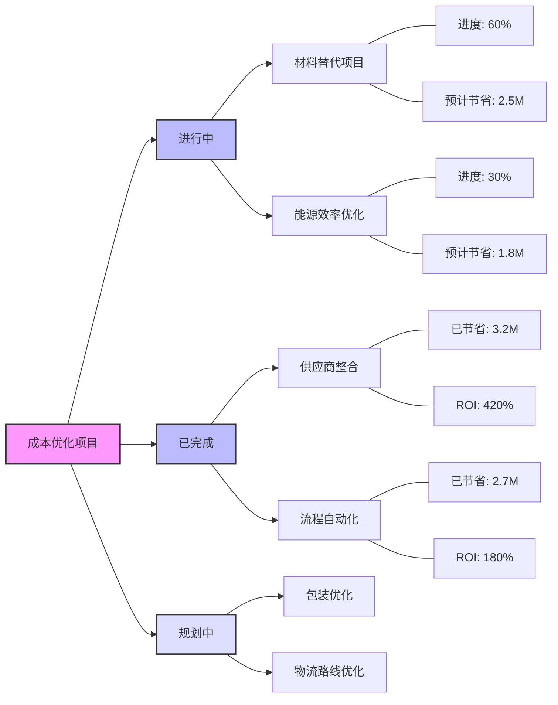
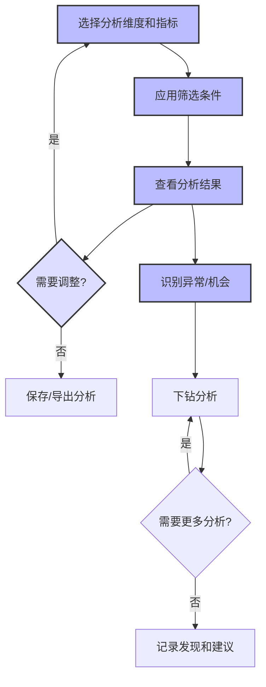

---
{"dg-publish":true,"tags":["财务BI","看板设计","成本分析","成本控制","成本优化"],"aliases":["成本管理看板","成本监控看板"],"permalink":"/知识共享/001_财务/02_财务BI看板项目/看板架构设计/核心看板设计/成本分析看板/","dgPassFrontmatter":true}
---


# 成本分析看板

## 概述

成本分析看板是财务BI系统中专注于企业成本结构和效率的核心分析工具，通过多维度剖析企业各类成本的构成、变化趋势和影响因素，为成本控制和优化决策提供数据支持。本看板结合先进的成本管理理念和分析方法，帮助企业全面理解成本动态，识别成本控制机会，实现精细化成本管理，增强企业盈利能力和竞争优势。

## 设计目标与原则

### 核心设计目标

1. **成本全景透视**：提供企业各类成本的全面、多维度视图
2. **成本驱动因素分析**：深入解析影响成本的关键业务和运营因素
3. **成本效率评估**：评估成本投入产出效率和优化空间
4. **异常与机会识别**：快速识别成本异常和潜在优化机会
5. **决策支持**：为成本控制和优化决策提供数据驱动的支持

### 设计原则

1. **多维透视原则**：从多角度、多层次分析成本结构和变化
2. **因果关联原则**：关注成本与业务活动的关联关系和作用机制
3. **标杆比较原则**：提供内部和外部的多维度对标比较
4. **可行动原则**：分析结果应指向明确的行动建议
5. **精细化原则**：支持从宏观到微观的层层深入分析
6. **预见性原则**：不仅分析历史，还提供未来成本趋势预测

## 用户与场景分析

### 目标用户群体

| 用户角色 | 关注重点 | 使用频率 | 典型需求 | 
| ---- | ---- | ---- | ---- |
| CFO/财务总监 | 整体成本结构、成本趋势 | 每周/每月 | 监控整体成本表现，制定成本管理策略 |
| 成本管理专员 | 详细成本构成、异常分析 | 每日/每周 | 分析具体成本项目，识别异常和优化点 |
| 业务部门经理 | 本部门成本效率、基准对比 | 每周/每月 | 管理部门预算，改进部门运营效率 |
| 采购经理 | 供应链成本、采购价格分析 | 每日/每周 | 优化采购决策，管理供应商成本 |
| 生产经理 | 生产成本、效率指标 | 每日/每周 | 监控生产成本，改进生产流程 |

### 主要使用场景

1. **定期成本审查**：定期评估企业整体和各部门成本表现
2. **成本异常诊断**：针对成本异常波动进行原因分析
3. **成本预算管理**：监控成本预算执行情况，分析偏差
4. **成本优化项目**：识别和跟踪成本优化机会和项目
5. **战略决策支持**：评估业务变动对成本结构的影响

## 看板结构设计

### 整体布局架构

成本分析看板采用"总览监控 + 结构分析 + 效率评估 + 优化管理"的分层架构：



### 分析层次与导航

| 分析层次 | 主要内容 | 典型问题 | 关键可视化 |
| ---- | ---- | ---- | ---- |
| 成本总览层 | 关键成本指标、总体趋势、预算对比 | 整体成本表现如何？与预算比较？ | 指标卡、趋势图、仪表盘 |
| 成本结构层 | 成本类别分布、产品成本构成、部门成本 | 成本构成如何？重点成本在哪里？ | 结构图、热力图、分层图 |
| 成本效率层 | 效率指标、标杆对比、弹性分析 | 成本效率如何？与标杆比较？ | 散点图、雷达图、对比图 |
| 成本优化层 | 优化项目跟踪、成本预测、优化建议 | 如何降低成本？未来趋势如何？ | 跟踪图、预测图、决策树 |

### 多维分析框架

成本分析看板支持以下多维分析视角，用户可灵活切换和组合这些维度：

1. **时间维度**：
   - 年/季度/月/周/日
   - 同比/环比/滚动分析
   - 趋势与季节性分析

2. **组织维度**：
   - 公司/部门/团队/个人
   - 业务单元/成本中心
   - 项目/产品线

3. **成本类别维度**：
   - 直接/间接成本
   - 固定/变动成本
   - 标准成本分类(材料/人工/制造费用等)

4. **业务活动维度**：
   - 价值链环节
   - 业务流程/活动
   - 客户/市场/渠道

## 核心指标与分析模块

### 成本总览模块

**核心指标**：

| 指标名称 | 计算方法 | 分析价值 | 展示方式 |
| ---- | ---- | ---- | ---- |
| 总成本 | 所有成本总和 | 整体成本规模 | 指标卡+趋势图 |
| 成本收入比 | 总成本/总收入 | 成本控制效率 | 指标卡+趋势图 |
| 固定成本比例 | 固定成本/总成本 | 成本结构弹性 | 指标卡+对比图 |
| 直接成本比例 | 直接成本/总成本 | 成本可控性 | 指标卡+对比图 |
| 成本增长率 | (本期-上期)/上期 | 成本变化趋势 | 指标卡+趋势图 |
| 预算执行率 | 实际成本/预算成本 | 预算控制效果 | 指标卡+仪表盘 |
| 单位成本 | 总成本/产量 | 规模效益评估 | 指标卡+趋势图 |

**关键分析视图**：

1. **成本趋势概览图**：
   - 总成本和主要成本类别的时间趋势
   - 同比和环比变化率
   - 预算线和基准线对比

2. **成本收入对比图**：
   - 成本与收入的增长对比
   - 成本收入比趋势
   - 收入增长带来的规模效应分析

3. **预算执行监控**：
   - 各成本类别预算执行情况
   - 预算偏差分析
   - 年度预算完成预测

### 成本结构模块

**成本类别分析**：

1. **成本构成分析**：
   - 主要成本类别占比
   - 成本结构随时间变化
   - 成本项目排名和帕累托分析

2. **固定-变动成本分析**：
   - 固定与变动成本的比例
   - 随业务量变化的成本弹性
   - 盈亏平衡点分析

3. **直接-间接成本分析**：
   - 直接与间接成本的比例
   - 间接成本分配效率
   - 可控和不可控成本分析

**产品成本分析**：

1. **产品成本构成**：
   - 产品单位成本构成
   - 产品间成本结构对比
   - 产品成本历史变化

2. **产品线成本比较**：
   - 不同产品线的成本效率
   - 产品组合对总成本的影响
   - 高/低成本产品识别

3. **产品成本异常分析**：
   - 产品成本偏差识别
   - 标准成本vs实际成本
   - 成本异常原因分析

**部门成本分析**：

1. **部门成本构成**：
   - 各部门成本构成和规模
   - 部门间成本结构对比
   - 部门成本随时间变化

2. **部门效率对比**：
   - 部门成本效率指标对比
   - 部门间最佳实践识别
   - 效率提升空间评估

3. **部门成本责任分析**：
   - 可控与不可控成本划分
   - 责任归属明确度评估
   - 部门预算执行评价

### 成本效率模块

**效率指标分析**：

1. **资源利用效率**：
   - 设备利用率与成本关系
   - 人员效率与成本关系
   - 材料利用率与成本关系

2. **流程效率指标**：
   - 流程周期时间与成本
   - 重工/废品率与成本
   - 流程中断与成本影响

3. **规模效益分析**：
   - 产量与单位成本关系
   - 最优规模分析
   - 边际成本分析

**标杆对比分析**：

1. **内部对标**：
   - 不同部门/工厂间效率对比
   - 历史最佳表现对比
   - 差距原因分析

2. **外部对标**：
   - 行业标杆对比
   - 竞争对手成本结构对比
   - 最佳实践对标

3. **基于效率矩阵的定位**：
   - 成本与质量的平衡
   - 成本与速度的平衡
   - 成本与灵活性的平衡

**成本弹性分析**：

1. **业务量与成本关系**：
   - 不同业务量下的成本变化
   - 边际成本曲线分析
   - 规模边界识别

2. **产能利用与成本**：
   - 不同产能利用率的成本影响
   - 最佳产能利用率分析
   - 产能调整的成本影响

3. **成本敏感性分析**：
   - 关键投入要素价格变化的影响
   - 生产参数变化的成本影响
   - 风险因素识别

### 成本优化模块

**成本优化项目跟踪**：

1. **优化项目仪表板**：
   - 成本优化项目概览
   - 项目进度和状态跟踪
   - 实现收益累计统计

2. **项目详情分析**：
   - 项目目标与实际收益
   - 实施障碍和解决方案
   - 最佳实践总结与分享

3. **优化机会库**：
   - 潜在优化机会识别
   - 预估收益评价
   - 实施难度评估

**成本预测与模拟**：

1. **趋势预测分析**：
   - 基于历史数据的成本趋势预测
   - 关键成本驱动因素预测
   - 预测区间与风险评估

2. **情景模拟分析**：
   - 不同业务环境下的成本模拟
   - 优化方案的成本影响模拟
   - 敏感性分析与风险评估

3. **目标成本规划**：
   - 基于战略目标的成本目标制定
   - 目标分解与责任分配
   - 实现路径规划

**优化建议与决策支持**：

1. **优化建议生成**：
   - 基于数据分析的优化建议
   - 收益与风险评估
   - 优先级排序推荐

2. **决策分析工具**：
   - 优化方案比较分析
   - 投资回报计算
   - 实施风险评估

3. **知识库与最佳实践**：
   - 成本优化知识库
   - 行业最佳实践案例
   - 经验教训总结

## 可视化与交互设计

### 核心可视化组件

#### 成本瀑布图

```
┌────────────────────────────────────────────────────────┐
│                                                        │
│ 成本                                                   │
│ 金额                                                   │
│                                                        │
│         ┌──┐                                           │
│         │  │                                           │
│         │  │                                           │
│         │  │   ┌──┐    ┌──┐                           │
│         │  │   │  │    │  │                           │
│         │  │   │  │    │  │    ┌──┐    ┌──┐    ┌──┐   │
│ ┌──┐    │  │   │  │    │  │    │  │    │  │    │  │   │
│ │  │    │  │   │  │    │  │    │  │    │  │    │  │   │
│ │  │    │  │   │  │    │  │    │  │    │  │    │  │   │
│ └──┘    └──┘   └──┘    └──┘    └──┘    └──┘    └──┘   │
│                                                        │
│ 上期  +材料   +人工   +能源   +折旧   +其他   =本期   │
│ 成本   成本    成本    成本    成本    成本    成本   │
│                                                        │
└────────────────────────────────────────────────────────┘
```

**设计要点**：
- 直观展示期间成本变化的构成因素
- 使用不同颜色区分增加和减少因素
- 支持不同成本类别和时间周期的分析
- 提供详细解释和钻取功能

#### 成本热力图

```
┌────────────────────────────────────────────────┐
│          产品线-部门成本热力图                 │
│                                                │
│           │ 生产部 │ 采购部 │ 物流部 │ 质检部 │
│───────────┼────────┼────────┼────────┼────────│
│ 产品线A   │ ■■■■■ │ ■■     │ ■■■    │ ■      │
│───────────┼────────┼────────┼────────┼────────│
│ 产品线B   │ ■■■   │ ■■■■   │ ■■     │ ■■     │
│───────────┼────────┼────────┼────────┼────────│
│ 产品线C   │ ■■■■  │ ■■■    │ ■■■■   │ ■■■    │
│───────────┼────────┼────────┼────────┼────────│
│ 产品线D   │ ■■    │ ■■     │ ■      │ ■      │
│───────────┼────────┼────────┼────────┼────────│
│                                                │
│  成本占比:  ■低   ■■中低   ■■■中   ■■■■高   ■■■■■极高  │
│                                                │
└────────────────────────────────────────────────┘
```

**设计要点**：
- 多维度交叉分析成本分布情况
- 颜色深浅表示成本规模或异常程度
- 支持灵活的维度切换和筛选
- 提供下钻功能深入分析高成本区域

#### 成本效率散点图

```
┌────────────────────────────────────────────────┐
│                                                │
│ 成本                                           │
│ 效率                      ·A2                  │
│  高                                            │
│   │                                            │
│   │               ·B3         ·C1              │
│   │                                            │
│   │        ·A1                                 │
│   │                    ·B1                     │
│   │                              ·D2           │
│   │    ·C3                                     │
│   │                                            │
│   │                         ·D1                │
│   │              ·C2                           │
│  低 │                                          │
│    └───────────────────────────────────────    │
│      低                  高                     │
│                  成本规模                       │
│                                                │
│    A:产品线A   B:产品线B   C:产品线C   D:产品线D │
│    数字表示不同时期(1:去年 2:今年 3:目标)        │
│                                                │
└────────────────────────────────────────────────┘
```

**设计要点**：
- 展示成本规模与效率的关系
- 使用不同形状/颜色区分不同维度
- 支持时间趋势和目标比较
- 突出表现最佳和最差的区域

#### 成本优化项目追踪图



**设计要点**：
- 清晰展示各优化项目的状态和进展
- 显示关键绩效指标和预期收益
- 支持项目优先级排序和筛选
- 提供详细项目信息的钻取功能

### 交互设计与用户体验

#### 多维成本分析器

**功能设计**：
- 灵活选择和组合分析维度
- 支持自定义分析视图和计算
- 保存常用分析场景
- 提供智能分析建议

**交互流程**：


#### 成本诊断助手

**功能设计**：
- 引导用户进行系统化的成本问题诊断
- 基于规则和历史数据识别异常模式
- 提供逐步深入的分析路径
- 推荐可能的成本优化方向

**诊断流程**：
1. 识别关键成本指标异常
2. 分析成本变化趋势和模式
3. 比较与预算/基准的差异
4. 识别相关业务活动变化
5. 确定成本变化的主要驱动因素
6. 评估优化机会和潜在收益

#### 成本模拟实验室

**功能设计**：
- 允许用户设计和测试成本优化假设
- 基于历史数据和业务规则模拟结果
- 比较不同优化方案的效果
- 评估实施风险和投资回报

**模拟参数**：
- 材料/人工成本变化
- 生产效率改进
- 规模变化
- 自动化水平
- 供应商转换
- 流程优化

## 数据需求与集成

### 核心数据来源

| 数据类型 | 主要来源 | 更新频率 | 数据粒度 |
| ---- | ---- | ---- | ---- |
| 财务成本数据 | 总账系统、成本会计系统 | 日/周/月 | 科目、成本中心、项目 |
| 生产运营数据 | MES系统、ERP系统 | 实时/日 | 产品、批次、工序 |
| 供应链采购数据 | 采购系统、供应商管理系统 | 日/周 | 物料、供应商、订单 |
| 人力资源数据 | HR系统、工时系统 | 日/周 | 部门、团队、个人 |
| 预算数据 | 预算系统 | 月/季 | 部门、项目、科目 |
| 基准数据 | 行业数据库、历史最佳实践 | 季/年 | 指标、行业、地区 |

### 数据处理与计算

1. **成本分配与归集**：
   - 直接成本直接归集
   - 间接成本合理分配
   - 基于活动的成本计算(ABC)

2. **高级分析计算**：
   - 差异分析计算引擎
   - 敏感性和预测模型
   - 优化算法和模拟计算

3. **数据质量管理**：
   - 数据一致性校验
   - 异常数据识别
   - 缺失数据处理策略

## 实施与集成建议

### 分阶段实施路径

| 阶段 | 重点工作 | 交付成果 | 时间参考 |
| ---- | ---- | ---- | ---- |
| 第一阶段：基础成本监控 | 基础指标和成本结构分析 | 成本总览模块，成本结构基础分析 | 6-8周 |
| 第二阶段：深度效率分析 | 效率指标和对标分析 | 成本效率模块，标杆对比功能 | 8-10周 |
| 第三阶段：优化与预测 | 优化跟踪和成本预测 | 成本优化模块，模拟预测功能 | 8-12周 |

### 与其他系统的集成

1. **与财务概览看板的集成**：
   - 核心成本指标共享
   - 成本异常预警联动
   - 一致的分析维度定义

2. **与其他财务分析看板的集成**：
   - 与利润分析看板的协同关系
   - 与预算执行看板的数据共享
   - 与运营效率看板的指标联动

3. **与业务系统的集成**：
   - 生产系统数据同步
   - 采购系统信息集成
   - 项目管理系统对接

## 实际应用案例

### 生产成本异常诊断

**场景描述**：
某制造企业发现产品单位生产成本异常上升，需要分析原因并制定改进措施。

**分析流程**：
1. 成本总览模块发现单位成本上升趋势
2. 成本结构分析显示材料成本和能源成本增幅最大
3. 进一步分析发现：
   - 材料成本增加与新供应商交付质量问题相关
   - 能源成本上升与设备效率下降有关
4. 效率分析显示设备利用率下降
5. 根因确认为：
   - 供应商质量问题导致废品率上升
   - 设备维护不足导致能源效率下降
6. 使用模拟工具评估改进方案：
   - 恢复原供应商或改进新供应商质量
   - 进行设备预防性维护
7. 创建成本优化项目并跟踪实施效果

### 跨部门成本优化项目

**场景描述**：
企业启动跨部门成本优化计划，需要识别最具潜力的优化机会并系统实施。

**分析流程**：
1. 使用成本效率模块进行内外部对标分析
2. 识别出最大效率差距的领域：
   - 间接人力成本高于行业标准
   - 采购价格波动较大
   - 库存周转率低于行业平均
3. 通过成本热力图定位重点优化区域
4. 运用优化建议分析工具评估潜在方案：
   - 精简管理层级降低间接成本
   - 实施战略采购计划稳定价格
   - 优化库存管理提高周转率
5. 建立项目组合并设置优先级
6. 使用项目跟踪工具监控实施进度和效果
7. 持续评估和调整优化方向

## 最佳实践与注意事项

1. **确保数据准确性**：
   - 建立成本数据质量标准
   - 定期审核成本分配规则
   - 确保数据来源的一致性

2. **平衡短期与长期视角**：
   - 避免短期成本削减损害长期竞争力
   - 区分价值创造型和纯成本型支出
   - 关注成本与质量、创新的平衡

3. **促进跨部门协作**：
   - 建立跨部门成本管理机制
   - 明确各部门成本责任
   - 鼓励分享最佳实践

4. **持续改进而非一次性削减**：
   - 培养持续改进文化
   - 建立成本管理能力
   - 强调系统性而非孤立优化 