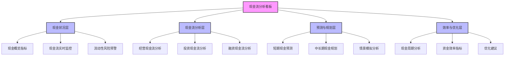
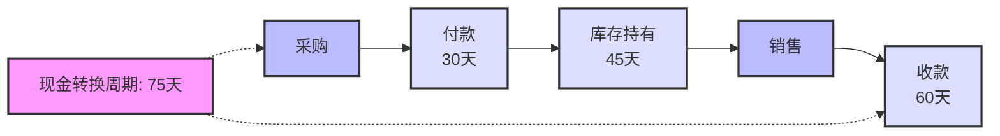
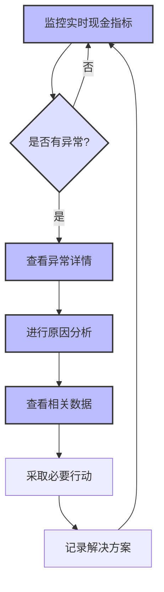

---
{"dg-publish":true,"tags":["财务BI","看板设计","现金流分析","流动性管理","现金规划"],"aliases":["现金流管理看板","流动性分析看板"],"permalink":"/知识共享/001_财务/02_财务BI看板项目/看板架构设计/核心看板设计/现金流分析看板/","dgPassFrontmatter":true}
---


# 现金流分析看板

## 概述

现金流分析看板是财务BI系统中专注于企业现金流状况与流动性管理的核心分析工具，通过全面监控与分析企业现金流入流出的各个方面，帮助管理层实时把握企业流动性状况，优化现金管理策略，预防流动性风险，提高资金使用效率。本看板结合先进的现金流管理理念和预测技术，为企业资金规划、投资决策和财务稳健性提供数据支持。

## 设计目标与原则

### 核心设计目标

1. **现金流全景监控**：提供企业现金流入流出的全面、实时视图
2. **流动性风险预警**：及时识别潜在的现金短缺风险和流动性问题
3. **现金流驱动因素分析**：深入分析影响现金流的关键业务因素和模式
4. **资金效率评估**：评估企业资金使用效率和优化机会
5. **现金流预测**：提供准确的短期和中长期现金流预测
6. **决策支持**：为资金规划、投资和融资决策提供数据支持

### 设计原则

1. **时效性原则**：确保关键现金流数据的实时性和预警的及时性
2. **可视性原则**：直观展示现金流模式、趋势和异常
3. **预见性原则**：强调预测和前瞻性分析，而不仅是历史回顾
4. **整合性原则**：整合运营、投资和融资活动的现金流影响
5. **场景模拟原则**：支持不同业务场景下的现金流模拟和压力测试
6. **实用性原则**：分析结果应直接支持现金管理决策和行动

## 用户与场景分析

### 目标用户群体

| 用户角色 | 关注重点 | 使用频率 | 典型需求 | 
| ---- | ---- | ---- | ---- |
| CFO/财务总监 | 整体现金状况、流动性风险 | 每日/每周 | 监控整体现金状况，评估财务稳健性 |
| 资金经理 | 短期现金流、日常资金管理 | 每日多次 | 管理日常现金流，优化短期资金配置 |
| 财务规划人员 | 中长期现金流预测、资金规划 | 每周/每月 | 制定资金规划，支持预算决策 |
| 业务管理者 | 业务现金流贡献、资金效率 | 每周/每月 | 了解业务对现金流的影响，优化运营资金 |
| 投资者/董事会 | 现金生成能力、财务健康度 | 每月/每季 | 评估企业财务韧性和长期可持续性 |

### 主要使用场景

1. **日常现金管理**：监控每日现金状况，管理短期资金需求
2. **现金流预测与规划**：预测未来现金流，制定资金规划
3. **流动性风险管理**：评估和管理潜在的现金短缺风险
4. **资金决策支持**：为投资、融资和分红决策提供依据
5. **业务现金影响分析**：分析业务决策对现金流的影响

## 看板结构设计

### 整体布局架构

现金流分析看板采用"现金状况监控 + 现金流分析 + 预测规划 + 效率优化"的分层架构：



### 分析层次与导航

| 分析层次 | 主要内容 | 典型问题 | 关键可视化 |
| ---- | ---- | ---- | ---- |
| 现金状况层 | 现金余额、短期流动性、预警 | 当前现金状况如何？是否有短期风险？ | 指标卡、趋势图、预警信号 |
| 现金流分析层 | 三大类现金流分析、现金流结构 | 现金流动向哪里？关键驱动因素是什么？ | 瀑布图、结构图、趋势图 |
| 预测与规划层 | 现金流预测、情景模拟、资金规划 | 未来现金流如何？不同情景下的影响？ | 预测图、情景模拟图、差异分析 |
| 效率与优化层 | 现金周期、资金效率、优化机会 | 如何提高资金效率？优化机会在哪里？ | 周期图、效率矩阵、建议卡片 |

### 多维分析框架

现金流分析看板支持以下多维分析视角，用户可灵活切换和组合这些维度：

1. **时间维度**：
   - 日/周/月/季/年
   - 短期(1-3个月)/中期(3-12个月)/长期(1年以上)
   - 历史/当前/预测

2. **现金流类别维度**：
   - 经营活动现金流
   - 投资活动现金流
   - 融资活动现金流
   - 自由现金流

3. **业务维度**：
   - 业务单元/部门
   - 产品线/项目
   - 客户/市场/地区

4. **对比维度**：
   - 计划vs实际
   - 同比/环比对比
   - 情景对比(基准/乐观/悲观)

## 核心指标与分析模块

### 现金状况模块

**核心指标**：

| 指标名称 | 计算方法 | 分析价值 | 展示方式 |
| ---- | ---- | ---- | ---- |
| 现金余额 | 各类现金及现金等价物总和 | 直接反映可用资金量 | 指标卡+趋势图 |
| 流动比率 | 流动资产/流动负债 | 短期偿债能力评估 | 指标卡+参考线 |
| 速动比率 | (流动资产-存货)/流动负债 | 即时偿债能力评估 | 指标卡+参考线 |
| 现金比率 | 现金及现金等价物/流动负债 | 极端情况下的偿债能力 | 指标卡+参考线 |
| 现金覆盖天数 | 现金余额/(年运营支出/365) | 无收入情况下的生存能力 | 指标卡+趋势图 |
| 经营活动净现金流 | 经营活动现金流入-流出 | 核心业务现金生成能力 | 指标卡+趋势图 |
| 自由现金流 | 经营现金流-维持性资本支出 | 可自由支配的现金流 | 指标卡+趋势图 |

**关键分析视图**：

1. **现金状况仪表盘**：
   - 实时现金余额与变动
   - 流动性比率监控
   - 现金缓冲状态评估

2. **流动性风险预警**：
   - 短期现金缺口预警
   - 流动性指标异常警报
   - 潜在风险事件提示

3. **现金流趋势监控**：
   - 现金余额历史趋势
   - 净现金流入/流出趋势
   - 季节性模式分析

### 现金流分析模块

**经营现金流分析**：

1. **经营现金流构成**：
   - 销售收款分析
   - 供应商付款分析
   - 税费支付分析
   - 工资福利支付分析

2. **经营现金流与利润对比**：
   - 净利润vs经营现金流对比
   - 差异原因分解
   - 现金转换效率评估

3. **经营现金流驱动因素**：
   - 销售增长对现金流影响
   - 毛利率变化对现金流影响
   - 运营资本变化对现金流影响

**投资现金流分析**：

1. **资本支出分析**：
   - 资本支出趋势与构成
   - 维持性vs增长性支出区分
   - 资本支出回报评估

2. **投资组合分析**：
   - 投资类型与金额分布
   - 投资回收与收益分析
   - 投资策略评估

3. **并购与处置分析**：
   - 并购相关现金流影响
   - 资产处置现金贡献
   - 战略投资回报评估

**融资现金流分析**：

1. **债务结构分析**：
   - 债务类型与期限结构
   - 还款计划与压力分析
   - 再融资需求评估

2. **股权融资分析**：
   - 股权融资历史与计划
   - 股利支付政策与历史
   - 股份回购影响

3. **融资成本分析**：
   - 加权平均资本成本
   - 债务成本趋势
   - 融资策略优化

### 预测与规划模块

**短期现金流预测**：

1. **滚动预测视图**：
   - 13周滚动现金流预测
   - 每日/每周现金变动预测
   - 预测与实际对比分析

2. **应收应付预测**：
   - 应收账款回收预测
   - 应付账款支付预测
   - 净营运资金变动预测

3. **短期资金缺口分析**：
   - 潜在资金缺口识别
   - 缺口弥补方案评估
   - 短期融资需求规划

**中长期现金流规划**：

1. **年度现金流预测**：
   - 基于预算的现金流转化
   - 季度/月度分解预测
   - 预测准确性跟踪

2. **中期资金需求规划**：
   - 经营增长对资金需求
   - 资本支出规划与影响
   - 债务还款与再融资规划

3. **长期战略现金规划**：
   - 战略计划的现金流影响
   - 长期财务可持续性评估
   - 股东回报潜力分析

**情景模拟分析**：

1. **敏感性分析**：
   - 关键假设变化的现金流影响
   - 临界点和风险阈值识别
   - 优先风险因素排序

2. **情景模拟**：
   - 基准/乐观/悲观情景规划
   - 特定事件情景分析
   - 复合风险情景评估

3. **压力测试**：
   - 极端条件下的流动性评估
   - 生存期分析
   - 应急预案准备度评估

### 效率与优化模块

**现金周期分析**：

1. **现金转换周期分析**：
   - 存货周转天数分析
   - 应收账款周转天数分析
   - 应付账款周转天数分析
   - 现金转换周期总体评估

2. **周期对比分析**：
   - 历史趋势对比
   - 行业标杆对比
   - 内部不同单位对比

3. **周期改进机会**：
   - 各环节优化潜力评估
   - 改进措施影响模拟
   - 优先行动建议

**资金效率分析**：

1. **现金效率指标**：
   - 现金流量充足率
   - 现金创造能力
   - 现金再投资比率

2. **资本配置效率**：
   - 投资回报率分析
   - 资本生产率评估
   - 资源配置优化建议

3. **流动资金管理效率**：
   - 闲置资金分析
   - 短期投资收益评估
   - 现金集中管理效果

**优化建议与行动**：

1. **现金流改善机会**：
   - 基于数据分析的改善点识别
   - 预期收益量化
   - 实施难度评估

2. **优化方案比较**：
   - 不同优化方案的效果对比
   - 实施时间表规划
   - 资源需求评估

3. **最佳实践推广**：
   - 内部最佳案例分享
   - 行业最佳实践对标
   - 知识库与学习资源

## 可视化与交互设计

### 核心可视化组件

#### 现金流瀑布图

```
┌───────────────────────────────────────────────────────────┐
│                                                           │
│                          期末现金                          │
│                                                           │
│ 期初                                                      │
│ 现金  ┌──┐                                                │
│      │  │    ┌──┐                                         │
│      │  │    │  │                                         │
│      │  │    │  │    ┌──┐                ┌──┐             │
│      │  │    │  │    │  │                │  │             │
│      │  │    │  │    │  │    ┌──┐        │  │             │
│      │  │    │  │    │  │    │  │        │  │             │
│      └──┘    └──┘    └──┘    └──┘        └──┘             │
│        │      │       │       │           │               │
│        │      │       │       │           │               │
│     期初余额  +经营活动 +投资活动 +融资活动   =期末余额     │
│                                                           │
└───────────────────────────────────────────────────────────┘
```

**设计要点**：
- 清晰展示现金余额变动的构成因素
- 使用不同颜色区分增加和减少因素
- 支持按不同时间周期和业务单位分析
- 提供详细分解和钻取功能

#### 现金流量趋势图

```
┌───────────────────────────────────────────────────────────┐
│                                                           │
│ 现金                                                      │
│ 流量                                         /\           │
│ (百万)                                      /  \          │
│                                           /    \          │
│  80 │                                   /      \          │
│     │                                 /        \          │
│  60 │               /\              /          \          │
│     │              /  \            /            \         │
│     │             /    \          /              \        │
│  40 │            /      \    /\_/                \_       │
│     │           /        \__/                      \      │
│  20 │         _/                                    \_    │
│     │      __/                                        \_  │
│   0 │____/                                              \_│
│     │                                                     │
│     └─────┬─────┬─────┬─────┬─────┬─────┬─────┬─────┬─────│
│           1     2     3     4     5     6     7     8     9      │
│                            月份                                  │
│                                                                  │
│     —— 经营现金流   ---- 投资现金流   …… 融资现金流              │
│                                                                  │
└───────────────────────────────────────────────────────────┘
```

**设计要点**：
- 展示不同类别现金流的时间趋势
- 支持叠加或分离显示不同现金流类型
- 突出关键波动点并提供注释
- 显示净现金流和累计现金流选项

#### 现金流预测与实际对比图

```
┌───────────────────────────────────────────────────────────┐
│                                                           │
│ 现金                                                      │
│ 余额                   │                                  │
│ (百万)                 │ 预测区间                         │
│                        │                                  │
│ 150 │                  │               ····              │
│     │                  │           ····    ····          │
│     │                  │       ····            ···       │
│     │          _,-─^   │   ····                   ···    │
│ 100 │      _,-´      \ │ ···                         ··  │
│     │  _,-´            │·                               ··│
│     │-´                │                                  │
│  50 │                  │                                  │
│     │                  │                                  │
│   0 │                  │                                  │
│     └─────────────────┬┴──────────────────────────────────│
│                  当前日期                                 │
│                                                           │
│     —— 历史实际   ···· 基准预测   --- 乐观预测  -·- 悲观预测 │
│                                                           │
└───────────────────────────────────────────────────────────┘
```

**设计要点**：
- 清晰区分历史实际数据和未来预测
- 展示不同情景下的预测范围
- 显示预测区间和置信度
- 标记关键事件点和转折点

#### 现金转换周期图



**设计要点**：
- 直观展示现金周转各环节的时间
- 突出现金锁定的关键环节
- 支持与历史数据和行业标杆对比
- 提供优化建议和影响模拟

### 交互设计与用户体验

#### 现金流动态监控器

**功能设计**：
- 实时显示现金状况和变动
- 灵活设置监控阈值和预警规则
- 提供自动预警和异常通知
- 支持快速深入分析异常

**交互流程**：


#### 现金流预测工作台

**功能设计**：
- 集成多种预测方法和模型
- 支持预测参数和假设调整
- 提供情景模拟和敏感性分析
- 跟踪预测准确性并持续改进

**预测方法**：
- 历史模式预测
- 基于业务驱动的预测
- 自下而上的明细预测
- 机器学习增强预测

**交互特性**：
- 拖拽式调整预测假设
- 实时更新预测结果
- 保存多个预测场景
- 协作式预测编辑和审核

#### 现金优化助手

**功能设计**：
- 基于数据识别现金管理优化机会
- 提供结构化的改进建议
- 量化潜在收益和实施难度
- 追踪优化措施实施效果

**优化类别**：
- 收款加速策略
- 付款优化方案
- 库存管理改进
- 闲置资金利用
- 融资结构优化

**交互流程**：
1. 识别优化机会领域
2. 浏览领域内具体优化建议
3. 评估不同建议的潜在影响
4. 创建优化行动计划
5. 设置目标和跟踪指标
6. 监控实施进度和效果

## 数据需求与集成

### 核心数据来源

| 数据类型 | 主要来源 | 更新频率 | 数据粒度 |
| ---- | ---- | ---- | ---- |
| 现金交易数据 | 银行系统、财务系统 | 实时/日 | 交易级、账户级 |
| 应收应付数据 | 应收应付系统、ERP系统 | 日/周 | 客户、供应商、发票 |
| 销售数据 | 销售系统、CRM系统 | 实时/日 | 订单、客户、产品 |
| 采购数据 | 采购系统、供应链系统 | 日/周 | 订单、供应商、物料 |
| 预算数据 | 预算系统、财务规划系统 | 月/季 | 部门、项目、科目 |
| 合同与计划数据 | 合同管理系统、项目系统 | 按需更新 | 合同、项目、里程碑 |

### 数据处理与计算

1. **数据整合与转换**：
   - 跨系统数据的实时/准实时整合
   - 不同粒度和时间维度的转换和聚合
   - 历史数据与预测数据的无缝连接

2. **高级分析计算**：
   - 现金流预测算法和模型
   - 敏感性分析和情景模拟引擎
   - 异常检测和模式识别

3. **数据安全与合规**：
   - 敏感财务数据的权限控制
   - 数据处理的审计跟踪
   - 合规报告自动化生成

## 实施与集成建议

### 分阶段实施路径

| 阶段 | 重点工作 | 交付成果 | 时间参考 |
| ---- | ---- | ---- | ---- |
| 第一阶段：基础现金监控 | 核心指标和现金状况监控 | 现金状况模块，基础现金流分析 | 6-8周 |
| 第二阶段：预测与分析 | 预测模型和深度分析 | 预测与规划模块，深度现金流分析 | 8-10周 |
| 第三阶段：优化与集成 | 效率分析和系统集成 | 效率与优化模块，全面系统集成 | 8-12周 |

### 与其他系统的集成

1. **与财务概览看板的集成**：
   - 现金状况关键指标共享
   - 流动性风险预警联动
   - 保持现金相关分析口径一致性

2. **与其他财务分析看板的集成**：
   - 与利润分析看板的利润-现金流关联
   - 与预算执行看板的计划-实际对比
   - 与融资分析看板的债务管理协同

3. **与业务系统的集成**：
   - 销售系统的收款预测集成
   - 采购系统的付款计划集成
   - 项目管理系统的资金需求集成

## 实际应用案例

### 流动性危机预防

**场景描述**：
企业需要提前识别和预防潜在的流动性危机，确保在各种情况下都能维持业务连续性。

**分析流程**：
1. 使用现金状况模块监控关键流动性指标
2. 通过预测模块进行12周滚动现金流预测
3. 识别潜在的现金短缺期：
   - 季节性销售低谷期
   - 集中采购付款期
   - 债务集中到期期
4. 运用情景模拟工具评估不同风险因素：
   - 主要客户延迟付款
   - 销售下滑30%
   - 信贷市场收紧
5. 制定预防措施：
   - 建立授信额度备用
   - 调整付款和收款政策
   - 优化库存水平
6. 设置预警触发点和应急预案
7. 持续监控并优化预警机制

### 运营资金优化项目

**场景描述**：
企业启动运营资金优化项目，旨在释放被锁定在运营周期中的现金。

**分析流程**：
1. 使用现金周期分析确定当前现金转换周期
2. 分析各环节现状和行业对标：
   - 应收账款：平均60天，行业标准45天
   - 存货：平均45天，行业标准30天
   - 应付账款：平均30天，行业标准40天
3. 识别优化机会：
   - 优化信用政策和收款流程
   - 改进库存管理和预测
   - 重新协商供应商条款
4. 使用模拟工具评估不同优化组合的影响
5. 制定实施计划并设定目标：
   - 缩短应收天数至50天
   - 减少库存天数至35天
   - 延长应付天数至35天
6. 使用现金优化助手跟踪实施进度和效果
7. 实现运营资金减少15%，释放现金1200万

## 最佳实践与注意事项

1. **平衡短期与长期视角**：
   - 短期现金管理不应牺牲长期业务健康
   - 结合战略目标评估现金决策
   - 建立多时间范围的现金管理框架

2. **提高预测准确性**：
   - 定期评估和改进预测模型
   - 结合业务驱动因素优化预测
   - 跟踪和学习历史预测偏差

3. **强化跨部门协作**：
   - 建立财务与业务部门的现金管理协作机制
   - 增强销售、采购等部门的现金意识
   - 分享现金流改善的成功经验和激励

4. **关注质量而非数量**：
   - 现金流质量与数量同样重要
   - 评估现金流的可持续性和重复性
   - 区分核心业务和非常规项目的现金贡献 