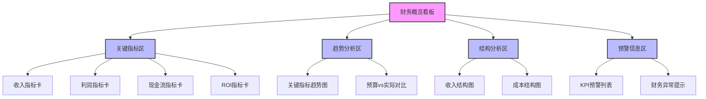
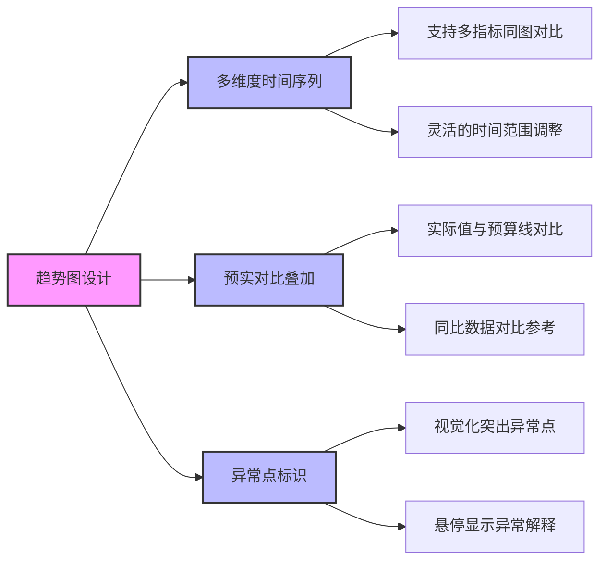
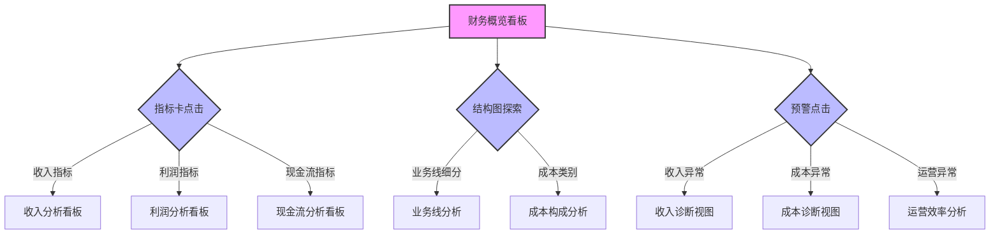

---
{"dg-publish":true,"tags":["财务BI","看板设计","概览看板","财务监控","高层视图"],"aliases":["财务仪表盘","财务驾驶舱"],"permalink":"/知识共享/001_财务/02_财务BI看板项目/看板架构设计/核心看板设计/财务概览看板/","dgPassFrontmatter":true}
---


# 财务概览看板

## 概述

财务概览看板是财务BI系统的核心入口和"指挥中心"，它聚合展示企业最关键的财务健康指标，为管理层和决策者提供全局视野，快速把握企业财务状况、识别异常和机会点。本看板采用高度聚合的数据视图，通过精心设计的可视化组件，确保用户能在第一时间获取最重要的财务洞察，并能便捷地导航至更详细的分析视图。

## 设计目标与原则

### 核心设计目标

1. **全局财务状况一览**：提供企业整体财务健康状况的快照视图
2. **关键指标监控**：突出展示最重要的财务KPI及其趋势变化
3. **异常与机会识别**：快速识别财务异常和潜在业务机会
4. **导航中心功能**：作为整个财务BI系统的导航枢纽
5. **决策支持**：支持管理层快速决策的信息需求

### 设计原则

1. **重要性优先**：按照业务重要性组织信息，最关键指标最醒目
2. **简洁高效**：避免信息过载，保持界面简洁清晰
3. **分层展示**：采用分层设计，支持从概览到细节的探索
4. **一目了然**：关键信息应在3-5秒内被用户感知
5. **上下文关联**：保持各指标间的关联性，支持整体理解
6. **趋势导向**：强调指标的变化趋势和历史对比
7. **响应式设计**：适应不同设备和屏幕尺寸

## 用户与场景分析

### 目标用户群体

| 用户角色 | 关注重点 | 使用频率 | 典型需求 | 
| ---- | ---- | ---- | ---- |
| 公司高管 | 整体业绩、关键偏差 | 每日/每周 | 快速了解企业财务健康状况，识别需关注的问题 |
| 财务总监 | 财务指标全貌、预警信息 | 每日多次 | 监控全局财务指标，识别异常，指导财务工作 |
| 业务部门主管 | 与本部门相关的指标表现 | 每周/每月 | 了解本部门财务表现，对比目标完成情况 |
| 董事会成员 | 战略级指标、长期趋势 | 每月/每季 | 了解公司财务状况用于治理决策 |

### 主要使用场景

1. **晨会检视**：管理层晨会快速检视企业状况
2. **异常监控**：财务团队日常监控识别异常情况
3. **决策支持**：为紧急决策提供数据支持
4. **绩效沟通**：与业务部门沟通财务表现
5. **董事会汇报**：向董事会成员汇报财务状况

## 看板结构设计

### 整体布局架构

财务概览看板采用"关键指标卡 + 趋势概览 + 结构视图 + 预警信息"的四区块布局架构：



### 区域功能定位

| 区域名称 | 位置布局 | 主要内容 | 交互特性 | 
| ---- | ---- | ---- | ---- |
| 关键指标区 | 顶部横向排列 | 核心KPI指标卡片，含同环比 | 点击下钻至详细分析，显示趋势迷你图 |
| 趋势分析区 | 中上部主区域 | 关键指标时间趋势，预实对比 | 时间范围切换，指标切换，高亮显示 |
| 结构分析区 | 中下部主区域 | 收入/成本结构，贡献分析 | 维度切换，钻取分析，高亮显示 |
| 预警信息区 | 右侧垂直区域 | 异常KPI列表，偏差提示 | 点击导航至具体问题，严重性过滤 |

### 多级视图设计

财务概览看板支持从高层到详细的三级视图设计：

1. **第一级：管理层摘要视图**
   - 极度聚焦的3-5个最关键指标
   - 适合高管快速检视，大屏展示
   - 高度视觉化，减少数据密度

2. **第二级：财务全景视图**（默认视图）
   - 完整的财务概览全景
   - 兼顾广度和一定深度
   - 适合财务专业人员日常使用

3. **第三级：部门/业务线视图**
   - 针对特定部门/业务的财务概览
   - 可切换不同业务实体
   - 指标体系与全景视图保持一致

## 关键指标与可视化设计

### 核心指标体系

| 指标类别 | 关键指标 | 计算方法 | 展示形式 |
| ---- | ---- | ---- | ---- |
| 收入指标 | 总收入、收入同比增长率 | 本期总收入，同比增长% | 指标卡+趋势图 |
| 利润指标 | 毛利率、净利率、EBITDA | 毛利/收入%, 净利/收入%, EBITDA | 指标卡+对比图 |
| 成本指标 | 总成本、成本收入比 | 本期总成本，成本/收入% | 指标卡+结构图 |
| 现金流指标 | 经营现金流、现金转换率 | 经营活动现金流，经营现金流/净利润 | 指标卡+趋势图 |
| 资产指标 | 总资产收益率、资产周转率 | 净利润/总资产，收入/总资产 | 指标卡+趋势图 |
| 运营指标 | 客单价、获客成本、留存率 | 收入/客户数，营销成本/新客数，留存客户% | 指标卡+对比图 |

### 可视化组件设计

#### 指标卡片设计

```
┌─────────────────────────┐
│ 总收入                  │
│                         │
│ ¥ 128.5M                │
│                         │
│ ↑ 12.3% vs 上年同期    │
│ ↓  2.1% vs 预算目标    │
│                         │
│         /\/\/\          │
└─────────────────────────┘
```

设计要点：
- 清晰的指标名称和当前值
- 同比和预算比突出显示
- 微型趋势图显示近期走势
- 使用颜色编码表示状态（绿色正向，红色负向）
- 点击即可下钻至详细分析

#### 趋势分析图表

**多指标趋势对比图**



设计要点：
- 支持多指标叠加或并列对比
- 提供预算线作为参考
- 显示同比数据作为对比
- 突出显示异常点并提供解释
- 支持时间粒度和范围调整

#### 结构分析图表

**收入/成本结构图**

```
┌───────────────────────────────────┐
│                                   │
│            产品A (35%)            │
│       ┌──────────────────┐        │
│       │                  │        │
│       │                  │        │
│服务收入│                  │产品收入 │
│(30%)  │                  │(70%)   │
│       │      产品B        │        │
│       │      (25%)       │        │
│       │                  │        │
│       └──────────────────┘        │
│           产品C (10%)             │
│                                   │
└───────────────────────────────────┘
```

设计要点：
- 使用树状图或环形图展示层级结构
- 颜色区分不同类别和层级
- 支持下钻探索和维度切换
- 显示占比百分比和绝对值
- 高亮显示重要或异常部分

#### 预警信息设计

**KPI预警列表**

```
┌─────────────────────────────────┐
│ 预警信息                        │
│                                 │
│ ● 产品A毛利率下降 12.3%         │
│   比上月下降，低于行业基准      │
│                                 │
│ ▲ 市场营销支出超预算 8.7%      │
│   增长速度高于收入增长          │
│                                 │
│ ■ 应收账款周转率降低           │
│   现为45天，比目标延长8天       │
│                                 │
└─────────────────────────────────┘
```

设计要点：
- 使用不同图标和颜色表示严重程度
- 简明扼要的问题描述和关键数据
- 提供上下文信息和参考基准
- 点击可直接导航至问题分析视图
- 支持按严重程度和类型筛选

## 交互设计与导航

### 主要交互功能

1. **时间维度控制**：
   - 灵活选择分析时间范围（本月/季/年）
   - 支持同比/环比/自定义对比设置
   - 历史时间轴快速导航

2. **组织维度筛选**：
   - 按业务单元/部门/产品线切换
   - 地区/子公司筛选
   - 多维度组合筛选

3. **指标个性化**：
   - 自定义关键指标组合显示
   - 保存个人常用指标视图
   - 指标优先级调整

4. **导航与钻取**：
   - 从指标卡直接下钻至详细分析
   - 从结构图探索细分领域
   - 预警信息直达问题区域

### 导航路径设计



### 个性化与配置选项

| 配置项 | 配置内容 | 用户价值 | 默认设置 |
| ---- | ---- | ---- | ---- |
| 指标选择 | 自定义显示的KPI组合 | 聚焦最相关指标 | 基于角色预设组合 |
| 布局调整 | 调整区块位置和大小 | 符合使用习惯和偏好 | 标准四区块布局 |
| 颜色方案 | 选择视觉主题和颜色方案 | 适应组织视觉标准 | 企业品牌色系 |
| 目标设置 | 设置个人KPI目标和阈值 | 个人化的目标监控 | 基于公司标准目标 |
| 通知偏好 | 设置预警提醒级别和方式 | 按需获取提醒 | 中高级别预警 |

## 数据更新与性能

### 数据刷新策略

| 数据类型 | 更新频率 | 数据来源 | 历史范围 |
| ---- | ---- | ---- | ---- |
| 核心KPI指标 | 日更新/实时指标 | 数据仓库/经过验证的财务系统 | 13个月滚动 |
| 趋势分析数据 | 日更新 | 数据仓库 | 5年历史数据 |
| 结构分析数据 | 周更新 | 数据仓库 | 当前期间 |
| 预警信息 | 实时/日计算 | 实时计算引擎/指标监控系统 | 最近发现的待处理事项 |

### 性能优化策略

1. **数据聚合预计算**：
   - 高频访问指标预聚合存储
   - 层级化聚合策略，支持下钻
   - 增量更新机制

2. **渲染性能优化**：
   - 首屏优先加载关键指标
   - 可视区域按需渲染
   - 大数据集优化展示策略

3. **缓存策略**：
   - 用户级视图状态缓存
   - 共享数据集缓存
   - 智能缓存失效机制

## 实施与优化建议

### 分阶段实施路径

| 阶段 | 重点工作 | 交付成果 | 时间参考 |
| ---- | ---- | ---- | ---- |
| 第一阶段 | 核心KPI展示 | 基础指标卡和趋势图 | 4-6周 |
| 第二阶段 | 结构分析与预警 | 完整四区块布局 | 6-8周 |
| 第三阶段 | 个性化与高级分析 | 支持个性化配置和下钻 | 6-8周 |

### 关键成功因素

1. **数据质量保障**：
   - 建立KPI数据认证流程
   - 明确数据口径和计算规则
   - 数据异常自动检测机制

2. **用户采纳策略**：
   - 分角色的培训计划
   - 融入日常工作流程
   - 持续收集用户反馈优化

3. **长期维护机制**：
   - 指标体系定期审核更新
   - 视觉和交互设计迭代优化
   - 性能监测和持续优化

## 实际应用案例

### 管理层晨会场景

**使用场景**：公司管理层每日晨会，快速检视关键业务指标

**核心功能**：
- 显示昨日/本周/本月核心业绩指标
- 突出异常和偏差较大的指标
- 支持基于问题的快速深入分析

**使用流程**：
1. 总览整体指标表现和趋势
2. 关注红色预警指标和异常
3. 点击问题指标深入了解原因
4. 分配后续行动和负责人

### 财务分析诊断场景

**使用场景**：财务团队对业绩偏离预期进行根因分析

**核心功能**：
- 多维度对比分析（预实对比、同环比）
- 指标关联分析，识别相关性
- 下钻探索功能，追踪问题源头

**使用流程**：
1. 从预警信息识别关键问题
2. 通过趋势图分析问题发展轨迹
3. 使用结构图识别问题集中区域
4. 下钻至专题分析确认根因
5. 通过关联指标验证分析结论

## 看板布局效果示意

### 桌面大屏幕布局

```
┌──────────────────────────────────────────────────────────────────┬─────────────────────┐
│                                                                  │                     │
│  ┌─────────┐  ┌─────────┐  ┌─────────┐  ┌─────────┐  ┌─────────┐ │   ┌─────────────┐  │
│  │ 总收入  │  │ 毛利率  │  │ 净利率  │  │ 运营现金│  │ 总资产  │ │   │ 预警信息    │  │
│  │ $128.5M │  │ 42.3%   │  │ 15.7%   │  │ $24.3M  │  │ 回报率  │ │   │ ● 产品A毛利 │  │
│  │ ↑12.3%  │  │ ↓2.1%   │  │ ↑0.8%   │  │ ↑5.4%   │  │ 8.9%    │ │   │ 率下降12.3%│  │
│  └─────────┘  └─────────┘  └─────────┘  └─────────┘  └─────────┘ │   │             │  │
│                                                                  │   │             │  │
│  ┌──────────────────────────────────────────────────────────────┐│   │ ▲ 市场营销  │  │
│  │                                                              ││   │   支出超预算 │  │
│  │                                                              ││   │   8.7%      │  │
│  │                    多指标趋势对比图                          ││   │             │  │
│  │                                                              ││   │ ■ 应收账款  │  │
│  │                                                              ││   │   周转率降低 │  │
│  │                                                              ││   │             │  │
│  └──────────────────────────────────────────────────────────────┘│   │ ● 区域C销售 │  │
│                                                                  │   │   未达目标   │  │
│  ┌─────────────────────────────────┬────────────────────────────┐│   │             │  │
│  │                                 │                            ││   └─────────────┘  │
│  │                                 │                            ││                     │
│  │                                 │                            ││   ┌─────────────┐  │
│  │         收入结构分析图          │        成本结构分析图      ││   │ 快速导航    │  │
│  │                                 │                            ││   │             │  │
│  │                                 │                            ││   │ > 利润分析  │  │
│  │                                 │                            ││   │ > 成本分析  │  │
│  └─────────────────────────────────┴────────────────────────────┘│   │ > 现金流    │  │
│                                                                  │   │ > 预算分析  │  │
└──────────────────────────────────────────────────────────────────┴─────────────────────┘
```

### 移动设备布局

```
┌─────────────────────────┐
│                         │
│  ┌─────────┐ ┌─────────┐│
│  │ 总收入  │ │ 毛利率  ││
│  │ $128.5M │ │ 42.3%   ││
│  │ ↑12.3%  │ │ ↓2.1%   ││
│  └─────────┘ └─────────┘│
│                         │
│  ┌─────────┐ ┌─────────┐│
│  │ 净利率  │ │ 现金流  ││
│  │ 15.7%   │ │ $24.3M  ││
│  │ ↑0.8%   │ │ ↑5.4%   ││
│  └─────────┘ └─────────┘│
│                         │
│  ┌─────────────────────┐│
│  │                     ││
│  │                     ││
│  │    关键指标趋势图   ││
│  │                     ││
│  │                     ││
│  └─────────────────────┘│
│                         │
│  ┌─────────────────────┐│
│  │                     ││
│  │   重要预警信息(3)   ││
│  │                     ││
│  │ ● 产品A毛利率下降   ││
│  │ ▲ 营销支出超预算    ││
│  │                     ││
│  └─────────────────────┘│
│                         │
└─────────────────────────┘
```

## 总结与最佳实践

1. **设计简洁为王**：保持界面简洁清晰，避免过多视觉干扰
2. **突出关键异常**：确保异常和偏差能立即被感知
3. **提供业务上下文**：所有指标应提供足够的比较和参考信息
4. **支持深入探索**：提供直观的导航路径深入分析问题
5. **保持一致体验**：与其他专题看板保持一致的设计语言和交互模式
6. **考虑多设备场景**：设计应适应从大屏到移动设备的多种使用场景
7. **关注数据及时性**：清晰标示数据更新时间，确保数据时效性 