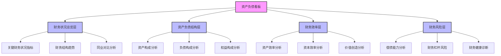
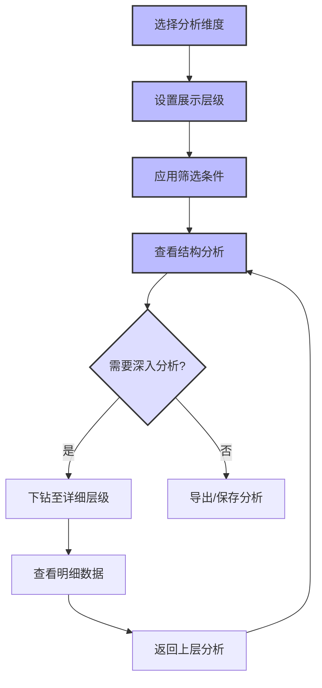

---
{"dg-publish":true,"tags":["财务BI","看板设计","资产负债分析","财务结构","资产管理"],"aliases":["财务状况看板","资产负债表分析看板"],"permalink":"/知识共享/001_财务/02_财务BI看板项目/看板架构设计/核心看板设计/资产负债看板/","dgPassFrontmatter":true}
---


# 资产负债看板

## 概述

资产负债看板是财务BI系统中专注于企业财务状况和资本结构的核心分析工具，通过全面分析企业资产、负债和所有者权益的构成、变化和相互关系，帮助管理层深入了解企业的财务状况、资金结构和风险水平。本看板结合现代财务理论和分析方法，为资产配置决策、负债管理、资本结构优化和财务风险控制提供数据支持，助力企业实现财务稳健与价值最大化。

## 设计目标与原则

### 核心设计目标

1. **资产负债全景透视**：提供企业资产负债的全面、多维度视图
2. **财务结构分析**：深入分析资产负债的构成、质量和效率
3. **财务风险监控**：监控和评估企业的财务风险水平和趋势
4. **资金使用效率评估**：评估企业资金配置和使用效率
5. **财务健康诊断**：诊断企业财务状况和可持续性
6. **决策支持**：为资本结构优化和资产负债管理提供决策支持

### 设计原则

1. **全面性原则**：覆盖资产负债分析的各个维度和层次
2. **关联性原则**：关注资产负债各要素间的联系和平衡
3. **趋势性原则**：强调资产负债结构和效率的变化趋势
4. **对比性原则**：提供多维度的内外部对比分析
5. **实用性原则**：分析结果直接指向可行的优化方向
6. **风险导向原则**：突出财务风险的识别和管理

## 用户与场景分析

### 目标用户群体

| 用户角色 | 关注重点 | 使用频率 | 典型需求 | 
| ---- | ---- | ---- | ---- |
| CFO/财务总监 | 整体财务结构、风险评估 | 每周/每月 | 监控公司财务结构健康度，评估资本配置 |
| 财务分析师 | 资产负债细节、效率指标 | 每周/每月 | 分析资产负债结构变化，识别优化机会 |
| 资金经理 | 债务结构、融资需求 | 每周/每月 | 管理债务组合，优化融资结构 |
| 业务部门主管 | 部门资产使用效率 | 每月/每季 | 了解部门资产效率，优化资源使用 |
| 投资者/董事会 | 财务稳健性、价值评估 | 每月/每季 | 评估公司长期财务健康度和投资价值 |

### 主要使用场景

1. **定期财务状况评估**：定期评估企业整体财务结构和健康度
2. **资本结构优化**：分析并优化企业的资本结构和融资策略
3. **资产配置决策**：为资产投资和配置决策提供依据
4. **财务风险管理**：识别和管理潜在的财务风险
5. **并购与投资分析**：评估并购和重大投资对财务结构的影响

## 看板结构设计

### 整体布局架构

资产负债看板采用"总览监控 + 结构分析 + 效率评估 + 风险管理"的分层架构：



### 分析层次与导航

| 分析层次 | 主要内容 | 典型问题 | 关键可视化 |
| ---- | ---- | ---- | ---- |
| 财务状况总览层 | 关键财务指标、整体结构、趋势 | 整体财务状况如何？与行业比较？ | 指标卡、雷达图、趋势图 |
| 资产负债结构层 | 各类资产负债的构成、变化分析 | 资产负债构成如何？有何变化？ | 结构图、瀑布图、热力图 |
| 财务效率层 | 资产效率、资本效率、价值创造 | 资金使用效率如何？如何提升？ | 效率矩阵、对比图、散点图 |
| 财务风险层 | 偿债能力、财务杠杆、财务健康 | 财务风险水平如何？潜在风险？ | 仪表盘、风险矩阵、预警图 |

### 多维分析框架

资产负债看板支持以下多维分析视角，用户可灵活切换和组合这些维度：

1. **时间维度**：
   - 年/季度/月
   - 同比/环比/趋势分析
   - 历史对比/预测比较

2. **组织维度**：
   - 公司整体/业务单元/部门
   - 子公司/分支机构
   - 项目/产品线

3. **资产负债类别维度**：
   - 资产类别(流动/非流动、有形/无形)
   - 负债类别(短期/长期、经营/融资)
   - 权益类别(注资/留存/其他)

4. **对比维度**：
   - 计划vs实际
   - 行业标杆对比
   - 历史最佳对比
   - 内部单位对比

## 核心指标与分析模块

### 财务状况总览模块

**核心指标**：

| 指标名称 | 计算方法 | 分析价值 | 展示方式 |
| ---- | ---- | ---- | ---- |
| 总资产 | 流动资产+非流动资产 | 反映企业资源规模 | 指标卡+趋势图 |
| 总负债 | 流动负债+非流动负债 | 反映企业债务规模 | 指标卡+趋势图 |
| 所有者权益 | 总资产-总负债 | 反映股东价值规模 | 指标卡+趋势图 |
| 资产负债率 | 总负债/总资产 | 评估企业财务杠杆水平 | 指标卡+仪表盘 |
| 流动比率 | 流动资产/流动负债 | 短期偿债能力评估 | 指标卡+参考线 |
| 产权比率 | 总负债/所有者权益 | 财务结构评估 | 指标卡+趋势图 |
| 资产收益率(ROA) | 净利润/平均总资产 | 资产收益能力 | 指标卡+趋势图 |
| 权益收益率(ROE) | 净利润/平均所有者权益 | 股东回报能力 | 指标卡+趋势图 |

**关键分析视图**：

1. **财务状况仪表盘**：
   - 关键财务指标概览
   - 指标间关联展示
   - 健康状态评估

2. **财务结构趋势图**：
   - 资产、负债、权益结构变化
   - 关键比率时间序列
   - 增长率和变化率分析

3. **行业对标分析**：
   - 关键指标与行业标杆对比
   - 竞争者财务状况比较
   - 市场定位与差距分析

### 资产负债结构模块

**资产构成分析**：

1. **资产结构分析**：
   - 流动资产与非流动资产比例
   - 各类资产占比及变化
   - 资产质量评估

2. **流动资产细分分析**：
   - 货币资金/应收款项/存货等构成
   - 各类流动资产变化趋势
   - 短期资产流动性评估

3. **非流动资产细分分析**：
   - 固定资产/投资/无形资产等构成
   - 长期资产变化趋势
   - 战略资产配置评估

**负债构成分析**：

1. **负债结构分析**：
   - 流动负债与非流动负债比例
   - 各类负债占比及变化
   - 负债来源和成本分析

2. **流动负债细分分析**：
   - 短期借款/应付款项/预收款项等构成
   - 各类短期负债变化趋势
   - 短期负债管理评估

3. **非流动负债细分分析**：
   - 长期借款/债券/长期应付款等构成
   - 长期负债期限结构
   - 债务成本和条款分析

**权益构成分析**：

1. **权益结构分析**：
   - 实收资本/资本公积/留存收益等构成
   - 各类权益变化趋势
   - 权益质量和稳定性评估

2. **股东回报分析**：
   - 股息政策和历史
   - 留存收益增长
   - 股东权益变动驱动因素

3. **股权结构分析**：
   - 主要股东及持股变化
   - 股权集中度评估
   - 控制权分析

### 财务效率模块

**资产效率分析**：

1. **总资产周转率分析**：
   - 总资产周转率计算和趋势
   - 行业对标和历史比较
   - 提升机会识别

2. **分类资产效率分析**：
   - 流动资产周转率
   - 固定资产周转率
   - 各类资产利用效率对比

3. **关键资产项目效率**：
   - 应收账款周转率/天数
   - 存货周转率/天数
   - 固定资产产出率

**资本效率分析**：

1. **资本结构效率**：
   - 加权平均资本成本(WACC)
   - 资本结构对ROE的影响
   - 最优资本结构分析

2. **权益乘数分析**：
   - 财务杠杆效应评估
   - 杠杆对盈利能力的影响
   - 风险与回报平衡分析

3. **融资效率分析**：
   - 债务成本分析
   - 融资方式比较
   - 融资与投资匹配度

**价值创造分析**：

1. **经济增加值(EVA)分析**：
   - EVA计算和趋势
   - EVA驱动因素分解
   - 价值创造能力评估

2. **资产价值评估**：
   - 账面价值vs市场价值
   - 无形资产价值评估
   - 资产减值风险分析

3. **价值创造路径分析**：
   - 业务价值创造分析
   - 投资价值创造分析
   - 融资价值创造分析

### 财务风险模块

**偿债能力分析**：

1. **短期偿债能力**：
   - 流动比率/速动比率分析
   - 现金比率分析
   - 营运资本管理

2. **长期偿债能力**：
   - 资产负债率分析
   - 利息保障倍数
   - 债务覆盖率分析

3. **债务结构与风险**：
   - 债务期限结构
   - 固定/浮动利率债务比例
   - 币种风险分析

**财务杠杆风险**：

1. **杠杆效应分析**：
   - 经营杠杆度(DOL)
   - 财务杠杆度(DFL)
   - 复合杠杆度(DTL)

2. **临界点分析**：
   - 息税前利润临界点
   - 杠杆安全边际
   - 压力测试分析

3. **融资约束分析**：
   - 融资契约遵守状况
   - 信用等级影响因素
   - 融资通道多元化

**财务健康诊断**：

1. **财务危机预警**：
   - Z-Score分析
   - 财务困境概率评估
   - 早期预警指标监控

2. **财务弹性评估**：
   - 紧急流动性资源评估
   - 融资能力储备
   - 应急财务计划评估

3. **可持续性分析**：
   - 财务结构可持续性评估
   - 增长自我可持续率分析
   - 长期财务健康指标

## 可视化与交互设计

### 核心可视化组件

#### 财务结构图

```
┌─────────────────────────────────────────────────────┐
│                                                     │
│            资产结构               负债及权益结构     │
│                                                     │
│  其他资产 10%                     其他负债 5%       │
│  ┌──────────┐                     ┌──────────┐      │
│  │          │                     │          │      │
│  │          │                     │          │      │
│  │          │                     │          │      │
│  │无形资产15%│                     │长期负债25%│      │
│  │          │                     │          │      │
│  │          │                     │          │      │
│  │          │                     │          │      │
│  │          │                     │          │      │
│  ├──────────┤                     ├──────────┤      │
│  │          │                     │          │      │
│  │固定资产35%│                     │流动负债30%│      │
│  │          │                     │          │      │
│  │          │                     │          │      │
│  ├──────────┤                     ├──────────┤      │
│  │          │                     │          │      │
│  │流动资产40%│                     │权益   40%│      │
│  │          │                     │          │      │
│  │          │                     │          │      │
│  └──────────┘                     └──────────┘      │
│                                                     │
│   总资产                           总负债及权益      │
│  1000万元                          1000万元        │
│                                                     │
└─────────────────────────────────────────────────────┘
```

**设计要点**：
- 清晰展示资产与负债权益的构成对比
- 使用不同颜色区分各类资产和负债权益
- 展示金额和百分比信息
- 支持时间比较和内部单位比较

#### 资产负债趋势图

```
┌────────────────────────────────────────────────┐
│                                                │
│ 金额                                           │
│ (百万)                                         │
│                                                │
│ 1200 │                                 _--''   │
│      │                            _--''        │
│ 1000 │                       _--''             │
│      │                  _--''                  │
│  800 │             _--''                       │
│      │        _--''                            │
│  600 │   _--''                                 │
│      │--'                                      │
│  400 │- - - - - - - - - - - - - - - - - - - - │
│      │                                         │
│  200 │............................................│
│      │                                         │
│    0 └────┬────┬────┬────┬────┬────┬────┬────┬─│
│           Q1   Q2   Q3   Q4   Q1   Q2   Q3   Q4│
│              2022              2023             │
│                                                │
│     — 总资产   - - 总负债   .... 净资产        │
│                                                │
└────────────────────────────────────────────────┘
```

**设计要点**：
- 展示资产、负债、净资产的变化趋势
- 使用不同线型和颜色区分不同指标
- 支持时间范围调整和历史比较
- 突出关键变化点和转折点

#### 财务效率矩阵

```
┌────────────────────────────────────────────────┐
│                                                │
│ 资产    │                                      │
│ 收益率  │         ●A                           │
│  高     │                                      │
│         │                                      │
│         │                  ●B                  │
│         │                                      │
│         │      ●F                              │
│         │                         ●C           │
│         │                                      │
│         │                                      │
│         │           ●E           ●D            │
│         │                                      │
│  低     │                                      │
│         └────────────────────────────────────  │
│            低                   高             │
│                    资产周转率                  │
│                                                │
│    A-F代表不同业务单元或时间点                  │
│                                                │
└────────────────────────────────────────────────┘
```

**设计要点**：
- 展示资产效率的两个关键维度关系
- 使用散点表示不同业务单元或时间点
- 添加参考线或区域表示目标区间
- 支持钻取查看具体效率驱动因素

#### 财务健康仪表盘

```
┌────────────────────────────────────────────────┐
│                                                │
│  财务健康评分                                  │
│                                                │
│    0    10   20   30   40   50   60   70   80   90  100  │
│    │    │    │    │    │    │    │    │    │    │    │   │
│    ├────┼────┼────┼────┼────┼────┼────┼────┼────┼────┤   │
│    │                            ▲                    │   │
│    │                                                 │   │
│    │   高风险     中等风险      良好      优秀       │   │
│    │                                                 │   │
│                                                      │
│  主要健康指标                    当前值    标杆值    状态  │
│  ───────────────────────────────────────────────────│
│  资产负债率                      58%      65%      ✓   │
│  流动比率                        1.2      1.5      ⚠️   │
│  利息保障倍数                    4.5      3.0      ✓   │
│  ROA                            5.2%     4.5%     ✓   │
│  债务/EBITDA                     3.2      4.0      ✓   │
│                                                      │
└────────────────────────────────────────────────────┘
```

**设计要点**：
- 直观显示企业整体财务健康状况
- 展示关键健康指标及其状态
- 提供行业标杆比较
- 突出潜在风险区域

### 交互设计与用户体验

#### 多维结构分析器

**功能设计**：
- 灵活选择资产负债科目层级和类别
- 交互式查看结构占比和变化
- 自定义对比期间和参照标准
- 识别异常结构和优化机会

**交互流程**：


#### 财务诊断向导

**功能设计**：
- 引导用户进行系统化的财务状况诊断
- 基于多维指标评估财务健康度
- 识别潜在风险点和改进机会
- 生成结构化诊断报告和建议

**诊断流程**：
1. 财务结构平衡性评估
2. 资产质量和效率评估
3. 负债结构和成本评估
4. 偿债能力和风险评估
5. 资本结构和回报评估
6. 可持续增长能力评估
7. 综合健康度评定和建议

#### 资本结构优化器

**功能设计**：
- 模拟不同资本结构方案的财务影响
- 评估债务/权益比例调整的效果
- 分析融资选择的成本和风险
- 推荐最优资本结构方案

**模拟参数**：
- 负债比例和构成
- 权益来源和成本
- 业务增长假设
- 利率环境变化
- 税率影响

**交互特性**：
- 拖拽式调整资本结构比例
- 实时计算WACC和财务指标
- 情景比较和敏感性分析
- 方案保存和对比功能

## 数据需求与集成

### 核心数据来源

| 数据类型 | 主要来源 | 更新频率 | 数据粒度 |
| ---- | ---- | ---- | ---- |
| 财务报表数据 | 总账系统、ERP系统 | 月/季/年 | 科目、成本中心、实体 |
| 管理会计数据 | 管理会计系统 | 月/季 | 业务单元、产品线、区域 |
| 资产管理数据 | 资产管理系统 | 月/季 | 资产类别、位置、使用部门 |
| 债务管理数据 | 财务系统、债务管理系统 | 月/季 | 债务工具、期限、条款 |
| 行业对标数据 | 外部数据库、行业报告 | 季/年 | 行业、地区、规模段 |
| 市场数据 | 金融数据库、市场信息系统 | 日/月 | 利率、汇率、股价、评级 |

### 数据处理与计算

1. **数据整合与标准化**：
   - 跨系统会计数据的协调与整合
   - 科目标准化和映射处理
   - 历史数据和预算数据的统一处理

2. **高级分析计算**：
   - 财务比率和效率指标计算
   - 趋势分析和预测模型
   - 风险评估和情景模拟算法

3. **安全与治理**：
   - 财务数据访问权限控制
   - 数据历史版本管理
   - 合规性和审计追踪

## 实施与集成建议

### 分阶段实施路径

| 阶段 | 重点工作 | 交付成果 | 时间参考 |
| ---- | ---- | ---- | ---- |
| 第一阶段：基础结构分析 | 基础指标和结构分析 | 财务状况总览层，资产负债结构基础分析 | 6-8周 |
| 第二阶段：效率与风险分析 | 效率指标和风险评估 | 财务效率层，财务风险基础分析 | 8-10周 |
| 第三阶段：高级分析与集成 | 高级分析功能和系统集成 | 完整的风险模块，优化建议功能 | 8-12周 |

### 与其他系统的集成

1. **与财务概览看板的集成**：
   - 共享关键财务状况指标
   - 协调资产负债相关预警机制
   - 保持分析口径和展示的一致性

2. **与其他财务分析看板的集成**：
   - 与利润分析看板的资产收益率联动
   - 与现金流看板的流动性指标共享
   - 与成本分析看板的资产成本关联

3. **与业务系统的集成**：
   - ERP系统的资产数据同步
   - 预算系统的计划数据集成
   - 投资管理系统的项目数据集成

## 实际应用案例

### 资本结构优化

**场景描述**：
企业需要评估和优化当前资本结构，以平衡财务风险和资本成本，提升股东价值。

**分析流程**：
1. 使用财务状况总览模块分析当前资本结构
2. 评估关键指标现状：
   - 资产负债率：65%，高于行业平均60%
   - WACC：8.2%
   - 利息保障倍数：3.5，接近风险阈值3.0
   - ROE：15%，低于目标18%
3. 使用资本结构优化器模拟不同方案：
   - 方案A：通过留存收益逐步降低负债
   - 方案B：发行新股置换部分高成本债务
   - 方案C：调整债务结构，延长期限降低成本
4. 评估各方案的影响：
   - 对WACC的影响
   - 对财务风险指标的影响
   - 对ROE和每股收益的影响
5. 综合考虑后选择方案C，并制定实施计划：
   - 重组短期债务为长期债务
   - 利用当前低利率环境固定部分利率
   - 增加融资渠道多样性
6. 设置关键监控指标和风险控制措施
7. 跟踪实施效果，适时调整优化方案

### 资产效率提升项目

**场景描述**：
企业资产周转率低于行业平均，需要识别低效资产并提高资金使用效率。

**分析流程**：
1. 使用财务效率模块分析当前资产效率
2. 通过效率矩阵识别低效资产领域：
   - 存货周转率：3.5次/年，低于行业5次/年
   - 应收账款周转率：6次/年，低于行业8次/年
   - 固定资产利用率：65%，低于目标80%
3. 深入分析各类资产效率问题：
   - 存货：产品线库存水平分析，识别积压产品
   - 应收账款：客户信用分析，识别高风险和慢付客户
   - 固定资产：设备利用率分析，识别闲置资产
4. 制定资产效率提升计划：
   - 优化存货管理，实施JIT系统
   - 改进信用政策和收款流程
   - 处置或重新配置低效固定资产
5. 设定明确目标：
   - 存货周转提升至4.5次/年
   - 应收账款周转提升至7次/年
   - 固定资产利用率提升至75%
6. 使用财务效率模块跟踪改进进展
7. 实现总资产周转率提升15%，资产收益率提升2个百分点

## 最佳实践与注意事项

1. **平衡静态与动态分析**：
   - 结合点状(静态)和趋势(动态)分析
   - 关注结构变化的速度和方向
   - 评估结构变化与业务战略的匹配度

2. **综合考量风险与收益**：
   - 不单纯追求资产收益率最大化
   - 平衡考虑财务风险和经营弹性
   - 结合宏观经济周期调整财务策略

3. **促进跨部门合作**：
   - 资产负债管理需要全企业协作
   - 增强业务部门的资产效率意识
   - 建立清晰的资源配置和责任机制

4. **与战略目标保持一致**：
   - 资产负债结构应支持企业战略
   - 根据业务阶段调整财务结构目标
   - 不同业务单元可能需要不同的财务策略 