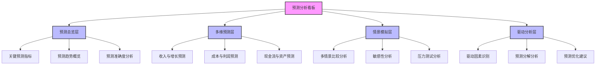
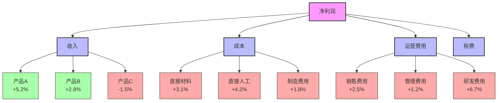
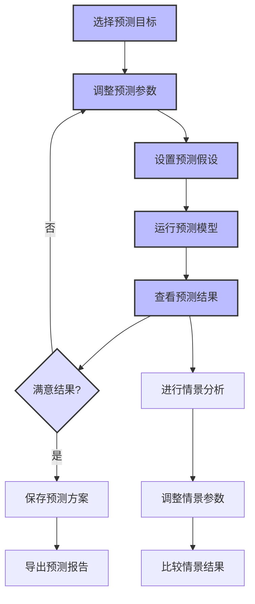

---
{"dg-publish":true,"tags":["财务BI","看板设计","预测分析","财务预测","情境模拟"],"aliases":["财务预测看板","预测模拟看板"],"permalink":"/知识共享/001_财务/02_财务BI看板项目/看板架构设计/核心看板设计/预测分析看板/","dgPassFrontmatter":true}
---


# 预测分析看板

## 概述

预测分析看板是财务BI系统中专注于企业未来财务和业务表现预测的核心分析工具，通过集成先进的预测模型、情景模拟和假设分析，帮助管理层和决策者洞察未来趋势，评估不同决策路径的潜在结果，提前识别机遇与风险。本看板结合统计方法、机器学习算法和专业财务逻辑，为战略规划、资源配置和风险管理提供前瞻性的数据支持，增强企业的预见能力和决策灵活性。

## 设计目标与原则

### 核心设计目标

1. **多维财务预测**：提供企业各财务维度的中短期预测视图
2. **情景模拟分析**：支持多种业务和市场情景下的结果模拟
3. **驱动因素分析**：识别并量化影响未来财务表现的关键驱动因素
4. **敏感性评估**：评估预测对关键假设变化的敏感程度
5. **风险与机会识别**：提前识别潜在的财务风险和业务机会
6. **决策支持**：为战略和战术决策提供基于预测的数据支持

### 设计原则

1. **预测透明性原则**：清晰展示预测方法、假设和可信度
2. **多情景原则**：提供多种场景的预测结果，避免单一预测的局限
3. **集成性原则**：整合多种预测方法和数据源，提高预测准确性
4. **动态更新原则**：支持预测模型的持续更新和反馈调整
5. **可解释性原则**：确保预测结果可理解、可解释和可行动
6. **前瞻平衡原则**：平衡短期预测准确性和长期预测价值

## 用户与场景分析

### 目标用户群体

| 用户角色 | 关注重点 | 使用频率 | 典型需求 | 
| ---- | ---- | ---- | ---- |
| CFO/财务总监 | 整体财务预测、战略影响 | 每月/每季 | 了解未来财务趋势，支持战略决策 |
| 财务规划人员 | 详细预测数据、预测准确性 | 每周/每月 | 制作详细预测报告，进行方案比较 |
| 业务部门主管 | 业务预测、资源需求预估 | 每月/每季 | 了解业务趋势，规划部门资源 |
| 投资分析师 | 长期价值预测、风险评估 | 每季/每年 | 评估投资回报，分析风险因素 |
| 高层管理者 | 战略预测、重大决策模拟 | 每季/每年 | 评估战略选择，制定长期规划 |

### 主要使用场景

1. **定期财务预测更新**：定期更新和审查企业财务预测
2. **战略决策评估**：评估不同战略选择的长期财务影响
3. **预算与规划制定**：为预算和资源规划提供基础预测
4. **风险分析与管理**：识别财务风险，评估应对策略效果
5. **投资与融资决策**：为投资项目和融资决策提供前瞻分析

## 看板结构设计

### 整体布局架构

预测分析看板采用"预测总览 + 多维预测 + 情景模拟 + 驱动分析"的分层架构：



### 分析层次与导航

| 分析层次 | 主要内容 | 典型问题 | 关键可视化 |
| ---- | ---- | ---- | ---- |
| 预测总览层 | 关键预测指标、整体趋势、准确度 | 企业未来趋势如何？预测可靠吗？ | 预测仪表盘、趋势图、置信区间图 |
| 多维预测层 | 各财务维度的详细预测结果 | 各项财务指标未来如何？有何关联？ | 预测曲线图、预测表格、关联图 |
| 情景模拟层 | 多种场景预测、敏感性、压力测试 | 不同情况下会怎样？关键风险是什么？ | 情景对比图、敏感性矩阵、风险热力图 |
| 驱动分析层 | 驱动因素分析、预测分解、优化 | 影响预测的关键因素是什么？如何改进？ | 驱动因素图、预测分解图、优化路径图 |

### 多维分析框架

预测分析看板支持以下多维分析视角，用户可灵活切换和组合这些维度：

1. **时间维度**：
   - 短期(3-6个月)/中期(1-2年)/长期(3-5年)
   - 月度/季度/年度预测
   - 滚动预测周期

2. **业务维度**：
   - 业务线/产品线/服务线
   - 客户群/市场细分/区域
   - 项目/倡议/战略行动

3. **财务维度**：
   - 收入/成本/利润
   - 现金流/资产/负债
   - KPI/财务比率/估值指标

4. **情景维度**：
   - 基准/乐观/悲观情景
   - 特定事件情景
   - 战略路径情景

## 核心指标与分析模块

### 预测总览模块

**核心指标**：

| 指标名称 | 计算方法 | 分析价值 | 展示方式 |
| ---- | ---- | ---- | ---- |
| 预测收入增长率 | 预测期收入增长百分比 | 反映业务增长趋势 | 指标卡+趋势图 |
| 预测毛利率 | 预测毛利/预测收入 | 预测盈利能力变化 | 指标卡+趋势图 |
| 预测EBITDA | 预测息税折旧摊销前利润 | 预测经营现金创造能力 | 指标卡+趋势图 |
| 预测自由现金流 | 预测经营现金流-资本支出 | 预测可用于投资和分配的现金 | 指标卡+趋势图 |
| 预测ROI | 预测净利润/投资总额 | 预测投资回报水平 | 指标卡+趋势图 |
| 预测准确度 | 1-|实际-预测|/实际值 | 评估预测模型准确性 | 指标卡+准确度图 |
| 预测置信度 | 基于统计模型的置信水平 | 反映预测的可信程度 | 指标卡+置信区间 |

**关键分析视图**：

1. **预测总览仪表盘**：
   - 关键预测指标概览
   - 与历史趋势对比
   - 主要预测变化提示

2. **预测趋势分析**：
   - 关键财务指标预测趋势
   - 历史、当前和预测数据的连续展示
   - 预测区间和置信度可视化

3. **预测准确度分析**：
   - 历史预测与实际结果对比
   - 预测偏差模式识别
   - 预测模型性能评估

### 多维预测模块

**收入与增长预测**：

1. **总体收入预测**：
   - 企业整体收入预测
   - 收入增长率预测
   - 季节性和周期性分析

2. **分类收入预测**：
   - 产品/服务线收入预测
   - 客户群/渠道收入预测
   - 区域/市场收入预测

3. **收入驱动指标预测**：
   - 销量/客户数/单价预测
   - 市场份额/市场渗透率预测
   - 客户获取与保留指标预测

**成本与利润预测**：

1. **成本结构预测**：
   - 固定与变动成本预测
   - 直接与间接成本预测
   - 成本率与成本弹性预测

2. **毛利预测**：
   - 整体毛利率预测
   - 产品/服务毛利率预测
   - 毛利贡献结构预测

3. **利润预测**：
   - EBITDA预测
   - 营业利润预测
   - 净利润与每股收益预测

**现金流与资产预测**：

1. **现金流预测**：
   - 经营活动现金流预测
   - 投资活动现金流预测
   - 融资活动现金流预测

2. **资产负债预测**：
   - 资产结构与增长预测
   - 负债水平与结构预测
   - 营运资本需求预测

3. **财务比率预测**：
   - 流动性比率预测
   - 杠杆比率预测
   - 资产效率比率预测

### 情景模拟模块

**多情景比较分析**：

1. **基准情景分析**：
   - 基于最可能假设的预测
   - 主要指标基准预测
   - 基准情景概率评估

2. **乐观与悲观情景**：
   - 乐观假设下的预测结果
   - 悲观假设下的预测结果
   - 情景间关键差异分析

3. **战略情景分析**：
   - 不同战略选择的预测结果
   - 战略路径比较
   - 战略决策点识别

**敏感性分析**：

1. **单因素敏感性**：
   - 关键假设变化的影响
   - 敏感性排序与矩阵
   - 临界值与拐点分析

2. **多因素敏感性**：
   - 多因素组合影响分析
   - 交互效应评估
   - 最敏感组合识别

3. **敏感因素深入分析**：
   - 高敏感因素深入研究
   - 敏感因素监控建议
   - 敏感因素控制策略

**压力测试分析**：

1. **极端情景测试**：
   - 极端市场条件模拟
   - 黑天鹅事件影响分析
   - 极限承受能力评估

2. **系统性风险测试**：
   - 行业危机情景模拟
   - 宏观经济冲击测试
   - 系统性风险应对能力

3. **恢复力分析**：
   - 冲击后恢复速度评估
   - 恢复所需资源分析
   - 恢复策略比较

### 驱动分析模块

**驱动因素识别**：

1. **关键驱动因素分析**：
   - 收入驱动因素识别与量化
   - 成本驱动因素识别与量化
   - 现金流驱动因素识别与量化

2. **驱动因素关联分析**：
   - 驱动因素间关系图谱
   - 相关性与因果性分析
   - 先导与滞后指标识别

3. **外部驱动因素分析**：
   - 宏观经济驱动因素
   - 行业与竞争驱动因素
   - 技术与规制驱动因素

**预测分解分析**：

1. **预测差异分解**：
   - 历史预测差异分解
   - 不同情景差异分解
   - 期间变化差异分解

2. **预测成分分析**：
   - 趋势成分分析
   - 季节性成分分析
   - 周期性与非周期性成分

3. **贡献度分析**：
   - 各因素对预测的贡献度
   - 边际影响分析
   - 累积效应分析

**预测优化建议**：

1. **预测改进机会**：
   - 预测准确度提升机会
   - 预测模型改进建议
   - 数据质量优化建议

2. **业务提升机会**：
   - 基于预测的业务优化机会
   - 价值提升路径识别
   - 风险缓解策略建议

3. **资源优化建议**：
   - 资源配置优化建议
   - 投资重点区域识别
   - 资源弹性管理建议

## 可视化与交互设计

### 核心可视化组件

#### 预测趋势图

```
┌──────────────────────────────────────────────────────┐
│                                                      │
│ 收入                                 │               │
│ (百万)                              │预测区间         │
│                                     │                │
│ 500 │                               │                │
│     │                               │          .... │
│ 400 │                               │       ...     │
│     │                             ..│    ...        │
│     │                          ...  │  ..           │
│ 300 │                      ....     │..             │
│     │                   ...         │               │
│     │               ....            │               │
│ 200 │           ....                │               │
│     │       ....                    │               │
│     │   ....                        │               │
│ 100 │...                            │               │
│     │                               │               │
│   0 └───┬───┬───┬───┬───┬───┬───┬───┼───┬───┬───┬───│
│         Q1  Q2  Q3  Q4  Q1  Q2  Q3  Q4│Q1  Q2  Q3  Q4│
│            2021        2022           │    2023      │
│                                       │              │
│      实际数据 ───      预测数据 ····    预测区间 ░░░  │
│                                                      │
└──────────────────────────────────────────────────────┘
```

**设计要点**：
- 清晰展示历史数据和预测数据的连续性
- 显示预测区间和置信范围
- 标记关键拐点和季节性模式
- 支持不同时间粒度的视图切换

#### 情景对比图

```
┌──────────────────────────────────────────────────────┐
│                                                      │
│ 利润率                               │               │
│  (%)                                │预测区间         │
│                                     │                │
│  25 │                               │          ╱╱    │
│     │                               │       ╱╱       │
│  20 │                   ╱╱╲         │    ╱╱          │
│     │                  ╱   ╲        │ ╱╱             │
│     │                 ╱     ╲╱╲     │╱               │
│  15 │                ╱        ╲     ●────────────    │
│     │               ╱          ╲╱╱╱╱│               ╱│
│     │        ╱╲    ╱              ╱ │              ╱ │
│  10 │       ╱  ╲╱╱╱              ╱  │             ╱  │
│     │      ╱                    ╱   │            ╱   │
│     │     ╱                    ╱    │           ╱    │
│   5 │────╱                    ╱     │          ╱     │
│     │                                                │
│   0 └───┬───┬───┬───┬───┬───┬───┬───┼───┬───┬───┬───│
│         Q1  Q2  Q3  Q4  Q1  Q2  Q3  Q4│Q1  Q2  Q3  Q4│
│            2021        2022           │    2023      │
│                                                      │
│  ── 实际数据   ── 基准情景   ╱╱ 乐观情景  ╱╱ 悲观情景 │
│                                                      │
└──────────────────────────────────────────────────────┘
```

**设计要点**：
- 同一图表中展示多种情景预测
- 使用不同线型和颜色区分情景
- 突出当前点和基准情景
- 支持动态显示/隐藏不同情景

#### 敏感性分析热力图

```
┌──────────────────────────────────────────────────────┐
│                                                      │
│       利润率敏感性分析 (对基准情景变化百分点)           │
│                                                      │
│        │ -10%  │ -5%   │ 基准  │ +5%   │ +10%        │
│────────┼───────┼───────┼───────┼───────┼───────      │
│ 售价   │ -4.2  │ -2.1  │  0.0  │ +2.1  │ +4.2        │
│────────┼───────┼───────┼───────┼───────┼───────      │
│ 销量   │ -3.5  │ -1.8  │  0.0  │ +1.7  │ +3.4        │
│────────┼───────┼───────┼───────┼───────┼───────      │
│ 原材料 │ +2.8  │ +1.4  │  0.0  │ -1.4  │ -2.7        │
│────────┼───────┼───────┼───────┼───────┼───────      │
│ 人工   │ +1.5  │ +0.7  │  0.0  │ -0.7  │ -1.5        │
│────────┼───────┼───────┼───────┼───────┼───────      │
│ 汇率   │ +0.8  │ +0.4  │  0.0  │ -0.4  │ -0.8        │
│────────┼───────┼───────┼───────┼───────┼───────      │
│                                                      │
│  负面影响  ■■■■■  ■■■   ■  □   □□□  □□□□□  正面影响  │
│  严重      中度    轻微  中性 轻微  中度    严重       │
│                                                      │
└──────────────────────────────────────────────────────┘
```

**设计要点**：
- 直观展示不同因素变化对目标指标的影响
- 使用颜色深浅表示影响程度
- 区分正面和负面影响
- 支持多种指标的敏感性视图切换

#### 驱动因素分析图



**设计要点**：
- 分层展示预测指标的驱动因素结构
- 显示各因素的预测变化方向和幅度
- 使用颜色区分正向和负向影响
- 支持下钻查看更详细的驱动结构

### 交互设计与用户体验

#### 预测模型实验室

**功能设计**：
- 允许用户调整预测模型参数和假设
- 实时更新预测结果和可视化
- 比较不同预测模型的效果
- 保存自定义预测场景

**交互流程**：


#### 情景规划向导

**功能设计**：
- 引导用户创建结构化的预测情景
- 协助设定合理的假设参数
- 提供预设情景模板和最佳实践
- 生成全面的情景分析报告

**向导流程**：
1. 定义情景目标和范围
2. 选择关键驱动因素
3. 设定基准情景假设
4. 创建替代情景参数集
5. 运行情景预测模型
6. 分析情景比较结果
7. 识别关键洞察和行动建议

#### 敏感性分析工具

**功能设计**：
- 自动识别关键敏感因素
- 可视化敏感度矩阵和热力图
- 支持单因素和多因素敏感性分析
- 识别临界阈值和拐点

**分析参数**：
- 因素变化范围和步长
- 评估指标选择
- 交互效应设置
- 置信水平设定

**交互特性**：
- 拖拽式调整变量范围
- 动态更新敏感性图表
- 临界点自动标记
- 敏感性排名和过滤

## 数据需求与集成

### 核心数据来源

| 数据类型 | 主要来源 | 更新频率 | 数据粒度 |
| ---- | ---- | ---- | ---- |
| 历史财务数据 | 财务系统、ERP系统 | 月/季/年 | 科目、部门、产品线 |
| 业务运营数据 | 业务系统、CRM系统 | 日/周/月 | 交易、客户、产品 |
| 市场与竞争数据 | 市场研究、行业数据库 | 月/季 | 行业、竞争者、市场细分 |
| 宏观经济数据 | 经济数据库、第三方提供商 | 月/季 | 指标、国家、地区 |
| 预算与计划数据 | 预算系统、规划工具 | 月/季/年 | 部门、项目、目标 |
| 预测历史记录 | 预测系统、历史版本库 | 随预测更新 | 版本、假设集、模型 |

### 数据处理与计算

1. **数据准备与转换**：
   - 历史数据清洗和标准化
   - 时间序列处理与季节性调整
   - 异常值检测与处理

2. **预测模型与算法**：
   - 时间序列预测模型
   - 机器学习预测算法
   - 因果和结构化预测模型
   - 集成预测方法

3. **模型管理与评估**：
   - 预测模型版本控制
   - 模型准确度评估指标
   - 模型性能监控和调优
   - 模型解释性工具

## 实施与集成建议

### 分阶段实施路径

| 阶段 | 重点工作 | 交付成果 | 时间参考 |
| ---- | ---- | ---- | ---- |
| 第一阶段：基础预测 | 核心预测模型和基本视图 | 预测总览层，基础预测功能 | 8-10周 |
| 第二阶段：情景分析 | 情景模拟和敏感性分析 | 多维预测层，情景模拟功能 | 10-12周 |
| 第三阶段：高级分析 | 驱动因素分析和优化建议 | 驱动分析层，预测优化功能 | 12-16周 |

### 与其他系统的集成

1. **与财务概览看板的集成**：
   - 共享关键预测指标
   - 提供预测与实际的对比视图
   - 保持数据口径和分析框架一致

2. **与其他财务分析看板的集成**：
   - 与预算执行看板的预测-预算-实际比较
   - 与利润分析看板的盈利预测协同
   - 与现金流看板的流动性预测集成

3. **与业务系统的集成**：
   - 销售预测系统数据同步
   - 供应链计划系统集成
   - 战略规划工具联动

## 实际应用案例

### 战略路径评估

**场景描述**：
企业需要评估三种不同的增长战略路径，了解各路径在未来5年的财务影响和风险特征。

**分析流程**：
1. 使用预测模型实验室设置基准情景：
   - 基于当前业务模式和市场趋势
   - 假设无重大战略变化
   - 纳入已知的市场和成本因素
2. 定义三种战略路径情景：
   - 路径A：产品线扩展策略
   - 路径B：市场渗透策略
   - 路径C：并购成长策略
3. 为每种路径设置关键假设：
   - 投资需求和时间分布
   - 收入增长模式和速度
   - 成本结构变化
   - 实施风险因素
4. 运行多情景对比分析：
   - 5年收入和利润预测
   - 现金流和资本需求分析
   - ROI和投资回收期比较
5. 进行敏感性分析：
   - 各路径对市场接受度的敏感性
   - 实施延迟的影响
   - 协同效应实现程度的影响
6. 生成决策支持报告：
   - 三种路径的财务对比
   - 风险-回报特征分析
   - 关键决策点和监控指标
   - 推荐路径和备选方案

### 经济下行风险预测

**场景描述**：
企业需要评估可能出现的经济下行对财务和运营的影响，并制定相应的风险应对策略。

**分析流程**：
1. 使用预测总览模块设定基准经济情景
2. 创建经济下行情景：
   - 轻度衰退情景(GDP-2%)
   - 中度衰退情景(GDP-5%)
   - 严重衰退情景(GDP-8%+)
3. 分析各情景对关键财务指标的影响：
   - 收入下降幅度预测
   - 利润率压缩分析
   - 现金流压力评估
   - 财务契约风险分析
4. 使用敏感性分析工具识别高风险领域：
   - 高固定成本业务单元
   - 周期性强的产品线
   - 高负债经营活动
5. 进行压力测试分析：
   - 流动性枯竭点分析
   - 生存期评估
   - 恢复弹性评估
6. 使用驱动分析模块制定风险缓解策略：
   - 成本结构调整建议
   - 现金保护措施
   - 业务组合重新平衡
   - 投资优先级调整
7. 制定经济下行应对预案：
   - 分阶段触发的行动计划
   - 预警指标设定
   - 资源动员路径

## 最佳实践与注意事项

1. **平衡准确性与实用性**：
   - 避免过于复杂的预测模型
   - 关注预测的业务解释性
   - 定期评估预测准确度，持续改进

2. **维持预测多样性**：
   - 不依赖单一预测方法
   - 整合定量和定性预测
   - 鼓励团队内部预测多元化

3. **注重预测假设透明**：
   - 清晰记录所有预测假设
   - 定期审查假设有效性
   - 建立假设更新机制

4. **建立预测反馈循环**：
   - 系统化记录预测与实际差异
   - 分析预测错误模式和原因
   - 将学习应用到未来预测中

5. **促进预测与决策整合**：
   - 将预测直接链接到决策过程
   - 创建预测驱动的行动计划
   - 建立预测-行动-结果追踪机制 