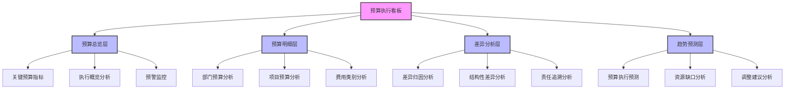
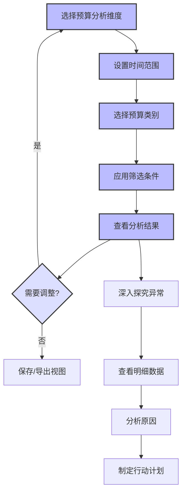

---
{"dg-publish":true,"tags":["财务BI","看板设计","预算执行","预算监控","差异分析"],"aliases":["预算监控看板","预算分析看板"],"permalink":"/知识共享/001_财务/02_财务BI看板项目/看板架构设计/核心看板设计/预算执行看板/","dgPassFrontmatter":true}
---


# 预算执行看板

## 概述

预算执行看板是财务BI系统中专注于企业预算管理和执行监控的核心分析工具，通过实时追踪和分析企业各部门、各业务线的预算执行情况，帮助管理层及时了解计划与实际的偏差，识别潜在问题，并采取相应的纠偏措施。本看板结合现代预算管理理念和精细化分析方法，为预算控制、资源优化配置和绩效评估提供数据支持，推动企业实现经营目标和价值增长。

## 设计目标与原则

### 核心设计目标

1. **预算执行全景监控**：提供企业各层级预算执行的全面、实时视图
2. **差异分析与异常识别**：快速识别预算执行中的显著偏差和异常
3. **预算执行趋势预测**：分析预算执行趋势，预测全年或周期执行结果
4. **原因诊断与责任追溯**：深入分析预算偏差的原因并明确责任归属
5. **支持调整与优化决策**：为预算调整和资源优化配置提供决策支持
6. **促进预算与战略协同**：确保预算执行与企业战略目标保持一致

### 设计原则

1. **及时性原则**：提供近实时的预算执行数据更新和监控
2. **多维度原则**：支持多角度、多层级的预算执行分析
3. **重点突出原则**：突出显示重大偏差和关键风险点
4. **可追溯原则**：支持预算偏差的深入分析和责任追溯
5. **预见性原则**：提供前瞻性的预算执行趋势分析
6. **闭环管理原则**：支持从监控、分析到调整的完整管理闭环

## 用户与场景分析

### 目标用户群体

| 用户角色 | 关注重点 | 使用频率 | 典型需求 | 
| ---- | ---- | ---- | ---- |
| CFO/财务总监 | 整体预算执行、重大偏差 | 每周/每月 | 监控整体预算执行状况，识别系统性问题 |
| 预算管理人员 | 详细预算数据、差异分析 | 每日/每周 | 管理预算执行过程，分析差异原因 |
| 业务部门经理 | 本部门预算执行、资源调配 | 每周/每月 | 监控部门预算执行，优化资源配置 |
| 成本控制人员 | 成本预算执行、节约机会 | 每周/每月 | 控制成本支出，识别节约机会 |
| 高层管理者 | 关键预算指标、趋势预测 | 每月/每季 | 评估经营目标完成情况，调整经营策略 |

### 主要使用场景

1. **定期预算执行审查**：定期评估企业整体和各部门预算执行情况
2. **预算差异分析与调查**：分析重大预算偏差，调查原因并制定应对措施
3. **预算调整决策支持**：为预算调整和资源重新分配提供数据支持
4. **绩效考核与评估**：将预算执行情况纳入绩效考核评估体系
5. **滚动预测与计划更新**：基于执行情况进行滚动预测和计划更新

## 看板结构设计

### 整体布局架构

预算执行看板采用"总览监控 + 多维分析 + 差异诊断 + 趋势预测"的分层架构：



### 分析层次与导航

| 分析层次 | 主要内容 | 典型问题 | 关键可视化 |
| ---- | ---- | ---- | ---- |
| 预算总览层 | 总体执行情况、关键指标、预警 | 整体预算执行如何？主要风险在哪里？ | 仪表盘、趋势图、热力图 |
| 预算明细层 | 各维度详细预算执行情况 | 各部门/项目执行情况如何？差异在哪里？ | 表格、柱状图、雷达图 |
| 差异分析层 | 预算差异原因、结构性问题 | 为什么出现偏差？责任归属于谁？ | 瀑布图、归因图、帕累托图 |
| 趋势预测层 | 执行趋势、风险预测、调整建议 | 未来趋势如何？如何调整以达成目标？ | 预测图、缺口图、情景图 |

### 多维分析框架

预算执行看板支持以下多维分析视角，用户可灵活切换和组合这些维度：

1. **组织维度**：
   - 公司整体/部门/团队/个人
   - 业务单元/成本中心/利润中心
   - 职能部门/业务部门/支持部门

2. **时间维度**：
   - 年度/季度/月度/周
   - 累计执行/当期执行
   - 同比/环比/历史趋势

3. **预算类别维度**：
   - 收入/成本/费用/利润/现金流
   - 资本预算/运营预算
   - 固定预算/变动预算/弹性预算

4. **项目与活动维度**：
   - 项目/子项目
   - 业务活动/职能活动
   - 战略项目/常规项目

## 核心指标与分析模块

### 预算总览模块

**核心指标**：

| 指标名称 | 计算方法 | 分析价值 | 展示方式 |
| ---- | ---- | ---- | ---- |
| 预算执行率 | 实际值/预算值×100% | 整体执行进度评估 | 指标卡+仪表盘 |
| 预算偏差率 | (实际值-预算值)/预算值×100% | 偏差程度评估 | 指标卡+趋势图 |
| 预算偏差绝对值 | 实际值-预算值 | 偏差规模评估 | 指标卡+瀑布图 |
| 预算执行进度 | 当前执行周期/总预算周期×100% | 时间进度参考 | 进度条+参考线 |
| 预算调整频率 | 调整次数/总时间 | 预算稳定性评估 | 指标卡+分布图 |
| 预算弹性指数 | 预算变动幅度/业务变动幅度 | 预算响应性评估 | 指标卡+趋势图 |
| 预算准确率 | 1-|偏差率|的平均值 | 预算准确性评估 | 指标卡+趋势图 |

**关键分析视图**：

1. **预算执行仪表盘**：
   - 关键预算指标实时状态
   - 预算执行率的视觉化展示
   - 主要预算类别执行情况

2. **预算执行热力图**：
   - 多维度预算执行偏差展示
   - 通过颜色深浅表示偏差程度
   - 快速识别高风险区域

3. **预算预警监控**：
   - 显示超出阈值的预算项目
   - 按风险等级分类预警信息
   - 预警历史趋势和分布

### 预算明细模块

**部门预算分析**：

1. **部门预算执行概览**：
   - 各部门预算执行率对比
   - 部门间执行差异分析
   - 部门预算历史执行趋势

2. **部门内预算细分**：
   - 部门内各预算类别执行情况
   - 人员/设备/材料等预算分析
   - 部门关键预算项目追踪

3. **部门预算效率分析**：
   - 部门预算与产出对比
   - 单位产出的预算消耗
   - 部门预算效率排名

**项目预算分析**：

1. **项目预算执行概览**：
   - 各项目预算执行率对比
   - 项目间预算差异分析
   - 战略项目vs常规项目对比

2. **项目预算进度分析**：
   - 项目进度与预算执行协同度
   - 项目里程碑预算分析
   - 项目预算节点监控

3. **项目价值评估**：
   - 项目投资回报率追踪
   - 项目预算价值贡献分析
   - 项目优先级与预算匹配度

**费用类别分析**：

1. **费用结构分析**：
   - 各类费用预算执行情况
   - 费用类别间的执行差异
   - 固定费用vs变动费用分析

2. **费用效率分析**：
   - 费用与业务量关系
   - 单位业务的费用消耗
   - 费用效率趋势与对标

3. **费用异常分析**：
   - 异常费用支出识别
   - 季节性费用模式分析
   - 费用控制机会识别

### 差异分析模块

**差异归因分析**：

1. **价格与数量差异**：
   - 价格因素导致的预算差异
   - 数量/用量因素导致的差异
   - 价格与数量综合影响分析

2. **效率与利用率差异**：
   - 资源利用效率导致的差异
   - 产能利用率影响分析
   - 效率改善机会识别

3. **外部因素差异**：
   - 市场环境变化导致的差异
   - 政策法规影响分析
   - 不可控因素影响评估

**结构性差异分析**：

1. **预算结构差异**：
   - 预算结构与实际结构对比
   - 结构性偏差识别
   - 预算优化方向分析

2. **时间性差异**：
   - 预算执行的时间差异分析
   - 提前/延后支出模式识别
   - 季节性因素影响评估

3. **系统性差异**：
   - 持续性预算偏差分析
   - 系统性错误识别
   - 预算方法论改进建议

**责任追溯分析**：

1. **责任中心分析**：
   - 预算差异责任归属
   - 责任中心执行评估
   - 责任边界清晰度分析

2. **决策影响分析**：
   - 管理决策对预算的影响
   - 决策变更的预算影响
   - 决策质量与预算关系

3. **执行偏差分析**：
   - 执行过程中的偏差点
   - 执行规范性评估
   - 执行能力提升建议

### 趋势预测模块

**预算执行预测**：

1. **时间序列预测**：
   - 基于历史数据的趋势预测
   - 季节性因素调整
   - 预测置信区间分析

2. **情景预测分析**：
   - 多情景预算执行预测
   - 乐观/基准/保守情景对比
   - 情景概率权重分析

3. **预算完成预测**：
   - 年度预算达成概率评估
   - 预算完成时间预测
   - 预算执行风险预警

**资源缺口分析**：

1. **资源需求预测**：
   - 未来资源需求趋势
   - 当前预算与未来需求差距
   - 关键资源瓶颈识别

2. **预算缺口分析**：
   - 预测预算缺口规模
   - 缺口成因和影响分析
   - 缺口优先级排序

3. **应对策略评估**：
   - 缺口弥补方案比较
   - 资源重新配置建议
   - 优先级调整建议

**调整建议分析**：

1. **预算调整建议**：
   - 基于数据的调整建议
   - 预算调整量化分析
   - 调整优先级排序

2. **执行策略优化**：
   - 预算执行流程优化建议
   - 控制点和审批流程优化
   - 执行效率提升建议

3. **长期改进建议**：
   - 预算方法论改进建议
   - 预算与业务协同增强
   - 预算文化和意识提升

## 可视化与交互设计

### 核心可视化组件

#### 预算执行仪表盘

```
┌───────────────────────────────────────────────────────────┐
│                                                           │
│  预算执行概览                                              │
│                                                           │
│  ┌──────────────┐  ┌──────────────┐  ┌──────────────┐     │
│  │ 收入预算     │  │ 成本预算     │  │ 费用预算     │     │
│  │              │  │              │  │              │     │
│  │   93%        │  │   105%       │  │   87%        │     │
│  │  目标: 100%  │  │  目标: 100%  │  │  目标: 100%  │     │
│  │              │  │              │  │              │     │
│  │ ▓▓▓▓▓▓▓▓▓░░░ │  │ ▓▓▓▓▓▓▓▓▓▓▓░ │  │ ▓▓▓▓▓▓▓▓░░░░ │     │
│  └──────────────┘  └──────────────┘  └──────────────┘     │
│                                                           │
│  ┌──────────────┐  ┌──────────────┐  ┌──────────────┐     │
│  │ 资本预算     │  │ 利润预算     │  │ 现金流预算   │     │
│  │              │  │              │  │              │     │
│  │   62%        │  │   91%        │  │   88%        │     │
│  │  目标: 75%   │  │  目标: 100%  │  │  目标: 95%   │     │
│  │              │  │              │  │              │     │
│  │ ▓▓▓▓▓▓░░░░░░ │  │ ▓▓▓▓▓▓▓▓▓░░░ │  │ ▓▓▓▓▓▓▓▓▓░░░ │     │
│  └──────────────┘  └──────────────┘  └──────────────┘     │
│                                                           │
│  时间进度: 75%     预算周期: 2023财年    更新: 2023-09-15  │
│                                                           │
└───────────────────────────────────────────────────────────┘
```

**设计要点**：
- 清晰显示各主要预算类别的执行率
- 将执行率与目标和时间进度对比
- 使用颜色区分超支/达标/欠缺状态
- 提供简洁的上下文信息和时间标记

#### 预算偏差瀑布图

```
┌───────────────────────────────────────────────────────────┐
│                                                           │
│  预算偏差分析 (百万元)                                     │
│                                                           │
│  10  │                                                    │
│      │                                                    │
│   5  │      ┌──┐                                          │
│      │      │  │                                          │
│   0  │ ┌──┐ │  │ ┌──┐          ┌──┐    ┌──┐              │
│      │ │  │ │  │ │  │          │  │    │  │    ┌──┐      │
│  -5  │ │  │ │  │ │  │ ┌──┐     │  │    │  │    │  │      │
│      │ │  │ │  │ │  │ │  │     │  │    │  │    │  │      │
│ -10  │ │  │ │  │ │  │ │  │ ┌──┐│  │    │  │    │  │      │
│      │ │  │ │  │ │  │ │  │ │  ││  │    │  │    │  │      │
│ -15  │ └──┘ └──┘ └──┘ └──┘ └──┘└──┘    └──┘    └──┘      │
│      │                                                    │
│      └─────┬────┬────┬────┬────┬────────┬────────┬────────│
│            │预算 │收入│销量│价格│直接成本│间接成本│实际结果│
│            │目标 │偏差│影响│影响│ 偏差   │ 偏差   │        │
│                                                           │
│   正面影响  ▓▓▓▓  负面影响  ▓▓▓▓                          │
│                                                           │
└───────────────────────────────────────────────────────────┘
```

**设计要点**：
- 直观展示预算目标与实际结果的差异来源
- 区分正面和负面影响因素
- 量化各因素的影响程度
- 支持不同预算维度和时间段的分析

#### 预算执行热力图

```
┌───────────────────────────────────────────────────────────┐
│                                                           │
│                 部门-预算类别执行热力图                     │
│                                                           │
│            │ 收入预算 │ 成本预算 │ 费用预算 │ 资本预算     │
│ ──────────┼──────────┼──────────┼──────────┼──────────    │
│ 销售部    │   93%    │   102%   │   91%    │   75%        │
│ ──────────┼──────────┼──────────┼──────────┼──────────    │
│ 生产部    │    -     │   107%   │   85%    │   62%        │
│ ──────────┼──────────┼──────────┼──────────┼──────────    │
│ 市场部    │   95%    │    -     │   115%   │   88%        │
│ ──────────┼──────────┼──────────┼──────────┼──────────    │
│ 研发部    │    -     │   98%    │   95%    │   71%        │
│ ──────────┼──────────┼──────────┼──────────┼──────────    │
│ 行政部    │    -     │    -     │   103%   │   94%        │
│ ──────────┼──────────┼──────────┼──────────┼──────────    │
│                                                           │
│    <80%     80-95%     95-105%    105-120%     >120%      │
│  ┌─────┐   ┌─────┐    ┌─────┐     ┌─────┐     ┌─────┐     │
│  │     │   │     │    │     │     │     │     │     │     │
│  └─────┘   └─────┘    └─────┘     └─────┘     └─────┘     │
│   严重欠缺    欠缺       达标       轻度超支    严重超支     │
│                                                           │
└───────────────────────────────────────────────────────────┘
```

**设计要点**：
- 使用颜色深浅直观表示预算执行状态
- 支持多维度交叉分析预算执行情况
- 快速识别异常和风险区域
- 提供颜色图例和状态解释

#### 预算执行趋势预测图

```
┌───────────────────────────────────────────────────────────┐
│                                                           │
│  预算                                     │                │
│  执行率                                  │ 预测区间        │
│  (%)                                    │                 │
│                                         │                 │
│  120 │                                  │                 │
│      │                                  │   ............. │
│  110 │                                  │  .             .│
│      │                       --------   │ .               │
│  100 │-------------------- -´        `--|----------------│
│      │                   /´             │                 │
│   90 │                 /                │                 │
│      │         __    /                  │                 │
│   80 │        /  \  /                   │                 │
│      │       /    \/                    │                 │
│   70 │     _/                           │                 │
│      │    /                             │                 │
│   60 │___/                              │                 │
│      │                                  │                 │
│      └─────┬────┬────┬────┬────┬────────┼────┬────┬───────│
│            Q1   Q2   Q3   Q4   Q1       │Q2   Q3   Q4     │
│               2022             2023     │     2023        │
│                                         │                 │
│         历史数据 ───      预测数据 ····     预算目标 ---    │
│                                                           │
└───────────────────────────────────────────────────────────┘
```

**设计要点**：
- 清晰区分历史执行数据和预测数据
- 显示与预算目标的比较
- 展示预测区间和可能的波动范围
- 标记关键时间点和趋势变化

### 交互设计与用户体验

#### 多维预算分析器

**功能设计**：
- 灵活选择和组合预算分析维度
- 调整时间范围和粒度
- 设置预算类别和责任中心
- 定制预算执行可视化视图

**交互流程**：


#### 预算偏差诊断助手

**功能设计**：
- 引导用户进行系统化的预算偏差诊断
- 自动识别主要偏差原因
- 提供逐步深入的分析路径
- 生成结构化的偏差报告和建议

**诊断流程**：
1. 确认偏差规模和性质
2. 检查价格和数量因素影响
3. 分析时间和季节性影响
4. 评估内部执行和控制因素
5. 考量外部环境变化影响
6. 确定主要偏差原因
7. 提出针对性改进建议

#### 预算调整模拟器

**功能设计**：
- 模拟不同预算调整方案的影响
- 评估资源重新分配的效果
- 预测调整后的执行趋势
- 推荐最优预算调整方案

**模拟参数**：
- 预算调整金额和比例
- 调整时间点和范围
- 影响因素变化假设
- 业务条件变化假设

**交互特性**：
- 交互式预算调整控制
- 实时计算和展示调整影响
- 多方案并列比较功能
- 调整历史记录和回溯

## 数据需求与集成

### 核心数据来源

| 数据类型 | 主要来源 | 更新频率 | 数据粒度 |
| ---- | ---- | ---- | ---- |
| 预算数据 | 预算管理系统、ERP系统 | 月/季/年 | 部门、项目、科目 |
| 实际执行数据 | 财务系统、ERP系统 | 日/周/月 | 交易、凭证、科目 |
| 业务活动数据 | 业务系统、CRM系统 | 实时/日 | 销售、生产、客户 |
| 项目数据 | 项目管理系统、PPM系统 | 日/周 | 项目、阶段、里程碑 |
| 人力资源数据 | HR系统、工时系统 | 日/周 | 部门、团队、个人 |
| 基准数据 | 历史数据库、行业数据 | 季/年 | 指标、基准、趋势 |

### 数据处理与计算

1. **数据整合与校准**：
   - 预算数据与实际数据的映射和对齐
   - 不同粒度数据的汇总和分解
   - 数据一致性和完整性验证

2. **高级分析计算**：
   - 差异分析计算引擎
   - 归因分析模型
   - 预测算法和模拟引擎

3. **实时处理与更新**：
   - 关键预算执行指标的近实时更新
   - 增量数据处理机制
   - 预警触发计算

## 实施与集成建议

### 分阶段实施路径

| 阶段 | 重点工作 | 交付成果 | 时间参考 |
| ---- | ---- | ---- | ---- |
| 第一阶段：基础监控 | 基础指标和总览分析 | 预算总览层，基础预算执行监控 | 6-8周 |
| 第二阶段：深度分析 | 差异分析和明细分析 | 预算明细层，差异分析功能 | 8-10周 |
| 第三阶段：预测与优化 | 预测模型和优化建议 | 趋势预测层，调整建议功能 | 8-12周 |

### 与其他系统的集成

1. **与财务概览看板的集成**：
   - 共享关键预算执行指标
   - 协调预算预警机制
   - 保持分析口径的一致性

2. **与其他财务分析看板的集成**：
   - 与利润分析看板的业绩目标关联
   - 与成本分析看板的成本控制协同
   - 与现金流看板的资金计划协调

3. **与业务系统的集成**：
   - 业务预测系统的数据同步
   - 项目管理系统的进度数据集成
   - 绩效管理系统的目标协同

## 实际应用案例

### 季度预算偏差分析

**场景描述**：
财务团队发现市场部第三季度的营销费用预算执行率达到115%，需要分析原因并评估对全年预算的影响。

**分析流程**：
1. 使用预算执行热力图确认市场部营销费用超支严重
2. 通过预算明细模块深入分析费用类别分布：
   - 广告投放费用执行率125%
   - 市场活动费用执行率110%
   - 渠道推广费用执行率105%
3. 使用差异归因分析工具分析主要原因：
   - 新产品发布临时增加的广告投入(占差异的60%)
   - 季节性促销活动范围扩大(占差异的25%)
   - 市场价格上涨因素(占差异的15%)
4. 通过预算执行趋势预测评估影响：
   - 预计全年营销费用将超预算8%
   - 对整体市场部预算影响约3%
5. 使用预算调整模拟器评估调整方案：
   - 方案A：重新分配第四季度各类营销费用
   - 方案B：申请增加全年营销预算
   - 方案C：通过其他费用节约抵消超支
6. 生成分析报告和调整建议：
   - 建议采用方案A和C的结合
   - 明确第四季度广告投入控制措施
   - 提出费用审批流程优化建议

### 多部门预算执行差异对比

**场景描述**：
管理层需要评估各业务部门的预算执行表现，识别最佳实践和改进机会。

**分析流程**：
1. 使用预算总览模块对比各部门预算执行情况：
   - 电子部门：执行率98%，偏差最小
   - 机械部门：执行率88%，显著欠缺
   - 消费品部门：执行率112%，明显超支
2. 通过预算明细模块分析各部门预算结构和特点：
   - 电子部门：精细化预算体系，月度调整机制
   - 机械部门：大项目周期长，预算滞后性强
   - 消费品部门：市场变化快，预算弹性不足
3. 使用差异分析模块识别关键差异成因：
   - 预算编制方法差异
   - 预算控制流程差异
   - 预算执行文化差异
4. 提取电子部门的最佳实践：
   - 滚动预算更新机制
   - 预算执行早期预警系统
   - 部门级预算责任制
5. 形成改进建议：
   - 统一预算方法论标准
   - 推广最佳预算控制实践
   - 建立预算执行评价体系
   - 加强预算培训和文化建设

## 最佳实践与注意事项

1. **平衡控制与灵活性**：
   - 严格控制预算的同时保持合理灵活性
   - 区分战略性和战术性预算调整
   - 建立明确的预算调整审批机制

2. **关注预算质量与准确性**：
   - 提高初始预算编制的准确性
   - 定期评估预算假设的有效性
   - 不断完善预算方法和模型

3. **促进跨部门协作**：
   - 加强财务与业务部门的预算协作
   - 建立共同的预算责任机制
   - 提高各层级预算意识和能力

4. **与战略和业务保持一致**：
   - 确保预算执行支持战略目标
   - 及时根据业务变化调整预算
   - 避免为了达成预算而损害长期利益 