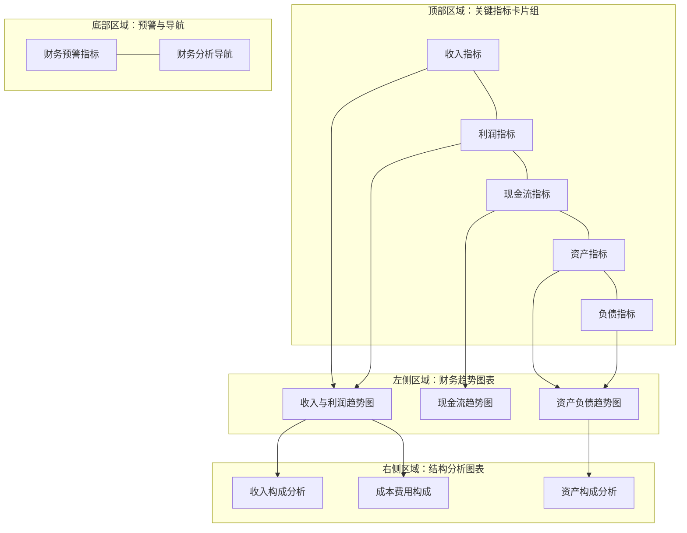

---
{"dg-publish":true,"dg-home":false,"permalink":"/知识共享/001_财务/02_财务BI看板项目/设计稿/看板设计/核心看板模块/财务概览看板设计/","dgPassFrontmatter":true}
---

#看板设计 #财务概览 #核心模块

财务概览看板是整个财务BI系统的门户，提供企业财务状况的全局视图，帮助决策者快速了解关键财务指标和趋势变化。本文档详细说明财务概览看板的设计方案。

## 设计目标

1. **全局视角**：提供企业整体财务状况的高层次概览
2. **关键指标聚焦**：突出显示最重要的财务KPI
3. **趋势可视化**：强调指标的历史变化趋势
4. **异常提示**：及时预警异常或需要关注的财务状况
5. **分析入口**：作为深入分析的导航枢纽

## 用户需求分析

财务概览看板的主要用户包括：

- **高管团队**：需要快速掌握公司整体财务状况
- **财务总监**：需要监控关键财务指标变化
- **业务管理层**：需要了解财务表现与业务关系

主要使用场景：
- 日常监控企业财务状况
- 准备管理层会议前的数据审视
- 发现问题后的初步分析和导航

## 看板布局设计

财务概览看板采用分区块布局，遵循信息层次结构，从整体到局部，布局如下：



## 核心组件设计

### 1. 关键指标卡片组

采用卡片式设计，每个卡片包含一个核心指标及其同环比变化：

```
┌─────────────────┐ ┌─────────────────┐ ┌─────────────────┐ ┌─────────────────┐ ┌─────────────────┐
│   收入指标卡    │ │   利润指标卡    │ │  现金流指标卡   │ │   资产指标卡    │ │   负债指标卡    │
│                 │ │                 │ │                 │ │                 │ │                 │
│ 总收入: 1000万  │ │ 净利润: 200万   │ │ 经营现金: 150万 │ │ 总资产: 3000万  │ │ 资产负债率: 45% │
│ 同比: ↑15%      │ │ 同比: ↑12%      │ │ 同比: ↓8%       │ │ 同比: ↑5%       │ │ 同比: ↓2%       │
│ 环比: ↑3%       │ │ 环比: ↑2%       │ │ 环比: ↑10%      │ │ 环比: ↑1%       │ │ 环比: ↓0.5%     │
└─────────────────┘ └─────────────────┘ └─────────────────┘ └─────────────────┘ └─────────────────┘
```

关键指标卡片内容：
1. **收入指标卡**：总收入、同比增长率、环比增长率
2. **利润指标卡**：净利润、毛利率、净利率，同环比变化
3. **现金流指标卡**：经营现金流、现金比率、现金流量比率
4. **资产指标卡**：总资产、资产周转率、ROA
5. **负债指标卡**：资产负债率、流动比率、利息保障倍数

设计要点：
- 使用大字体显示核心数值
- 用颜色编码表示变化方向（增长为绿色，下降为红色）
- 提供同比和环比两种对比视角
- 卡片支持点击，链接到相应的详细分析页面

### 2. 财务趋势图表区

#### 2.1 收入与利润趋势图

```
收入与利润趋势（月度）
^
|                                            o
|                                    o-------
|                            o-------
|                    o-------
|            o-------
|    o-------                 x-------x-------x
|                     x-------               
|             x-------
|     x-------
+------------------------------------------------->
  1月    2月    3月    4月    5月    6月    7月

  o 收入   x 净利润   --- 预算线
```

图表设计要点：
- 双Y轴设计，左侧显示收入，右侧显示利润
- 包含历史趋势线和预算/目标参考线
- 默认显示最近12个月数据
- 支持时间粒度切换（月/季/年）
- 提供简单的预测延伸线

#### 2.2 现金流趋势图

采用瀑布图+折线图组合方式，展示现金流构成及趋势：
- 显示经营/投资/筹资活动现金流的构成
- 展示自由现金流的变化趋势
- 标注关键的现金流入/流出事件

#### 2.3 资产负债趋势图

采用堆叠面积图，展示资产和负债结构随时间变化：
- 显示流动资产与非流动资产的构成变化
- 显示流动负债与非流动负债的构成变化
- 叠加资产负债率的趋势线

### 3. 结构分析图表区

#### 3.1 收入构成分析

使用环形图/饼图，展示收入的多维度构成：

```
       收入构成
      
      ┌───┐
     /     \
    /  35%   \  产品A
   |           |
   |    25%    |  产品B  
   |           | 
    \   20%   /  产品C
     \       /
      \ 20% /    其他
       └───┘
```

设计要点：
- 提供多维度切换：按产品/客户/地区等
- 显示构成比例和具体金额
- 支持钻取查看下一层分类
- 包含同比变化指标

#### 3.2 成本费用构成

使用树形图展示成本费用的层级构成：
- 第一层：销售成本、销售费用、管理费用、财务费用等
- 第二层：各类成本费用的具体构成
- 通过颜色深浅表示同比变化情况

#### 3.3 资产构成分析

使用树形图展示资产的分层结构：
- 流动资产：现金、应收账款、存货等
- 非流动资产：固定资产、无形资产等
- 通过颜色和标记显示资产质量和效率指标

### 4. 预警与导航区

#### 4.1 财务预警指标

采用警示卡片设计，突出显示需要关注的异常指标：

```
┌─────────────────────────┐ ┌─────────────────────────┐ ┌─────────────────────────┐
│    ⚠️ 应收账款周转     │ │    ⚠️ 产品B毛利率      │ │    ⚠️ 库存周转天数     │
│                         │ │                         │ │                         │
│ 当前: 65天              │ │ 当前: 18%               │ │ 当前: 85天              │
│ 目标: <45天             │ │ 目标: >25%              │ │ 目标: <60天             │
│ 趋势: ↑ (恶化)          │ │ 趋势: ↓ (恶化)          │ │ 趋势: → (持平)          │
└─────────────────────────┘ └─────────────────────────┘ └─────────────────────────┘
```

设计要点：
- 根据预设阈值自动识别异常指标
- 清晰显示当前值、目标值及差距
- 指明问题趋势（恶化/改善/持平）
- 支持点击进入相关分析页面

#### 4.2 财务分析导航

提供快速导航至各专题分析页面的入口：

```
┌───────────┐ ┌───────────┐ ┌───────────┐ ┌───────────┐ ┌───────────┐
│  利润分析 │ │ 成本分析  │ │ 现金流分析│ │ 资产负债  │ │ 预算执行  │
└───────────┘ └───────────┘ └───────────┘ └───────────┘ └───────────┘
```

设计要点：
- 提供常用分析路径的快捷入口
- 根据用户角色推荐相关分析页面
- 记录最近访问的分析页面

## 交互设计

财务概览看板提供以下交互功能：

1. **全局筛选器**：
   - 时间范围选择器（支持年/季/月/自定义）
   - 组织单位筛选（公司/部门/业务线）
   - 产品线/客户群筛选

2. **钻取功能**：
   - 从卡片指标钻取至详细分析
   - 从图表数据点钻取至构成分析
   - 从异常指标钻取至根因分析

3. **比较功能**：
   - 同期比较（去年同期/上期）
   - 预算比较（实际vs预算）
   - 目标比较（实际vs目标）

4. **视图定制**：
   - 调整布局和组件大小
   - 个性化关键指标选择
   - 保存个人视图配置

## 视觉设计

### 配色方案

采用专业、沉稳的配色方案：

1. **背景色**：浅灰色 (#F7F7F7)，减少视觉疲劳
2. **主题色**：深蓝色 (#2C5282)，体现专业性
3. **强调色**：
   - 正向变化：绿色 (#38A169)
   - 负向变化：红色 (#E53E3E)
   - 警示信息：橙色 (#DD6B20)
4. **图表色系**：采用中性色调，确保数据可读性

### 字体系统

- **标题**：16-20px，加粗，深色
- **正文**：12-14px，常规，中性色
- **数据**：24-32px（主要指标），16-20px（次要指标）
- **注释**：10-12px，浅色

## 数据规范

1. **更新频率**：
   - 核心指标：日更新
   - 趋势图表：周更新
   - 结构分析：月更新

2. **数据显示规则**：
   - 货币金额：保留2位小数，千位分隔符
   - 百分比：保留1位小数
   - 比率：保留2位小数
   - 天数：取整数

3. **阈值设置**：
   - 预警阈值：基于行业标准或历史表现
   - 同比变化：±5%为显著变化
   - 环比变化：±2%为显著变化

## 响应式设计

财务概览看板支持在不同设备上良好显示：

1. **大屏幕**：完整布局，所有组件并行显示
2. **中等屏幕**：保持整体布局，调整组件大小
3. **小屏幕**：转为垂直布局，组件单列排列
4. **移动设备**：简化视图，聚焦核心指标

## 实现技术建议

1. **前端技术**：
   - 图表库：ECharts/Highcharts
   - 响应式框架：Bootstrap/Ant Design
   - 交互框架：React/Vue

2. **后端技术**：
   - 数据聚合：SQL/OLAP查询
   - 缓存策略：Redis缓存常用数据
   - 计算引擎：按需/预计算结合

3. **优化策略**：
   - 数据预加载：预计算常用指标
   - 渐进式加载：核心指标优先显示
   - 按需加载：详细数据按需获取

## 下一步行动

1. **原型设计**：基于本文档创建交互原型
2. **用户测试**：收集关键用户反馈
3. **技术评估**：确定实现技术栈
4. **数据准备**：梳理数据来源和计算逻辑
5. **开发实施**：按优先级分阶段实现

---

**相关笔记**：
- [[知识共享/001_财务/02_财务BI看板项目/设计稿/财务BI看板模块规划\|财务BI看板模块规划]]
- [[知识共享/001_财务/02_财务BI看板项目/设计稿/指标设计/财务核心指标体系\|财务核心指标体系]]
- [[看板交互设计指南\|看板交互设计指南]] 