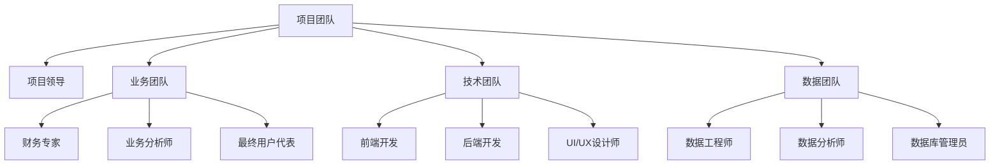
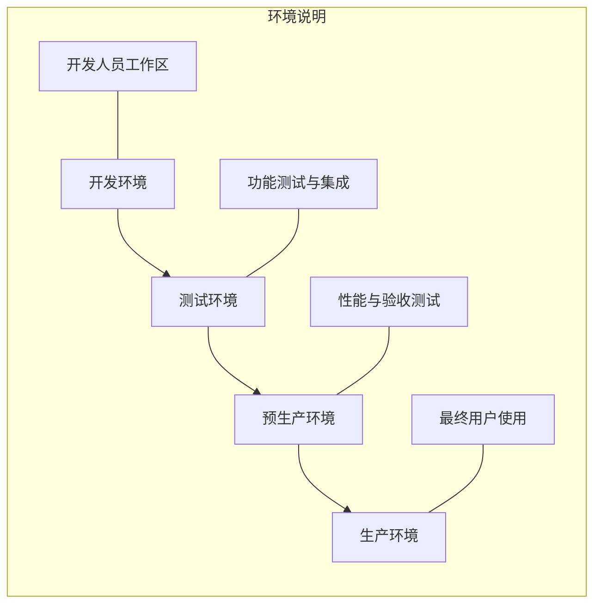
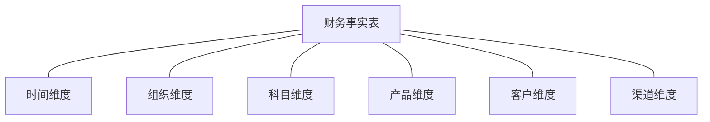
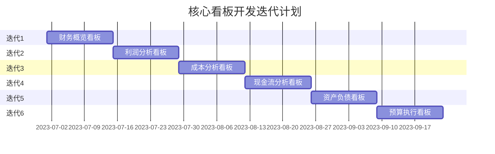

---
{"dg-publish":true,"dg-home":false,"permalink":"/知识共享/001_财务/02_财务BI看板项目/设计稿/财务BI看板实施与部署指南/","dgPassFrontmatter":true}
---

#财务BI #系统实施 #部署方案

本文档提供财务BI看板系统从设计到上线的详细实施与部署指南，为项目团队提供清晰的执行路径和最佳实践。

## 一、前期准备

### 1. 团队组建

成功实施财务BI看板系统需要跨职能团队的协作：

**关键角色职责**：

- **项目领导**：统筹规划、资源协调、进度管理
- **财务专家**：提供业务需求和财务专业知识
- **业务分析师**：分析需求、设计功能、制定验收标准
- **前端开发**：负责看板界面开发和交互实现
- **数据工程师**：构建数据处理流程和分析模型
- **UI/UX设计师**：设计直观有效的用户界面

### 2. 需求梳理与确认

在正式开发前进行充分的需求梳理：

- **业务需求研讨会**：与各级用户进行深入访谈
- **现有系统分析**：评估现有报表和分析工具
- **用户故事编写**：以用户为中心描述需求
- **需求优先级排序**：明确MVP和后续迭代内容
- **需求确认文档**：形成正式需求文档并获得签署

### 3. 技术选型

根据企业情况选择适合的技术栈：

| 组件类型 | 推荐选项 | 适用场景 |
|---------|---------|---------|
| **前端框架** | React | 交互复杂、组件复用需求高 |
|  | Vue.js | 学习曲线低、快速开发 |
| **可视化库** | ECharts | 丰富的图表类型、中文支持好 |
|  | Highcharts | 商业应用成熟、兼容性高 |
|  | D3.js | 高度自定义、复杂可视化 |
| **后端技术** | Node.js | 前后端统一、快速响应 |
|  | Java Spring | 企业应用成熟、稳定性高 |
|  | Python Flask | 数据处理能力强、开发快速 |
| **数据存储** | PostgreSQL | 开源、功能丰富、分析能力强 |
|  | SQL Server | 与微软生态集成良好 |
|  | Snowflake | 云端数据仓库、弹性扩展 |

技术选型评估因素：

- 企业现有技术栈和团队技能
- 系统性能和扩展性要求
- 数据量级和处理复杂度
- 集成需求和兼容性考量
- 成本和许可限制

## 二、系统环境搭建

### 1. 环境规划

根据企业规模和需求规划多环境架构：

各环境配置建议：

- **开发环境**：每位开发者本地环境 + 共享开发服务器
- **测试环境**：模拟生产数据结构但规模较小
- **预生产环境**：与生产环境配置相同，用于最终验证
- **生产环境**：高可用配置，满足性能和安全要求

### 2. 基础设施准备

确保硬件和网络资源满足要求：

**服务器配置建议**：

| 环境 | CPU | 内存 | 存储 | 网络 |
|-----|-----|-----|-----|-----|
| 开发 | 4核 | 16GB | 500GB SSD | 100Mbps |
| 测试 | 8核 | 32GB | 1TB SSD | 1Gbps |
| 生产 | 16核+ | 64GB+ | 2TB+ SSD (RAID) | 10Gbps |

**云环境选项**：

- AWS: EC2 + RDS + S3
- Azure: VM + SQL Database + Blob Storage
- 阿里云: ECS + RDS + OSS

### 3. 软件安装与配置

各环境需要安装和配置的软件清单：

1. **操作系统**：Linux (推荐Ubuntu/CentOS) 或 Windows Server
2. **Web服务器**：Nginx或Apache
3. **数据库**：PostgreSQL/MySQL/SQL Server
4. **开发工具**：
   - 代码仓库：Git (GitHub/GitLab)
   - CI/CD工具：Jenkins/GitHub Actions
   - 项目管理：JIRA/Trello
   - 文档协作：Confluence/SharePoint
5. **监控工具**：Prometheus + Grafana

## 三、数据准备与集成

### 1. 数据源梳理

全面梳理和评估可用数据源：

- **核心财务系统**：ERP、财务软件、总账系统
- **业务系统**：CRM、SCM、HR系统
- **外部数据**：市场数据、行业基准、宏观经济指标
- **非结构化数据**：文档、邮件、会议记录

**数据源评估表**：

| 数据源 | 数据内容 | 更新频率 | 数据质量 | 访问方式 | 责任人 |
|-------|---------|---------|---------|---------|-------|
| ERP财务模块 | 总账、应收/应付 | 实时/日更新 | 高 | API | 财务IT主管 |
| 业务CRM | 客户、销售数据 | 日更新 | 中 | 数据库读取 | 销售IT主管 |
| 预算系统 | 预算和计划数据 | 月更新 | 高 | 文件导出 | 财务经理 |

### 2. 数据模型设计

设计支持多维分析的数据模型：

**星型模型示例**：

**关键维度定义**：

- **时间维度**：日期、月份、季度、年度、财年等
- **组织维度**：公司、部门、成本中心、利润中心
- **科目维度**：会计科目层级、报表科目映射
- **业务维度**：产品、客户、区域、渠道等

### 3. ETL流程开发

构建稳健的数据集成和处理流程：

**ETL工具选择**：

- **开源选项**：Apache NiFi, Talend Open Studio
- **商业选项**：Informatica, Microsoft SSIS
- **云服务**：AWS Glue, Azure Data Factory

**ETL最佳实践**：

- 增量抽取策略降低系统负载
- 数据处理任务模块化设计
- 失败重试和异常处理机制
- 处理过程日志和审计记录
- 批处理与实时处理结合

## 四、核心看板开发

### 1. 迭代开发计划

采用敏捷方法进行迭代开发：

**敏捷开发流程**：

- 每个迭代2-3周
- 每日站会同步进度和障碍
- 迭代结束演示和回顾
- 持续调整产品待办事项优先级

### 2. 前端开发指南

确保前端开发的一致性和质量：

**组件开发标准**：

- 采用组件设计系统，确保一致的UI
- 组件化开发，提高代码复用性
- 响应式设计，适应不同设备
- 性能优化，快速加载和渲染

**看板开发检查清单**：

- [ ] 布局符合设计规范
- [ ] 过滤器和控件正常工作
- [ ] 数据加载状态处理
- [ ] 错误和异常处理
- [ ] 交互响应迅速流畅
- [ ] 适配不同屏幕尺寸
- [ ] 浏览器兼容性测试

### 3. 后端开发指南

构建高效可靠的后端服务：

**API设计原则**：

- RESTful API设计风格
- 统一的错误处理机制
- 版本控制和向后兼容
- 性能优化和缓存策略
- 安全认证和授权机制

**数据服务层开发**：

- 指标计算逻辑和业务规则封装
- 数据缓存机制减少数据库负载
- 查询优化提高响应速度
- 数据聚合和预计算策略

## 五、测试与质量保障

### 1. 测试策略

全面的测试确保系统质量：

**测试类型**：

- **单元测试**：验证独立组件和函数
- **集成测试**：验证组件间交互
- **功能测试**：验证业务功能完整性
- **性能测试**：验证系统响应时间和并发能力
- **安全测试**：验证数据保护和访问控制
- **用户验收测试**：最终用户确认系统满足需求

### 2. 质量检验标准

明确的质量标准和检验流程：

**功能质量标准**：

- 数据准确性：计算结果与手工核对一致
- 功能完整性：全部需求已实现并通过测试
- 易用性：符合用户体验设计规范

**技术质量标准**：

- 代码质量：通过代码审查和静态分析
- 性能标准：关键页面加载时间<2秒
- 可靠性：系统稳定运行，无严重缺陷

### 3. 验收测试流程

制定明确的验收测试流程：

1. **测试计划编写**：确定测试范围、方法和标准
2. **测试案例准备**：根据业务场景设计测试案例
3. **测试环境准备**：配置模拟真实使用的测试环境
4. **执行验收测试**：业务用户参与进行系统测试
5. **问题跟踪与修复**：记录问题并进行修复
6. **最终验收签字**：满足验收标准后正式签署验收文档

## 六、系统部署

### 1. 部署准备

部署前的准备工作：

- **部署计划制定**：详细的部署步骤和时间表
- **回滚计划制定**：部署失败时的应急处理流程
- **数据迁移准备**：历史数据导入和验证
- **环境检查**：确认生产环境配置满足要求
- **最终用户通知**：告知用户系统上线时间和影响

### 2. 生产环境部署步骤

详细的部署执行步骤：

1. **数据库部署**：
   - 创建生产数据库和表结构
   - 配置数据库参数和安全设置
   - 导入初始数据和参考数据

2. **应用服务部署**：
   - 部署后端API服务
   - 配置服务器参数和连接信息
   - 部署前端静态资源

3. **网络和安全配置**：
   - 配置负载均衡和高可用
   - 设置防火墙和网络访问规则
   - 配置SSL证书和HTTPS访问

4. **系统启动和验证**：
   - 按顺序启动各服务组件
   - 执行冒烟测试验证基本功能
   - 监控系统运行状态

### 3. 部署后检查

确保部署成功的检查项：

- **功能可用性**：所有功能正常工作
- **数据完整性**：数据显示完整准确
- **性能监控**：系统响应时间在预期范围内
- **日志检查**：无异常错误日志
- **用户访问**：各类用户可正常登录和使用

## 七、用户培训与支持

### 1. 培训计划

针对不同用户群体的培训策略：

**培训方式与内容**：

| 用户群体 | 培训方式 | 培训内容 | 时长 |
|---------|---------|---------|------|
| 高层管理者 | 面对面演示 | 战略指标解读、决策应用 | 1小时 |
| 财务分析师 | 实操培训 | 高级分析功能、数据解读 | 半天 |
| 业务主管 | 部门研讨会 | 部门相关指标与应用 | 2小时 |
| 普通用户 | 线上培训 | 基础操作与导航 | 1小时 |

**培训资料准备**：

- 用户手册与功能说明
- 操作视频教程
- 常见问题解答
- 练习任务和案例

### 2. 上线支持策略

系统上线初期的支持安排：

- **现场支持团队**：首周提供全天候现场支持
- **问题响应机制**：设立问题响应优先级和流程
- **日常支持安排**：指定技术和业务支持人员轮值
- **定期复盘会议**：每周回顾上线情况和问题解决

### 3. 长期支持体系

建立长效的用户支持体系：

- **支持门户**：建立内部支持网站和知识库
- **内部培训师**：培养部门内部培训师持续培训
- **用户反馈渠道**：建立用户反馈收集和处理机制
- **定期用户交流**：组织用户经验分享和需求讨论

## 八、系统评估与持续优化

### 1. 使用效果评估

定期评估系统实际应用效果：

**评估指标**：

- **使用度指标**：用户登录频率、使用时长
- **技术指标**：性能监控、错误率、可用性
- **业务价值指标**：决策效率提升、数据洞察产出
- **用户满意度**：用户调查和反馈

**评估方法**：

- 系统使用数据分析
- 用户访谈和调查
- 业务案例研究
- 投资回报分析

### 2. 持续优化计划

基于评估结果制定持续优化计划：

**优化焦点领域**：

- 功能扩展与完善
- 性能与可用性提升
- 用户体验改进
- 数据质量提升
- 新技术与创新应用

### 3. 版本迭代计划

规划系统的长期迭代路径：

- **短期迭代（季度）**：功能优化和问题修复
- **中期升级（半年）**：功能扩展和体验提升
- **长期更新（年度）**：架构升级和新技术应用

**版本规划建议**：

- 每月发布小版本修复问题
- 每季度发布功能增强版本
- 每年规划一次较大版本升级

## 九、常见问题与解决方案

### 1. 技术实施常见问题

**数据集成问题**：

| 问题描述 | 解决方案 | 预防措施 |
|---------|---------|---------|
| 源系统数据质量问题 | 实施数据清洗规则，建立数据异常警报 | 制定数据治理标准，源系统数据验证 |
| ETL处理性能瓶颈 | 优化ETL流程，实施增量加载，调整处理时间窗口 | 合理规划处理批次，预估数据增长 |
| 数据不一致问题 | 建立主数据管理，统一指标口径和计算逻辑 | 制定数据字典和指标说明，规范命名 |

**前端开发问题**：

| 问题描述 | 解决方案 | 预防措施 |
|---------|---------|---------|
| 页面响应缓慢 | 优化查询，实施数据缓存，前端懒加载 | 性能测试和基准设定，代码审查 |
| 浏览器兼容性问题 | 引入兼容性库，降级处理，明确支持范围 | 明确目标浏览器，构建自动化测试 |
| 移动设备适配问题 | 实施响应式设计，简化移动端功能 | 移动优先设计，多设备测试 |

### 2. 项目管理常见问题

**进度管理问题**：

| 问题描述 | 解决方案 | 预防措施 |
|---------|---------|---------|
| 需求变更频繁 | 建立变更控制流程，评估影响后再实施 | 前期需求充分调研，制定变更管理计划 |
| 资源不足导致延期 | 调整优先级，寻求临时资源支持 | 合理规划资源需求，设置缓冲时间 |
| 部门协作不畅 | 建立跨部门协调机制，明确责任人 | 项目启动会明确各方职责，建立沟通机制 |

**团队协作问题**：

| 问题描述 | 解决方案 | 预防措施 |
|---------|---------|---------|
| 沟通不足导致误解 | 增加沟通频率，采用可视化工具同步进度 | 建立常规沟通机制，使用协作工具 |
| 技能缺口影响质量 | 提供培训和指导，引入外部专家 | 项目前评估技能需求，提前培训 |
| 业务参与不足 | 明确业务责任人，建立激励机制 | 项目早期获得高层支持，明确收益 |

### 3. 用户采纳常见问题

**使用阻力**：

| 问题描述 | 解决方案 | 预防措施 |
|---------|---------|---------|
| 用户抗拒变化 | 突出系统价值，提供充分培训，逐步过渡 | 提前沟通变化，让用户参与设计 |
| 使用复杂度高 | 简化界面，提供向导和帮助资源 | 用户体验设计，易用性测试 |
| 数据信任问题 | 提供数据来源和计算逻辑说明，与已知数据核对 | 透明的数据处理流程，清晰的指标解释 |

## 十、附录

### 1. 关键文档清单

项目执行过程中的关键文档：

- 项目章程与计划
- 需求规格说明书
- 系统设计文档
- 数据模型说明
- 测试计划与报告
- 部署手册
- 用户手册
- 培训材料

### 2. 项目里程碑检查表

项目关键里程碑的检查清单：

**需求确认里程碑**：
- [ ] 所有关键业务需求已收集
- [ ] 需求优先级已确定
- [ ] 需求文档已获得利益相关方签署

**设计完成里程碑**：
- [ ] 系统架构设计已完成
- [ ] 数据模型设计已完成
- [ ] UI设计原型已获批
- [ ] 技术选型已确定

**开发完成里程碑**：
- [ ] 所有核心看板已开发完成
- [ ] 数据集成已完成
- [ ] 单元测试通过率>90%
- [ ] 代码审查已完成

**测试通过里程碑**：
- [ ] 功能测试全部通过
- [ ] 性能测试达到目标
- [ ] 安全测试无严重漏洞
- [ ] 用户验收测试通过

**上线准备里程碑**：
- [ ] 生产环境已准备就绪
- [ ] 部署计划和回滚计划已批准
- [ ] 用户培训已完成
- [ ] 支持团队已准备就绪

### 3. 相关资源与参考

项目实施相关资源：

- **技术文档**：选用技术栈的官方文档
- **最佳实践**：BI实施与数据可视化最佳实践
- **标准规范**：数据治理、信息安全相关标准
- **培训资源**：技术培训和用户培训材料 