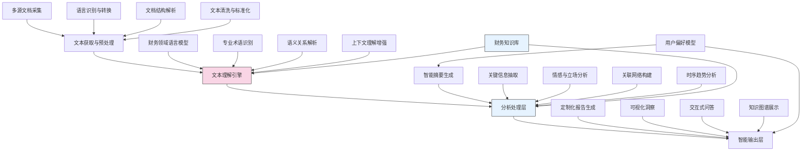

---
{"dg-publish":true,"tags":["AI财务应用","文本处理","信息提取","自然语言处理","智能摘要"],"创建日期":"2024-05-14","permalink":"/知识共享/001_财务/03_AI与财务应用/01_智能财务分析/1.1 大语言模型应用/财务文本智能摘要与分析/","dgPassFrontmatter":true}
---

## 技术概述

财务文本智能摘要与分析系统是一套专门针对财务领域文本资料的智能处理解决方案，融合了最新的自然语言处理技术与财务专业知识，实现对复杂财务文本的自动化提炼、分析和洞察生成。核心技术包括：

- **领域特化文本理解模型**：基于大型语言模型架构，通过财务文本语料库的专业微调，提升对财务术语、表达方式和隐含关系的理解能力
- **多级摘要生成技术**：结合提取式和生成式摘要算法，根据不同应用场景自动提取关键信息或生成灵活摘要
- **财务信息抽取引擎**：针对财务数据、事件、风险、政策等关键信息的精准识别和结构化提取
- **情感和立场分析**：识别文本中表达的情感倾向、信心水平和立场，揭示潜在风险或机会信号
- **跨文档关联分析**：建立文档间的关联网络，发现隐藏的关系模式和知识线索

该系统突破了传统文本分析工具在财务专业领域的局限性，能够处理年报、财报分析、研究报告、政策文件、新闻评论等多种文本类型，提供深度语义理解和价值洞察，实现从海量非结构化文本到结构化财务智能的转化。

## 系统架构

系统架构由四个主要层次组成：

1. **文本获取与预处理层**：负责从多种来源获取财务文本，进行语言检测、格式转换和初步清洗，确保后续处理的统一性
2. **文本理解引擎**：系统的核心，基于特化的财务领域语言模型，实现对文本的深度语义理解
3. **分析处理层**：执行多维度的文本分析任务，包括摘要生成、信息抽取、情感分析等
4. **智能输出层**：根据用户需求和偏好，将分析结果转化为直观、可操作的形式

整个系统由财务知识库提供领域知识支持，并通过用户偏好模型实现个性化输出定制，形成一个闭环优化的智能处理流程。

## 实施方案

### 技术实施路线图

**第一阶段：基础能力建设（2-3个月）**
- 财务文本语料库的构建与预处理
- 领域语言模型的适配与微调
- 基础文本分析能力（分词、命名实体识别等）实现

**第二阶段：核心功能开发（3-4个月）**
- 智能摘要算法的开发与优化
- 财务信息抽取系统构建
- 情感与立场分析模块实现
- 文档关联分析初步功能开发

**第三阶段：高级功能实现（3-4个月）**
- 跨文档语义关联与知识发现
- 时序分析与趋势预测功能
- 多层次和多角度摘要生成
- 交互式查询与问答系统开发

**第四阶段：集成与优化（2-3个月）**
- 用户界面和可视化组件开发
- 系统性能优化和扩展性增强
- 个性化推荐和定制输出功能
- 与现有财务系统集成接口开发

### 技术挑战与解决策略

1. **财务术语与表达的特殊性**
   - 挑战：财务文本包含大量专业术语和独特表达方式
   - 解决策略：构建专业财务术语库，结合领域专家标注数据进行定向训练

2. **文本隐含信息的提取**
   - 挑战：财务文本中的关键信息常以隐晦方式表达
   - 解决策略：设计基于财务语境的推理增强模块，捕捉文本蕴含和预设立场

3. **多文档信息一致性**
   - 挑战：来自不同来源的文档可能存在信息冲突
   - 解决策略：实现信息冲突检测和来源可信度评估机制，提供证据权重分析

4. **摘要质量与实用性平衡**
   - 挑战：过于简洁可能丢失关键细节，过于详细又失去摘要价值
   - 解决策略：开发多层次摘要生成，支持动态调整摘要粒度，并基于用户反馈优化

## 价值创造

### 量化价值评估

1. **时间效率提升**
   - 文档阅读和分析时间减少65-80%
   - 关键信息获取速度提升70-85%
   - 多文档综合分析效率提高75-90%

2. **信息覆盖与质量**
   - 关键信息捕获率提升40-60%
   - 隐含风险识别准确率增加35-50%
   - 跨文档关联信息发现能力提升50-70%

3. **决策支持价值**
   - 决策相关信息完备性提高45-65%
   - 决策周期缩短30-50%
   - 基于文本分析的决策质量提升25-40%

4. **知识管理效益**
   - 财务知识沉淀与复用率提高60-80%
   - 知识检索效率提升70-90%
   - 组织财务文本资产价值提升40-60%

### 投资回报分析

投资回报率(ROI)预计达到200-300%（2年期），主要来源：
- 人力资源节约和效率提升（55%）
- 决策质量提升带来的价值增加（30%）
- 知识资产积累与复用（15%）

典型企业实施成本结构：模型训练和定制（40%）、系统开发与集成（35%）、数据准备与知识库构建（25%）。预期投资回收期为10-14个月。

## 未来演进

### 技术迭代路线图

**近期演进（1-2年）**
- 多语言财务文本分析能力扩展
- 结合结构化财务数据的混合分析
- 增强因果关系和影响分析能力
- 发展对财务叙事的批判性评估功能

**中期演进（2-3年）**
- 构建对话式财务文本探索系统
- 发展财务文本生成式搜索能力
- 实现跨模态财务信息融合分析
- 开发自主学习的财务文本理解代理

**远期演进（3-5年）**
- 打造财务文本理解的认知系统
- 实现对财务预测的自动评估和验证
- 开发模拟人类专家思维的分析流程
- 建立自主进化的财务知识处理生态系统

### 扩展应用场景

1. **投资研究辅助**：自动分析研究报告、财经新闻和市场评论，提取投资洞察

2. **合规文件审查**：快速分析法规文件，识别与企业相关的合规要求和变化

3. **竞争情报分析**：汇总分析竞争对手的公开信息，提取战略走向和市场动态

4. **并购尽职调查**：高效处理大量目标企业文档，提炼关键信息和风险点

## 实验验证

### 概念验证方案

**阶段一：基准能力测试（4-6周）**
- 选取100-150份不同类型的财务文本
- 测试系统摘要与人工摘要的匹配度
- 评估关键信息提取的准确性和完整性
- 验证领域术语识别的精确度

**阶段二：用户应用测试（6-8周）**
- 招募15-20位不同角色的财务专业人员
- 设计真实使用场景的任务评估
- 比较系统辅助和传统方法的效率差异
- 收集用户体验反馈和改进建议

**阶段三：综合价值验证（8-10周）**
- 在2-3个业务部门实施试点应用
- 跟踪记录工作流程变化和效率提升
- 评估系统对决策支持的实际贡献
- 验证规模化部署的技术准备度

### 评估指标框架

**性能指标**
- 摘要质量评分：通过专业人员评价的摘要准确性、完整性和价值
- 信息提取准确率：自动提取的关键信息与人工标注的匹配程度
- 处理速度：处理标准长度文档的平均时间
- 系统扩展性：处理不同类型和规模文档的适应能力

**用户价值指标**
- 时间节省率：与传统方法相比的时间节约百分比
- 使用满意度：用户对系统功能和体验的评价得分
- 洞察价值评分：系统提供的见解对工作的实际帮助程度
- 持续使用意愿：用户长期使用系统的意愿度

**业务影响指标**
- 决策准确性改善：使用系统后决策质量的提升程度
- 知识传递效率：团队成员间知识共享和学习的速度变化
- 工作流程优化：依赖文档分析的流程效率提升情况
- 创新能力增强：基于文本分析的新见解和创新提案增加情况

## 未来影响

财务文本智能摘要与分析系统将彻底改变财务专业人员与文本信息的交互方式，从手动筛选向智能导航转变。随着系统能力的持续进化，我们可以预见以下深远影响：

1. **财务知识民主化**：复杂财务文本的理解门槛大幅降低，使更广泛的利益相关者能够获取和理解关键财务信息

2. **分析视角拓展**：超越单一文档的局限，建立起跨文档、跨时间、跨来源的综合分析视角

3. **从数据到叙事的转化**：帮助财务专业人员更有效地构建和传达基于数据的财务叙事

4. **集体智慧的放大**：通过共享文本分析洞察，放大组织的集体智慧，促进更好的协作决策

这一系统最终将成为连接海量财务文本与实际业务决策的关键桥梁，彻底释放隐藏在非结构化文本中的价值，为财务领域的知识管理和价值创造带来革命性变化。 